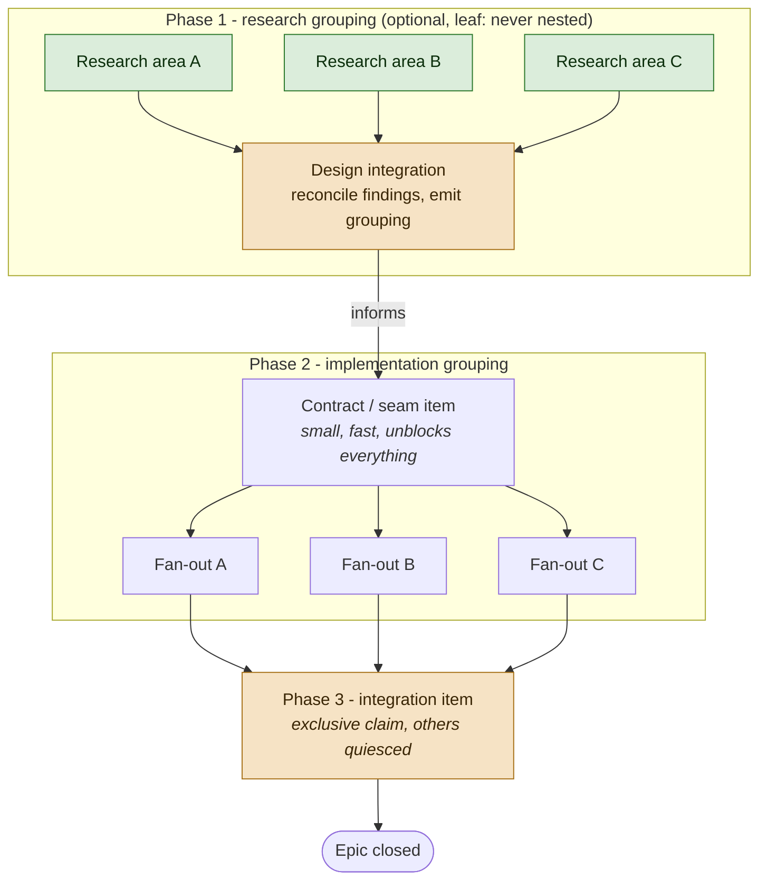
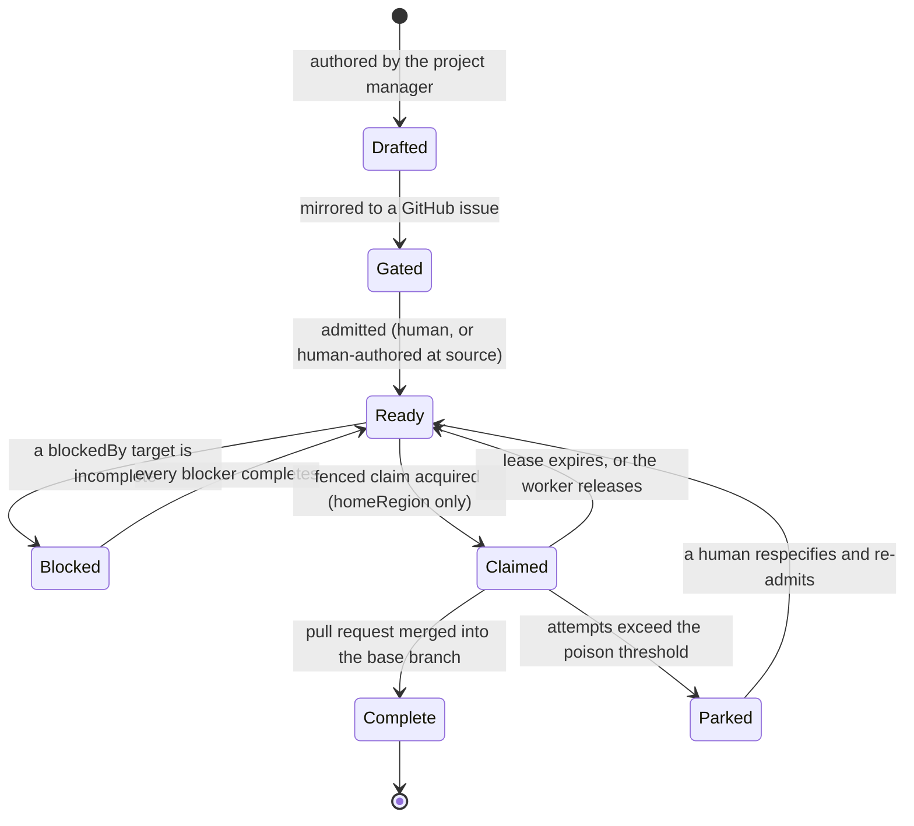

# Repository-context MCP (repocontext)

This file is the **single master** for how to use the `repocontext` MCP server in
Orleans.Lattice. The `repocontext` skill (`.github/skills/repocontext/SKILL.md`)
points here rather than restating these rules, so there is one place to change
and nothing to drift.

`repocontext` is a repository-context store that indexes a repository into queryable records - structural nodes
(files / packages / symbols) with content digests and vector embeddings - plus a
durable **agent-memory** layer (notes, decisions, gotchas) keyed by topic. Read
tools are safe and read-only; write tools are **destructive and fail-closed**.

**Tool names.** For brevity this guide names the retrieval and capture tools by
their bare verb (`search`, `recall`, `remember`, and so on); the real tool ids
carry the `repocontext_` prefix, as do the health / status / list tools
(`repocontext_health`, `repocontext_index_status`), so any bare `index_status`
in the prose means the same tool.

## The session protocol - the four moments

Everything else in this file is *how* to use the tools. This section is *when* -
and it is the part that changes behaviour. The read side is chronically
under-used: a session onboards with one `search`, files memories it never reads
back, and never calls `context` at all. That is not disagreement with the rules
below; it is that nothing named a **moment** to call them. These four moments are
obligations. Each has an observable trigger, so you can check whether you
honoured it.

**1. Session start, once - orient before you act.**
Before your first edit on any non-trivial task, spend one round:
`repocontext_health`, then `repocontext_list_repos` to learn the id of the
repository you are in (**derive it from the listing, never from your current
directory** - see [The repo id](#the-repo-id), which matters most in a git
worktree), then `index_status {repoId}` (which also calibrates you -
see [Health and degraded mode](#health-and-degraded-mode)), then **sweep the
memory you are about to need**.

**`list_topics` + `recall` is the primary memory mechanism.** Memory is a small,
keyed, topic-partitioned store, so the right way into it is to *enumerate* it,
not to rank it: enumeration is both more precise (it cannot out-rank the entry
you need) and faster (one small call, no vector search). Semantic search over
memory exists and is useful, but it is a **supplement for discovery**, not a
replacement for the mechanism - reach for it when you could not have named what
you were looking for, never as the way you check whether something was captured.

The ladder, in order:

1. **`repocontext_list_topics {repoId}`** - the map: every topic with its live
   entry count. One call, small payload, no ranking. **This is the step everyone
   skips and the one that makes the rest work**, because every other memory read
   needs a topic or a key you must already know.
2. **`repocontext_scan` scope `MemoryTopic`** for the one or two topics the
   listing shows are relevant (the epic, component, or package you are about to
   touch, plus `decisions` / `gotchas` / `conventions`). Targeted and complete.
3. **`repocontext_recall`** by key when you know it - the cheapest and most
   precise path of all, and the reason a stable, predictable `id` on capture
   matters so much.
4. *Supplementary:* **`repocontext_search`** to turn up an entry you could not
   have named (it ranks memory alongside code), and **`repocontext_neighbors`**
   to walk typed links out of an entry you did find.

You are looking for three things: the decision that already settled this, the
gotcha that will cost you an hour, and the convention you would otherwise
violate. Reading memory is the entire point of having written it; a session that
files entries and never reads any is using half the tool.

> **Why enumeration beats ranking here, stated plainly.** A memory question is
> almost always "has this already been decided / hit / written down?" - a
> question about *presence*. `search` answers a different question: "what is most
> similar?" It ranks memory against the whole code corpus, so a genuinely
> relevant entry can sit below ten plausible files and read as "nothing was
> captured". `list_topics` plus a topic `scan` enumerates, so it can distinguish
> "not captured" from "captured but out-ranked". **A `search` miss is never
> evidence of absence.** Use `search` to discover; use enumeration to decide.

**2. Before any discovery - probe, do not guess.**
Any "where is X / how does Y work / has this been decided" question opens with
`search` (or `scan`), never with `grep` / `glob` or a guessed path. Drop to
`grep` only after a probe shows the index is degraded, per guardrail 2 below.
This holds for the *whole* session, not just its first few minutes: the most
common failure is a strong opening probe followed by an hour of `grep`. Note that
"why is it like this?", "is this safe to change?", and "has this bitten us
before?" are **memory** questions, not code questions - they go to `search` or
`scan` scope `Memory` first, and to the code second.

**3. Before reading source in order to change it - `context`, not `search` + `view`.**
When you need real code to *do* the task (not merely to locate a file),
[`context`](#context---budgeted-context-bundle-in-one-call) is the default move:
one call returns ranked, explained source under a hard token ceiling, where the
`search` + `view` loop costs several round trips and whatever the files happen to
weigh. Pass a stable `session` id and reuse it all task long, so follow-up
bundles never re-charge you for context you already hold. Use `search` + `view`
when you genuinely only need *where*, and `outline` / `related` when you need a
file's shape or its callers rather than its body.

**4. At every durable finding - capture before you move on.**
The trigger is not "end of session" - you will forget, or run out of turn. It is
the moment itself: you settled a design question, you lost time to something
non-obvious, you pinned down an unwritten norm, or you are handing work to
another session. Capture it then, with `remember`, under the right topic. See
[Capture](#capture---durable-agent-memory).

**Self-check - symptoms of under-use.** If any of these describes your session so
far, you are leaving most of the surface unused - fix it on the next step, not
next session:

- you called `search` early on, then switched to `grep` / `view` for the rest of
  the session;
- you called `remember` this session but never `recall`, `scan` scope `Memory`,
  or `neighbors`;
- you have never called `context` on a task that required reading source to
  change it;
- you re-derived something - a convention, a workaround, a rationale - that a
  `scan` of `decisions` / `gotchas` / `conventions` would have handed you;
- you read three or more whole files with `view` to answer one question, without
  first trying `outline` / `related` / `context`;
- you concluded the repo "isn't indexed" because your current directory (a git
  worktree name, say) did not appear in `repocontext_list_repos` - the base
  repository is what is indexed, so resolve the id from the listing instead of
  falling back to `grep`;
- you are coordinating with another session (an epic, a stacked-PR chain,
  parallel workstreams) and passing state only through chat messages rather than
  the [coordination bus](#coordination---memory-as-a-cross-session-bus).

## Use it as the primary recall and search mechanism

`repocontext` is the **default first move** for finding things in this repo and
for recalling what past sessions learned. For any discovery task - locating
code, docs, symbols, or a prior decision - reach for `search` / `scan` / `recall`
*before* `grep` / `glob`, even when you think you know the path. Do not default
to `grep` / `glob` for repo-wide discovery.

(Availability: if the `repocontext_*` tools are not in your toolset - or
`repocontext_health` does not report the surface reachable - then it is simply
not wired up in this environment; fall back to `grep` / `glob` / `view` and do
not mention or block on it. Everything below applies when the surface is
present.)

The two jobs it is your first move for:

- **Discovery across the whole repo** - lead with a natural-language `search`, or
  a `scan` when you want completeness (every file under a path, every memory
  entry). Use it even when you have a rough idea of the filename; it is faster
  than guessing paths.
- **Durable cross-session memory** - check what past sessions captured
  (decisions, gotchas, conventions, glossary) before rediscovering it. **The
  primary mechanism is `list_topics` + `recall`** (with `scan` scope
  `MemoryTopic` between them): memory is a small, keyed, topic-partitioned store,
  so enumerating it is both more precise and faster than ranking it. Semantic
  search over memory is a **supplement for discovery** - use it to surface an
  entry you could not have named. It does not replace enumeration, and because it
  ranks memory against the whole code corpus, a `search` miss is never proof an
  entry was not captured.

**Two loops - pick by what you need, not by habit.**

- **The work loop - the default whenever you will change code.** One
  [`context`](#context---budgeted-context-bundle-in-one-call) call, with the task
  in natural language and a stable `session` id, returns ranked, explained source
  under a hard token ceiling; then `view` the specific files you are about to
  edit; then `remember` what you learned. Reach for this whenever the answer is
  "I need to read the relevant code": it is one round trip instead of several and
  it cannot overrun your budget.
- **The locate loop - when you only need *where*.** `search` for the question,
  take the best hit's `path`, `view` that file to read the real content, and
  (optionally) `remember` any durable gotcha you uncovered.

To navigate the code graph (a file's callers, dependents, tests, or declared
symbols) without full-file reads, use the
[graph-navigation tools](#graph-navigation---outline--related--changed)
`outline` / `related` / `changed`.

Two guardrails make it safe to lean on as primary - follow both every time:

1. **Locate with `repocontext`, read the real file with `view`.** The index
   reflects the **last ingest, not your uncommitted edits**. Treat every hit as a
   pointer: once `repocontext` tells you *where*, `view` (or `grep`) the actual
   file before you quote, rely on, or edit its content. Never edit from an index
   digest. This is a rule about *editing*, not about *reading*, and it is not a
   reason to avoid `context`: the bodies `context` packs are real indexed content
   and are exactly what you should use to understand a task cheaply. Just `view`
   a file before you edit it, and re-`view` anything you already changed this
   session, because your own uncommitted edits are never in the index.
2. **Fall back only after a probe shows it is degraded - never sight-unseen.**
   Every trigger below is a signal you can read **only from a `repocontext`
   call**, so a discovery task must *open* with a `repocontext` probe
   (a `repocontext_search`, or a quick `repocontext_health` / `index_status`
   check) and may drop to `grep` / `glob` only once that probe shows one of
   these. Opening with `grep` without probing `repocontext` first is **not** a
   valid fallback - it is skipping the primary tool, and is the one thing this
   guardrail exists to stop. Drop to `grep` / `glob` for a query when any of
   these hold:
   - `search` returns `mode: keyword` (semantic index unhealthy);
   - `index_status` reports `status: Failed`;
   - the index is **mid-ingest** (`status: Running` with
     `filesEmbedded < filesScanned`): `mode: semantic` still answers, but it only
     covers the already-embedded slice, so a *missing* hit does **not** mean the
     code is absent (see "Health and degraded mode");
   - the newest hit's `lastIngested` (or `index_status`'s `updatedAt`) predates
     committed work you are relying on. Note the index never reflects
     *uncommitted* edits - that is guardrail 1's job to handle, not a reason to
     fall back.

   **Not a valid trigger: "my directory is not in `repocontext_list_repos`."**
   In a git worktree it never will be, because the indexed repository is the base
   repo, not your worktree directory. Resolve the id from the listing (see
   [The repo id](#the-repo-id)) and carry on; concluding "this worktree is not
   indexed, so I will explore directly" abandons a healthy index over a naming
   mismatch.

   A stale, keyword-only, or partially-embedded index is a worse locator than a
   direct search, so do not force it - but confirm that with a probe first
   rather than assuming it.

Only skip `repocontext` outright for a lookup you can nail in one or two direct
calls on a file you already know by path - there the hop is pure overhead.

**First-use smoke check.** The first time you reach for it in a session, spend
one round to learn which mode you are in: `repocontext_health`, then
`repocontext_index_status {repoId}`, then one representative `search`. That tells
you up front whether you have full `semantic` coverage, a still-`Vectorising`
index that is only partially embedded, or a `keyword` / `Failed` degraded state -
so you calibrate how hard to lean on it, instead of discovering a weak index
mid-task.

## The repo id

- **Derivation.** A repository's `repoId` defaults to the **final path segment of
  the indexed path** - the repo's own folder name - unless an explicit `repoId`
  was passed to `repocontext_add_repo`. That is the *indexed* path, **not your
  current working directory**: never derive the id from the directory you happen
  to be sitting in. Do not assume it; confirm with `repocontext_list_repos`.
  Examples in this file write it as `{repoId}` - substitute the value you derived.
- **Working in a git worktree? The repo id is still the base repository's.**
  This is the single most common way this surface gets wrongly written off. A
  worktree lives at a path like
  `.../copilot-worktrees/<repo>/<generated-worktree-name>`, so deriving the id
  from your directory yields the *worktree's* name - which is not a repository id
  and will never appear in `repocontext_list_repos`. **An absent worktree name
  does not mean "this code is not indexed."** The base repository is indexed and
  is what you should query: run `repocontext_list_repos` and use the entry that
  names the repository (for example `lattice`), regardless of which worktree you
  are in. If you are unsure of the indexed root, `repocontext_changed` names it
  for you: passing a worktree path fails with "The path '...' is outside the
  indexed root of repository '/workspace/lattice'", which tells you both the root
  and the id.
- **Do not "fix" a worktree miss by adding the worktree as a new repository.**
  `repocontext_add_repo` on a worktree path would index a near-duplicate copy of
  the same code under a throwaway id, splitting the store and every later search
  across two repos. It is a destructive write; do not reach for it here. Query the
  base repository instead.
- **What the index does and does not know in a worktree.** The index reflects the
  base repository's **last ingested (committed) state**, so it will not contain
  your worktree's branch-local or uncommitted changes - and on a long-lived branch
  it can be meaningfully behind what you are editing. That does not stop it being
  the right tool for *discovery*: it still locates code, docs, symbols, and prior
  decisions correctly. It does make guardrail 1 sharper than usual - locate with
  `repocontext`, then `view` the real file in **your** worktree before quoting or
  editing it, because the file you are about to change may differ from the indexed
  copy. Graph and drift tools scoped to the indexed root (`changed`, and any
  `path` argument) only accept paths under that root, so they answer questions
  about the base repository, not about your worktree's diff; use `git diff` for
  the latter.
- **Disambiguation.** If `repocontext_list_repos` returns more than one repo,
  select the one whose id matches the workspace you are working in and ignore
  unrelated indexes (for example throwaway test fixtures).
- **Visibility during a first ingest.** `list_repos` enumerates **committed,
  materialised structural records**, which is a different source from the live
  progress counters `index_status` reads. A repository still in its **first**
  ingest can therefore be **absent from `list_repos` entirely** - and not yet
  answer `scan` or `search` - while `index_status` already reports it `Running`
  with advancing counters, because its structural writes are durable in the WAL
  but have not yet materialised into the readable projection. So do **not** infer
  "not indexed" from an empty `list_repos`: `index_status {repoId}` is the
  authority for an onboarding still in progress, and a repo surfaces in
  `list_repos` only once its structural records materialise.
- **Fields.** `repocontext_list_repos` reports one row per repo, but the fields
  it returns depend on ingest state: expect at least `repoId` and
  `embeddedVectorCount` (how many **sources** - files and captured symbols - have
  a landed embedding, so it can exceed the file count once symbols are embedded),
  and treat a per-repo `lastIngested` / `fileCount` as **best-effort - they can be
  absent while an ingest is still running**. Do not rely on `list_repos` alone to
  judge staleness. The dependable freshness signals are the per-hit `lastIngested`
  on `search` results and `index_status`'s `updatedAt` (see "Health and degraded
  mode").

## Retrieval

### search - relevance-ranked, natural language

- Pass a natural-language `query` and a small `k` (1-100, default 10); start
  small and widen only if needed.
- **Always read the `mode` field on the result:**
  - `semantic` - vector nearest-neighbour search (the good path).
  - `keyword` - deterministic BM25 keyword/structural scan, used because the
    vector index is unavailable or stale. Ranking is corpus-relative BM25 over
    file content and names (a distinctive term outweighs a ubiquitous one), so it
    is a capable literal-term search - but it matches tokens, not meaning, so a
    purely conceptual query with no shared vocabulary can still rank poorly. When
    you see `keyword`, prefer distinctive identifier-like terms, and fall back to
    `grep` only if the terms you have are too generic.
  - `empty` - no matches.
- Hits carry `key`, `path`, `fields` (`digest`, `language`, `sizeBytes`,
  `lastIngested`), `tags`, `links` (structural cross-references between
  records - informational; there is no client tool to set them), and `reasons`
  (see next bullet). **`search` does not return file contents** - `view` the file
  (or `recall` the record) for the body.
- **Every hit carries a `reasons` list explaining why it ranked** - server-derived,
  deterministic, ordinal-ordered, bounded, and never null. A `semantic` hit lists
  `semantic`, the matched chunk kind (`chunk:symbol`, `chunk:file`, or `chunk:memory`), and
  `symbol:<fqName>` for a symbol vector or `topic:<topic>` for a memory vector; a
  `keyword` hit lists whichever projected
  fields the query terms hit (`path-name-match`, `symbol:<fqName>`, `tag:<tag>`,
  `topic-match`, `content-match`, `key-match`). Use `reasons` to judge whether a hit
  is relevant for the right reason (a name/path coincidence versus a genuine content
  or semantic match) before you act on it.
- Results are verbose - each hit carries full metadata, and the server returns
  every payload as both structured and text content - so keep `k` small and
  prefer a targeted `scan` (with `pathPrefix`) when you want breadth without the
  per-hit weight.

### list_topics - the map of the memory store

- `repocontext_list_topics {repoId}` returns every distinct memory topic with its
  live entry count. One call, a small payload, and no ranking involved.
- **With `recall`, this is the primary memory mechanism** - not a preliminary to
  searching. Memory is small, keyed, and partitioned by topic, so enumerating it
  is both more precise than ranking (nothing can out-rank the entry you need) and
  faster (no vector search, no large payload). Semantic search over memory is a
  supplement for *discovery*; it does not replace this path.
- **It is the step most often skipped**, and skipping it is what breaks the rest:
  every other memory read needs a topic or a key you must already know - `scan`
  scope `MemoryTopic` needs the topic name, `recall` needs the full key. Without
  the listing you are guessing, and the usual fallback (a blind `scan` scope
  `Memory` over the entire store, paged, then hand-parsed) is many calls and a
  large payload to answer what one call answers.
- Use it to decide *where* to look before looking: the counts tell you which
  topics are substantial, and the names tell you which per-workstream topics
  (`epic-1830`, `perf`, a component name) a past session actually used, which you
  could not have guessed.
- It is also the only honest way to answer "was this ever captured?". `search`
  ranks; `list_topics` plus a topic `scan` enumerates. Only the second can
  distinguish "not captured" from "captured but out-ranked".

### scan - ordered, complete enumeration

- Deterministic paged walk of a `scope`: `Files`, `Packages`, `Symbols`,
  `Memory`, or `MemoryTopic` (with `topic`).
- Restrict a `Files` scan to a subtree with `pathPrefix`, e.g.
  `src/lattice/Primitives/`.
- Page with the returned `continuationToken` while `hasMore` is true;
  `pageSize` is 1-500 (default 100).
- Reach for `scan` when you want **completeness** (audit every file under a path,
  list every memory entry in a topic) rather than relevance.
- **Expiry and link staleness are not evaluated by a bulk read.** A `scan` (and a
  degraded `keyword`-mode `search`) enumerates key+value only, so its expiry
  fields (`expires`, `hasExpired`, `expiresAtUtc`, `remainingSeconds`) and its
  memory link-staleness fields (`stale`, `staleLinks`) come back `null`
  ("not evaluated") - this is by design, not a durable claim. A scan still yields
  only live (non-expired, non-tombstoned) entries. To read an entry's authoritative
  TTL or link staleness, `recall` it (or, for TTL, use a `semantic` `search`,
  whose hits are hydrated per-key).

### recall - one record by key

- Fetch a single record by its full key. Key shapes:
  - File: `repo/{repoId}/file/{path}` - e.g.
    `repo/{repoId}/file/src/lattice/Primitives/GCounter.cs`
  - Memory: `repo/{repoId}/mem/{topic}/{id}`
- `recall` returns the stored record - its flattened `fields`, `tags`, `links`,
  and remaining TTL - not live file content; per guardrail 1, `view` the file for
  the current body.
- **`recall` evaluates memory link staleness.** For a memory entry, `recall`
  compares each structural link (to a file or symbol) against the target's
  current content digest, captured when the link was made, and reports drift
  through `stale` (any linked target changed or was deleted) and `staleLinks`
  (the specific target keys). A `stale` link is a cue to re-read the target and
  refresh or retire the note. `neighbors` evaluates the same per walked entry.
  Bulk reads do not (see below), so `stale`/`staleLinks` come back `null` there.
- A missing or expired key returns `exists: false`, so you can tell an absent
  entry from an empty one.

### neighbors - walk knowledge-linking edges

- `neighbors` walks the typed knowledge-linking edges out of a memory entry (see
  [Knowledge linking](#knowledge-linking---typed-edges-between-memory-entries))
  and returns the adjacent entries, hydrated from the store, as a bounded
  breadth-first traversal. Use it to explore the curated concept graph past
  sessions captured - "what does this concept relate to?" - rather than to search
  free text.
- Bound the walk: `relation` restricts it to one edge type (e.g. `broader`);
  `depth` is clamped to `[1, 3]` (default 1, immediate neighbors); `maxNodes` is
  clamped to `[1, 100]` (default 50). The result's `truncated` flag reports when
  the node cap stopped the walk.
- A seed key with no live entry returns `exists: false`; a dangling edge whose
  target has no live value is still returned as a neighbor with its own
  `exists: false`, so you can see broken links.
- Each walked neighbor that is a memory entry is returned with its link staleness
  evaluated (`stale` / `staleLinks`), exactly as `recall` does, so a graph walk
  surfaces which linked concepts point at drifted code.

### Graph navigation - outline / related / changed

Three read-only tools navigate the structural graph the reconcilers maintain (file,
symbol, content, and reverse cross-reference records) so you can understand code
without spending tokens on full-file reads. All are pure reads over stored records;
`related` and `outline` never touch disk, and `changed` reaches the workspace only
through the fail-closed boundary.

- **`outline`** - the structural skeleton of one indexed file *without its body*:
  each declared symbol (kind, signature, 1-based start/end line span), ordered by
  position, plus the token cost of reading the whole file. It is the cheapest way to
  grasp a file's shape and decide whether a full `view` is worth the tokens. The
  token count is null only when the file was never content-processed; a path with no
  stored file node returns `exists=false`.
- **`related`** - the structural neighbourhood of one file: the type-names it
  references (outbound imports), the indexed symbols that reference *its*
  declarations (inbound dependents, resolved to their declaring files), and the test
  types that cover it (from the `{Name}Tests` / `{Name}Test` convention). Use it to
  navigate the code graph (callers, dependents, tests) rather than guessing.
  **Caveat:** edges are keyed by *simple* (unqualified) type-name, a syntactic
  approximation - two distinct types sharing a simple name are not disambiguated, so
  treat a dependent set as a lead to confirm by reading, not a proof.
- **`changed`** - how the current workspace has drifted from the index (files added,
  updated, removed), by digest comparison and **without invoking git**, so it works
  in any checkout. It also lists the indexed files that depend on the changed ones
  (the reverse-reference impact set / blast radius). Use it to scope a review to what
  actually moved, or to see what an index needs to catch up on. A supplied path
  resolving outside the mounted workspace is refused.

### context - budgeted context bundle in one call

`repocontext_context` is the highest-leverage retrieval tool: it returns a ranked,
explained bundle of source for a natural-language `task`, packed under a **hard token
ceiling**, collapsing the `search -> recall -> view` loop into one round trip that
can never overrun your context budget. Prefer it over hand-running that loop when you
need the actual source to *do* a task (not just locate a file).

- It searches for the `task` (semantic when available, else a keyword bundle),
  resolves the top hits to unique files, and packs each at a `detail` level:
  `paths` (path only), `outline` (declared-symbol skeleton), or `slices` (bounded
  body text). `auto` (default) packs the richest level that yields a non-empty bundle
  and reports the level it settled on in `detail`.
- Budgeting: `responseBudgetTokens` is the hard ceiling (the reported `totalTokens`
  is the exact BPE sum and never exceeds it); `top` bounds how many files are
  considered. Both are clamped, never trusted to drive unbounded work. `truncated`
  flags that lower-ranked candidates were dropped. It **fails closed** when even the
  cheapest entry does not fit: `entries` is empty and `retryBudgetTokens` reports a
  budget guaranteed to admit at least one entry (null when the search matched
  nothing).
- Each entry carries its match `reasons`, its exact BPE `tokenCount`, the whole-file
  `fullReadTokenCount`, and a per-version `contentHash`. Per guardrail 1, the packed
  `slices`/`outline` content still reflects the last ingest - `view` the file before
  editing.
- **Reuse economics - never pay twice.** Each delivered unit carries a stable opaque
  `receipt`. Hand receipts back in `seen` to suppress exactly those units (the rest
  of the file still arrives), or assert whole-file possession in `known` as
  `path@hash`. Pass a stable `session` id to persist this bookkeeping across calls:
  the session auto-suppresses units it already delivered and validates `known`
  claims. A whole-file claim is honoured **only** for a version actually delivered as
  a complete body, so partial evidence is never promoted to whole-file possession.
  Suppressed content is acknowledged in `reused` and never charged against `top` or
  the budget. Reuse the same `session` id across a multi-step task to keep each
  follow-up bundle cheap.
- **The budget bounds the response, and `responseTokens` is the figure to read.**
  A bundle reports two numbers: `responseTokens` is the estimated cost of the
  response *as you receive it* (delivered content plus each entry's JSON envelope,
  multiplied because the MCP SDK serializes every result twice), and it is what
  `responseBudgetTokens` actually caps. `totalTokens` is the narrower sum of the
  packed source text alone - useful as "how much source did I get", but it is not
  the cost. The estimate is deliberately conservative, so a bundle can come in
  under the ceiling but never over it. (Until issue #1811 was fixed the budget
  capped only the content, so a bundle reporting a few thousand tokens could land
  as a response many times that size and silently overflow a harness; if you are
  running an older build and see that, the workaround below still applies.)
- **If a bundle is ever too large for your harness, retry it smaller - do not
  abandon `context`.** Quietly falling back to `grep` after one oversized response
  is the single most common way this tool falls out of use. Drop `top` to 3-5, ask
  for `detail: "outline"` first and request `slices` only for the files the outline
  shows you actually need, and keep the same `session` id so the retry is not
  re-charged for what the first call already delivered. If the response was spilled
  to a file, it is still readable - grep it rather than discarding the call you
  already paid for.

### stats - usage accounting

`repocontext_stats` reports an aggregate summary of the surface's own usage over a
bounded recent window (no arguments), so you can see whether it is actually reducing
context cost. It returns only summed token figures - `calls`, `responseTokens`,
`readsReplacedTokens` (whole-file reads conservatively replaced, credited only for
delivered whole-file-equivalent content), `netSavedTokens`, and `windowSeconds` - and
carries no body, query, path, or repository identity. Read-only.

`netSavedTokens` (= `readsReplacedTokens - responseTokens`) is **signed**, and a
negative value is expected, not a defect: read-replacement credit is awarded only for
whole-file-equivalent (`slices`) delivery, so a discovery-heavy window - cheap
`paths` / `outline` calls, or `context` used only to locate - spends response tokens
while earning little credit and nets negative. Net trends positive as a task moves to
reading real bodies (`slices`) and reuses a stable `session` so repeated context is
suppressed and never re-charged. Treat it as a deliberately conservative floor on the
true saving - it never credits the `search -> recall -> view` round trips it also
removed - not a live figure you must keep above zero.

## Capture - durable agent memory

### remember

- Creates or updates a memory entry under a `topic` (both `repoId` and `topic`
  required). Omit `id` to create a new entry with a generated id; pass an
  existing `id` to **CRDT-merge in place** rather than blind-overwrite.
- **Prefer a caller-chosen, deterministic `id` on a durable entry.** `id` reads
  as server-owned because it defaults to a generated GUID, but you may choose it:
  `explorer-token-contrast-1801` rather than `e11f414a...`. A stable, meaningful
  id makes the write **idempotent** (so a retry cannot double-write), makes a
  later revision a one-liner instead of a hunt, and makes the entry addressable
  by `recall` without a search. Use the workstream, component, or issue it
  belongs to.
- **Keep the `id` the call returns, and pass it back when you revise.** If you
  rewrite, extend, or improve the same note later in the same session - normal,
  since you often learn the rest of the story after first writing it down - pass
  that `id` so the entry CRDT-merges in place. Omitting it creates a second,
  near-duplicate entry instead of revising the first. If you have lost the id,
  `search` or `scan` the topic for your own entry (match on `author`) and reuse
  its id rather than writing afresh.
- **`repoId` is required on `remember`, and it is easy to drop.** Read calls
  carry it too, but a write that omits it fails with
  `ArgumentException: ... missing a value for the required parameter 'repoId'`.
  That particular failure is **pre-write** - nothing reached the store, so a
  straight retry is safe.
- **Retrying an ambiguous write: check before you re-send.** A validation error
  that names a missing parameter is safe to retry. Any *ambiguous* failure - a
  timeout, a dropped connection, an error that does not clearly precede the
  write - may have landed. `scan` (or `search`) the topic first and look for your
  own entry by `author` before re-issuing, or retry with the same explicit `id`
  so the write merges instead of duplicating.
- Useful fields: `title`, `body`, `kind` (`Decision` / `Note` / `Memory`),
  `tags`, `author`, `provenance`, and `ttlSeconds`. To relate one entry to
  another, pass `addLinks` / `removeLinks` (see
  [Knowledge linking](#knowledge-linking---typed-edges-between-memory-entries)).
- **TTL - when to set it.** Default to **no `ttlSeconds`** (durable, or the repo
  default): decisions, gotchas, conventions, and glossary are meant to outlive
  the session, and when one goes wrong you `update` or `forget` it rather than
  let it lapse. Set a TTL only when the entry has a **known natural expiry and
  its silent disappearance is acceptable** - for example a time-boxed fact ("CI
  flaky on X until #123 lands"), short-lived coordination for sibling sessions
  working the same task right now, or provisional state you expect to supersede
  shortly. Never TTL something whose loss would be a problem: expiry is silent
  and unlogged, so correctness-critical memory must be retired deliberately with
  `forget`, not left to time out. **Cross-session coordination handoffs are the
  standard TTL case, and their default is one week** (`ttlSeconds: 604800`) - see
  [Coordination](#coordination---memory-as-a-cross-session-bus).

### Keep the topic vocabulary small and stable

Prefer a fixed set so related notes stay groupable instead of fragmenting into
synonyms (`decision` vs `decisions`):

- `decisions` - a design choice **with its rationale** (use `kind: Decision`).
- `gotchas` - a non-obvious pitfall a future agent would trip on.
- `conventions` - a project norm not obvious from a single file.
- `glossary` - a domain term.
- `todo` - a cross-session follow-up.
- `backlog` - an agent-operated work item. Has its own schema, relation
  vocabulary, and gating rules; see
  [The agent-operated backlog](#the-agent-operated-backlog).
- or a stable component/feature name (e.g. `wal`, `replication`).

### What to capture (and what not)

- **Do** capture non-obvious decisions with rationale, hard-won gotchas,
  cross-session TODOs, and domain glossary - things that outlive this session.
  Keep each entry short and self-contained: enough context to act on without the
  originating conversation.
- **Do not** capture secrets or credentials, anything already committed to
  `docs/` or `AGENTS.md` (link to it instead), transient within-turn state, or
  large blobs. Memory is not a scratchpad for the current turn. The one exception
  to "transient" is a deliberate **cross-session handoff** (see
  [Coordination](#coordination---memory-as-a-cross-session-bus)), which is
  transient by design and therefore carries a TTL.
- **Capture each finding once.** Prefer one well-formed entry written when you
  actually understand the finding, over a first draft plus a near-duplicate
  "better" version. If you do improve it, revise in place with its `id` (see
  `remember` above).
- **A user telling you to remember counts as a capture request.** When the user
  says *remember* / *note* / *keep in mind* / *don't forget* a standing fact,
  decision, or convention, that is a `repocontext_remember` request - not a cue
  to merely hold it in the current chat. Persist it under the right topic and
  confirm briefly, rather than only acknowledging it. Skip persistence only when
  the instruction is plainly task-scoped (keep it in-conversation, or give it a
  short TTL).

**Example - good vs. weak.** A good entry is short, self-contained, correctly
topiced, and carries the rationale:

- Good: `remember(topic: "gotchas", kind: Note, title: "WAL shard read path returns ValueTask", body: "IWalShardGrain.ReadAsync / ReadShippingAsync / GetNextSequenceAsync return ValueTask (not Task) for the same-silo fast path the shipper polls; add .AsTask() only at Task.WhenAll fan-out sites. Reverting to Task reintroduces a real per-poll allocation.")` - actionable months later without this conversation.
- Weak: `remember(topic: "notes", body: "looked at the WAL, seems fine")` - vague, no rationale, transient, and filed under a catch-all topic instead of a stable one.

### Coordination - memory as a cross-session bus

When several sessions work one epic, a stacked-PR chain, or parallel
workstreams, the memory layer is also their **coordination bus** - the one place
where a handoff survives a session ending, a context window rolling over, or a
sibling starting an hour later. Chat messages between sessions do not persist and
are not addressable by a session that was not there; a memory entry is both.

- **One topic per workstream, named after it.** Use the epic or workstream id -
  `epic-1616`, `perf-wal-partitioning` - not a generic bucket. A sibling then
  picks the whole thread up with a single `scan` of scope `MemoryTopic`. This is
  the one case where a per-workstream topic beats `decisions` / `gotchas`.
- **Read the bus before you start, and again before you hand back.** A child
  session's first move is `scan` `MemoryTopic` for its workstream topic: the
  seams it must build on, the interfaces already integrated, and the sibling
  gotchas all live there. A coordinator re-scans before it integrates.
- **Post the handoffs that unblock somebody else**: an interface or seam now
  integrated (with its commit sha), a decision that constrains sibling work, a
  gotcha a sibling will otherwise hit, a deferral and its reason. Keep each entry
  short and self-contained - the reader will not have your conversation.
- **Always set `author`** to the session or agent identity (for example
  `feature-dev-t13`, `epic-coordinator`). On a shared topic, provenance is what
  makes an entry actionable.
- **Coordination entries are time-boxed: give them a TTL, one week by default**
  (`ttlSeconds: 604800`). Their value expires with the workstream, and a stale
  handoff ("T12 integrated at 2dbeecba") is worse than none once the epic has
  shipped. Extend it deliberately for a longer-running epic (`update` the entry,
  or re-`remember` with a larger `ttlSeconds`); shorten it for a same-day
  handoff.
- **Promote anything durable; do not let it lapse.** If something posted to the
  bus matters beyond the workstream - a real gotcha, a convention, a decision
  with lasting rationale - re-`remember` it under the durable topic
  (`gotchas` / `conventions` / `decisions`) with **no TTL**. The bus is for
  coordination; the durable topics are the record. Do this as an explicit step
  when the workstream closes, for every entry worth keeping.

### update / forget

- `update` - CRDT-patches scalar `fields` and `tags` on an **existing** record
  (preserves any remaining TTL; fails if the key does not exist). Use it to
  correct or re-tag, not to recreate. On a memory record it also patches
  knowledge-linking edges via `addLinks` / `removeLinks`.
- `forget` - removes an entry. Default is an immediate hard delete; pass
  `lapse: true` (optionally with `lapseSeconds`) to re-write it with a short TTL
  so concurrent readers drain gracefully. Prefer `lapse` when another session
  may be reading.

### Knowledge linking - typed edges between memory entries

A memory entry can carry typed, directional **links** to other repository-context
keys: a small knowledge graph over your captured concepts, layered on top of the
same CRDT-merged store. Use it to connect a glossary/concept entry to the ones it
generalises, specialises, or relates to, so a later session can *walk* the graph
with `neighbors` instead of guessing search terms.

- **Write edges** with `remember` or `update` using `addLinks` / `removeLinks`:
  a map from a **relation name** to a list of **target keys**. Links are a
  memory-record feature only; supplying them for a structural (file/symbol)
  record is rejected. Every target must be a well-formed key
  (`repo/{repoId}/...`) or the whole write is rejected before any change is made;
  the target need not exist yet (dangling edges are allowed and surface as
  `exists: false` when walked).
- **Read edges** with `recall` (the entry's `links` map) or walk them with
  `neighbors`.
- **A link to code is tracked for staleness.** When you link a memory entry to a
  structural target (a file or symbol), the store captures that target's content
  digest at link time. A later `recall` (or `neighbors` walk) flags the entry
  `stale` when the target has drifted or been deleted, so a note that anchors a
  decision to a specific file tells a future session when the file has moved on.
  Prefer linking a durable note to the code it depends on for exactly this signal;
  a memory-to-memory edge carries no digest and is never stale.
- **Relation vocabulary - keep it small and stable**, the same discipline as
  topics. Prefer this fixed set (a lightweight SKOS-style derivation), authored
  from the **more general** entry outward:
  - `broader` - the target is a more general concept (this is a kind of target).
  - `narrower` - the target is a more specific concept (inverse of `broader`).
  - `related` - a non-hierarchical association.
  - `partOf` - the target is a whole this entry is a component of.
  Author one direction and let the reader infer the inverse; do not write both
  `broader` and `narrower` for the same pair. The
  [backlog](#the-agent-operated-backlog) extends this set with five further
  relations (`blockedBy`, `anchoredTo`, `claims`, `integrates`, `informs`)
  under the same discipline. Extend it there, in one documented place, so an
  audit of memory does not prune a relation it does not recognise.
- **What to link.** Connect durable concept/glossary entries into a navigable
  graph (e.g. `Orleans.Lattice` --`narrower`--> `WAL`, `CRDT`, `Shard`). Do not
  link transient notes or use links as a second tag system - a link asserts a
  relationship between two concepts, not a label on one.

**Example.** Capture two concepts and relate them:

- `remember(topic: "glossary", id: "wal", title: "Write-ahead log", body: "...")`
- `remember(topic: "glossary", id: "tree", title: "B+ tree", body: "...", addLinks: { "related": ["repo/{repoId}/mem/glossary/wal"] })`
- later: `neighbors(key: "repo/{repoId}/mem/glossary/tree", relation: "related")` returns the WAL entry.

## The agent-operated backlog

The `backlog` topic is a specialisation of everything above: ordinary memory
entries, an extended relation vocabulary, and rules that make the graph safe for
**several agents to drain concurrently**. It is the durable form of epic #2055.
Read this section before authoring, claiming, or completing a backlog item. The
agent definitions under `.github/agents/` implement the protocol; this section
defines the data they operate on.

**Responsibility split - two stores, one source of truth each.** Neither store
copies the other's content, because two writable copies with no transaction
between them diverge, and the divergence surfaces weeks later.

| Concern | Owner |
|---------|-------|
| Item identity, specification, human-visible priority, oversight, audit trail, notifications | **GitHub issues** |
| Dependency graph, code anchors, claims, resume pointers, durable learnings | **repocontext memory** |

A human can reprioritise or respecify without an agent in the loop, because the
thing they edit (the issue) is the thing that is authoritative.

### Item schema

**Topic `backlog`. One entry per item.** The `id` is derived deterministically
from the item - `issue-2057`, never a generated GUID - so a retry merges in
place instead of creating a near-duplicate. The id is the mirrored issue number,
which makes identity and mirroring the same act (see
[Entry gating](#entry-gating---mirror-first-admit-by-label)).

**A memory record has exactly four author-settable scalars**, and this is the
constraint the whole schema is built around. `repocontext_update` accepts
`title`, `body`, `author` and `provenance` on a memory record and **rejects
every other name** - `update(fields: { "priority": "P0" })` fails with *"The
field 'priority' is not a settable scalar on a Memory record"*. There is no
generic field bag. `createdAt` is set by the store at creation and is never
authored. So an item's structured attributes must be carried by the two
collection-valued members that do accept arbitrary content: **tags** and
**links**.

| Carrier | CRDT | Concurrency behaviour |
|---------|------|-----------------------|
| Scalars (`title`, `body`, `author`, `provenance`) | LWW register | Two concurrent writers: one write is **silently lost**. |
| `tags` | add-wins OR-Set | Two concurrent writers: **both survive**, so the collision is visible. |
| `links` | `OrMap<string, OrSet>` per relation | Two concurrent writers: **both survive**, converging per relation. |

The allocation follows directly from that table.

#### Attribute tags

Single-valued, low-cardinality attributes are carried as `key:value` **tags**.
Tags are returned by `scan` and `recall` and are matchable by `search`, so an
attribute expressed this way is filterable without reading bodies. Arbitrary
`:` and `/` characters round-trip intact, so a branch name is a legal tag value.

| Tag | Meaning |
|-----|---------|
| `backlog` | Plain marker tag. Every item carries it. |
| `priority:P0` .. `priority:P3` | Ordering priority. |
| `phase:research` \| `phase:implementation` \| `phase:integration` | Which phase of its grouping the item belongs to. Set at authoring, never changed by a worker. |
| `homeRegion:<region>` | The region in which claims for this item are taken. A claim attempted from any other region fails closed, because the underlying lock is cluster-wide and therefore region-scoped. |
| `baseBranch:<branch>` | The branch this item's pull request targets. For an item in a grouping this is the **epic branch**, never `main`. |

**Exactly one tag per prefix.** Two `priority:` tags on one item means two
authors wrote concurrently. Add-wins is what makes that visible rather than
silent, so it is reported as a defect and reconciled, never resolved by picking
one arbitrarily.

Keep attribute tags **low-churn**. OR-Set dots accumulate per add, so an
attribute rewritten every run would grow a long-lived item record without bound.
That is why execution state is deliberately not a tag (see below).

#### The item body

`body` holds a pointer to the mirrored GitHub issue - not a copy of its
specification - plus the resume block for the most recent attempt:

- `lastLocation`: branch / pull request number / sha of the last attempt.
- `resumeNote`: a short "what is done, what is left".

`body` is an LWW register, and that is safe here **only because these fields are
written exclusively by the current fenced claim holder**, so there is never more
than one writer. LWW is not unsafe in general; it is unsafe when unserialised.
The fenced claim is what serialises it. Nothing else may write `body` while a
claim is live.

The resume block is **advisory**. A resuming worker re-decides from it and never
continues blindly, because an abandoned run leaves the branch behind but not the
reasoning that produced it.

#### What is deliberately not on the item record

- **`attempts`** is derived from the mirrored issue's claim-comment trail, not
  stored. GitHub already owns the audit trail, counting comments needs no
  reverse index, and a per-attempt counter on the item record would be exactly
  the unbounded-churn write the OR-Set dot cost warns against.
- **Claims, leases and fencing tokens** live in the fenced claim/lease surface
  and on short-lived per-run worker records, never on the item.

**Never set a TTL on a backlog item.** Expiry is silent and unlogged, so a
lapsed item that other items declare `blockedBy` starves its dependents
invisibly, with no event anywhere to explain it. Retire an item deliberately
with `forget`. This is a hard exception to the "coordination state is time-boxed"
rule in [Coordination](#coordination---memory-as-a-cross-session-bus): a backlog
item is a ledger entry, not a handoff.

**Recording `baseBranch:` on the item is what makes a retry land correctly.**
Leaving it to worker convention means a resumed or reassigned attempt targets
whatever the worker assumes, which for a sub-item of an epic is usually `main` -
exactly the case the epic branch exists to avoid. An item that is `partOf` an
epic and carries `baseBranch:main` is a **defect**, reported rather than
silently accepted.

### Relation vocabulary - the backlog extension

These extend the small, stable
[knowledge-linking vocabulary](#knowledge-linking---typed-edges-between-memory-entries)
rather than competing with it. `partOf` and `related` are the documented
relations used unchanged, and the four additions follow the same discipline:
few, stable, one direction authored, named for what they assert.

They are documented here so tooling that audits memory - the daily Memory
Accuracy automation in particular - recognises them and does not prune them as
unknown relations.

| Relation | Authored on | Points at | Meaning |
|----------|-------------|-----------|---------|
| `blockedBy` | the **dependent** item | item keys | Every target must be complete before this item is claimable. |
| `anchoredTo` | the item | file / symbol keys | The code this item concerns. Gives digest-drift staleness for free. |
| `claims` | a **per-run worker record** | the item | This run asserts ownership of the item. |
| `partOf` | the sub-item | the epic item | Grouping membership. The documented relation, used unchanged. |
| `integrates` | the **integration item** | the epic it closes out | Marks exactly one item per grouping as its integration join. |
| `informs` | a **research grouping** | the implementation grouping it produced | Keeps the rationale behind a decomposition discoverable from the work it caused. |
| `related` | either | items, gotchas, decisions | Near-duplicate items, and the learnings a prior attempt produced. The documented relation, used unchanged. |

Two rules follow from the store's semantics rather than from taste:

- **`claims` lives on a short-lived per-run record, never on a long-lived one.**
  OR-Set dots accumulate per add, so an edge asserted and released every run
  grows a long-lived record without bound.
- **Edges make a collision detectable, not preventable.** There is no
  compare-and-swap anywhere in this surface: `repocontext_update` preconditions
  on record *existence* only, never on value. A `claims` edge is therefore an
  audit record of who tried, not a lock. Mutual exclusion comes from the fenced
  claim/lease surface, whose monotonic fencing tokens and bounded,
  expiry-reclaimed leases give real exclusion and a real stale-claim reaper.

#### Why `anchoredTo` matters

Linking an item to the files it concerns captures those targets' content digests
at link time, so `repocontext_recall` reports the item `stale` once the code
drifts. An item whose anchor moved auto-flags "re-validate the spec before
spending a run on it". This is the one capability GitHub issues cannot provide,
and it doubles as the poison-item mitigation.

Combined with `repocontext_related`, anchors also give each item a **blast
radius**, so two items touching the same code can be serialised at selection
time rather than colliding at merge time. Selecting for disjointness is the
primary throughput mechanism; a concurrency cap is only a backstop for an
unavoidably overlapping ready set.

### The grouping model - three phases

A **grouping** is a set of items delivered together: an epic and its sub-items,
joined by `partOf` edges from sub-item to epic. A grouping runs in up to three
phases.

1. **Research and design** (optional, for a large or uncertain epic). One item
   per research area, fanned out to research agents. Research items produce
   memory entries, docs and proposals rather than code, so their blast radius is
   empty and they parallelise perfectly. The phase terminates in a
   **design-integration item** that reconciles the findings and *emits* the
   implementation grouping, linked to it with `informs`.
2. **Implementation.** Seam-first fan-out: land the contract as one small fast
   item, then fan out implementations against it. Prefer wide DAGs to deep
   chains - a `blockedBy` edge that exists only because of how the work was
   *described* is not a real dependency.
3. **Integration.** The close-out item described below.



Green items have empty or disjoint blast radii and run concurrently without
restriction; amber items are exclusive joins.

**Termination rule, and it is load-bearing: a research grouping does not itself
get a research grouping.** It is a leaf phase. Without this rule an agent asked
to plan an epic can recurse indefinitely into planning the planning. An item
tagged `phase:research` may not author a further research grouping; whatever it
emits is an implementation grouping. Research is also not the default - where
the shape of the work is already understood, a research phase is pure
critical-path depth.

#### The integration item

Every grouping terminates in exactly one designated integration item, which is
`blockedBy` every fan-out item in the grouping and carries an `integrates` edge
to the epic it closes out.

It exists to absorb the risk that maximum parallelism creates: N pull requests,
each green in isolation against a different base, none ever tested against the
others. The failure it catches is not a merge conflict (those are visible) but
the epic passing every sub-item's acceptance criteria while failing its own. Its
remit is therefore conflict reconciliation, a **full cross-package test run**
rather than the per-package targeted runs the sub-items ran, and verification
against the *epic's* acceptance criteria.

Three rules attach to it:

- **It is exclusive.** It spans the grouping's whole blast radius by design, so
  it cannot be selected for disjointness like a normal item. It requires an
  exclusive claim with the grouping's other workers quiesced. This is the one
  deliberate exception to the disjointness rule.
- **A grouping is not complete until its integration item is complete.** An epic
  cannot be closed by its sub-items alone, however green they are.
- **A design-integration item may not complete while the grouping it emitted
  lacks a mermaid dependency DAG**, and the gate applies transitively to
  anything those groupings go on to emit. A generated grouping is held to
  exactly the standard a hand-authored one is. That is the case that matters
  most, because a human has least visibility into a decomposition an agent
  assembled, so the obligation must not be launderable through a layer of
  automation.

#### Branch inheritance

An epic gets one shared branch and its sub-item pull requests target that
branch; the epic reaches `main` as a single fully-gated pull request once its
integration item passes. Concretely:

- the epic record carries `baseBranch:<type>/epic/<epic-slug>`;
- every sub-item inherits that value as its own `baseBranch:` tag;
- sub-item branches nest under it as `<type>/epic/<epic-slug>/<item-slug>`;
- an item that is `partOf` an epic and carries `baseBranch:main` is reported as
  a defect.

### Computing the ready set

The **ready set** is the items claimable right now. It is always computed as a
topic scan plus per-candidate depth-1 checks, and never as a single graph query.

**Why it cannot be one call.** `repocontext_neighbors` is navigation, not query:
it walks **outbound** edges only, with `depth` clamped to `[1, 3]` and
`maxNodes` to `[1, 100]`. There is no reverse index over memory links - the
reverse cross-reference index serves `repocontext_related` for *symbols* only -
so "who is blocked by me?" and "what did completing X unblock?" cannot be asked
directly. They require either an explicitly authored inverse edge or a topic
scan. Do not design a protocol around a reverse lookup this surface cannot
serve. Scan-plus-check is fine at hundreds of items; this is a coordination
graph, not a queue engine.

The computation:

1. `repocontext_scan` scope `MemoryTopic`, topic `backlog`, paging on the
   continuation token, to enumerate every live item.
2. Drop items already complete, parked, or held under a live fenced claim.
3. For each remaining candidate, one depth-1 `repocontext_neighbors` on
   `blockedBy`. A candidate survives when every target it names is complete.
4. Drop survivors whose mirrored issue is not admitted (see
   [Entry gating](#entry-gating---mirror-first-admit-by-label)). This is checked
   *after* the `blockedBy` narrowing, so it costs one issue read per survivor
   rather than one per item in the topic.
5. Sort by `(priority, createdAt, id)`, then pick from the top three to five.
   Ordering deterministically is fine and is not a defect: `repocontext_claim` is
   real mutual exclusion, so two workers converging on the same item resolve to
   exactly one proceeding and the other observing a clean refusal it can act on
   immediately. Jitter is a cheap way to spread the fan-out across candidates and
   avoid spending a round on a refusal, so it remains worth applying - but it is an
   optimisation, and no worker may rely on it for correctness.
6. Prefer a candidate whose blast radius - its `anchoredTo` anchors plus
   `repocontext_related` on them - is disjoint from the radii of in-flight
   items.

A `scan` is a bulk read and therefore does **not** evaluate TTL or link
staleness: `stale` and `staleLinks` come back `null` there, meaning "not
evaluated" rather than "not stale". Staleness must be read with `recall` on the
specific candidate.

#### Defect conditions the ready-set computation must surface

These are reported, never silently absorbed:

- **Dangling `blockedBy`.** A target that returns `exists: false` is a defect,
  not a satisfied dependency. Treating an absent blocker as complete is how a
  deleted item silently releases work that was deliberately gated on it.
- **Stale item.** An `anchoredTo` target drifted, so `recall` reports the item
  `stale`. Re-validate the spec before spending a run on it.
- **Duplicate attribute tag.** Two tags sharing a `key:` prefix means two
  concurrent authors. Reconcile; never pick one arbitrarily.
- **Ready set empty while pending is not.** There is no cycle detection in the
  store, so a dependency cycle is silent permanent starvation. Alarm rather than
  exit quietly.
- **Ready set empty and pending empty.** Exit immediately. Every tick otherwise
  spends a whole session for nothing.
- **`baseBranch:main` on an item that is `partOf` an epic.** See branch
  inheritance above.
- **A grouping whose fan-out is complete but whose integration item is not.**
  The grouping is not complete; do not close the epic.

#### Item lifecycle



`Claimed --> Ready` on lease expiry is the normal path, not an exception. Stale
claims are the common case, so a claim is always lease-bounded and reclaimed on
expiry rather than held by a flag that a killed session leaves set forever.

### Mirroring to GitHub

Mirroring exists so a human can see and steer the backlog without reading agent
memory. It is deliberately narrow.

- **Item to issue on creation.** Every item is mirrored, and **the issue number
  becomes the item id** (`issue-2057`). Identity and mirroring are the same act,
  so an unmirrored item does not exist.
- **Epics mirror as GitHub epics with native sub-issues**, matching the existing
  convention that an epic is a container closed by its sub-issues' pull
  requests, never by one pull request of its own.
- **State transitions mirror as an issue comment or a label** - claimed,
  released, parked, complete. This trail is also what `attempts` is counted
  from.
- **Mirroring is one-way for content.** A human editing the issue body is the
  source of truth; the item's `body` points at the issue rather than copying it.
  An agent never writes the item's specification back onto the issue, and never
  reconciles a divergence by overwriting the human's text.
- **Never mirrored:** claims, leases, fencing tokens, anchors and blast radii.
  They churn far faster than an issue timeline should, and they are execution
  state rather than specification.

### Entry gating - mirror-first, admit-by-label

An agent-writable backlog otherwise grows without bound and lets the fleet pick
its own homework. The gate is **both** halves of that choice, because each
closes a different hole, and it is enforced at step 4 of the ready-set
computation:

1. **Visibility is mandatory and structural.** Every item is mirrored to a
   GitHub issue at creation and takes its id from that issue. There is no such
   thing as an unmirrored item, so nothing can be enqueued invisibly.
2. **Agent-authored items additionally require human admission.** An item an
   agent proposed is opened carrying the existing `needs-specification` label
   and is **excluded from the ready set while that label is present**. A human
   removes the label to admit it. An item a human filed, or one the product
   owner approved in conversation with the project manager, is admitted at
   creation.

This reuses the repository's existing `needs-specification` and `stale` label
ladder rather than inventing a parallel state machine, and it keeps admission on
the GitHub side where a human can exercise it without an agent in the loop -
consistent with GitHub owning oversight.

Poison items ride the same ladder: after N failed attempts an item is parked
(labelled `stale`) rather than burning a whole session per scheduled tick.

### Worked example

Two items, one blocked by the other, both anchored to real code and both
belonging to epic `issue-2099`.

```text
# 1. The blocker. The issue is filed first, so its number is the item id.
remember(repoId: "lattice", topic: "backlog", id: "issue-2100",
         kind: "Note", author: "backlog-pm",
         title: "Add the WAL shard batching seam",
         body: "Spec: https://github.com/NSTA1/Orleans.Lattice/issues/2100",
         tags: ["backlog", "priority:P1", "phase:implementation",
                "homeRegion:uksouth", "baseBranch:feat/epic/wal-batching"],
         addLinks: {
           "partOf":     ["repo/lattice/mem/backlog/issue-2099"],
           "anchoredTo": ["repo/lattice/file/src/lattice/BPlusTree/Wal/IWalShardGrain.cs"]
         })

# 2. The dependent. blockedBy is authored on the DEPENDENT, pointing back.
remember(repoId: "lattice", topic: "backlog", id: "issue-2101",
         kind: "Note", author: "backlog-pm",
         title: "Batch the shipper poll against the new seam",
         body: "Spec: https://github.com/NSTA1/Orleans.Lattice/issues/2101",
         tags: ["backlog", "priority:P1", "phase:implementation",
                "homeRegion:uksouth", "baseBranch:feat/epic/wal-batching"],
         addLinks: {
           "partOf":     ["repo/lattice/mem/backlog/issue-2099"],
           "blockedBy":  ["repo/lattice/mem/backlog/issue-2100"],
           "anchoredTo": ["repo/lattice/file/src/lattice/BPlusTree/Wal/IWalShardGrain.cs"]
         })
```

Reading it back:

- `scan` scope `MemoryTopic` topic `backlog` enumerates both, with their tags.
- `neighbors(key: "repo/lattice/mem/backlog/issue-2101", relation: "blockedBy",
  depth: 1)` returns `issue-2100`, which is incomplete, so `issue-2101` is
  **excluded from the ready set**. `issue-2100` names no blocker and is ready.
- Completing `issue-2100` moves `issue-2101` into the ready set on the next
  computation. Nothing pushes that transition, because there is no reverse
  index; it is observed by the next scan-plus-check pass.
- Deleting `issue-2100` instead makes `issue-2101`'s `blockedBy` target return
  `exists: false`. That is reported as a **defect**, not treated as satisfied.
- Editing `IWalShardGrain.cs` makes `recall` report both items `stale`, because
  their `anchoredTo` target's digest drifted. Both are re-validated before a run
  is spent on them.
- Epic `issue-2099` stays open until the item carrying `integrates` to it
  completes, even once `issue-2100` and `issue-2101` are both merged.

## Write-tool safety

- Every write tool (`add_repo`, `remove_repo`, `remember`, `update`, `forget`)
  is **destructive and fail-closed** - offered only when the host opted writes
  in. Never call one speculatively.
- Do not write memory without a clear durable reason, and never `remove_repo`
  the repo you are working in.
- **`remove_repo` requires explicit user consent.** It drops a repository's
  entire indexed context (structural nodes, memory, and vectors), so never call
  it on your own initiative, as a cleanup step, or to "reset" an index. Invoke it
  only when the user has explicitly asked for that specific repository to be
  removed; if a task seems to need it but the user has not asked, stop and ask
  first rather than assuming consent.

## Freshness and re-ingest

Freshness is mostly automatic. Once a repository is onboarded, its
per-repository self-index grain keeps the index converged with no client call: a
continuous background reconcile walks the tree, diffs it against the stored
records, and applies exactly the delta, so files added, edited, and deleted on
disk are picked up on their own. Directory-modification-time pruning keeps that
cheap, and a pure in-place content edit (which does not bump its directory's
mtime) is caught by a periodic full sweep - so the index trails on-disk state
only by a bounded reconcile / full-walk interval, not until some manual
re-ingest. That bounded lag is exactly why guardrail 1 still holds: locate with
the index, then read the live file with `view`.

You therefore rarely need to re-ingest by hand. `repocontext_add_repo` is
idempotent and resumable and re-ingests only what changed (pruning deleted
files); its one edge over the background reconcile is that it forces an
*immediate* full, exact walk, so reach for it only when you cannot wait out the
reconcile bound after a large change. A re-add (like the initial onboard) starts
an async job - poll `index_status` and read its two progress fractions
separately: `chunksCommitted` / `chunksTotal` is the structural **apply** phase,
while `filesEmbedded` / `filesScanned` is the slower **embedding** phase that
follows it, so chunks reaching completion while `filesEmbedded` still climbs is
normal, not a contradiction (embeddings also require a healthy vector projection
- see "Health and degraded mode"). A still-`Running` job whose `filesEmbedded` or
`updatedAt` keeps advancing is healthy; only a stalled `updatedAt` or
`status: Failed` warrants giving up on it.

## Health and degraded mode

- `repocontext_health` - is the surface registered and reachable.
- `repocontext_index_status {repoId}` - `status` / `phase` / counters
  (`filesScanned`, `filesEmbedded`, `chunksCommitted`, `updatedAt`, `attempt`).
  Note `attempt` is a **cumulative run-start tally**, not a retry or failure
  count: it rises by one on the initial onboarding and on every re-drive (each
  periodic reconcile that picks up edits and deletions, each gap back-fill, each
  re-drive of a failed run, each reminder-driven resume), so it climbs steadily
  on a healthy, actively-maintained repository - a high value is normal and is
  never on its own a degradation signal (use `status` / `updatedAt` for that).
  Read it two ways:
  - **Degraded:** `status: Failed`, or `filesEmbedded: 0` alongside a
    stale-projection error, means semantic search has degraded to `keyword` -
    retrieval still works but ranking is literal. Report it and fall back to
    `grep`; do not try to repair projection state from here - it needs an
    operator-driven rebuild.
  - **Partially embedded (mid-ingest):** `status: Running` with
    `0 < filesEmbedded < filesScanned` means vectorising is still in flight.
    `search` returns `mode: semantic`, but only the already-embedded files are
    reachable by vector, so a confident-looking result can silently omit
    not-yet-embedded files. For **completeness** while an ingest runs, do not
    trust a single `search` - also `scan` the relevant `pathPrefix` (or `grep`),
    and re-run the `search` once `filesEmbedded` reaches `filesScanned`.
  - **Stale content projection (body-text ranking only):** the per-file content
    projection is a separate, rebuildable tree from the vector index. If it is
    terminally stale (its leaf checkpoint fell off the write-ahead log awaiting an
    operator rebuild), the store degrades gracefully rather than failing: ingest
    still completes (structural, symbol, and vector passes are independent and the
    content back-fill retries the skipped files once the tree is healed), and
    keyword `search` still ranks over filenames, identifiers, and memory - it just
    loses file-body matches until the rebuild lands. So a `keyword` result that
    misses a term you know is inside a file body (but not its path or symbols) can
    mean a stale content tree, not an absent match; confirm with `grep` before
    concluding the code is gone.

## Regions

- Every tool accepts an optional `region`; omit it to target the current region.
  Set it only when you are deliberately working against a named peer region
  (see `lattice_list_regions`).
