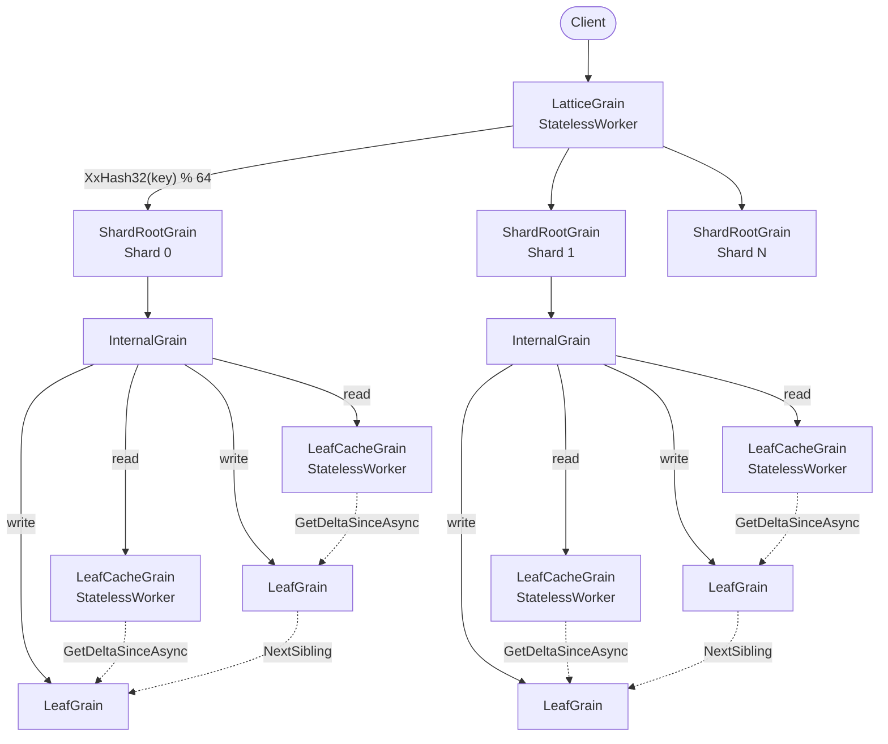
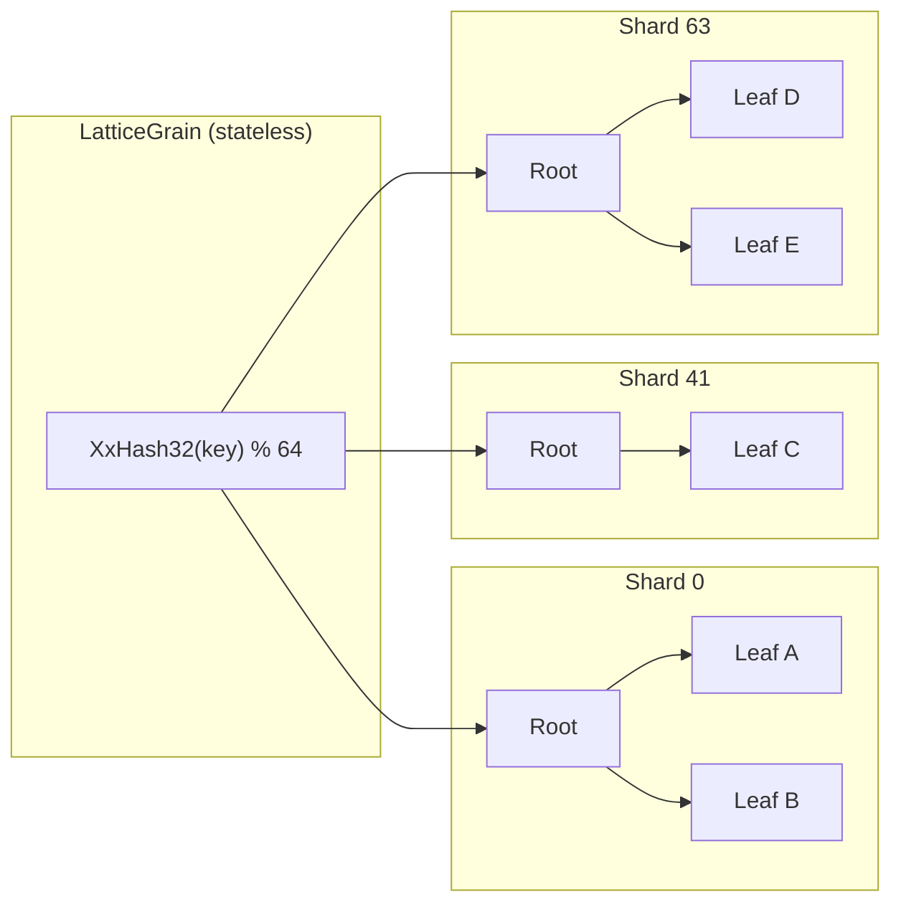
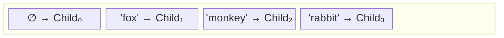
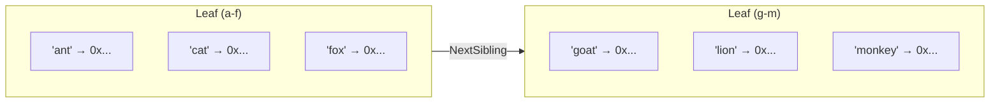
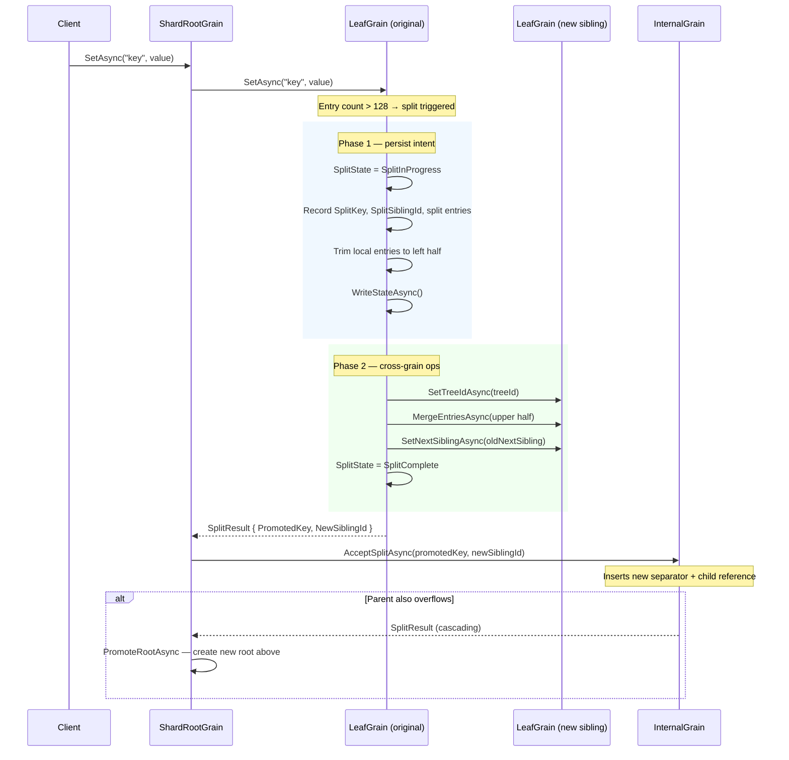
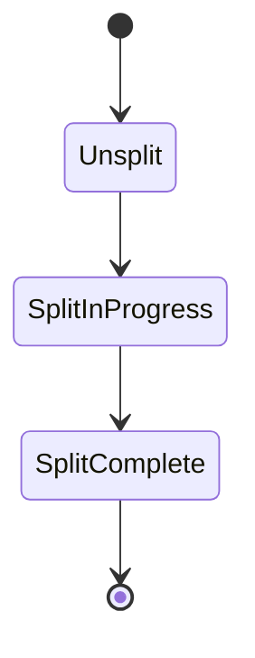
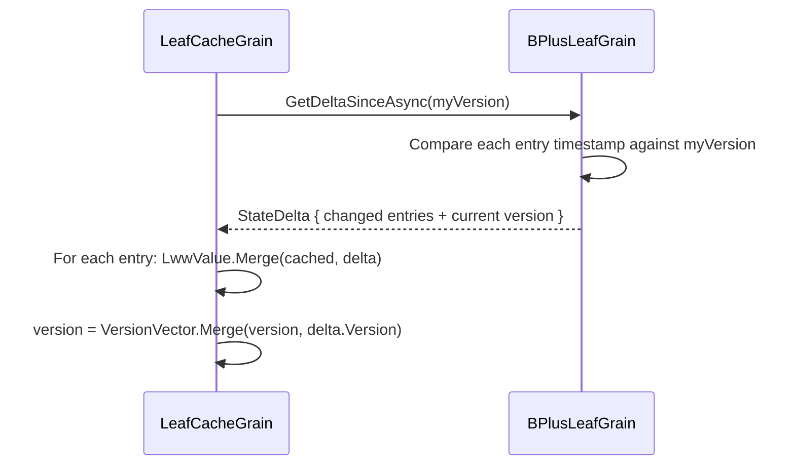
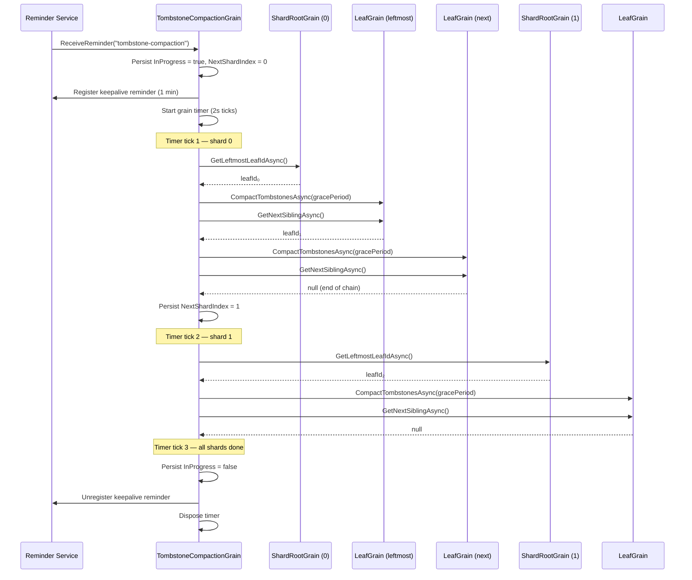
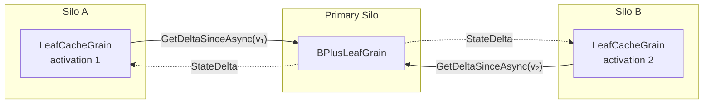

# Orleans.Lattice

A distributed B+ tree library built on [Microsoft Orleans](https://learn.microsoft.com/dotnet/orleans/), designed for scalable ordered key-value storage across a cluster. The tree is **sharded** — incoming keys are hashed to one of many independent sub-trees so that no single root grain becomes a throughput bottleneck. Every node uses **monotonic state primitives** (hybrid logical clocks, last-writer-wins registers, and monotonic split lifecycle enums) to resolve conflicts without distributed locks and to make split operations idempotent and crash-safe.

## Use Cases

| Scenario | Why Orleans.Lattice fits |
|---|---|
| **Distributed ordered index** — maintain a sorted index across a cluster where point lookups and future range scans are both needed | B+ tree structure keeps keys in sort order; sharding spreads load across grains |
| **High-write key-value store** — many writers updating different keys concurrently | Each shard's sub-tree is independent; LWW registers resolve concurrent writes to the same key without coordination |
| **Actor-per-entity metadata store** — store metadata for millions of entities (IoT devices, user profiles, game objects) keyed by ID | Orleans virtual actors manage activation/deactivation automatically; tree depth stays small (2–3 levels for millions of keys) |
| **Event-sourced lookup tables** — build secondary indices over event-sourced aggregates that need to survive partial failures | Monotonic split state means a crash mid-split can be recovered by re-emitting the split record — idempotently |
| **Multi-tenant ordered storage** — each tenant gets a logically separate tree sharing the same silo infrastructure | The shard router grain key is the tree ID, so multiple independent trees coexist in one cluster |

## How It Works

### High-Level Architecture

A request flows through five layers of Orleans grains. Writes go directly to the primary leaf; reads are served by a stateless cache that pulls deltas from the primary:



1. **`LatticeGrain`** — a `[StatelessWorker]` grain (many concurrent activations). Computes `XxHash32(key) % shardCount` to pick a shard, then forwards the request.
2. **`ShardRootGrain`** — one per shard (keyed `{treeId}/{shardIndex}`). Manages the root pointer for its sub-tree and handles root-level splits by creating new internal nodes above the old root. Routes reads through the cache layer.
3. **`BPlusInternalGrain`** — an internal node holding separator keys and child references. Routes a key to the correct child and accepts promoted splits from below. Split acceptance is idempotent — duplicate deliveries are detected and skipped.
4. **`LeafCacheGrain`** — a `[StatelessWorker]` read-through cache. Each silo may have its own activation. On a cache miss, it pulls a `StateDelta` from the primary leaf and merges entries using `LwwValue.Merge`. Because the merge is commutative and idempotent, stale entries are harmlessly overwritten without an invalidation protocol.
5. **`BPlusLeafGrain`** — a leaf node storing key → value entries in a sorted dictionary. Splits when the entry count exceeds the configured maximum. Maintains a `VersionVector` that is ticked on every write, enabling delta extraction for the cache layer.

### Sharding

Without sharding, every operation starts at a single root grain — a serialisation bottleneck. Sharding eliminates this by giving each key range its own independent sub-tree:



The hash function (`XxHash32`) is **stable across processes** — unlike `string.GetHashCode()`, it will always route the same key to the same shard. The default shard count is 64, configurable at tree creation time.

**Trade-off:** Keys in different shards have no ordering relationship. A global range scan requires a scatter-gather across all shards followed by a merge.

### B+ Tree Node Structure

Each shard is a standard B+ tree with a configurable branching factor (default: 128 keys per leaf, 128 children per internal node).

#### Internal Nodes

An internal node stores a sorted list of `(SeparatorKey, ChildGrainId)` entries. The first entry always has a `null` separator and acts as the leftmost catch-all:



Routing walks the separator list from right to left and picks the first child whose separator is ≤ the search key:

| Lookup key | Selected child | Reason |
|---|---|---|
| `"ant"` | Child₀ | `"ant"` < `"fox"`, falls through to leftmost |
| `"fox"` | Child₁ | `"fox"` ≥ `"fox"` |
| `"lion"` | Child₂ | `"lion"` ≥ `"monkey"` is false, `"lion"` ≥ `"fox"` is true — wait, walk from right: `"lion"` < `"rabbit"`, `"lion"` < `"monkey"`, `"lion"` ≥ `"fox"` ✓ → Child₁ |
| `"zebra"` | Child₃ | `"zebra"` ≥ `"rabbit"` |

#### Leaf Nodes

Each leaf stores entries in a `SortedDictionary<string, LwwValue<byte[]>>` and maintains a `NextSibling` pointer to the right neighbour for future range scans:



### Leaf Splits

When a leaf exceeds `MaxLeafKeys` (128) entries after an insert, it splits using a **two-phase** pattern that is crash-safe:



1. **Phase 1 (persist intent):** The leaf finds the **median key**, records the split metadata (`SplitKey`, `SplitSiblingId`, right-half entries) and trims its own entries to the left half — all in a single `WriteStateAsync` call.
2. **Phase 2 (cross-grain ops):** The new sibling is populated via `MergeEntriesAsync` (an idempotent bulk merge), sibling pointers are updated, and `SplitState` advances to `SplitComplete`.
3. A `SplitResult` containing the promoted key and new sibling's `GrainId` is returned up the call stack.
4. The parent internal node inserts the new separator. If *it* overflows, the split cascades further (internal nodes use the same two-phase pattern).
5. If the split reaches the shard root, a new internal root is created above the old one via a two-phase `PromoteRootAsync`, increasing tree depth by one.

**Recovery:** If a grain crashes between Phase 1 and Phase 2, the next call to `SetAsync` detects `SplitState == SplitInProgress` and resumes Phase 2 (`CompleteSplitAsync`). After recovery completes, the caller's write is routed to the correct leaf — locally if the key falls below the split key, or forwarded to the new sibling otherwise. This ensures **no writes are lost** during a crash mid-split.

### Monotonic State Primitives

All state in the tree is designed to advance monotonically — it can move forward but never backwards. This makes operations idempotent and crash-safe.

#### Hybrid Logical Clock (HLC)

Each grain maintains an `HybridLogicalClock` that combines wall-clock time with a logical counter:

```
HLC = (WallClockTicks, Counter)
```

- **Tick** — advances the clock for a local event. If the physical clock has moved forward, the counter resets to 0. Otherwise the counter increments.
- **Merge** — given two HLC values, returns a new value strictly greater than both. The merge is commutative and associative.

This gives every write a totally-ordered timestamp without requiring a central clock service.

#### Last-Writer-Wins Register (LWW)

Each key-value entry in a leaf node is wrapped in `LwwValue<byte[]>`:

```
LwwValue = (Value, Timestamp, IsTombstone)
```

The merge rule is simple: **the entry with the higher `HLC` timestamp wins**. This is:

- **Commutative:** `Merge(a, b) = Merge(b, a)`
- **Associative:** `Merge(Merge(a, b), c) = Merge(a, Merge(b, c))`
- **Idempotent:** `Merge(a, a) = a`

These three properties make `LwwValue` a join-semilattice — two divergent replicas can always merge to a consistent result regardless of message ordering.

Deletes are represented as **tombstones** (an `LwwValue` with `IsTombstone = true` and a timestamp). A tombstone with a higher timestamp than a live value wins; a live value with a higher timestamp than a tombstone "resurrects" the key.

#### Monotonic Split State

The split lifecycle for every node is a three-value enum:



The merge operation is `max()` — once a node reaches `SplitComplete`, no message can revert it to an earlier state. This means:

- If a grain crashes between `SplitInProgress` and `SplitComplete`, on reactivation it detects the incomplete split and resumes the cross-grain phase (`CompleteSplitAsync`). The sibling operations (`MergeEntriesAsync`, `InitializeAsync`) are idempotent, and the parent's `AcceptSplitAsync` guards against duplicate `(separatorKey, childId)` pairs.
- If two messages arrive out of order (one carrying `SplitInProgress`, one carrying `SplitComplete`), the result is simply `SplitComplete`.
- After recovery, the caller's original operation (a write for leaves, a split promotion for internal nodes) is routed to the correct node based on the split key — ensuring no operations are silently dropped.

#### Version Vector

Each leaf node maintains a `VersionVector` — a map from replica ID (the grain's string identity) to the highest `HLC` value produced by that replica:

```
VersionVector = { "grain/abc" → HLC(100:3), "grain/def" → HLC(95:0) }
```

The version vector is ticked on every write (insert, update, or delete). This enables **delta extraction**: a consumer can present its own version vector and ask "give me everything that changed since this point." The leaf compares each entry's timestamp against the consumer's clock for the relevant replica and returns only the newer entries.

Merge is **pointwise-max** across all replica IDs:

```
Merge({r1→10, r2→5}, {r1→8, r3→3}) = {r1→10, r2→5, r3→3}
```

This is commutative, associative, and idempotent — making it safe for uncoordinated consumers to merge version vectors from multiple sources.

#### State Deltas

A `StateDelta` is a snapshot of changes extracted from a leaf:

```
StateDelta = {
    Entries:  { key → LwwValue }   // only entries newer than the caller's version
    Version:  VersionVector          // the leaf's version at extraction time
    SplitKey: string?                // non-null if the leaf has split since the caller's version
}
```

When `SplitKey` is present, it signals that the leaf has split and all entries ≥ `SplitKey` have moved to a new sibling. Consumers (e.g. `LeafCacheGrain`) use this to **prune** stale entries from their local cache that now belong to the sibling.

The delta extraction flow:



Because both `LwwValue.Merge` and `VersionVector.Merge` are lattice operations, applying the same delta twice is a no-op. This makes the protocol tolerant of duplicate deliveries and message reordering.

### Tombstone Compaction

Deleted keys are represented as **tombstones** — `LwwValue` entries with `IsTombstone = true`. Tombstones participate in LWW merge and delta replication like any other entry, so all replicas and caches eventually learn about the delete. However, tombstones are never removed by normal operations, leading to unbounded storage and scan overhead.

#### How It Works

A single **`TombstoneCompactionGrain`** per tree owns one [grain reminder](https://learn.microsoft.com/dotnet/orleans/grains/timers-and-reminders) that fires at the configured grace-period interval. When the reminder fires, it starts a **grain timer** that processes one shard per tick (every 2 seconds), avoiding a single long-running grain call that could hit Orleans timeouts for large trees:

1. The reminder tick persists `InProgress = true` and registers a **one-minute keepalive reminder**, then starts a grain timer at shard 0.
2. Each timer tick processes one shard:
   a. Calls `GetLeftmostLeafIdAsync` on the shard root to find the head of the leaf chain.
   b. Walks the doubly-linked leaf list via `GetNextSiblingAsync`, calling `CompactTombstonesAsync` on each leaf.
   c. Persists the updated `NextShardIndex` to durable state.
3. If a shard fails, it is retried once before being skipped.
4. After all shards are processed, the timer self-disposes, `InProgress` is set to `false`, and the keepalive reminder is unregistered.

**Recovery:** If the silo restarts mid-compaction, the keepalive reminder fires within one minute and the grain resumes from the persisted `NextShardIndex`. Once the pass completes, the keepalive is unregistered. If `InProgress` is already `false` when the keepalive fires, it simply unregisters itself.

Each leaf compares every tombstone's `HLC.WallClockTicks` against `now − gracePeriod`. Tombstones older than the cutoff are physically removed from the `SortedDictionary`. A `LastCompactionVersion` (a `VersionVector` snapshot) is persisted after each pass so that subsequent ticks can **skip the scan entirely** when no writes have occurred since the last compaction.



The reminder is registered lazily — `LatticeGrain` calls `EnsureReminderAsync` on the first `SetAsync` or `DeleteAsync` for a given tree. A per-process `ConcurrentDictionary` ensures this cross-grain call happens at most once per silo.

For manual or on-demand compaction (e.g. maintenance scripts, integration tests), call `RunCompactionPassAsync` on the compaction grain directly:

```csharp
var compaction = grainFactory.GetGrain<ITombstoneCompactionGrain>("my-tree");
await compaction.RunCompactionPassAsync();
```

#### Configuration

`TombstoneGracePeriod` follows the same named-options pattern as all other `LatticeOptions` properties:

```csharp
// Global default — applies to all trees.
siloBuilder.ConfigureLattice(o => o.TombstoneGracePeriod = TimeSpan.FromHours(12));

// Per-tree override.
siloBuilder.ConfigureLattice("my-tree", o => o.TombstoneGracePeriod = TimeSpan.FromDays(7));

// Disable compaction entirely for a specific tree.
siloBuilder.ConfigureLattice("archive-tree", o => o.TombstoneGracePeriod = Timeout.InfiniteTimeSpan);
```

The default grace period is **24 hours**. The reminder interval equals the grace period (clamped to a minimum of 1 minute, the Orleans reminder floor).

#### Design Considerations

| Concern | Approach |
|---|---|
| **Scalability** | One reminder per tree (not per leaf). The compaction grain uses a grain timer to process one shard per tick, avoiding long-running calls that could hit Orleans timeouts. |
| **Consistency** | Tombstones are only removed after the grace period, giving all caches and replicas time to observe the delete via delta replication. |
| **Idempotency** | `CompactTombstonesAsync` is safe to call multiple times. The `LastCompactionVersion` fast-path avoids redundant scans. |
| **Durability** | Compaction progress (`NextShardIndex`, `InProgress`) is persisted to grain storage. A one-minute keepalive reminder ensures the grain is reactivated after a silo restart to resume the in-flight pass. |
| **Fault tolerance** | If a shard fails during compaction, it is retried once before being skipped. The next reminder tick starts a fresh pass. |
| **Memory** | Leaves are compacted one at a time via sequential grain calls. Orleans deactivates idle leaves on its normal schedule; no bulk activation occurs. |
| **Disabling** | Set `TombstoneGracePeriod = Timeout.InfiniteTimeSpan` to disable compaction globally or per tree. |

### Read Caching

The `LeafCacheGrain` is a `[StatelessWorker]` that acts as a per-silo read-through cache for leaf data:



- **Delta refresh**: Every read calls `GetDeltaSinceAsync` on the primary leaf, passing the cache's current `VersionVector`. If the cache is already up to date, the primary short-circuits and returns an empty delta (a cheap version-vector comparison, no entry scan). If entries have changed, only the newer entries are returned and merged in.
- **Consistency**: Reads are consistent as of the moment the delta is fetched from the primary. The only window for a "stale" result is a concurrent write that lands on the primary *after* `GetDeltaSinceAsync` returns but *before* the caller sees the response — this is normal read-write race behaviour, not cache staleness.
- **Why keep a local cache at all?**: The `VersionVector` fast-path makes the delta call cheap when nothing has changed, but the local `Dictionary<string, LwwValue<byte[]>>` avoids deserialising the full entry set on every read. When the primary returns a non-empty delta, only the changed entries are merged — the rest are already in memory.
- **Split-aware pruning**: When a `StateDelta` contains a non-null `SplitKey`, the cache removes all entries with keys ≥ `SplitKey` from its local dictionary. These entries now belong to a different leaf grain and would otherwise become stale ghosts in the cache.

### Idempotent Split Propagation

`AcceptSplitAsync` on internal nodes checks for duplicate `(separatorKey, childId)` pairs before inserting. If the same split result is delivered twice (e.g. crash recovery, message retry), the duplicate is detected and skipped. Combined with the monotonic `SplitState` on leaf and internal nodes, this makes the entire split protocol idempotent end-to-end.

Internal nodes themselves use the same two-phase split pattern as leaves. If an internal node crashes mid-split, the next `AcceptSplitAsync` call resumes the incomplete split before processing the caller's promotion — routing it to the correct node (locally or to the new sibling) based on the split key.

### Root Promotion

When a split cascades all the way up to the shard root, `ShardRootGrain` creates a new internal root above the old one via a **two-phase promotion**:

1. **Phase 1 (persist intent):** The `SplitResult` and a `RootWasLeaf` flag are saved to `ShardRootState.PendingPromotion` and persisted.
2. **Phase 2 (create root):** A new `BPlusInternalGrain` is created with a **deterministic `GrainId`** derived from the shard key and old root ID (`SHA-256` hash). The new root is initialised with the promoted key and left/right children, and `RootNodeId` is updated.

If the shard root crashes between phases, `ResumePendingPromotionAsync` (called at the start of every `GetAsync`, `SetAsync`, and `DeleteAsync`) detects the pending promotion and completes it. The deterministic `GrainId` ensures that re-executing Phase 2 targets the same grain — making the promotion idempotent.

### Bounded Retry

`ShardRootGrain` wraps `SetAsync` and `DeleteAsync` in a bounded retry loop (default: 3 attempts). If a grain call fails due to a transient error (e.g. storage fault, network partition), the request is retried. Orleans automatically deactivates a failed grain; the retry hits a fresh activation that runs any pending recovery logic before processing the request. This shields callers from transient infrastructure errors without requiring client-side retry code.

### Grain-to-Grain Mapping

| B+ Tree Concept | Orleans Grain | Key Format | Persistent State |
|---|---|---|---|
| Shard router | `LatticeGrain` (`[StatelessWorker]`) | `{treeId}` | None (stateless) |
| Shard root | `ShardRootGrain` | `{treeId}/{shardIndex}` | `ShardRootState` — root node ID + leaf/internal flag + pending promotion |
| Internal node | `BPlusInternalGrain` | `Guid` | `InternalNodeState` — sorted children + HLC + split state |
| Leaf node | `BPlusLeafGrain` | `Guid` | `LeafNodeState` — sorted LWW entries + sibling pointer + HLC + version vector + split state |
| Leaf cache | `LeafCacheGrain` (`[StatelessWorker]`) | `{leafGrainId}` | None (in-memory LWW-map + version vector) |

### Capacity and Depth

With the default branching factor of 128:

| Keys per shard | Tree depth | Total grains per shard |
|---|---|---|
| ≤ 128 | 1 (leaf only) | 2 (root + leaf) |
| ≤ 16,384 | 2 | ~130 |
| ≤ 2,097,152 | 3 | ~16,500 |

With 64 shards, the total tree supports **~134 million keys** at depth 3. Each hop between grains costs approximately 0.1–1 ms within a cluster, so a depth-3 lookup is 3–4 grain calls from router to leaf.

## Getting Started

```csharp
// In your silo configuration:
siloBuilder.AddMemoryGrainStorage("bplustree");
// Or use Azure Table Storage, ADO.NET, etc.

// In client code:
var router = grainFactory.GetGrain<ILattice>("my-tree");

// Write
await router.SetAsync("customer-123", Encoding.UTF8.GetBytes("Alice"));

// Read
byte[]? value = await router.GetAsync("customer-123");

// Delete
bool deleted = await router.DeleteAsync("customer-123");
```

## Project Structure

```
src/lattice/
├── Primitives/
│   ├── HybridLogicalClock.cs    Monotonic timestamp (wall clock + counter)
│   ├── LwwValue.cs              Last-writer-wins register with tombstone support
│   ├── SplitState.cs            Monotonic split lifecycle enum
│   ├── VersionVector.cs         Causal history per replica (pointwise-max merge)
│   └── StateDelta.cs            Changed entries + version + split key for delta replication
└── BPlusTree/
    ├── LatticeOptions.cs        Branching factor and shard count constants
    ├── SplitResult.cs           Promoted key + new sibling ID
    ├── ILattice.cs              Public API — stateless router
    ├── IShardRootGrain.cs       Per-shard root interface
    ├── IBPlusInternalGrain.cs   Internal node interface
    ├── IBPlusLeafGrain.cs       Leaf node interface + delta extraction + tombstone compaction
    ├── ILeafCacheGrain.cs       Stateless read-through cache interface
    ├── ITombstoneCompactionGrain.cs  Per-tree tombstone compaction reminder owner
    ├── State/
    │   ├── LeafNodeState.cs     Sorted LWW entries + sibling pointer + version vector
    │   ├── InternalNodeState.cs Sorted children + routing logic + split state
    │   ├── ShardRootState.cs    Root pointer + leaf/internal flag + pending promotion
    │   └── TombstoneCompactionState.cs  In-flight compaction progress for crash recovery
    └── Grains/
        ├── LatticeGrain.cs           XxHash32 shard routing
        ├── ShardRootGrain.cs        Root management + two-phase split promotion + retry + cache routing
        ├── BPlusInternalGrain.cs    Idempotent separator insertion + two-phase cascading splits
        ├── BPlusLeafGrain.cs        LWW insert/delete + two-phase leaf splitting + delta extraction
        └── LeafCacheGrain.cs        Stateless per-silo read cache with LWW merge + split pruning
        └── TombstoneCompactionGrain.cs  Reminder-driven tombstone cleanup across all leaves
```

## License

This project is unlicensed. See [LICENSE](LICENSE) for details.
