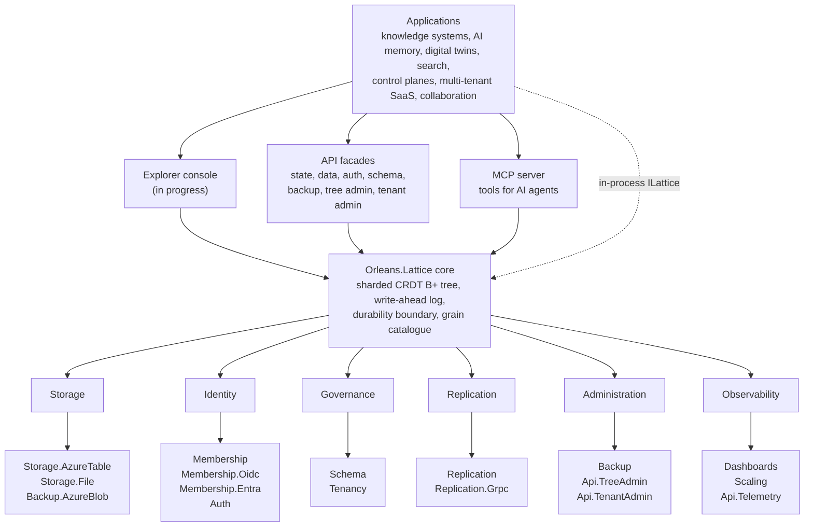

# Orleans.Lattice


[](https://www.nuget.org/packages/Orleans.Lattice)
[](https://codecov.io/gh/NSTA1/Orleans.Lattice)

Orleans.Lattice is a platform for building durable, distributed state systems on
[Microsoft Orleans](https://learn.microsoft.com/dotnet/orleans/).

At its centre is a sorted, horizontally-scalable, conflict-free key-value store
that runs inside your own cluster. Around it are the concerns a real system
acquires once it outgrows one machine - storage, identity, governance,
replication, administration, observability - each implemented as a companion
package behind a seam in the core, rather than baked into it.

It is local-first. A complete deployment runs on a single machine with no cloud
dependency, and the same programming model carries through to a globally
distributed, active-active estate. What changes between those two points is
which companion packages a host registers, not the code that reads and writes
data.

### Start here

| If you want to | Go to |
|---|---|
| Understand what the platform is and how it is put together | This page |
| Browse the full capability catalogue | [FEATURES.md](FEATURES.md) |
| Find the right package for a concern | [PACKAGES.md](PACKAGES.md) |
| See a production deployment blueprint | [reference-architecture.md](reference-architecture.md) |
| Write code now | [Quick Start](#quick-start) |
| Read the day-to-day reference docs | [Documentation](#documentation) |

## What is it?

The core is a **sorted, durable, horizontally-scalable key-value store** embedded
in your Orleans cluster. Keys are `string`, values are `byte[]`, and typed-value
helpers layer automatic serialization on top. No external database, no
coordinator service, no external queue.

The keyspace is split across self-balancing B+ sub-trees that rebalance
themselves online. The durability boundary is a write-ahead log. Conflict
resolution is algebraic rather than lock-based or consensus-based, which is what
lets any cluster accept a write to any key.

The core alone supports:

- Point reads, writes, deletes, and per-entry TTL.
- Ordered key and entry scans - forward, reverse, and range-bounded.
- Multi-key atomic writes with all-or-nothing visibility - within a tree, and across multiple trees.
- Bulk loading from one-shot batches or streaming `IAsyncEnumerable` sources.
- Durable, resumable cursors that survive silo failovers and client restarts.
- Online resize, online reshard, and online snapshots (offline mode also available).
- Soft delete with a configurable retention window, and undo of resize within the window.
- Per-tree event stream, diagnostics, and `System.Diagnostics.Metrics` instruments.

The name comes from its use of **lattice-based state primitives** - mathematical
structures where merges are commutative, associative, and idempotent - which is
what makes the system conflict-free and recoverable without distributed locks or
consensus (**provided** you use its [CRDT Primitives](docs/crdt/readme.md)).

## Why it exists

Every durable distributed system ends up solving the same set of problems:
sharding, online rebalancing, crash-safe durability, conflict resolution,
backup, tenancy, identity, replication, and an operator surface. They are
usually assembled from a database, a cache, a queue, an identity provider, and a
layer of glue - each with its own operational model, its own failure modes, and
its own consistency story to reconcile with the others.

Orleans already supplies the hard parts of a distributed runtime: virtual
actors, single-threaded execution per grain, location transparency, and
failover. What it does not supply is an ordered, durable, shardable store to put
underneath them. Orleans.Lattice fills that gap, and takes three positions about
how:

- **The store lives in the cluster.** State is held by grains in the same
  process as the code using it, so a read is a grain call rather than a network
  round trip to a separate tier with its own scaling and failure envelope.
- **Conflict resolution is algebraic.** Merges are commutative, associative, and
  idempotent, so convergence needs no distributed lock manager and no consensus
  round trip. This is what makes active-active writes across regions tractable.
- **Everything else is a seam.** Storage, identity, governance, replication,
  administration and observability are companion packages that plug into
  documented extension points. A host that registers none of them runs the core
  library alone, with no ambient cost for the features it does not use.

The result is a platform rather than a product: it is not tied to one
application category, and the deployment topology is a configuration decision
taken late, not an architecture decision taken up front.

## What you can build

Orleans.Lattice is a substrate for durable distributed state, so the categories
below are examples of what the same primitives compose into, not a fixed feature
set.

| Category | Why the platform fits | Relevant capabilities |
|---|---|---|
| **Knowledge systems** | Ordered keyspaces with per-key revision history and server-side filtering, so a corpus can be browsed, versioned, and queried without a separate metadata store. | [Change history](FEATURES.md#indexing-search-and-views), [predicate operations](docs/lattice/predicated-operations.md), [tag indexes](docs/lattice/api.md#tag-indexes) |
| **AI memory systems** | Conflict-free records with per-entry TTL and approximate nearest-neighbour search over vectors held in the same store the records live in. | [Vector search](docs/lattice.vector/README.md), [TTL](docs/lattice/ttl.md), [MCP server](docs/lattice.api.mcp/README.md) |
| **Digital twins** | One grain per entity with durable, ordered state behind it, converging deterministically when a device and the cloud both write. | [Conflict-free merges](docs/lattice/state-primitives.md), [grain indexes](docs/lattice.grainindex/README.md), [events](docs/lattice/events.md) |
| **Search and indexing platforms** | Materialised views and tag indexes maintained off the write-ahead log, so secondary access paths are derived rather than hand-maintained. | [Materialised views](docs/lattice/materialised-views.md), [tag indexes](docs/lattice/api.md#tag-indexes), [vector search](docs/lattice.vector/README.md) |
| **Distributed control planes** | Fail-closed authorization, atomic multi-key writes, fencing-token leases, and a saga coordinator for changes that must apply all-or-nothing. | [Atomic writes](docs/lattice/atomic-writes.md), [atomic action](docs/lattice/atomic-action.md), [distributed lock](docs/lattice/distributed-lock.md) |
| **Multi-tenant SaaS platforms** | Keyspace-partitioned tenants with per-tenant quotas, metering, rate limiting, and optional region residency, layered on the core through null seams. | [Multi-tenancy](docs/lattice.tenancy/README.md), [schema enforcement](docs/lattice.schema/README.md), [tenant administration](docs/lattice.api.tenantadmin/README.md) |
| **Collaborative applications** | Active-active replication where any cluster may write any key, with deterministic convergence and no coordinator to elect. | [Cross-cluster replication](docs/lattice.replication/README.md), [state primitives](docs/lattice/state-primitives.md), [change history](docs/lattice/change-history.md) |

## The deployment journey

A deployment grows in three stages. The application code that reads and writes
data is identical in all three: it resolves `ILattice` and calls it. Each stage
adds companion packages and configuration, not a rewrite.

### 1. Local

One machine, no cloud account, no external services. This is a first-class
deployment target, not a degraded development mode.

- **Durability.** The [file write-ahead log](docs/lattice.storage.file/README.md)
  gives an append-and-fsync log per shard on local disk, with crash-safe
  reconciliation and background compaction. The in-memory WAL is the default if
  you do not need durability yet.
- **Inspection.** The [Explorer console](docs/lattice.explorer/running-the-explorer.md)
  (in progress) browses trees, topology, data and history over the cluster's
  gRPC APIs.
- **AI access.** The [MCP server](docs/lattice.api.mcp/README.md) exposes the
  cluster's API facades as Model Context Protocol tools an agent can call.

### 2. Team

A shared cluster with real users, so identity, policy and data shape start to
matter.

- **Identity.** [OIDC](docs/lattice.membership.oidc/README.md) for Okta, Auth0,
  Keycloak, Ping or Google, or [Entra ID](docs/lattice.membership.entra/README.md)
  for Microsoft identities, resolving credentials to subjects with transitive
  group membership.
- **Authorization.** [Fail-closed, default-deny policy](docs/lattice/security.md)
  per tree, prefix, or key, enforced on the core data path and on every external
  API.
- **Schema.** [Per-tree write validation and value versioning](docs/lattice.schema/README.md),
  with dead-letter diversion of non-compliant writes and read-time upcasting of
  stale values.
- **Tenancy.** [Keyspace-partitioned tenants](docs/lattice.tenancy/README.md) with
  a lifecycle, per-tenant quotas, metering and rate limiting.

### 3. Global

Multiple regions, each serving reads and writes.

- **Replication.** [Active-active replication](docs/lattice.replication/README.md)
  between clusters. Any cluster can write to any tree; concurrent updates
  converge deterministically, and atomic multi-key writes stay all-or-nothing on
  every peer.
- **Backup and disaster recovery.** [Causally consistent backup](docs/lattice.backup/README.md)
  to a shared sink that is the single source of truth, so the catalog rebuilds
  from it and a backup [cold-restores into a fresh cluster](docs/lattice.backup/disaster-recovery.md).
- **Autoscaling.** A [cluster-aggregate scaling signal](docs/lattice.scaling/README.md)
  an external autoscaler such as KEDA can scrape.
- **Blueprint.** The [reference architecture](reference-architecture.md) is a
  worked design plus a parameterised deployment kit for an active-active,
  cross-region estate on Azure Container Apps.

| Stage | Add | Programming model |
|---|---|---|
| Local | File WAL, Explorer, MCP | `ILattice` |
| Team | Membership, Auth, Schema, Tenancy | `ILattice` |
| Global | Replication, Backup, Scaling | `ILattice` |

## Architecture: a core plus seams

The distinctive structural property of Orleans.Lattice is that major concerns
are not implemented in the core. Each is a seam the core defines and a companion
package fills. A host composes the platform it needs by registering packages;
nothing it leaves out is present at runtime.


```mermaid
flowchart TD
    App["Applications<br/>knowledge systems, AI memory, digital twins, search,<br/>control planes, multi-tenant SaaS, collaboration"]

    App --> Explorer["Explorer console<br/>(in progress)"]
    App --> Apis["API facades<br/>state, data, auth, schema,<br/>backup, tree admin, tenant admin"]
    App --> Mcp["MCP server<br/>tools for AI agents"]

    Explorer --> Core
    Apis --> Core
    Mcp --> Core
    App -. "in-process ILattice" .-> Core

    Core["Orleans.Lattice core<br/>sharded CRDT B+ tree, write-ahead log,<br/>durability boundary, grain catalogue"]

    Core --> Storage["Storage"]
    Core --> Identity["Identity"]
    Core --> Governance["Governance"]
    Core --> Replication["Replication"]
    Core --> Administration["Administration"]
    Core --> Observability["Observability"]

    Storage --> StoragePkgs["Storage.AzureTable<br/>Storage.File<br/>Backup.AzureBlob"]
    Identity --> IdentityPkgs["Membership<br/>Membership.Oidc<br/>Membership.Entra<br/>Auth"]
    Governance --> GovernancePkgs["Schema<br/>Tenancy"]
    Replication --> ReplicationPkgs["Replication<br/>Replication.Grpc"]
    Administration --> AdminPkgs["Backup<br/>Api.TreeAdmin<br/>Api.TenantAdmin"]
    Observability --> ObsPkgs["Dashboards<br/>Scaling<br/>Api.Telemetry"]
```

Three consequences follow from this shape, and they are worth understanding
before reading the catalogues:

- **Opt-in cost.** A capability you do not register costs nothing. Tenancy, for
  example, is layered on the core through null seams, so a host without it is
  byte-for-byte unchanged.
- **Substitutable implementations.** A seam is a public contract, not an
  internal detail. Storage backends, identity providers, compression algorithms,
  backup sinks, and Explorer plugins are all replaceable with your own.
- **Uniform external surface.** Every external caller - gRPC client, operator
  console, AI agent - goes through the same transport-agnostic API facades and
  the same fail-closed authorization gate, so a permission means the same thing
  whichever surface asks.

The complete inventory lives in [PACKAGES.md](PACKAGES.md), and the capability
each package delivers is catalogued in [FEATURES.md](FEATURES.md).

## Core properties

- **Self-organising under load.** Hot regions of the keyspace re-balance themselves online - no downtime, no lost writes, no coordination protocol. Cold regions stay cheap.
- **Strongly consistent from the outside.** Point reads, writes, and ordered scans always see a consistent view of the data, even while the cluster is rebalancing underneath. See [Consistency](docs/lattice/consistency.md) for the per-operation guarantee matrix.
- **Crash-safe by construction.** A silo crash at any point - mid-write, mid-split, mid-snapshot, mid-bulk-load - is recovered without operator intervention and without data loss.
- **Eventually convergent under failure.** Storage faults, stale routing, and interrupted operations cannot corrupt data; once the fault window closes, the tree converges to the correct state.
- **No locks, no consensus round-trips.** No Paxos, no Raft, no distributed lock manager. All conflict resolution is algebraic.

Behaviour is validated end-to-end by a suite of [chaos tests](docs/lattice/chaos-tests.md) that hammer a live cluster with concurrent reads, writes, scans, splits, resizes, and reshards - optionally with random storage-write faults - and assert both live consistency and eventual convergence. The concurrency-critical protocols go further: the atomic-commit protocol, the WAL seams, the distributed lock, and the atomic-action coordinator are driven by pure deterministic cores that a [verification tier](FEATURES.md#reliability-and-formal-verification) machine-checks with Coyote and, for atomic commit, a TLA+ specification.

## Quick Start

Register Lattice on a silo. `AddLattice` registers the grain catalogue, the grain storage provider (via the supplied callback), and the in-memory write-ahead-log backend in a single call:

```csharp verify
siloBuilder.AddLattice((silo, storageName) =>
    silo.AddMemoryGrainStorage(storageName));

// AddLattice registers the in-memory WAL by default - swap for a durable backend in production.

// elsewhere - on the client or inside a grain - resolve a tree by name and write a key:
var lattice = grainFactory.GetGrain<ILattice>("my-tree");
await lattice.SetAsync("hello", "world"u8.ToArray());
```

For production, swap the in-memory WAL for a durable backend - e.g. Azure Table Storage from the sibling package:

```csharp verify
siloBuilder
    .AddLattice((silo, storageName) => silo.AddMemoryGrainStorage(storageName))
    .AddAzureTableWalStorage(opts =>
    {
        opts.ConnectionString = "DefaultEndpointsProtocol=https;...";
    });
```

Add cross-cluster replication on top by registering `AddLatticeReplication(...)` alongside the WAL. See the [`Orleans.Lattice.Replication` overview](docs/lattice.replication/README.md) for the full multi-cluster setup.

For a local-first alternative to the Azure Table backend, register the
[file write-ahead log](docs/lattice.storage.file/README.md) instead and keep the
whole deployment on one machine.

## RepoContext: an example built on the platform

RepoContext is an MCP server that gives an AI agent durable, conflict-free
memory about a codebase: a structural record and content digest per file, symbol
outlines and a reverse cross-reference graph, agent-authored notes and decisions
with optional TTL, semantic search over embeddings, and a budgeted context
bundle with reuse accounting. It runs as a single local container.

It is worth reading as a worked example because it composes most of the platform
at once, and does so without a line of bespoke storage code:

- Every record is a CRDT value on a Lattice tree, so concurrent agents converge
  without locks and the store inherits durability, TTL and tombstone compaction
  from the core.
- [`Orleans.Lattice.Storage.File`](docs/lattice.storage.file/README.md) makes the
  container restart-durable with no cloud account.
- [`Orleans.Lattice.Vector`](docs/lattice.vector/README.md) provides the
  approximate nearest-neighbour index behind semantic search, persisted on a
  tree so a restart reloads it rather than rebuilding it.
- [`Orleans.Lattice.Api.Mcp`](docs/lattice.api.mcp/README.md) supplies the
  agent-facing surface and the fail-closed authorization gate; RepoContext adds
  no authorization path of its own.
- [`Orleans.Lattice.Api.Mcp.RepoContext.Replication`](docs/lattice.api.mcp.repocontext.replication/README.md)
  turns the same store into a multi-cluster one by choosing a per-tree merge
  mode, which is the [deployment journey](#the-deployment-journey) applied to a
  real application.

**RepoContext demonstrates Orleans.Lattice. It does not define it.** It is one
application category among many, and nothing in the platform is shaped around
it.

See the [Repo-context MCP documentation](docs/lattice.api.mcp.repocontext/README.md)
and the [container sample](samples/RepoContextContainer/README.md).

## Documentation

Use these documents for day-to-day use and operations:

- [API Reference](docs/lattice/api.md) - the public `ILattice` interface, batch operations, options, and serializable types.
- [Configuration](docs/lattice/configuration.md) - options reference, per-tree overrides, immutability constraints, storage provider.
- [Security](docs/lattice/security.md) - opt-in identity, authorization, and enforcement: how membership, policy, fail-closed enforcement, the external APIs, and cross-cluster convergence fit together, with links to each package.
- [Predicate Operations](docs/lattice/predicated-operations.md) - server-side predicate push-down for typed reads, conditional and atomic writes, scans, cursors, and range deletes.
- [Migrating from an External Store](docs/lattice/external-store-migration.md) - importing an existing Redis, relational, or Cosmos DB dataset over the bulk-load path, with key-design, value-serialization, and post-load verification guidance.
- [Queues](docs/lattice/queues.md) - the public `ILatticeQueue<T>` cluster-internal FIFO primitive, bounded-queue eviction, and throughput guidance.
- [Compression](docs/lattice/compression.md) - the public `ILatticeCompressor` seam, `AddLatticeCompressor` registration, tag-space partitioning, and how to plug in a custom algorithm.
- [Samples](docs/lattice/samples.md) - runnable sample projects exercising `ILattice`.
- [Benchmarks](docs/lattice/benchmarks.md) - prerequisites, running benchmarks, interpreting results.
- [Troubleshooting](docs/lattice/troubleshooting.md) - symptom-driven diagnosis: reading a `DiagnoseAsync` report, storage-provider write failures, split activity, slow scans, and stale reads.

For internals (the "how"):

- [Architecture](docs/lattice/architecture.md) - grain layers, sharding, root promotion, grain mapping, capacity.
- [Tree Structure](docs/lattice/tree-structure.md) - internal/leaf node layout, two-phase leaf splits, idempotent split propagation.
- [Tree Storage](docs/lattice/tree-storage.md) - per-provider storage limits, node size estimation, sizing recommendations.
- [Verified Atomic-Commit](docs/lattice/verified-atomic-commit.md) - the proven-core pattern, Coyote concurrency tier, property catalogue, and TLA+ spec behind the atomic-commit protocol.
- [Verified WAL](docs/lattice/verified-wal.md) - the proven-core pattern and Coyote concurrency tier behind the WAL shipping, GC-trim, cursor-registry, move-fence, shutdown-drain, offset-allocation, blocked-floor, and move-resume seams.
- [WAL](docs/lattice/wal.md) - write-ahead log as the sole foreground-commit durability boundary.
- [WAL Causal+](docs/lattice/wal-causal-plus.md) - causal+ entry-schema extension, dependency satisfaction, snapshot semantics.
- [WAL Storage Providers](docs/lattice/wal-storage-providers.md) - `IWalStorageProvider` durability seam, in-memory default, optional Azure Table backend.
- [WAL Tuning](docs/lattice/wal-tuning.md) - how `WalMaxPendingBatches` and `WalPartitions` interact with a durable backend's throughput envelope; default sizing rules and the storage-account ceiling above which the cap stops helping.
- [WAL Saturation Signal](docs/lattice/wal-saturation-signal.md) - the per-tree, three-state back-pressure surface (`IWalSaturationSignal`, `IWalSaturationObserver`) that lets callers throttle offered load before silent queueing on the writer-side admission gate.

For the complete catalogues:

- [FEATURES.md](FEATURES.md) - every capability, grouped by concern, with its docs and sample.
- [PACKAGES.md](PACKAGES.md) - every package, grouped by the seam it fills.
- [reference-architecture.md](reference-architecture.md) - the active-active, cross-region deployment blueprint and its parameterised deployment kit.
- [llms.txt](llms.txt) - the documentation index for AI agents and LLM tooling.

## Performance Characteristics

Orleans.Lattice inherits the asymptotic properties of a [B+ tree](https://en.wikipedia.org/wiki/B%2B_tree). In a single shard containing *n* keys with branching factor *b*:

| Operation | Time Complexity |
|---|---|
| Point read (`GetAsync`) | O(log<sub>b</sub> n) |
| Insert / update (`SetAsync`) | O(log<sub>b</sub> n) |
| Delete (`DeleteAsync`) | O(log<sub>b</sub> n) |
| Ordered scan (`ScanKeysAsync`) | O(n) |
| Count (`CountAsync`) | O(n / b) |
| Space | O(n) |

With the default branching factor (~128 children per node), a shard with two million keys is only three levels deep, so a single-key lookup crosses just three grains. Sharding (default 64) reduces per-shard *n* further; cross-shard operations scatter-gather across all shards.

Measured single-silo throughput and latency against real Azure Tables are in the [single-silo performance guide](docs/lattice/performance-single-silo.md).

## Releases

See [CHANGELOG.md](CHANGELOG.md) for the per-version notes and [docs/RELEASING.md](docs/RELEASING.md) for the per-package tag-and-publish protocol.

## Contributing

Contributions are welcome! To get started:

1. Fork the repository and create a feature branch from `main`.
2. Make your changes and ensure all existing tests pass.
3. Add tests for any new functionality.
4. Open a pull request with a clear description of the change and the problem it solves.

Please open an issue first to discuss significant changes or new features before starting work.

## License

This project is licensed under the MIT License. See [LICENSE](LICENSE) for details.
