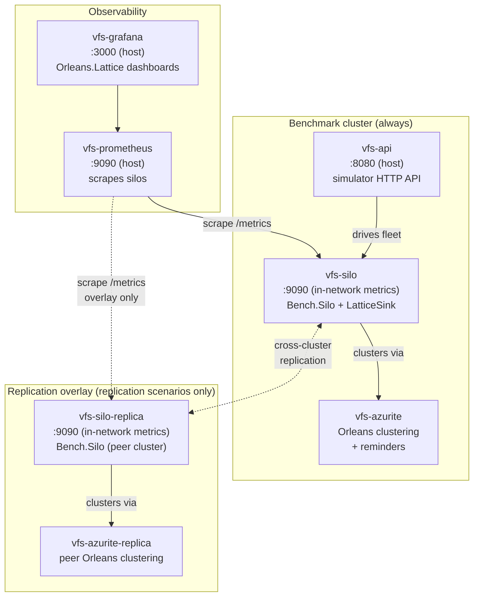

# Orleans.Lattice - Benchmark Stack

> **Why this exists.** The benchmark suite is the regression alarm for
> `Orleans.Lattice`. Every scenario is a fixed, reproducible workload that
> produces a small set of summary scalars - commit p99, commits/s, sink
> publish/drop rates, replication ship/apply latency, cache hit ratio, GC
> pressure, microbench timings. Those scalars are pushed into the
> [history stack](./history/README.md) and rendered as run-over-run trend
> lines in Grafana, so a performance regression caused by a refactor, a
> dependency bump, or a tuning change shows up as a visible step in the line
> and the offending commit (`git_sha` is part of every sample's labels) is one
> click away. Treat the suite as a CI-grade tripwire: run the relevant
> scenarios before merging anything that touches the hot path.

End-to-end benchmark suite covering the 14 scenarios in [`benchmark-scenarios.md`](./benchmark-scenarios.md).

The stack is brought up via `docker compose` and driven through the Vehicle Fleet
Simulator's HTTP API (`samples/VehicleFleetSimulator/`). A single PowerShell script
selects the scenario and runs end-to-end:

```powershell
./benchmark.ps1 current-state-no-replication
```

## Layout

```
benchmark/
├── benchmark.ps1                    # Single-parameter runner (scenario slug). Captures
│                                    # results.json + opportunistically pushes to history.
├── benchmark-all.ps1                # Sweep runner: invokes benchmark.ps1 for every scenario.
├── start-history.ps1                # Bring up / tear down the long-lived history stack only.
├── benchmark-scenarios.md           # Authoritative scenario plan (14 scenarios).
├── docker-compose.yml               # Base topology (single cluster).
├── docker-compose.replication.yml   # Replication overlay (current-state-single-peer,
│                                    # replication-backpressure, receiver-crash,
│                                    # bidirectional-replication, replication-key-filter).
├── host/
│   ├── Bench.Microbench/            # BenchmarkDotNet harness for the `microbench` scenario
│   │                                # (in-process; bypasses the Orleans cluster entirely).
│   ├── Bench.Sink/                  # LatticeSink (bounded-channel ITelemetrySink) +
│   │                                # LatticeReadDriver hosted service for read-* scenarios.
│   └── Bench.Silo/                  # Benchmark silo: env-driven sink switch + Lattice /
│                                    # Replication wiring.
├── scenarios/                       # Per-scenario knobs - one .env per scenario slug.
├── prometheus/
│   ├── prometheus.yml               # Scrape config (single cluster).
│   └── prometheus-replication.yml   # Scrape config (both clusters under the overlay).
├── grafana/
│   ├── provisioning/                # Datasource + dashboards provider yaml.
│   └── dashboards/                  # Embedded Orleans.Lattice dashboards (overview, commit
│                                    # path, replication), synced at run-time from
│                                    # src/lattice.dashboards/Grafana/.
├── history/                         # Long-lived run-over-run history stack.
│   ├── docker-compose.history.yml   # VictoriaMetrics + Grafana on :3001 / :8428.
│   ├── Generate-Dashboards.ps1      # Regenerates the eight persona-trend dashboards.
│   ├── README.md                    # Data model, label schema, ad-hoc query path.
│   └── grafana/                     # Provisioning + generated BenchmarkHistory.*.json.
└── .run/                            # Per-run output: <scenario>/<run_id>/results.json
                                     # plus comparison.{md,csv} when `-Compare` is used.
```

The benchmark stack does **not** modify the simulator. `host/Bench.Silo/` is a separate
silo project that references `samples/VehicleFleetSimulator/src/VehicleFleetSimulator.Grains`
and `.Abstractions` unmodified, plus the new `host/Bench.Sink/` (the LatticeSink) and the
core lattice projects under `src/`. The simulator's existing API project is reused
verbatim - the benchmark `docker-compose.yml` invokes its unmodified Dockerfile from the
simulator-local context.

## Topology



The replication overlay (`docker-compose.replication.yml`) is layered on top of the
base `docker-compose.yml` for the five scenarios that need a second cluster:
`current-state-single-peer`, `replication-backpressure`, `receiver-crash`,
`bidirectional-replication`, and `replication-key-filter`. Every other scenario
runs against the base topology only.

## Scenarios

Fourteen scenarios live under `scenarios/<slug>.env`. They span four
lattice-usage profiles plus a micro-benchmark control.

| Profile             | Scenario id                       | Description                                              | Replication | Chaos |
|---------------------|-----------------------------------|----------------------------------------------------------|-------------|-------|
| micro               | `microbench`                      | `ILattice` micro-benchmark (BenchmarkDotNet, no cluster) | n/a         | n/a   |
| write-heavy random  | `current-state-no-replication`    | Per-vehicle current-state overwrites, replication off    | off         | none  |
| write-heavy random  | `skewed-key-shard-splits`         | Skewed-key variant exercising adaptive shard splits      | off         | none  |
| write-heavy ordered | `event-log-with-ttl`              | Append-only event-log keyspace with TTL-driven eviction  | off         | none  |
| read-heavy          | `read-heavy-random`               | 95:5 read:write, random key distribution                 | off         | none  |
| read-heavy          | `read-heavy-ordered`              | 95:5 read:write, sequential keyspace walk                | off         | none  |
| read-write mix      | `read-write-mix-random`           | 50:50 mix, random keys (YCSB-A shape)                    | off         | none  |
| read-write mix      | `read-write-mix-ordered`          | 50:50 mix, sequential walks                              | off         | none  |
| replication         | `current-state-single-peer`       | Current-state tree, single-peer replication              | on          | none  |
| replication         | `bidirectional-replication`       | Two-cluster bidirectional replication                    | on (both)   | none  |
| replication         | `replication-key-filter`          | Per-key replication filter cost                          | on          | none  |
| replication         | `replication-backpressure`        | Backpressure / catch-up under sender pause               | on          | pause |
| replication         | `receiver-crash`                  | Receiver crash mid-stream, recovery cost                 | on          | kill  |
| replication control | `observer-no-peer`                | Observer-off control paired with `current-state-single-peer` | off     | none  |

Per-scenario knobs live in `scenarios/<slug>.env`. Each file sets:

| Variable                       | Purpose                                                  |
|--------------------------------|----------------------------------------------------------|
| `BENCH_TELEMETRY_SINK`         | `null` \| `fanout` \| `lattice` (silo's `Telemetry:Sink`) |
| `BENCH_KEY_SHAPE`              | `CurrentStateByVehicleId` \| `RegionPrefixedVehicleId` \| `EventLogTimestamped` |
| `BENCH_EVENT_LOG_TTL`          | TTL applied via `SetAsync(ttl)` for the event-log shape  |
| `BENCH_REPLICATION_ENABLED`    | `true` to call `AddLatticeReplication` on the silo       |
| `BENCH_REPLICATION_OVERLAY`    | `true` to bring up the replica cluster                    |
| `BENCH_REPLICATION_KEY_PREFIXES`| Comma-separated prefix filter (`replication-key-filter`) |
| `BENCH_FLEET_SIZE`             | Number of vehicles to seed                                |
| `BENCH_WARMUP_SECONDS`         | Settle time before measurement                            |
| `BENCH_DURATION_SECONDS`       | Measurement window                                        |
| `BENCH_CHAOS`                  | `none` \| `pause` \| `kill` (`replication-backpressure`, `receiver-crash`) |
| `BENCH_CHAOS_TARGET`           | Compose service name to apply chaos to                    |
| `BENCH_CHAOS_AFTER_SECONDS`    | Delay before chaos action                                 |
| `BENCH_CHAOS_DURATION_SECONDS` | How long the disruption lasts                             |

## Calibrating fleet size for this host

Before any scenario can be run, the benchmark suite needs to know the fleet
size that stresses _this_ host without saturating it. That number depends on
your CPU, memory, and storage and has to be measured per host - running every
scenario at a fixed `BENCH_FLEET_SIZE` (the old default of `2000`) would mean
slow hosts overflow the simulator's bounded sink channel and fast hosts have
so much spare capacity that real performance regressions hide in the noise.

```powershell
./initialise.ps1
```

The initialisation script:

1. Verifies the history VictoriaMetrics holds no `bench_*` series (or `-Force`).
   This is a guard against silently re-calibrating on top of a populated
   history dataset; calibration runs themselves are passed `-NoHistoryPush`
   and never write to VM.
2. Sweeps a geometric ladder of fleet sizes against `current-state-no-replication`
   (the cheapest write-heavy scenario; replication and chaos add noise that
   would distort the saturation signal). Default ladder: `500, 1000, 2000,
   4000, 8000, 16000`.
3. After each rung, classifies it against three saturation signals:
   - **Sink drops** - `sink_dropped_combined_increase > 0` means the producer's
     bounded channel overflowed; the rung is past the producer-side knee.
   - **Throughput plateau** - if `commits_per_second` grew less than 10 %
     between the previous rung and this one despite the fleet roughly doubling,
     the silo is past the commit-path knee (adding load no longer adds work).
   - **Commit p99 growth** - if the leaf-commit tail jumped > 2× relative to
     the smallest rung, the silo is past the latency knee.
4. Stops climbing the ladder once the first knee rung is observed (provided at
   least one healthy rung was found below it), then **bisects** between the
   highest healthy rung and the first knee rung until the window narrows to
   ≤ 250 vehicles. Without bisection, the geometric ladder's 2× step leaves
   the actual saturation point loose to within a factor of two; bisection
   closes that down to one operating-fleet bucket of resolution.
5. Picks **65 %** of the saturation knee as the operating fleet size, rounded
   down to the nearest 250 to keep the value tidy. The 65 % safety margin is
   deliberate: at the knee itself, p99 noise is wild and a real regression
   gets absorbed; at 65 %, the same regression manifests as a measurable shift
   in p99 toward the knee, which is what the regression tripwire wants.
6. Writes the result to **`benchmark/.fleet-size.config`**, which is gitignored
   so each host has its own value. The format is env-style so `benchmark.ps1`'s
   existing `Read-EnvFile` parses it directly:

   ```env
   # Generated by benchmark/initialise.ps1 -- DO NOT EDIT BY HAND.
   # Calibrated:        2026-05-15T08:30:12Z
   # Saturation knee:   1250
   # Safety margin:     65 %
   BENCH_FLEET_SIZE=750
   ```

The total wall-clock cost is roughly _(rungs + bisection iterations) ×
(warmup + duration + 60 s docker overhead)_ - the default 6-rung ladder plus
up to 4 bisection rungs typically completes in 10–15 minutes on commodity
hardware (often less, because the ladder short-circuits as soon as the first
knee is observed).

Re-run `./initialise.ps1` whenever the host changes (different machine, OS
upgrade, Docker upgrade, large CPU-share change). The script accepts:

| Parameter            | Default                                | Purpose                                                                       |
|----------------------|----------------------------------------|-------------------------------------------------------------------------------|
| `-Ladder`            | `500,1000,2000,4000,8000,16000`        | Geometric fleet-size ladder.                                                  |
| `-Scenario`          | `current-state-no-replication`         | Scenario id used for the sweep.                                               |
| `-Force`             | _off_                                  | Skip the "VM holds bench_* series" guard and the overwrite warning.           |
| `-SafetyMargin`      | `0.65`                                 | Fraction of knee used as the operating point. Range 0.4..0.95.                |
| `-BisectIterations`  | `4`                                    | Maximum bisection rungs after the geometric ladder finds a knee. `0` to skip. |
| `-BisectMinWindow`   | `250`                                  | Stop bisecting once the gap between healthy and knee shrinks to this many vehicles. |

### Precedence of `BENCH_FLEET_SIZE`

Three layers can supply the fleet size, with the rightmost winning:

```
scenarios/<slug>.env  <  benchmark/.fleet-size.config  <  benchmark.ps1 -FleetSizeOverride
```

The values in `scenarios/<slug>.env` are kept as documentary defaults but are
overridden by the calibrated config at run time. `-FleetSizeOverride` is used
internally by `initialise.ps1` to walk the ladder and is also available for
ad-hoc one-off probes (pair it with `-SkipFleetSizeCheck` to bypass the
config-existence check).

If the config file is missing, `benchmark.ps1` exits early with a friendly
message pointing at `./initialise.ps1`. The microbench scenario does not drive
a fleet, so the check is skipped for it.

## Running a scenario

Prerequisites: Docker Desktop (or any Compose v2-compatible daemon) and
PowerShell 7+, plus a successful run of `./initialise.ps1` (see
[Calibrating fleet size for this host](#calibrating-fleet-size-for-this-host)).

```powershell
# Default - bring stack up, run, tear down.
./benchmark.ps1 current-state-no-replication

# Keep the stack running so Grafana stays accessible afterwards.
./benchmark.ps1 -Scenario current-state-single-peer -KeepRunning

# One-off run at a non-calibrated fleet size (e.g. for a quick probe).
./benchmark.ps1 -Scenario current-state-no-replication -FleetSizeOverride 4000 -SkipFleetSizeCheck

# Tear down a -KeepRunning stack manually.
docker compose -f docker-compose.yml -f docker-compose.replication.yml down -v
```

The script:

1. Reads `scenarios/<slug>.env`, exporting every key as a process env var.
2. Picks the right compose-file overlay (replication or single-cluster).
3. Syncs the Orleans.Lattice dashboards from `src/lattice.dashboards/Grafana/`
   into `benchmark/grafana/dashboards/` (substituting `${DS_PROMETHEUS}` → `prometheus`).
4. `docker compose up --build -d`.
5. Polls `/api/ping/health` until the silo + api are reachable.
6. Seeds the configured fleet size via `/api/vehicles/batch` and starts every vehicle.
7. Waits `BENCH_WARMUP_SECONDS`, runs the `BENCH_DURATION_SECONDS` measurement
   window, applies any chaos (`pause` / `kill`) at `BENCH_CHAOS_AFTER_SECONDS` in
   parallel, then `stop-all`s the fleet.
8. Prints fleet stats and (unless `-KeepRunning`) tears the stack down.
9. **Captures an auto-discovered panel of summary scalars** by listing every
   meter under the configured prefixes (`orleans.lattice` - covers both the
   core meter and `orleans.lattice.replication` - and `vehicle_fleet_simulator`
   - covers `vehicle_fleet_simulator.sink` and the read-driver meter
   `vehicle_fleet_simulator.read_driver` - plus a curated `dotnet.*`
   allow-list) and synthesising p50/p95/p99 / per-second / max+avg keys per
   instrument type. A short `$ScalarPanelExtra` block in `benchmark.ps1`
   overlays a handful of hand-curated headline metrics that win on key
   collisions. The result lands in `.run/<scenario>/<run_id>/results.json`.
10. **Opportunistically pushes** those scalars into the long-lived
    [history stack](./history/README.md) if it's reachable on `:8428`. If the
    history stack is down, the run completes normally and the local JSON is the
    durable record.

## Cross-run comparison

Each run produces a `.run/<scenario>/<run_id>/results.json` like:

```json
{
  "scenario": "current-state-no-replication",
  "run_id":   "2026-04-30T14-08-41Z",
  "git_sha":  "abc1234",
  "started":  "2026-04-30T14:03:11Z",
  "ended":    "2026-04-30T14:08:41Z",
  "duration_s": 330,
  "config":  { "BENCH_TELEMETRY_SINK": "lattice", "BENCH_FLEET_SIZE": "2000", "...": "..." },
  "metrics": {
    "lattice_commit_p99_ms":                                   12.3,
    "lattice_commits_per_second":                          19847,
    "sink_published_per_second":                            2034,
    "sink_dropped_combined_increase":                          0,
    "lattice_cache_hit_ratio":                              0.94,
    "replication_ship_p95_ms":                                 4.7,
    "replication_apply_lag_p95_ms":                            6.1,
    "dotnet_gc_gen2_collections_increase":                     0,
    "orleans_lattice_replication_apply_duration_milliseconds_p99": null,
    "...": "~52 auto-discovered keys + the curated extras"
  },
  "fleetStats": { "total": 2000, "driving": 2000, "...": "..." }
}
```

Aggregate across runs:

```powershell
# Latest run per scenario, side-by-side, with delta vs. a reference scenario.
./benchmark.ps1 -Compare -CompareAgainst current-state-no-replication

# Without the delta column.
./benchmark.ps1 -Compare
```

Outputs:

| File                       | Contents                                            |
|----------------------------|-----------------------------------------------------|
| `.run/comparison.md`       | Markdown table per metric, ready to paste into a PR |
| `.run/comparison.csv`      | Same data flat for spreadsheet use                  |

## Auto-discovery of metrics

The scalar panel that ends up in `results.json` is **derived from Prometheus's
`/api/v1/metadata` endpoint at capture time**, not hard-coded in the script.
Four configuration blocks at the top of `benchmark.ps1` drive it:

| Variable                    | Purpose                                                                                                |
|-----------------------------|--------------------------------------------------------------------------------------------------------|
| `$AutoDiscoverPrefixes`     | Meter-name prefixes to walk (default: `orleans_lattice_` - covers core + replication - and `vehicle_fleet_simulator_` - covers sink + read-driver). |
| `$AutoDiscoverDotnetAllow`  | Allow-list of `dotnet.*` instruments to include (the runtime meter is noisy, so we curate).            |
| `$ScalarPanelExclude`       | Names to drop after discovery (e.g. duplicates of curated extras).                                     |
| `$ScalarPanelExtra`         | Hand-curated headline metrics. Keys here **win on collision** with auto-discovered ones.               |

Per instrument type, the script synthesises this fixed shape:

| Prometheus type                 | Synthesised keys                                              |
|---------------------------------|---------------------------------------------------------------|
| `counter`                       | `<name>_per_second`, `<name>_increase`                        |
| `gauge` (incl. UpDownCounter)   | `<name>_max`, `<name>_avg`                                    |
| `histogram`                     | `<name>_p50`, `<name>_p95`, `<name>_p99`, `<name>_per_second` |
| `summary`                       | `<name>_p99`                                                  |

The upshot: **adding a new instrument to the lattice source automatically
flows into the next benchmark run** without touching `benchmark.ps1`. The
console preview prints `panel: N keys (M extra overrides)` so you can see how
many keys came from auto-discovery vs. the curated overlay.

## Trend dashboard (history stack)

For run-over-run trend visualisation (e.g. *"how has `current-state-no-replication`'s
p99 evolved across commits?"*) bring up the long-lived **history stack**. It runs in
parallel with the per-run flow and accumulates summary scalars across every scenario
invocation.

```powershell
./benchmark.ps1 -OpenHistory     # one-shot; stays up across many scenario runs
# ... run scenarios as normal, they auto-push when this is up ...
./benchmark.ps1 -ImportHistory   # backfill any prior runs the VM hasn't seen
./benchmark.ps1 -CloseHistory    # stop (named volumes preserved)
```

Then visit <http://localhost:3001>. The history Grafana hosts an
**Overview dashboard** plus **seven persona dashboards** - one per
lattice-usage profile - so each dashboard answers a single regression
question without templating-var juggling:

| Persona dashboard         | Aggregates                                                          | Asks                                                           |
|---------------------------|---------------------------------------------------------------------|----------------------------------------------------------------|
| `lat-hist-overview`       | every persona below, one row each                                   | Is anything red right now? (single-page roll-up of all KPIs.)  |
| `lat-hist-replication`    | the six replication scenarios                                       | Has ship/apply latency or commit-overhead-under-replication regressed? |
| `lat-hist-write-heavy-random`  | `current-state-no-replication`, `skewed-key-shard-splits`      | Has the steady-state write hot path regressed?                |
| `lat-hist-write-heavy-ordered` | `event-log-with-ttl`                                           | Has the append-only + TTL-eviction path regressed?            |
| `lat-hist-read-heavy`     | `read-heavy-random`, `read-heavy-ordered`                           | Has GetAsync-dominant load (cache/prefetch) regressed?        |
| `lat-hist-read-write-mix` | `read-write-mix-random`, `read-write-mix-ordered`                   | Has the YCSB-A-shaped balanced workload regressed?            |
| `lat-hist-microbench`     | `microbench`                                                        | Has the `ILattice` algorithm cost (no Orleans dispatch) regressed? |
| `lat-hist-wal-performance` | the five replication-enabled silo scenarios                         | Has WAL-append or in-memory Apply latency regressed? The legacy shadow-write tile is retained for backwards comparison and reads zero on every recent run. |

The Overview dashboard is the recommended landing page: it shows every
persona's headline KPIs in a single view (one row per persona, scoped to
that persona's scenarios) so a regression in any workload class is visible
without flipping dashboards. Click any KPI tile to drill into the matching
persona dashboard for trend strips and per-run barcharts.

Each persona dashboard has the same **3-band** layout, top-to-bottom:

1. **Headline KPIs** - three or four stat tiles with threshold-coloured
   backgrounds binding to short, stable aliases (e.g. `bench_lattice_commit_p99_ms`,
   `bench_replication_ship_p95_ms`). The stable-alias layer is curated in
   `benchmark.ps1`'s `$ScalarPanelExtra`; KPI metric-name resolution is
   validated at dashboard-generation time, so a typo or rename fails fast.
2. **Trends across runs** - one timeseries per metric family (commit, cache,
   sink, replication, process, microbench), points-mode with one line per
   `{__name__, scenario, git_sha}` so a regression appears as a visible step
   between commits.
3. **Per-run history** - barchart per KPI, one bar per run, hover shows
   `{{scenario}} {{run_id}} @ {{git_sha}}` so the offending commit is one
   click away.

Dashboards regenerate from `benchmark/history/Generate-Dashboards.ps1`. Adding
a scenario or moving it between personas is a one-line edit to the `$Personas`
table at the top of that script - re-run, wait ~30 s for Grafana's
file-provider rescan, done.

See [`history/README.md`](./history/README.md) for the full data model, label
schema, and ad-hoc query path.

## Dashboards

Grafana provisions the embedded **Orleans.Lattice** dashboards (overview, commit
path, replication) from `src/lattice.dashboards/Grafana/` automatically. Browse to
<http://localhost:3000> - anonymous viewer access is enabled, admin
credentials are `admin/admin`.

The dashboards bind against the meters:

| Meter                                  | Source                                              |
|----------------------------------------|-----------------------------------------------------|
| `orleans.lattice`                      | core library (shard reads/writes, splits)          |
| `orleans.lattice.replication`          | replication package (WAL, ship-loop, apply)        |
| `vehicle_fleet_simulator.sink`         | `LatticeSink` (publish/drop/queue depth)           |
| `vehicle_fleet_simulator.read_driver`  | `LatticeReadDriver` (read-heavy / mix scenarios)   |

Prometheus is at <http://localhost:9090> for raw query access.

## `microbench` - micro-benchmark path

`microbench` does not stand up the docker stack and does not boot an Orleans silo. It
targets `ILattice` directly through a [BenchmarkDotNet](https://benchmarkdotnet.org/)
harness that hand-instantiates the `LatticeGrain → ShardRootGrain → BPlusLeafGrain`
vertical and routes the `IGrainFactory` calls through NSubstitute mocks. The
measurement isolates the lattice algorithm cost from Orleans dispatch, serialization,
and the simulator pipeline; the Orleans-native end-to-end cost is captured by
`current-state-no-replication` onwards.

```powershell
./benchmark.ps1 microbench
```

The runner builds and invokes `benchmark/host/Bench.Microbench/`, which exercises four
workload
