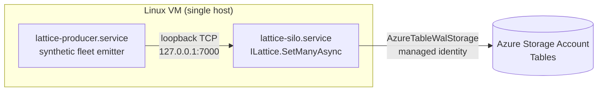

# Azure throughput benchmark (real Azure Storage)

A two-process Linux VM deployment that measures **Entries written per second** when
a single-silo Orleans.Lattice host backed by a real Azure Storage account is fed a
sustained stream of synthetic vehicle telemetry. The tree is configured with
`AzureTableWalStorageProvider` so every commit produces real WAL traffic against
Azure Tables.

This is the only benchmark in the suite that runs against **real Azure Storage**
rather than Azurite or in-memory storage. The local docker-compose scenarios
(`benchmark.ps1 <scenario>`) are reproducible but Azurite collapses network RTT and
does not model Azure Tables partition-server behaviour or throttling. Use this
harness when a throughput claim needs to be backed by real-Azure numbers.

## Topology



Both processes run as systemd units on the same Linux VM and share a loopback hop
to `127.0.0.1:7000`. The silo authenticates to Azure Tables via the VM's
system-assigned managed identity (no keys, no connection strings).

## Why a single VM (not ACI)

The harness previously ran as two ACI containers. That topology produced a series
of investigation artefacts that turned out to be ACI-induced rather than Lattice
bugs (60s `az container logs` tail truncation, multi-pipe stdout scraping
duplication, cold-start variance, no live attach for `dotnet-dump` /
`dotnet-counters`). See `throughput.md` section 0 in this folder for the
full rationale. The single-VM topology gives deterministic CPU, deterministic
NIC (accelerated networking), the full `dotnet-*` diagnostic surface, and
journald-backed log capture with no scraper indirection.

## Files

| Path | Purpose |
|------|---------|
| `Producer/Program.cs` | Generates `VehicleTelemetryEvent` records and writes JSON lines over TCP. |
| `Silo/Program.cs` | Single-silo lattice host; TCP listener -> `ILattice.SetManyAsync`. |
| `infra/main.bicep` | VM + NIC (accelerated networking) + NSG + storage account + role assignments. |
| `infra/cloud-init.yaml` | First-boot bootstrap (`.NET 10 SDK`, dotnet diagnostic tools, `/opt/lattice` tree). |
| `infra/bootstrap.sh` | Manual / fallback bootstrap path; idempotent. |
| `infra/lattice-silo.service` | systemd unit template for the silo (placeholders filled in by `update.ps1`). |
| `infra/lattice-producer.service` | systemd unit template for the co-located producer. |
| `scripts/parameters.ps1` | Default parameters (subscription, region, prefix, VM size). |
| `scripts/parameters.local.ps1` | **Gitignored** operator overrides. Created by `deploy.ps1` if missing. |
| `scripts/deploy.ps1` | End-to-end provision: key gen, `~/.ssh/config`, Bicep deploy, cloud-init wait, bootstrap fallback, chained `update.ps1`. |
| `scripts/update.ps1` | Inner loop: `git ls-files \| tar \| ssh` -> `dotnet publish` silo+producer on the VM -> `systemctl restart`. |
| `scripts/run-cohort.ps1` | Single cohort: applies env drop-ins, restarts silo, starts producer, waits for FINAL, extracts journals, prints summary. |
| `scripts/ladder.ps1` | Thin loop over `run-cohort.ps1` for rung sweeps; writes `.ladder-results.csv`. |
| `scripts/vm.ps1` | Day-to-day helper: `start` / `stop` / `status` / `ssh` / `logs` / `refresh-ip`. |

## One-time setup

1. Sign in to Azure (`az login`).
2. Copy the parameters template (or just let `deploy.ps1` do it for you):
   ```powershell
   Copy-Item benchmark/azure-throughput/scripts/parameters.ps1 `
			 benchmark/azure-throughput/scripts/parameters.local.ps1
   # edit: SubscriptionId, Location (match your Tables-account region),
   # SshPublicKeyPath (deploy.ps1 will generate the key if missing).
   ```
3. Deploy:
   ```powershell
   ./benchmark/azure-throughput/scripts/deploy.ps1
   ```
   `deploy.ps1` provisions infra, waits for cloud-init, then chains to
   `update.ps1` which publishes the silo + producer and starts the silo.

To spin up a second environment side-by-side (e.g. an experimental SKU):

```powershell
./benchmark/azure-throughput/scripts/deploy.ps1 -NamePrefix lat-exp -VmSize Standard_F8as_v6
```

The resource group becomes `rg-lat-exp` and the `~/.ssh/config` host alias becomes
`lat-exp` so the day-to-day scripts all accept `-NamePrefix lat-exp`.

## Daily workflow

```powershell
./benchmark/azure-throughput/scripts/vm.ps1 start                # ~30s
./benchmark/azure-throughput/scripts/update.ps1                  # sync source, publish, restart silo
./benchmark/azure-throughput/scripts/run-cohort.ps1 -Vehicles 4000 -TickHz 5 -DurationSec 30
./benchmark/azure-throughput/scripts/ladder.ps1 -Rungs '4000:5','6000:5','8000:5'
./benchmark/azure-throughput/scripts/vm.ps1 logs                 # journalctl -fu lattice-silo
./benchmark/azure-throughput/scripts/vm.ps1 stop                 # deallocate; no compute charges
```

`update.ps1` flags:
- `-NoBuild` -- just bounce the silo (no rsync, no publish).
- `-NoRestart` -- sync + publish, leave the service alone (inspect first).
- `-Clean` -- wipe `/opt/lattice/publish*` before publishing (force full rebuild).
- `-SkipUnitSync` -- skip re-rendering the systemd units when only source changed.

`run-cohort.ps1` flags:
- `-Vehicles <N>` -- synthetic fleet size (default 4000).
- `-TickHz <N>` -- per-vehicle samples per second (default 5).
- `-DurationSec <N>` -- producer run time (default 45).
- `-ExtraSiloEnv @{ BENCH_FOO='bar' }` -- arbitrary env overrides for the silo unit.
- `-NamePrefix lat-exp` -- target a non-default environment.

Every cohort writes three artefacts under `benchmark/.run/azure-throughput/`:
- `silo-<cohort>.log` -- silo journal (between cohort start and silo stop)
- `producer-<cohort>.log` -- producer journal
- `sampler-<cohort>.csv` -- per-second CPU% / RSS samples from the VM

## Parallel Layer 3 producer

The Orleans-client producer uses `BENCH_GENERATOR_PARALLELISM` workers (default
`Environment.ProcessorCount`; `0` also means automatic), capped at the vehicle
count. `run-cohort-aca.ps1 -GeneratorParallelism K` pins it for a cohort; omission
resets any previous pin to automatic. Workers own disjoint vehicle slices and
retain the per-vehicle tick pacing: total offered load is still vehicles x Hz,
not K times that rate. An in-progress tick finishes at the duration boundary.

Keys are formatted once before measurement. `get-point` and `get-many` pass
empty values directly to the ingest engine, which reads only their keys; write
modes still serialize the same telemetry JSON with a fresh tick timestamp.
The TCP producer and its JSON wire protocol are unchanged. The client generator
transfers up to 1,024 entries per channel item (64 bounded items), avoiding a
shared channel lock per key. The engine still receives individual entries and
retains its own batching, flush concurrency, and single pre-seed pass. In
addition to the channel, each worker and the reader can hold one chunk.

Periodic and `DONE` lines carry `genBlockedFrac` and `slipMaxMs`:

- `genBlockedFrac` is generator-seconds spent waiting for channel capacity or
  behind the scheduled tick budget, divided by elapsed seconds x worker count.
  Overlapping wait and lateness count once. Periodic values cover the reporting
  interval; `DONE` covers the full run. Live blocked writes remain observable.
- `slipMaxMs` is the run-wide maximum schedule slip across workers, including
  overrun of an unfinished tick, not just the last completed tick.

`performance-report.ps1` warns and renders `>= X` when a retained producer log
shows slip above 1,000 ms, or `genBlockedFrac` at least 0.2 while completed
throughput is below 90% of offered load. These are conservative lower bounds:
channel back-pressure can originate downstream, so this is not proof of a
producer CPU bottleneck. Such cells cannot establish a cluster ceiling. Scaling
ratios are omitted when the cell or its 1-silo anchor is producer-bound, and
charts omit affected workload curves rather than plot a misleading plateau.
Resume and dry-run aggregation re-read retained logs, including legacy slip
fields. New evidence is also retained in cohort state.

For a local generator-only measurement, build the Producer project in Release,
then run its DLL with `--dry-run`. This bypasses TCP, Orleans, Azure credentials,
and pre-seeding, but drains the same channel adapter into a no-op sink:

```powershell
$env:BENCH_WORKLOAD_MODE = 'get-many'
$env:BENCH_VEHICLE_COUNT = '1000000'
$env:BENCH_TICK_HZ = '10'
$env:BENCH_DURATION_SEC = '10'
$env:BENCH_GENERATOR_PARALLELISM = '4' # Repeat with 1, keeping load unchanged.
dotnet benchmark\azure-throughput\Producer\bin\Release\net10.0\VehicleFleetSimulator.AzureThroughput.Producer.dll --dry-run
```

Compare `DONE avg` and verify `dry-run drained` equals `DONE total`. This measures
local generation/queue capacity, not cluster throughput or a guaranteed parallel
speedup. No producer replicas or sliced pre-seeding are required by this path.

## Auto-shutdown safety net

The Bicep deploys a DevTestLab `shutdown-computevm-<vm>` schedule that fires at
**19:00 UTC daily** (configurable via `AutoShutdownTime` / `AutoShutdownTimeZone`
in `parameters.local.ps1`). If you forget `vm.ps1 stop`, the VM deallocates
automatically.

## Reading the results

`run-cohort.ps1` prints a self-contained summary block:

```
=== Cohort complete ===
Host         : 8 vCPU / 32092 MiB / 6.17.0-1017-azure
Cohort       : v4000-h5-30s-<utc>
Producer     : inactive
Silo FINAL   : [silo] FINAL written=547,006 failed=0 elapsed=43.9s active=35.7s ...
Throughput   : 547,006 entries in 35.7s active = 15,297/s
Silo CPU     : avg 163.3% / peak 220% (of one vCPU)
System CPU   : avg 20.4% / peak 24.1%
Silo RSS peak: 0.6 GiB (of 31.3 GiB)
Diagnostics  : stall-watchdog=0  wal-slot=0  wal-append=0
Verdict      : HEALTHY
```

`Throughput` is the **active-window** average -- entries / (last-flush-drain -
first-accepted-batch). Excludes the silo's pre-connect idle window and the
post-FINAL drain so it's the honest sustained-ingest number.

`Diagnostics` counts `[stall-watchdog]`, `[wal-slot]`, and `[wal-append]` lines.
Any non-zero count indicates a real wedge-shape; combined with a non-zero
`failed` count it's the evidence triad for re-opening `wedge-plan.md` (see
section 23 of that file for the policy).

`ladder.ps1` produces a CSV with one row per rung covering written, failed,
active-avg, CPU peak, RSS, verdict, and a UTC timestamp. Default location:
`scripts/.ladder-results.csv` (gitignored).

## Saturation knobs

See `wedge-plan.md` section 23.3 (in this folder) for the authoritative table
of every BENCH_* knob that matters, what it bounds, and when to turn it. The
short version, in the order an investigator reaches for them:

| Knob | Default | What it does |
|------|---------|--------------|
| `BENCH_VEHICLE_COUNT`, `BENCH_TICK_HZ` | 4000, 5 | Offered rate. |
| `BENCH_RESPONSE_TIMEOUT_SEC` | 30 | Silo grain-RPC deadline. **Raise to 180 when saturating** or you'll see `[silo] grain-rpc-deadline` failures that look like wedges but aren't. The `ladder.ps1` script pins this to 180 by default for exactly this reason. |
| `BENCH_BATCH_SIZE` | 4096 | Entries per `SetManyAsync`. |
| `BENCH_FLUSH_CONCURRENCY` | 8 | Parallel in-flight flushes from `TcpIngestService`. |
| `BENCH_WAL_PARTITIONS` | `LatticeOptions.DefaultWalPartitions` (currently 8) | WAL grain count per tree. Pairs with `BENCH_FLUSH_CONCURRENCY`. Inherited from the shipping default so the bench tracks the library; override explicitly to A/B against a non-default fan-out. |
| `BENCH_WAL_MAX_PENDING_BATCHES` | `LatticeOptions.DefaultWalMaxPendingBatches` (currently 16) | Per-WalShardGrain pipeline depth. Inherited from the shipping default so the bench tracks the library; see [WAL Tuning](../../docs/lattice/wal-tuning.md) for the storage-account-throughput envelope above which raising this further stops helping. |
| `BENCH_SET_MANY_FANOUT_BUDGET_SEC` | `30` | Seconds `LatticeGrain.SetManyAsync` may spend awaiting its per-shard fan-out before refusing the call with `LatticeSaturatedException` (`SetManyFanOut`). **One of two knobs here that deliberately do not inherit the library default**, which is `Timeout.InfiniteTimeSpan` so that the bound is opt-in on the released line ([#3386](https://github.com/NSTA1/Orleans.Lattice/issues/3386)). An unbounded fan-out is the [#3348](https://github.com/NSTA1/Orleans.Lattice/issues/3348) collapse itself, so the rig opts in to the recommended finite budget and measures the corrected configuration. Set `0` for infinite to reproduce the pre-fix shape. |
| `BENCH_WAL_ADMISSION_CALL_BUDGET_SEC` | `15` | Seconds **one top-level call** may spend waiting at the WAL admission saturation gate, summed across every append and every retry layer (`LatticeOptions.WalAdmissionSaturationCallBudget`). The second knob that deliberately does not inherit the library default, which is `Timeout.InfiniteTimeSpan` ([#3390](https://github.com/NSTA1/Orleans.Lattice/issues/3390)). Left infinite, only the per-append `WalAdmissionSaturationWaitBudget` applies and the three nested retry layers each open a fresh one - the multiplication [#3348](https://github.com/NSTA1/Orleans.Lattice/issues/3348) names as remedy 3, recorded in its cohort logs as `10488ms of that was saturation back-off` against a 5 s per-append budget. Set `0` for infinite. |
| `BENCH_TREE_ID` | rotates per cohort | Pin to re-use an existing WAL partition; otherwise every cohort starts on an empty manifest. |

All of these can be passed via `-ExtraSiloEnv @{ BENCH_FOO = 'bar' }` to
`run-cohort.ps1`.

## A/B-ing a WAL optimisation

```powershell
# Baseline arm.
./scripts/run-cohort.ps1 -Vehicles 4000 -TickHz 5 -DurationSec 60 `
	-ExtraSiloEnv @{ BENCH_WAL_ELIMINATE_CANDIDATE_ROW = 'false'; BENCH_TREE_ID = 'ab-baseline' }

# Candidate arm.
./scripts/run-cohort.ps1 -Vehicles 4000 -TickHz 5 -DurationSec 60 `
	-ExtraSiloEnv @{ BENCH_WAL_ELIMINATE_CANDIDATE_ROW = 'true'; BENCH_TREE_ID = 'ab-candidate' }
```

Keep `Vehicles`, `TickHz`, `DurationSec` identical between arms so the only
changed variable is the option under test. Pinning `BENCH_TREE_ID` per arm
tags the WAL partition keys but is not required for cohort correctness; the
default per-cohort rotation keeps each measurement starting from an empty
manifest.

## Tearing down

```powershell
# Stops billing for compute (storage + PIP still bill at ~$14/month idle).
./benchmark/azure-throughput/scripts/vm.ps1 stop

# Full teardown.
az group delete --name rg-lat --yes --no-wait
```

## Caveats

- The harness measures **end-to-end commit throughput** with a single silo and
  a single lattice tree. It is not a proxy for the partitioned-WAL benchmark
  (`benchmark/host/Bench.WalAzureTable`), which is a structural correctness probe.
- Managed identity role propagation can take up to 60s after `deploy.ps1`
  completes. `deploy.ps1` waits for cloud-init to finish before chaining to
  `update.ps1`, which is usually enough; if the silo's first WAL write fails
  with a 403, wait a minute and run `update.ps1` again to bounce the silo.
- The tree's keys are `Guid.ToString("N")` so the workload is uniform-random
  across shards. To skew distribution, edit `Producer/Program.cs`.

## Historical context

- `wedge-plan.md` -- residual WAL wedge investigation, closed after section 23
  (the F8-on-VM re-verification cohorts).
- `throughput.md` -- performance follow-up. Current single-VM baselines live in
  section 25; the saturation-knobs catalogue is in `wedge-plan.md` section 23.3.
