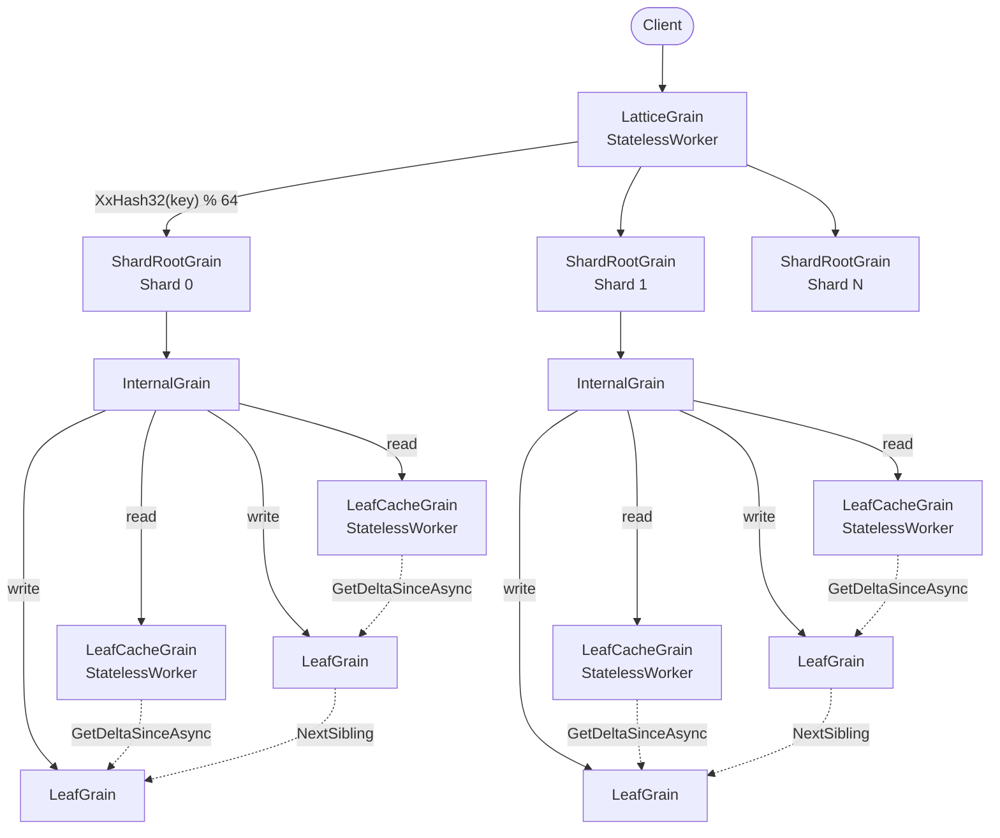
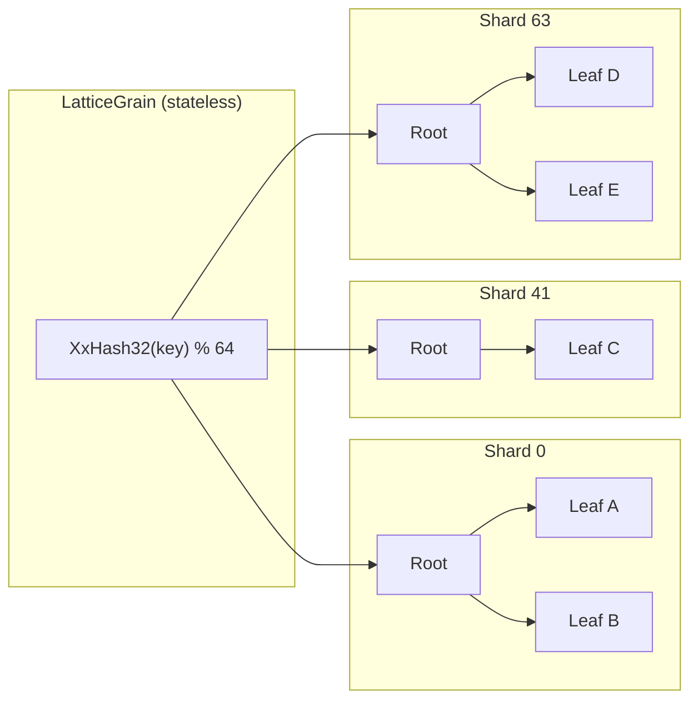

# Architecture

## High-Level Architecture

A request flows through five layers of Orleans grains. Writes go directly to the primary leaf; reads are served by a stateless cache that pulls deltas from the primary:

1. **`LatticeGrain`** — a `[StatelessWorker]` grain (many concurrent activations). Resolves the key's virtual slot via `XxHash32(key) % VirtualShardCount`, looks up the physical shard index in the cached `ShardMap`, and forwards the request to the corresponding `ShardRootGrain`.
2. **`ShardRootGrain`** — one per shard (keyed `{treeId}/{shardIndex}`). Manages the root pointer for its sub-tree and handles root-level splits by creating new internal nodes above the old root. Routes reads through the cache layer.
3. **`BPlusInternalGrain`** — an internal node holding separator keys and child references. Routes a key to the correct child and accepts promoted splits from below. Split acceptance is idempotent — duplicate deliveries are detected and skipped.
4. **`LeafCacheGrain`** — a `[StatelessWorker]` read-through cache. Each silo may have its own activation. On a cache miss, it pulls a `StateDelta` from the primary leaf and merges entries using `LwwValue.Merge`. Because the merge is commutative and idempotent, stale entries are harmlessly overwritten without an invalidation protocol.
5. **`BPlusLeafGrain`** — a leaf node storing key → value entries in a sorted dictionary. Splits when the entry count exceeds the configured maximum. Maintains a `VersionVector` that is ticked on every write, enabling delta extraction for the cache layer.

## Sharding

Without sharding, every operation starts at a single root grain — a serialisation bottleneck. Sharding eliminates this by giving each key range its own independent sub-tree:

The hash function (`XxHash32`) is **stable across processes** — unlike `string.GetHashCode()`, it will always route the same key to the same shard. The default shard count is 64, configurable at tree creation time.

**Shard map indirection.** Routing is two-stage: keys hash into a large fixed virtual space (`VirtualShardCount`, default 4096), and a per-tree `ShardMap` collapses ranges of virtual slots onto physical shards. The default map (`slot[i] = i % shardCount`) preserves the legacy `hash % shardCount` routing bit-for-bit when `VirtualShardCount % ShardCount == 0` (enforced by the options validator). The shard map is persisted on the tree's registry entry, fetched lazily by `LatticeGrain` on first access, cached for the activation's lifetime, and invalidated alongside the physical-tree-ID cache when a shard signals a stale alias. This indirection decouples logical key routing from the physical shard count, enabling adaptive shard splitting without rehashing existing keys.

**Trade-off:** Keys in different shards have no ordering relationship. A global range scan requires a scatter-gather across all shards followed by a merge.

## Root Promotion

When a split cascades all the way up to the shard root, `ShardRootGrain` creates a new internal root above the old one via a **two-phase promotion**:

1. **Phase 1 (persist intent):** The `SplitResult` and a `RootWasLeaf` flag are saved to `ShardRootState.PendingPromotion` and persisted.
2. **Phase 2 (create root):** A new `BPlusInternalGrain` is created with a **deterministic `GrainId`** derived from the shard key and old root ID (`SHA-256` hash). The new root is initialised with the promoted key and left/right children, and `RootNodeId` is updated.

If the shard root crashes between phases, `ResumePendingPromotionAsync` (called at the start of every `GetAsync`, `SetAsync`, and `DeleteAsync`) detects the pending promotion and completes it. The deterministic `GrainId` ensures that re-executing Phase 2 targets the same grain — making the promotion idempotent.

## Bounded Retry

`ShardRootGrain` wraps `SetAsync` and `DeleteAsync` in a bounded retry loop (default: 3 attempts). If a grain call fails due to a transient error (e.g. storage fault, network partition), the request is retried. Orleans automatically deactivates a failed grain; the retry hits a fresh activation that runs any pending recovery logic before processing the request. This shields callers from transient infrastructure errors without requiring client-side retry code.

## Grain-to-Grain Mapping

| B+ Tree Concept | Orleans Grain | Key Format | Persistent State |
|---|---|---|---|
| Shard router | `LatticeGrain` (`[StatelessWorker]`) | `{treeId}` | None (stateless) |
| Shard root | `ShardRootGrain` | `{treeId}/{shardIndex}` | `ShardRootState` — root node ID + leaf/internal flag + pending promotion + pending bulk graft + last completed bulk operation ID |
| Internal node | `BPlusInternalGrain` | `Guid` | `InternalNodeState` — sorted children + HLC + split state |
| Leaf node | `BPlusLeafGrain` | `Guid` | `LeafNodeState` — sorted LWW entries + sibling pointer + HLC + version vector + split state |
| Leaf cache | `LeafCacheGrain` (`[StatelessWorker]`) | `{leafGrainId}` | None (in-memory LWW-map + version vector) |

## Capacity and Depth

With the default branching factor of 128:

| Keys per shard | Tree depth | Total grains per shard |
|---|---|---|
| ≤ 128 | 1 (leaf only) | 2 (root + leaf) |
| ≤ 16,384 | 2 | ~130 |
| ≤ 2,097,152 | 3 | ~16,500 |

With 64 shards, the total tree supports **~134 million keys** at depth 3. A depth-3 lookup requires 3–4 grain calls from router to leaf; actual latency depends on cluster topology, network conditions, and storage provider performance.
