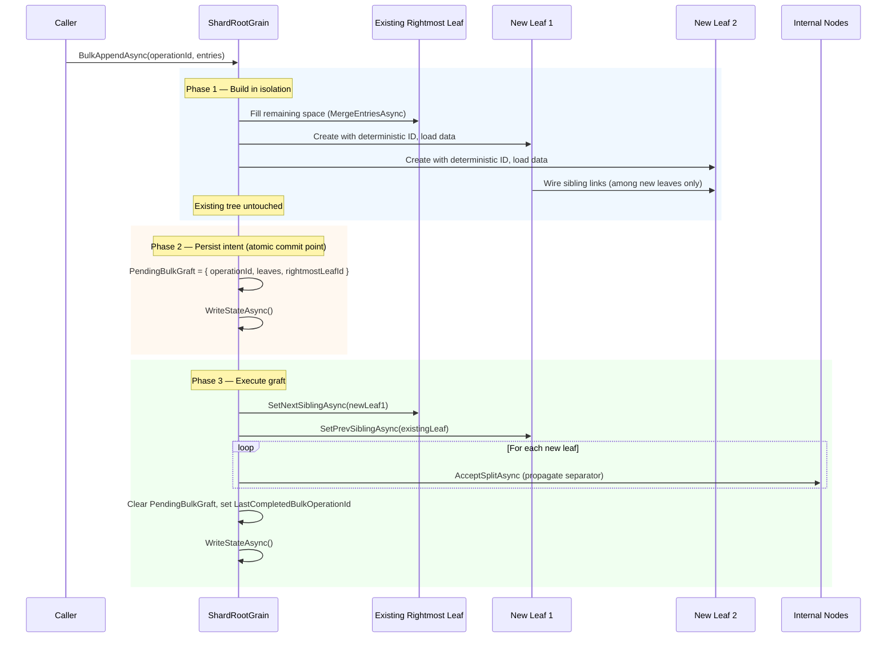

# Bulk Loading

Orleans.Lattice supports two bulk-loading modes for efficiently populating a tree without the overhead of individual `SetAsync` calls.

## One-Shot Bulk Load (`ILattice.BulkLoadAsync`)

Builds the tree bottom-up from a pre-sorted list of key-value pairs. Designed for initial population of an empty tree:

```csharp verify
var tree = grainFactory.GetGrain<ILattice>("my-tree");
var data = new []
{
    new { Key = "user:1", Value = "Alice" },
    new { Key = "user:2", Value = "Bob" },
};
var entries = data
    .Select(d => KeyValuePair.Create(d.Key, Encoding.UTF8.GetBytes(d.Value)))
    .ToList();

await tree.BulkLoadAsync(entries);
```

Internally, `LatticeGrain` partitions entries by shard, sorts each partition, and calls `ShardRootGrain.BulkLoadAsync` in parallel across all shards.

**How it works:**

1. **Create leaves** — entries are divided into leaf-sized chunks. Each leaf gets a **deterministic `GrainId`** derived from the operation ID and index, so crash-retries reuse the same grains instead of creating orphans.
2. **Wire sibling links** — leaves are connected in a doubly-linked list for range scans.
3. **Build internal nodes** — internal nodes are created bottom-up, layer by layer, also with deterministic IDs.
4. **Atomic commit** — the shard's root pointer is updated in a single `WriteStateAsync` call. This is the commit point: if a crash occurs before this write, the shard is still empty and the entire operation can be retried safely.

**Idempotency:** Each shard call carries a unique `operationId`. If the same operation is retried after success, `LastCompletedBulkOperationId` matches and the call is a no-op. If the shard already has data from a *different* operation, an `InvalidOperationException` is thrown (bulk load requires an empty shard).

## Streaming Bulk Load (Extension Method)

For datasets too large to materialise in memory, a streaming overload accepts an `IAsyncEnumerable`:

```csharp verify
async IAsyncEnumerable<KeyValuePair<string, byte[]>> ReadFromSource()
{
    // Yield entries in ascending key order (from your data source).
    for (int i = 0; i < 1_000_000; i++)
        yield return KeyValuePair.Create($"k:{i:D8}", Encoding.UTF8.GetBytes($"v{i}"));
    await Task.CompletedTask;
}

await tree.BulkLoadAsync(
    ReadFromSource(),
    grainFactory,
    chunkSize: 10_000);
```

The extension method buffers entries per shard and flushes each shard independently when its buffer reaches `chunkSize`. Flushes to different shards run in parallel; flushes to the *same* shard are sequential (preserving key order). Each chunk gets a unique `operationId` for idempotent retries.

Routing is resolved up front via `ILattice.GetRoutingAsync()`, which returns the per-tree `ShardMap` and physical tree id. Entries are then partitioned by physical shard via `ShardMap.Resolve(key)`, so the bulk loader honours non-default maps produced by future adaptive splits.

Under the hood, each chunk calls `ShardRootGrain.BulkAppendAsync`, which appends entries to the right edge of an existing tree.

## Two-Phase Graft (BulkAppendAsync)

`BulkAppendAsync` uses a **two-phase graft** pattern to safely extend an existing tree:



**Recovery guarantees:**

| Crash point | State on recovery | Action |
|---|---|---|
| Before Phase 2 write | Existing tree unchanged, new leaves are orphans | Caller retries; deterministic IDs reuse same grains |
| Between Phase 2 and Phase 3 | `PendingBulkGraft` persisted in state | `ResumePendingBulkGraftAsync` completes the graft on next access (Get/Set/Delete/Keys/BulkAppend) |
| After Phase 3 | Fully grafted, operation ID recorded | Retry with same `operationId` is a no-op |

**Key properties:**
- **No corruption:** The existing tree is never modified until after the intent record is persisted.
- **Deterministic grain IDs:** New leaves use IDs derived from `{shardKey}/append/{operationId}/leaf/{index}`, so retries target the same grains.
- **Idempotent sibling wiring:** `SetNextSiblingAsync` and `SetPrevSiblingAsync` are safe to call multiple times with the same value.
- **Idempotent separator propagation:** `AcceptSplitAsync` detects duplicate `(separatorKey, childId)` pairs and skips them.
