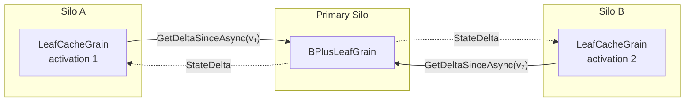

# Read Caching

The `LeafCacheGrain` is a `[StatelessWorker]` that acts as a per-silo read-through cache for leaf data:

- **Delta refresh**: By default, every read calls `GetDeltaSinceAsync` on the primary leaf, passing the cache's current `VersionVector`. If the cache is already up to date, the primary short-circuits and returns an empty delta (a cheap version-vector comparison, no entry scan). If entries have changed, only the newer entries are returned and merged in. When [`CacheTtl`](configuration.md#cachettl) is set to a non-zero value, the cache skips the delta refresh if less than the configured duration has elapsed since the last successful refresh, serving reads entirely from local memory.
- **Consistency**: Reads are consistent as of the moment the delta is fetched from the primary. The only window for a "stale" result is a concurrent write that lands on the primary *after* `GetDeltaSinceAsync` returns but *before* the caller sees the response — this is normal read-write race behaviour, not cache staleness.
- **Why keep a local cache at all?**: The `VersionVector` fast-path makes the delta call cheap when nothing has changed, but the local `Dictionary<string, LwwValue<byte[]>>` avoids deserialising the full entry set on every read. When the primary returns a non-empty delta, only the changed entries are merged — the rest are already in memory.
- **Split-aware pruning**: When a `StateDelta` contains a non-null `SplitKey`, the cache removes all entries with keys ≥ `SplitKey` from its local dictionary. These entries now belong to a different leaf grain and would otherwise become stale ghosts in the cache.
