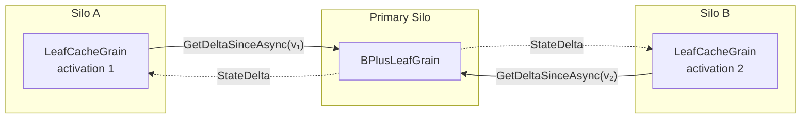

# Read Caching

The `LeafCacheGrain` is a `[StatelessWorker]` that acts as a per-silo read-through cache for leaf data:



- **Delta refresh**: By default, every read calls `GetDeltaSinceAsync` on the primary leaf, passing the cache's current `VersionVector`. If the cache is already up to date, the primary short-circuits and returns an empty delta (a cheap version-vector comparison, no entry scan). If entries have changed, only the newer entries are returned and merged in. When [`CacheTtl`](configuration.md#cachettl) is set to a non-zero value, the cache skips the delta refresh if less than the configured duration has elapsed since the last successful refresh, serving reads entirely from local memory.
- **Freshness bound**: Cached reads are bounded by `CacheTtl + one delta round-trip`. See [Consistency](consistency.md#read-cache-staleness) for the full per-operation contract.
- **Why keep a local cache at all?**: The `VersionVector` fast-path makes the delta call cheap when nothing has changed, but the local `Dictionary<string, LwwValue<byte[]>>` avoids deserialising the full entry set on every read. When the primary returns a non-empty delta, only the changed entries are merged — the rest are already in memory.
- **Split-aware pruning**: When a `StateDelta` contains a non-null `SplitKey`, the cache removes all entries with keys ≥ `SplitKey` from its local dictionary. These entries now belong to a different leaf grain and would otherwise become stale ghosts in the cache.

## Cache Invalidation via Tree Aliasing

When a tree is **resized** (via `ResizeAsync`), the data is copied into a new physical tree with different leaf grain IDs. After the alias swap, reads route to the new physical tree's leaf grains — which have entirely different `GrainId` values. Because `LeafCacheGrain` instances are keyed by the primary leaf's `GrainId.ToString()`, the new physical tree automatically gets **fresh cache grains** with no stale data.

This means cache invalidation after a resize is **free** — no explicit cache flush or broadcast is needed:

```
Before resize:
  LatticeGrain("my-tree") → ShardRootGrain("my-tree/0") → LeafCacheGrain("leaf-abc")

After resize + alias swap:
  LatticeGrain("my-tree") → resolves alias → ShardRootGrain("my-tree/resized/op1/0") → LeafCacheGrain("leaf-xyz")
```

The old `LeafCacheGrain("leaf-abc")` is never called again and will be garbage-collected by Orleans when it deactivates due to inactivity. The new `LeafCacheGrain("leaf-xyz")` starts fresh, fetching a full delta from the new primary leaf on its first read.

### Stale `LatticeGrain` activations

`LatticeGrain` is a `[StatelessWorker]` that resolves the alias once per activation and caches the result. After an alias swap, existing activations still hold a cached alias pointing to the old (now soft-deleted) physical tree. When a request hits a stale activation and the shard throws `InvalidOperationException`, the grain catches the error, invalidates its cached alias via `TryInvalidateStaleAlias()`, re-resolves the alias from the registry, and retries the operation — all transparently within the same grain call. This means the caller sees at most one brief retry delay, not a failure. Old activations will eventually deactivate due to inactivity.
