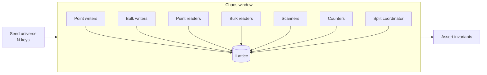
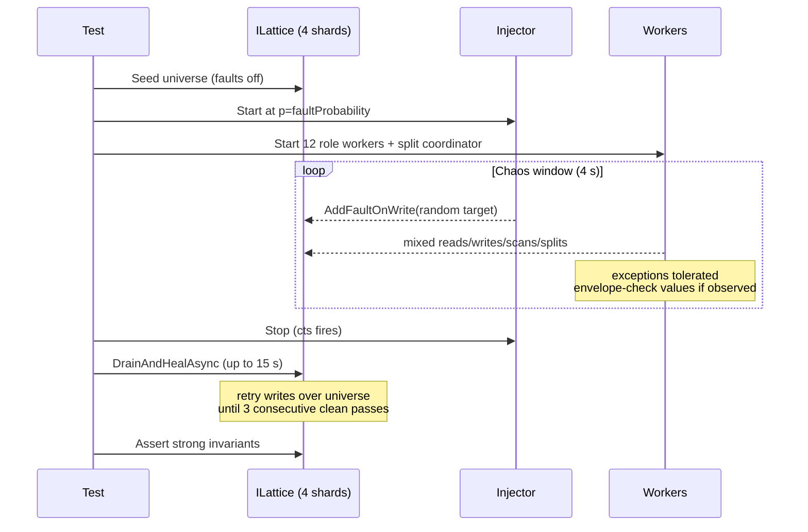

# Chaos Tests

Orleans.Lattice ships two integration tests that bombard a running cluster
with concurrent reads, writes, scans, and topology mutations, then assert
that the system's public correctness guarantees hold. They act as the
end-to-end contract for the properties described in
[Adaptive Shard Splitting](shard-splitting.md) — specifically the claim
that the public `ILattice` API is **strongly consistent across arbitrary
concurrent shard splits**, and that the split recovery protocols
(resumable splits, two-phase root promotion, shadow-write atomicity,
registry version stamping, idempotent bulk graft) converge correctly
even when storage writes fail at random.

Both tests live under `test/lattice/BPlusTree/` and use the
`[NonParallelizable]` attribute so they have the cluster to themselves.

| Test | File | Purpose |
|---|---|---|
| Happy-path chaos | `ChaosIntegrationTests.cs` | Assert strong invariants *during* heavy concurrent load with manually-triggered splits. |
| Chaos + faults theory | `ChaosWithFaultsIntegrationTests.cs` | Parametrized theory that injects random storage faults; asserts eventual convergence after the fault window closes. |

## The workload

Both tests run a parallel workload against a pinned 4-shard tree with
aggressive `MaxLeafKeys = 4` (so even small key counts trigger many
leaf splits) over a fixed key *universe*. Writers only rewrite existing
keys with monotonically-increasing values of the form
`v-{keyIndex}-{writerId}-{seq}`. Any value matching that envelope proves
the byte array is internally consistent.

Fixture differences:

| Test | Fixture | `MaxLeafKeys` | `MaxInternalChildren` | Key prefix | Universe |
|---|---|---|---|---|---|
| Happy-path | `FourShardClusterFixture` | 4 | default | `chaos-{i:D5}` | 500 |
| Chaos + faults | `MultiShardFaultInjectionClusterFixture` | 4 | 4 | `fchaos-{i:D5}` | 200 |



Worker categories:

* **Point writers** — `SetAsync` on random universe keys.
* **Bulk writers** — `SetManyAsync` with batches of 8 random keys.
* **Point readers** — `GetAsync`; validates envelope if a value is returned.
* **Bulk readers** — `GetManyAsync` for 16 random keys.
* **Scanners** — rotating `KeysAsync`, `EntriesAsync`, reverse scan,
  range scan. Each scan must yield exactly the universe with no
  duplicates.
* **Counters** — `CountAsync` must always equal the pinned universe size.
* **Split coordinator** — every ~500 ms, picks a non-empty shard and
  drives `ITreeShardSplitGrain.SplitAsync` + `RunSplitPassAsync` to
  completion.

## Test 1 — Happy-path chaos (`ChaosIntegrationTests`)

This test establishes that the public API's consistency guarantees hold
*during* the chaos window, not just after it closes. Every operation
observes a fully consistent view of the tree.

### What it proves

| Invariant | Mechanism under test |
|---|---|
| `CountAsync` returns the exact universe size, always | Per-slot routing via `CountForSlotsAsync` against the authoritative `ShardMap` plus version stability check |
| `KeysAsync` / `EntriesAsync` yield exactly the universe, no duplicates, no unknowns, in strict sorted order | In-line reconciliation-cursor injection into the k-way merge + `HashSet` dedup |
| `KeysAsync(null, null, reverse: true)` yields the full universe in reverse | Reverse-scan path also reconciles |
| `KeysAsync(start, end)` yields exactly the in-range slice | Range pruning is slot-aware |
| `GetAsync` / `GetManyAsync` never return a corrupt value | Writes are atomic per-shard; CRDT LWW resolves concurrent rewrites |
| No public-API call throws an unhandled exception | Stale routing retries and enumeration aborts are transparent |
| Splits during a scan never cause data loss, duplication, or out-of-order output | `MovedAwaySlots` + version stamping + in-line reconciliation |

### Tolerated transients

These exception types surface from Orleans' streaming internals and are
treated as retry signals, not failures:

* `EnumerationAbortedException` — a stream cursor grain deactivated
  mid-iteration. The caller re-issues the scan.
* `StaleShardRoutingException` — a `LatticeGrain` activation used a
  cached shard map after a concurrent split committed its swap. The
  framework retries once against the fresh map.

Any other exception, or any observed envelope/duplicate/missing-key
violation, fails the test.

### Pass criteria

After the chaos window closes:

* `CountAsync` matches the pinned universe size exactly.
* `KeysAsync` yields exactly the pinned universe (no gaps, no extras).
* Every worker category performed at least one operation (proves the
  workload ran under real concurrency, not a degenerate single-thread
  schedule).
* Zero envelope violations were observed *during* the window.

## Test 2 — Chaos + faults theory (`ChaosWithFaultsIntegrationTests`)

This parametrized theory layers random storage faults on top of the same
workload. Unlike the happy-path test, per-operation invariants are
*weakened* during the fault window — arbitrary exceptions are tolerated
because a failed `WriteStateAsync` legitimately cascades into split
aborts, stale routing, and count drift. Instead, the test asserts
**eventual convergence**: once faults stop and the cluster quiesces,
the tree must recover to the exact same pinned universe with every
value still matching its envelope.

### Parametrization

```csharp
[TestCase(0.00, TestName = "no_faults_baseline")]
[TestCase(0.05, TestName = "5pct_fault_probability")]
[TestCase(0.15, TestName = "15pct_fault_probability")]
[TestCase(0.30, TestName = "30pct_fault_probability")]
public async Task Chaos_with_storage_faults_converges_after_quiescence(double faultProbability)
```

`faultProbability` is the probability, per 20 ms tick, that the fault
injector arms a fresh one-shot `WriteStateAsync` fault on a randomly
chosen target grain (initial leaves + shard-root grains of every shard).
Orleans' `FaultInjectionGrainStorage` consumes each armed fault on the
next write for that grain, so the injector re-arms continuously to
approximate a steady-state failure rate.

> Note: Orleans' one-shot fault API caps concurrent armed faults at
> ≈ `|targets|`. Higher `faultProbability` primarily drives faster
> re-arm latency rather than a linear increase in fault count. The
> gradient is still meaningful for exercising recovery paths under
> progressively heavier disruption.

### Test phases



### Tolerated during faults

Every exception type is tolerated and counted (`tolerated-write-errors`,
`tolerated-read-errors`, `tolerated-scan-errors`, etc.). A single
storage fault cascades into many observable shapes:

* Direct `InvalidOperationException` from the faulted write.
* `OrleansException` wrappers when a faulted grain deactivates.
* `EnumerationAbortedException` if a stream cursor was on the
  deactivated grain.
* `StaleShardRoutingException` after a shard map swap when the split
  coordinator crashed and resumed mid-phase.
* `ArgumentException` from the injector itself when a target already
  has an armed fault pending (skipped).

Envelope violations (a value that doesn't start with `v-{index}-`) are
**not** tolerated — CRDT LWW is supposed to preserve atomicity of the
value payload even when the wrapping write fails.

### Healing phase (`DrainAndHealAsync`)

After the fault injector stops, lingering armed faults remain on
whichever targets weren't hit during the chaos window. The test drains
them by replaying writes over the entire universe until **3 consecutive
passes complete exception-free**, bounded by a 15 s timeout. This loop:

* Consumes any remaining one-shot faults (each fires once on its next
  write, clearing itself).
* Gives resumable splits and pending root promotions time to reach
  their `RunSplitPassAsync` keepalive tick and replay.
* Exercises idempotent apply of `BulkGraft` and shadow `MergeManyAsync`
  — a healing retry that re-writes the same value is a no-op under LWW.

### Pass criteria (post-quiescence)

After healing:

* `CountAsync == UniverseSize` exactly.
* `KeysAsync` yields exactly the pinned universe.
* `EntriesAsync` yields exactly the pinned universe with every value
  matching its envelope.
* Every universe key is recoverable via `GetAsync`.
* Zero envelope violations were observed during the whole run.
* Every workload category performed at least one operation; the
  injector armed at least one fault (for `p > 0`).

## Observed recovery surfaces

Between them, the chaos tests exercise every recovery path documented
in [shard-splitting.md](shard-splitting.md) and the architecture notes:

| Surface | Happy path | With faults |
|---|:---:|:---:|
| Concurrent reads/writes during split shadow phase | ✅ | ✅ |
| `KeysAsync` / `EntriesAsync` in-line reconciliation | ✅ | ✅ |
| `CountAsync` per-slot routing + version stability check + bounded retry | ✅ | ✅ |
| `StaleShardRoutingException` transparent retry | ✅ | ✅ |
| Permanent `MovedAwaySlots` rejection after split completion | ✅ | ✅ |
| Resumable `SplitInProgress` intent replay across crashes | — | ✅ |
| Two-phase root promotion (`PendingPromotion`) replay | — | ✅ |
| Shadow `MergeManyAsync` atomicity under failed source write | — | ✅ |
| Registry `ShardMap.Version` stamping under retry | — | ✅ |
| Idempotent `BulkGraft` and drain chunks | — | ✅ |

## Runtime characteristics

| Property | Happy-path | Chaos + faults (per case) |
|---|---|---|
| Duration | ~5 s chaos + ~1 s assert | ~4 s chaos + up to 15 s heal |
| Wall-clock | ~8 s | ~20 s per `TestCase` (~80 s total) |
| Universe size | 500 keys | 200 keys |
| Parallel workers | 16 (4 pw + 2 bw + 3 pr + 2 br + 2 sc + 2 ct + 1 split) | 14 (3 pw + 2 bw + 2 pr + 2 br + 2 sc + 1 ct + 1 split + 1 fault injector) |
| Shards (initial / post) | 4 / up to ~8 | 4 / up to ~6 |

## See also

* [Adaptive Shard Splitting](shard-splitting.md) — the protocol these
  tests exercise end-to-end, including scan semantics and tunables.
* [Architecture](architecture.md) — grain layers, root promotion,
  bounded retry, and the invariants the chaos tests verify against the
  public API.
* [State Primitives](state-primitives.md) — HLC and LWW, which
  guarantee the value envelope holds even under concurrent rewrites.
