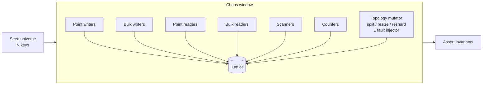
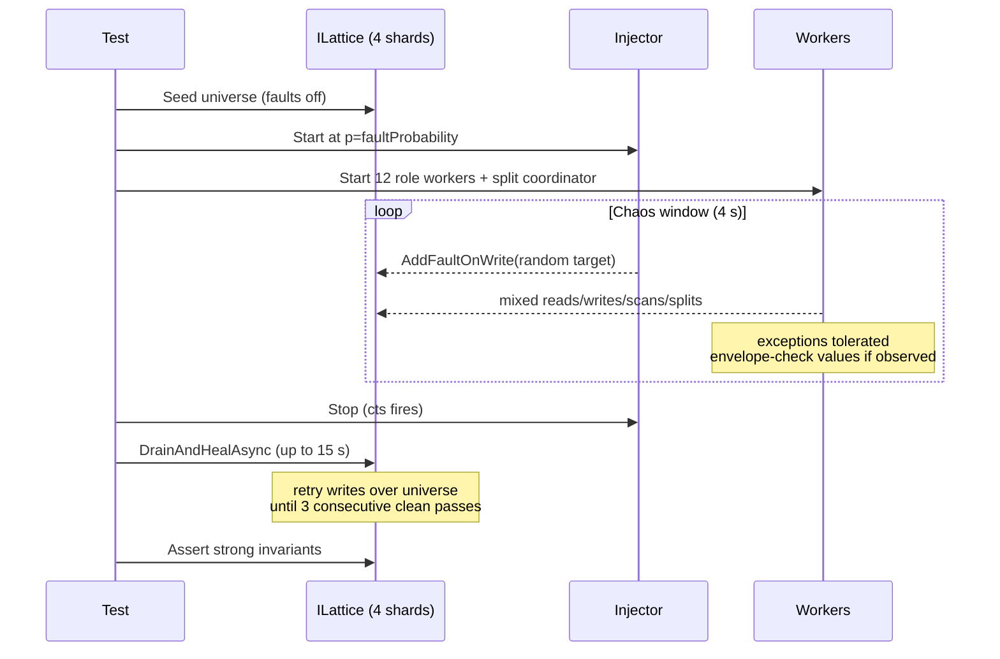

# Chaos Tests

Orleans.Lattice ships a suite of integration tests that bombard a running
cluster with concurrent reads, writes, scans, and topology mutations,
then assert that the system's public correctness guarantees hold. They
act as the end-to-end contract for the properties described in
[Consistency](consistency.md) — specifically that the public `ILattice`
API is strongly consistent across arbitrary concurrent shard splits,
online resizes, and online reshards — and that the recovery protocols
(resumable splits, two-phase root promotion, shadow-write atomicity,
shadow-forwarding, registry version stamping, idempotent bulk graft)
converge correctly even when storage writes fail at random.

All chaos tests live under `test/lattice/BPlusTree/`, use the
`[NonParallelizable]` attribute so they have the cluster to themselves,
and are tagged `[Category("Chaos")]` so the iterative-development test
filter (`dotnet test --filter "TestCategory!=Chaos"`) skips them.

| Test class | File | Purpose |
|---|---|---|
| Happy-path chaos | `ChaosIntegrationTests.cs` | Strong invariants *during* heavy concurrent load with manually-triggered splits. |
| Chaos + storage faults | `ChaosWithFaultsIntegrationTests.cs` | Parametrized theory that injects random storage faults; asserts eventual convergence after the fault window closes. |
| Chaos + online resize | `ChaosResizeIntegrationTests.cs` | Full-workload chaos while `ResizeAsync` changes fan-out in the background under `SnapshotMode.Online`. Exercises the `TreeResizeGrain` phase machine (Snapshot → Swap → Reject → Cleanup), shadow-forwarding on every source shard, and the alias swap. |
| Chaos + online reshard | `ChaosReshardIntegrationTests.cs` | Full-workload chaos while `ReshardAsync` grows the physical shard count (4 → 8) in the background. Exercises the `TreeReshardGrain` migration loop, dispatch-budget clamping, `HotShardMonitorGrain` interlock, and `ShardMap` convergence when reshard-dispatched splits race with workload writes. |

## The workload

Every chaos test runs a parallel workload against a 4-shard tree with
aggressive structural sizing (`MaxLeafKeys = 4` on the happy-path /
faults fixtures) over a fixed key *universe*. Writers only rewrite
existing keys with monotonically-increasing values of the form
`v-{keyIndex}-{writerId}-{seq}`. Any value matching that envelope proves
the byte array is internally consistent.

Fixture and parameter differences:

| Test | Fixture | `MaxLeafKeys` | `MaxInternalChildren` | Key prefix | Universe |
|---|---|---|---|---|---|
| Happy-path | `FourShardClusterFixture` | 4 | default | `chaos-{i:D5}` | 500 |
| Chaos + faults | `MultiShardFaultInjectionClusterFixture` | 4 | 4 | `fchaos-{i:D5}` | 200 |
| Chaos + resize | `FourShardClusterFixture` | registry default → `16` mid-run | registry default → `16` mid-run | `resize-chaos-{i:D5}` | 200 |
| Chaos + reshard | `FourShardClusterFixture` (4 shards → 8) | registry default | registry default | `reshard-chaos-{i:D5}` | 200 |

Worker categories (exact mix varies per test — see the runtime table):

* **Point writers** — `SetAsync` on random universe keys.
* **Bulk writers** — `SetManyAsync` with batches of 8 random keys
  (happy-path / faults only).
* **Point readers** — `GetAsync`; validates envelope if a value is returned.
* **Bulk readers** — `GetManyAsync` for 16 random keys (happy-path /
  faults only).
* **Scanners** — rotating `ScanKeysAsync`, `ScanEntriesAsync`, reverse scan,
  range scan. Each full-tree scan must yield exactly the universe with
  no duplicates and no unknown keys.
* **Counters** — `CountAsync` must always equal the pinned universe size.
* **Topology mutator** — test-specific:
  * happy-path: every ~500 ms drives
    `ITreeShardSplitGrain.SplitAsync` + `RunSplitPassAsync` on a
    non-empty shard.
  * faults: same split driver plus a fault injector that arms random
    `WriteStateAsync` faults.
  * resize: initiates `ResizeAsync` once at the window start and pumps
    the coordinator to completion.
  * reshard: initiates `ReshardAsync(8)` once at the window start and
    pumps `RunReshardPassAsync` + per-shard split passes to completion.

## Test 1 — Happy-path chaos (`ChaosIntegrationTests`)

This test establishes that `ILattice`'s consistency guarantees hold
*during* the chaos window, not just after it closes. Every operation
observes a fully consistent view of the tree.

### What it proves

| Invariant | Mechanism under test |
|---|---|
| `CountAsync` returns the exact universe size, always | Per-slot routing via `CountForSlotsAsync` against the authoritative `ShardMap` plus version stability check |
| `ScanKeysAsync` / `ScanEntriesAsync` yield exactly the universe, no duplicates, no unknowns, in strict sorted order | In-line reconciliation-cursor injection into the k-way merge + `HashSet` dedup |
| `ScanKeysAsync(null, null, reverse: true)` yields the full universe in reverse | Reverse-scan path also reconciles |
| `ScanKeysAsync(start, end)` yields exactly the in-range slice | Range pruning is slot-aware |
| `GetAsync` / `GetManyAsync` never return a corrupt value | Writes are atomic per-shard; CRDT LWW resolves concurrent rewrites |
| No public-API call throws an unhandled exception | Stale routing retries and enumeration aborts are transparent |
| Splits during a scan never cause data loss, duplication, or out-of-order output | `MovedAwaySlots` + version stamping + in-line reconciliation |

### Tolerated transients

These exception types surface from Orleans' streaming internals and are
treated as retry signals, not failures:

* `EnumerationAbortedException` — a stream cursor grain deactivated
  mid-iteration. The caller re-issues the scan.
* `StaleShardRoutingException` — a `LatticeGrain` activation used a
  cached shard map after a concurrent split committed its swap. The
  framework retries once against the fresh map.

Any other exception, or any observed envelope/duplicate/missing-key
violation, fails the test.

### Pass criteria

After the chaos window closes:

* `CountAsync` matches the pinned universe size exactly.
* `ScanKeysAsync` yields exactly the pinned universe (no gaps, no extras).
* Every worker category performed at least one operation (proves the
  workload ran under real concurrency, not a degenerate single-thread
  schedule).
* Zero envelope violations were observed *during* the window.

## Test 2 — Chaos + storage faults theory (`ChaosWithFaultsIntegrationTests`)

This parametrized theory layers random storage faults on top of the same
workload. Unlike the happy-path test, per-operation invariants are
*weakened* during the fault window — arbitrary exceptions are tolerated
because a failed `WriteStateAsync` legitimately cascades into split
aborts, stale routing, and count drift. Instead, the test asserts
**eventual convergence**: once faults stop and the cluster quiesces,
the tree must recover to the exact same pinned universe with every
value still matching its envelope.

`faultProbability` is the probability, per 20 ms tick, that the fault
injector arms a fresh one-shot `WriteStateAsync` fault on a randomly
chosen target grain (initial leaves + shard-root grains of every shard).
Orleans' `FaultInjectionGrainStorage` consumes each armed fault on the
next write for that grain, so the injector re-arms continuously to
approximate a steady-state failure rate.

> Note: Orleans' one-shot fault API caps concurrent armed faults at
> ≈ `|targets|`. Higher `faultProbability` primarily drives faster
> re-arm latency rather than a linear increase in fault count. The
> gradient is still meaningful for exercising recovery paths under
> progressively heavier disruption.

### Test phases

### Tolerated during faults

Every exception type is tolerated and counted (`tolerated-write-errors`,
`tolerated-read-errors`, `tolerated-scan-errors`, etc.). A single
storage fault cascades into many observable shapes:

* Direct `InvalidOperationException` from the faulted write.
* `OrleansException` wrappers when a faulted grain deactivates.
* `EnumerationAbortedException` if a stream cursor was on the
  deactivated grain.
* `StaleShardRoutingException` after a shard map swap when the split
  coordinator crashed and resumed mid-phase.
* `ArgumentException` from the injector itself when a target already
  has an armed fault pending (skipped).

Envelope violations (a value that doesn't start with `v-{index}-`) are
**not** tolerated — CRDT LWW is supposed to preserve atomicity of the
value payload even when the wrapping write fails.

### Healing phase (`DrainAndHealAsync`)

After the fault injector stops, lingering armed faults remain on
whichever targets weren't hit during the chaos window. The test drains
them by replaying writes over the entire universe until **3 consecutive
passes complete exception-free**, bounded by a 15 s timeout. This loop:

* Consumes any remaining one-shot faults (each fires once on its next
  write, clearing itself).
* Gives resumable splits and pending root promotions time to reach
  their `RunSplitPassAsync` keepalive tick and replay.
* Exercises idempotent apply of `BulkGraft` and shadow `MergeManyAsync`
  — a healing retry that re-writes the same value is a no-op under LWW.

### Pass criteria (post-quiescence)

After healing:

* `CountAsync == UniverseSize` exactly.
* `ScanKeysAsync` yields exactly the pinned universe.
* `ScanEntriesAsync` yields exactly the pinned universe with every value
  matching its envelope.
* Every universe key is recoverable via `GetAsync`.
* Zero envelope violations were observed during the whole run.
* Every workload category performed at least one operation; the
  injector armed at least one fault (for `p > 0`).

## Test 3 — Chaos + online resize (`ChaosResizeIntegrationTests`)

This test targets the online resize path. A full concurrent workload
runs against a seeded tree while `ResizeAsync` changes the B+ fan-out
to `MaxLeafKeys = 16` / `MaxInternalChildren = 16` under
`SnapshotMode.Online`. The entire resize — snapshot drain, alias swap,
per-shard reject phase, cleanup — happens inside the chaos window.

### Recovery surfaces exercised

* `TreeResizeGrain` phase machine (Snapshot → Swap → Reject → Cleanup)
  under sustained traffic.
* Shadow-forwarding on every source shard — live writes during the
  drain must be mirrored to the destination with their original HLCs.
* Alias swap — mid-flight `GetAsync` / `SetAsync` on a stateless-worker
  `LatticeGrain` activation holding a stale alias must transparently
  re-resolve and retry.
* Strongly-consistent `CountAsync` / `ScanKeysAsync` during the online
  snapshot drain and Rejecting phase.

### Tolerated transients

The same set as the happy-path test, plus `StaleTreeRoutingException`
raised during the alias swap window.

### Pass criteria

After the chaos window closes:

* `CountAsync` matches the pinned universe size exactly.
* `ScanKeysAsync` yields exactly the pinned universe.
* `IsResizeCompleteAsync` is `true`.
* Every worker category performed at least one operation; the resize
  was driven to completion.
* Zero envelope violations observed during the window.

## Test 4 — Chaos + online reshard (`ChaosReshardIntegrationTests`)

This test targets the online reshard path — growing the physical shard
count from 4 to 8 while the tree continues to serve traffic. The
reshard is kicked off synchronously before the chaos timer starts (so
cold-activation cost doesn't burn the window on slow Release CI
runners); the in-window driver only pumps the migration loop to
completion.

### Recovery surfaces exercised

* `TreeReshardGrain` migration loop under sustained traffic —
  eligibility filtering, dispatch-budget clamping
  (`MaxConcurrentMigrations`), re-evaluation across ticks.
* `HotShardMonitorGrain` interlock — the autonomic monitor must
  suppress its own passes while a reshard is in flight.
* `ShardMap` convergence when reshard-dispatched splits race with
  workload writes (shadow-write, drain, swap, reject, permanent
  `MovedAwaySlots`).
* No invariant drift across the full reshard window.

### Tolerated transients

`EnumerationAbortedException`, `StaleShardRoutingException`,
`TimeoutException`.

### Pass criteria

After the chaos window closes:

* `CountAsync` matches the pinned universe size exactly.
* `ScanKeysAsync` yields exactly the pinned universe.
* `IsReshardCompleteAsync` is `true`.
* The post-reshard `ShardMap` has at least `ReshardTarget` distinct
  physical shards.
* Every worker category performed at least one operation.
* Zero envelope violations observed during the window.

## Observed recovery surfaces

Between them, the chaos tests exercise every recovery path documented
in [shard-splitting.md](shard-splitting.md),
[online-reshard.md](online-reshard.md),
[tree-sizing.md](tree-sizing.md), and the architecture notes:

| Surface | Happy path | Faults | Resize | Reshard |
|---|:---:|:---:|:---:|:---:|
| Concurrent reads/writes during split shadow phase | ✅ | ✅ | — | ✅ |
| `ScanKeysAsync` / `ScanEntriesAsync` in-line reconciliation | ✅ | ✅ | ✅ | ✅ |
| `CountAsync` per-slot routing + version stability + bounded retry | ✅ | ✅ | ✅ | ✅ |
| `StaleShardRoutingException` transparent retry | ✅ | ✅ | — | ✅ |
| `StaleTreeRoutingException` transparent retry across alias swap | — | — | ✅ | — |
| Permanent `MovedAwaySlots` rejection after split completion | ✅ | ✅ | — | ✅ |
| Resumable `SplitInProgress` intent replay across crashes | — | ✅ | — | — |
| Two-phase root promotion (`PendingPromotion`) replay | — | ✅ | — | — |
| Shadow `MergeManyAsync` atomicity under failed source write | — | ✅ | — | — |
| Registry `ShardMap.Version` stamping under retry | — | ✅ | — | ✅ |
| Idempotent `BulkGraft` and drain chunks | — | ✅ | ✅ | ✅ |
| `TreeResizeGrain` phase machine under live traffic | — | — | ✅ | — |
| Per-source-shard shadow-forwarding under live traffic | — | — | ✅ | — |
| `TreeReshardGrain` migration loop + dispatch-budget clamping | — | — | — | ✅ |
| `HotShardMonitorGrain` ↔ reshard interlock | — | — | — | ✅ |

## Runtime characteristics

| Property | Happy-path | Faults (per case) | Resize | Reshard |
|---|---|---|---|---|
| Chaos window | ~5 s | ~4 s | ~20 s | ~20 s |
| Heal / assert | ~1 s | up to 15 s | ~1 s | ~1 s |
| Wall-clock | ~8 s | ~20 s / case (~80 s total) | ~25 s | ~25 s |
| Universe size | 500 | 200 | 200 | 200 |
| Parallel workers | 16 | 14 | 7 + resize driver | 7 + reshard driver |
| Shards (initial / post) | 4 / up to ~8 | 4 / up to ~6 | 4 / 4 (fan-out changed, shard count unchanged) | 4 / ≥ 8 |

## See also

* [Consistency](consistency.md) — the per-operation guarantees these
  tests verify against the public API under topology mutation.
* [Adaptive Shard Splitting](shard-splitting.md) — the split protocol
  exercised by the happy-path, faults, and reshard tests.
* [Online Reshard](online-reshard.md) — the reshard coordinator and
  its interaction with autonomic splits.
* [Tree Sizing](tree-sizing.md#resizing-an_existing_tree) — the online
  resize path exercised by `ChaosResizeIntegrationTests`.
* [Architecture](architecture.md) — grain layers, root promotion,
  bounded retry, and the invariants the chaos tests verify.
* [State Primitives](state-primitives.md) — HLC and LWW, which
  guarantee the value envelope holds even under concurrent rewrites.
