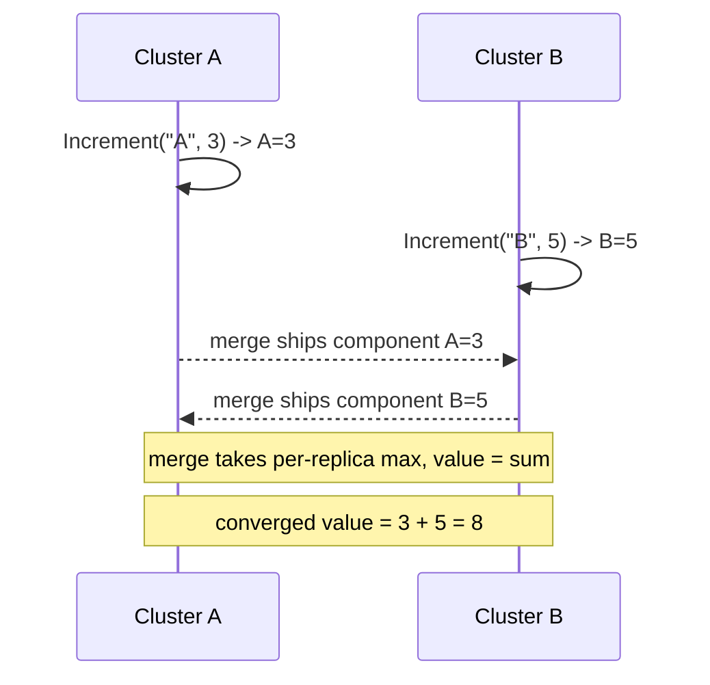

# G-Counter (Grow-Only Counter)

`tree.GCounter(key)` -> `GCounterAccessor`, merge mode `LatticeMergeMode.GCounter`.

## Semantics

A **G-Counter** is a counter that only ever goes **up**. Each replica keeps its
own per-replica component and increments only its own; the counter's value is the
**sum** of every replica's component. Because a replica only advances its own
component and merge takes the **per-replica maximum**, concurrent increments from
different clusters all survive - nothing is lost and nothing is double-counted on
re-delivery.

It is the grow-only half of the [PN-Counter](pncounter.md): a PN-Counter is two
G-Counters (one for increments, one for decrements). Reach for a G-Counter when
the quantity can never decrease - page views, total bytes ingested, monotonic
event tallies - and you want the smallest, tombstone-free counter primitive.

`IncrementAsync` takes a `replicaId` naming the writer and a non-negative
`amount`; each side advances only its own component.

## Behaviour



## Example

```csharp verify
var views = tree.GCounter("post:42:views");

// Two clusters count views concurrently; each advances its own component.
await views.IncrementAsync("cluster-A", 3, cancellationToken);
await views.IncrementAsync("cluster-B", 5, cancellationToken);

// The value is the sum across replicas - no increment is lost to a concurrent one.
long total = await views.ValueAsync(cancellationToken);
```

See also: the positive-negative [PN-Counter](pncounter.md) and the
[CRDT overview](readme.md).
