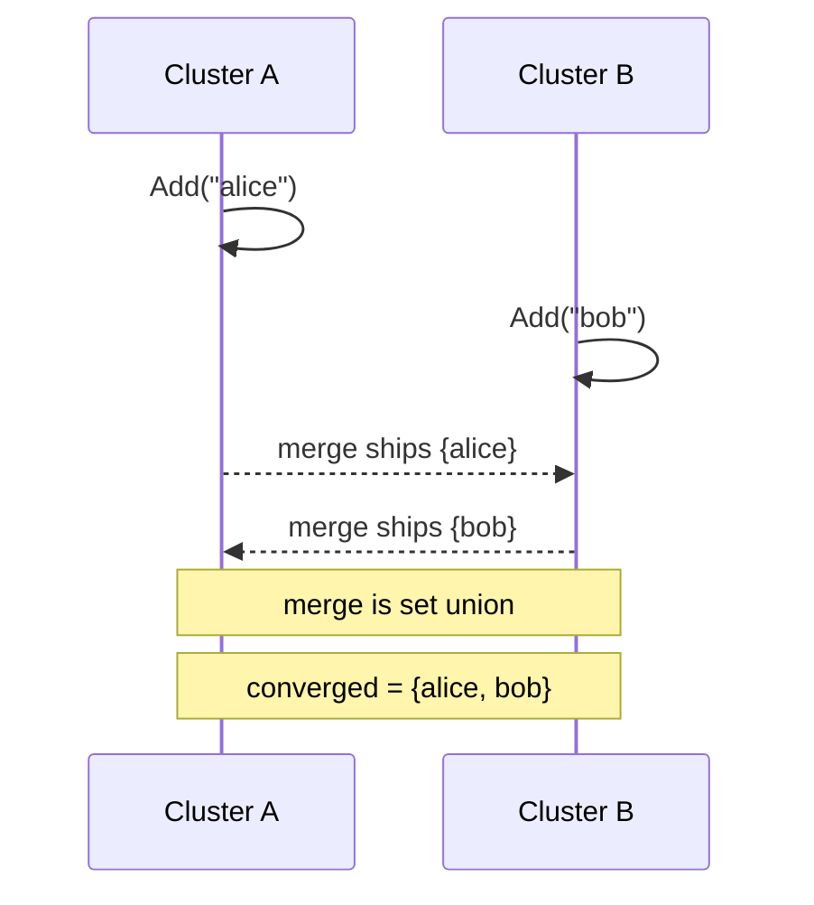

# G-Set (Grow-Only Set)

`tree.GSet(key)` -> `GSetAccessor`, merge mode `LatticeMergeMode.GSet`.

## Semantics

A **G-Set** is a set that only ever **grows**: elements can be added but never
removed. Elements are opaque `byte[]` compared by content. The merge is plain
**set union**, which is trivially commutative, associative, and idempotent, so
concurrent active-active adds from any number of clusters all survive
convergence and a re-delivered add is harmless.

Because it carries no dots and no tombstones, a G-Set is the **minimal** set
primitive - the smallest, cheapest choice for append-only workloads such as tag
sets, seen-ids, or an accumulating audience. When you need to remove elements,
reach for the add-wins [OR-Set](orset.md) or the remove-wins [RW-Set](rwset.md)
instead.

## Behaviour



## Example

```csharp verify
var seen = tree.GSet("campaign:autumn:reached");

// Two clusters add members concurrently; union keeps both.
await seen.AddAsync(Encoding.UTF8.GetBytes("alice"), cancellationToken);
await seen.AddAsync(Encoding.UTF8.GetBytes("bob"), cancellationToken);

bool reachedAlice = await seen.ContainsAsync(Encoding.UTF8.GetBytes("alice"), cancellationToken);
IReadOnlyList<byte[]> everyone = await seen.ToListAsync(cancellationToken);
```

See also: the add-wins [OR-Set](orset.md), the remove-wins [RW-Set](rwset.md),
and the [CRDT overview](readme.md).
