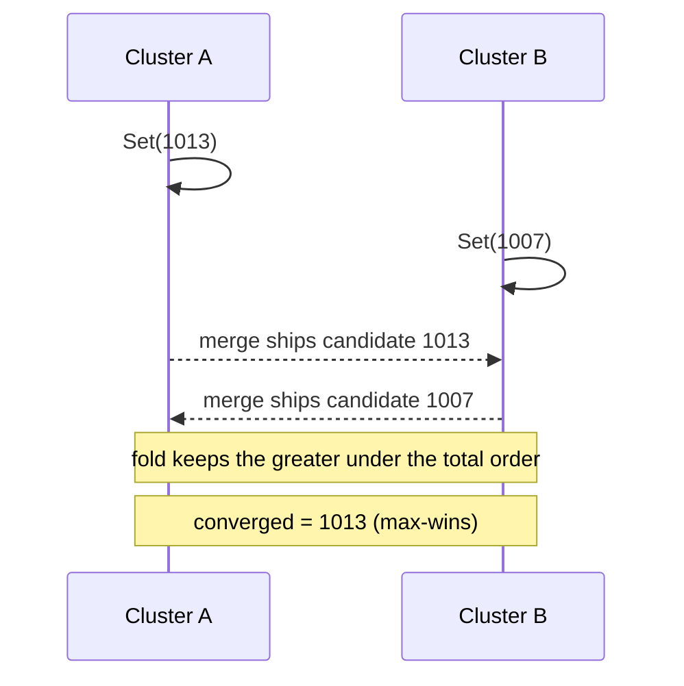

# Max-Register (Monotone High-Water Mark)

`tree.MaxRegister<T>(key, orderKeySelector)` -> `MaxRegisterAccessor<T>`, merge
mode `LatticeMergeMode.MaxRegister`.

## Semantics

A **Max-Register** keeps the **greatest** totally-ordered value ever written - a
monotone high-water mark. A write advances the register only when the candidate
beats the current value under the total order; concurrent active-active writes
from different clusters converge on the single greatest value because the fold is
a directional **max** over the total order, which is commutative, associative,
and idempotent.

The register is generic over your value type `T`. Because the store cannot know
your ordering, you supply an `orderKeySelector` that produces an
**order-preserving** `byte[]` key for a value: its unsigned lexicographic byte
order must match the intended value order (for example a big-endian encoding of a
numeric reading). The key travels on the wire alongside the value so the receiver
folds without needing your comparer.

Reach for it when a value only ever moves in one direction: a monotone gauge, a
version ceiling, a max-seen sensor reading, a highest-offset watermark. Its
mirror is the [Min-Register](minregister.md); for keeping concurrent values
rather than the extreme, use the [MV-Register](mvregister.md).

## Behaviour



## Example

```csharp verify
// The order key must be order-preserving: big-endian bytes of the reading.
var peak = tree.MaxRegister<long>("sensor:42:peak", static v =>
{
    var key = new byte[8];
    System.Buffers.Binary.BinaryPrimitives.WriteInt64BigEndian(key, v);
    return key;
});

// Two clusters report peaks concurrently; the register keeps the greater.
await peak.SetAsync(1013, cancellationToken);
await peak.SetAsync(1007, cancellationToken);

long? highest = await peak.GetAsync(cancellationToken);
```

See also: its low-water mirror [Min-Register](minregister.md), the multi-value
[MV-Register](mvregister.md), and the [CRDT overview](readme.md).
