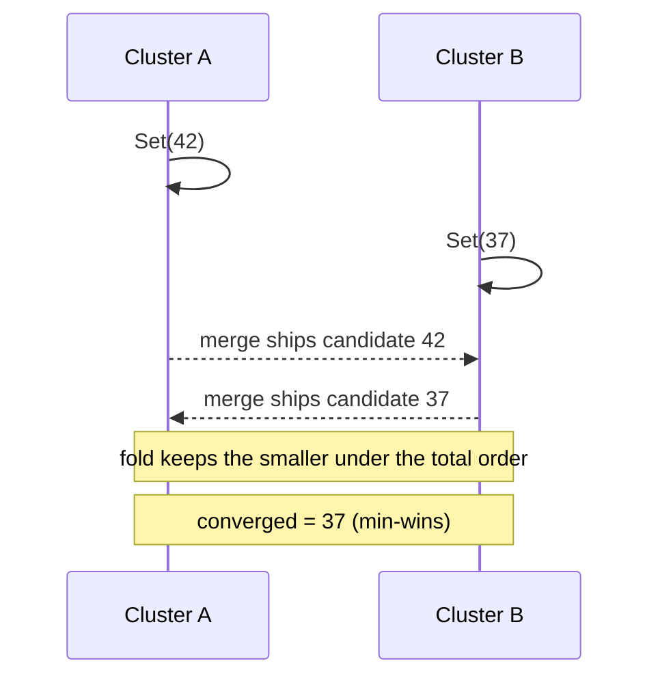

# Min-Register (Monotone Low-Water Mark)

`tree.MinRegister<T>(key, orderKeySelector)` -> `MinRegisterAccessor<T>`, merge
mode `LatticeMergeMode.MinRegister`.

## Semantics

A **Min-Register** is the mirror image of the [Max-Register](maxregister.md): it
keeps the **smallest** totally-ordered value ever written - a monotone low-water
mark. A write advances the register only when the candidate beats the current
value under the total order; concurrent active-active writes from different
clusters converge on the single smallest value because the fold is a directional
**min** over the total order, which is commutative, associative, and idempotent.

As with the Max-Register, you supply an `orderKeySelector` that produces an
**order-preserving** `byte[]` key for a value - its unsigned lexicographic byte
order must match the intended value order. The key travels on the wire alongside
the value so the receiver folds without needing your comparer.

Reach for it when a value only ever moves down: a min-seen latency floor, a
first-seen timestamp, a lowest-price watermark. Its mirror is the
[Max-Register](maxregister.md); for keeping concurrent values rather than the
extreme, use the [MV-Register](mvregister.md).

## Behaviour



## Example

```csharp verify
// The order key must be order-preserving: big-endian bytes of the reading.
var floor = tree.MinRegister<long>("service:api:latency-floor-ms", static v =>
{
    var key = new byte[8];
    System.Buffers.Binary.BinaryPrimitives.WriteInt64BigEndian(key, v);
    return key;
});

// Two clusters report latencies concurrently; the register keeps the smaller.
await floor.SetAsync(42, cancellationToken);
await floor.SetAsync(37, cancellationToken);

long? lowest = await floor.GetAsync(cancellationToken);
```

See also: its high-water mirror [Max-Register](maxregister.md), the multi-value
[MV-Register](mvregister.md), and the [CRDT overview](readme.md).
