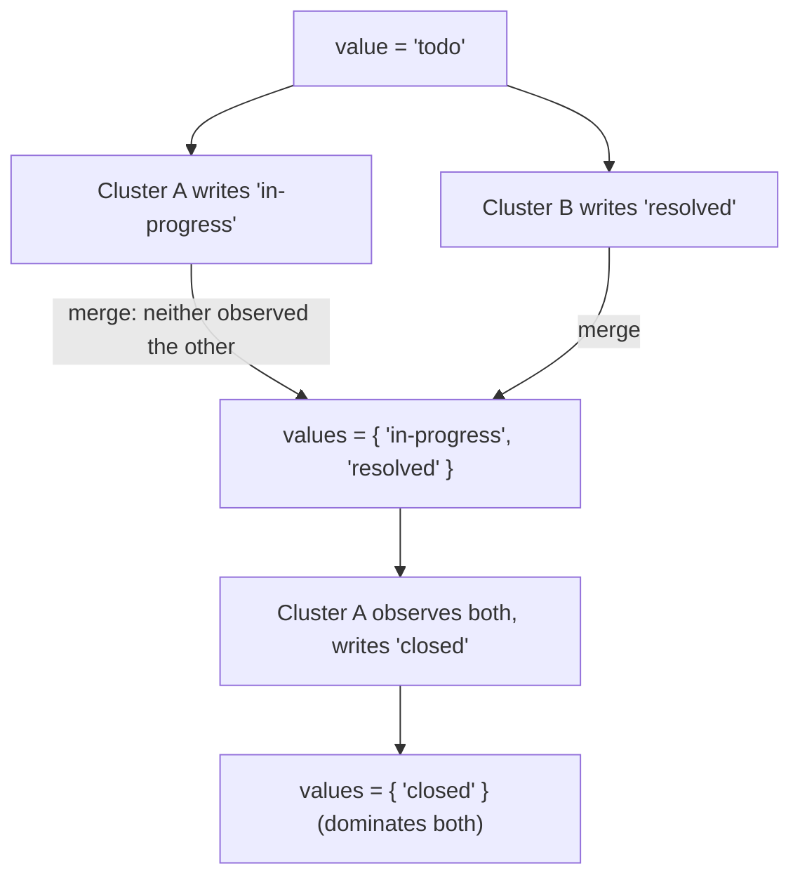

# MV-Register (Multi-Value Register)

`tree.MvRegister<T>(key)` -> `MvRegisterAccessor<T>`, merge mode `LatticeMergeMode.MvRegister`.

## Semantics

An **MV-Register** holds a single typed value - but unlike last-writer-wins, when
two replicas write **concurrently** it keeps *both* values instead of silently
discarding one. Your application then reads the conflict set and resolves it
however it likes (newest, merge, ask the user).

Each write stamps a causal *dot* and records the dots it has observed. On merge,
a value is kept only if its dot is **not dominated** by the other side's context;
a write that causally follows (observed) an earlier value replaces it. So a
value written *after seeing* both concurrent values collapses the register back
to a single entry.

`T` is serialized with a JSON serializer by default; pass your own
`ILatticeSerializer<T>` for other formats.

Use it for: a config field, a document title, an order status - a single-valued
field where you would rather surface a genuine conflict than lose a write.

## Behaviour



## Example

```csharp verify
var status = tree.MvRegister<string>("ticket:7:status");

// Two agents set the status concurrently, each unaware of the other's write.
await status.SetAsync("agent-A", "in-progress", cancellationToken);
await status.SetAsync("agent-B", "resolved", cancellationToken);

// Neither write observed the other, so both survive as a conflict set the
// application resolves - last-writer-wins would have dropped one silently.
IReadOnlyList<string> candidates = await status.ValuesAsync(cancellationToken);

// A later write that has observed both collapses the register to one value.
await status.SetAsync("agent-A", "closed", cancellationToken);
```

See also: [OR-Set](orset.md) when you want to *keep* many values rather than
resolve to one, and the [CRDT overview](readme.md).
