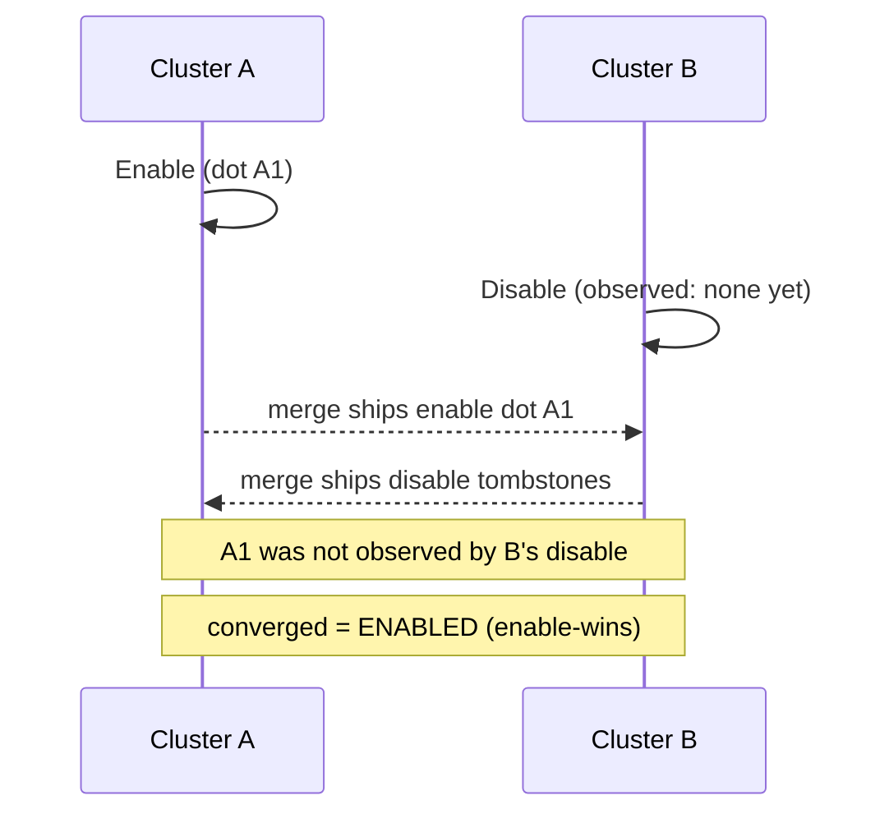

# OR-Flag (Observed-Remove Flag, enable-wins)

`tree.OrFlag(key)` -> `OrFlagAccessor`, merge mode `LatticeMergeMode.OrFlag`.

## Semantics

An **OR-Flag** is a single boolean presence bit - "enabled" or not - with
**enable-wins** convergence. It is the OR-Set idea reduced to a single implicit
element: the flag tracks *presence* rather than a payload, so you get OR-Set
semantics without carrying a set's element bytes.

Every `Enable` mints a fresh causal dot. `Disable` tombstones only the enable
dots it has **observed**. The flag is on whenever at least one enable dot
survives, so a `Disable` concurrent with an `Enable` it never saw leaves the flag
**enabled**.

Re-enabling an already-enabled flag still mints a fresh dot (that is what beats a
concurrent disable), but the flag keeps at most **one dot per replica** - see
[state size](readme.md#state-size-of-the-observed-remove-primitives). Enabling
the same flag a million times costs one dot, not a million.

Use it for: membership rows in a secondary index (a tag/key pair is present or
not), feature toggles, presence bits - where a concurrent enable should beat a
concurrent disable.

## Behaviour



## Example

```csharp verify
var beta = tree.OrFlag("tenant:5:beta");

// Cluster A turns the flag on; cluster B concurrently turns it off without
// having observed A's enable.
await beta.EnableAsync("cluster-A", cancellationToken);
await beta.DisableAsync(cancellationToken);

// The disable only cancels the enable dots it saw, so a concurrent enable
// survives - the flag converges ENABLED.
bool isOn = await beta.IsEnabledAsync(cancellationToken);
```

## Marking many flags at once

Enabling flags one at a time costs two round trips per key - a read to mint the
enable dot, then the apply. `EnableManyAsync` reads every current flag in one
batched call, mints all the deltas from that snapshot, and applies them through a
single batched CRDT write, so a presence- or membership-marking pass costs one
round trip per leaf rather than two per key.

```csharp verify
// Mark a whole batch of feature flags on in one write.
string[] keys = ["tenant:5:beta", "tenant:6:beta", "tenant:7:beta"];
await tree.EnableManyAsync(keys, "cluster-A", cancellationToken);

// Enabling is idempotent under OR-Flag merge, so a retried batch converges
// rather than clobbering a concurrent writer.
await tree.EnableManyAsync(keys, "cluster-A", cancellationToken);
```

The batch is **not atomic**: a partial failure leaves it half-applied. When the
marks must land all-or-nothing, stage them instead and hand the tokens to the
cross-tree atomic builder, which mints every delta from the same single batched
read:

```csharp verify
IReadOnlyList<LatticeStagedCrdtWrite> staged =
    await tree.StageEnableManyAsync(["tenant:8:beta", "tenant:9:beta"], "cluster-A", cancellationToken);
```

See also: its remove-wins mirror [RW-Flag](rwflag.md), the fuller
[OR-Set](orset.md), and the [CRDT overview](readme.md).
