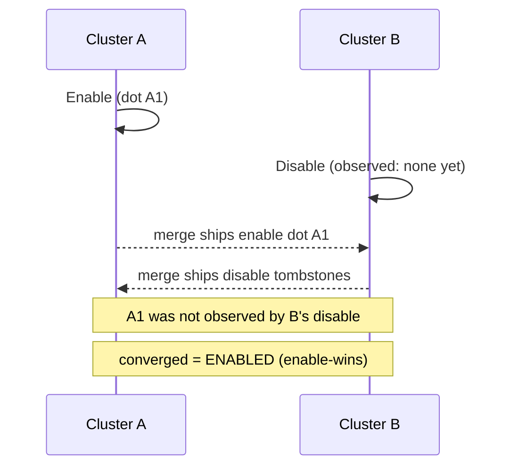

# OR-Flag (Observed-Remove Flag, enable-wins)

`tree.OrFlag(key)` -> `OrFlagAccessor`, merge mode `LatticeMergeMode.OrFlag`.

## Semantics

An **OR-Flag** is a single boolean presence bit - "enabled" or not - with
**enable-wins** convergence. It is the OR-Set idea reduced to a single implicit
element: the flag tracks *presence* rather than a payload, so you get OR-Set
semantics without carrying a set's element bytes.

Every `Enable` mints a fresh causal dot. `Disable` tombstones only the enable
dots it has **observed**. The flag is on whenever at least one enable dot
survives, so a `Disable` concurrent with an `Enable` it never saw leaves the flag
**enabled**.

Use it for: membership rows in a secondary index (a tag/key pair is present or
not), feature toggles, presence bits - where a concurrent enable should beat a
concurrent disable.

## Behaviour



## Example

```csharp verify
var beta = tree.OrFlag("tenant:5:beta");

// Cluster A turns the flag on; cluster B concurrently turns it off without
// having observed A's enable.
await beta.EnableAsync("cluster-A", cancellationToken);
await beta.DisableAsync(cancellationToken);

// The disable only cancels the enable dots it saw, so a concurrent enable
// survives - the flag converges ENABLED.
bool isOn = await beta.IsEnabledAsync(cancellationToken);
```

See also: its remove-wins mirror [RW-Flag](rwflag.md), the fuller
[OR-Set](orset.md), and the [CRDT overview](readme.md).
