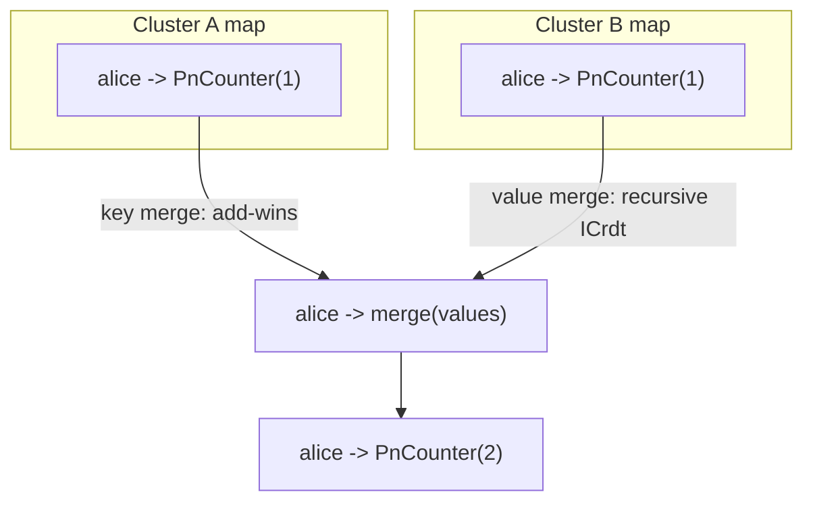

# OR-Map (Observed-Remove Map)

`tree.OrMap<TKey,TValue>(key)` -> `OrMapAccessor<TKey,TValue>`, merge mode `LatticeMergeMode.OrMap`.

## Semantics

An **OR-Map** is a dictionary that is a CRDT twice over. Its **keys** follow
add-wins [OR-Set](orset.md) semantics, and each **value** is itself a CRDT that
is merged **recursively** per key. So when two replicas write the same map key
concurrently, the values are not overwritten - they are folded together through
the value type's own merge.

`TValue` must implement `ICrdt<TValue>` and have a parameterless constructor;
use any built-in primitive or your own. Because the wire shape is generic, the
map's `(TKey, TValue)` pair must be registered on the host once via
`AddOrMapShape` before the silo starts.

Use it for: per-user scores, per-shard aggregates, per-item metadata - a keyed
collection where each entry must converge, not just the key set.

## Behaviour



## Example

First, register the map's shape on the host (once, at startup):

```csharp verify
// One-time host wiring: declare the map's (key, value) shape for this tree.
siloBuilder.AddOrMapShape<string, PnCounter>("election-2026");
```

If this registration is missing, an OR-Map write to the tree raises
`LatticeCrdtShapeNotRegisteredException` (a subclass of `InvalidOperationException`)
rather than silently mis-dispatching; the API bindings surface it as a
client-error precondition (for example gRPC `FailedPrecondition`). The closed-shape
primitives never need this - they resolve through the global registry fallback.

Then read and write it through the typed accessor:

```csharp verify
// A map of per-candidate vote tallies; each value is itself a PN-Counter.
var votes = tree.OrMap<string, PnCounter>("election-2026");

// Cluster A records a vote for "alice" by advancing a PN-Counter value.
var tallyA = new PnCounter();
tallyA.Increment("cluster-A");
await votes.SetAsync("alice", "cluster-A", tallyA, cancellationToken);

// A concurrent vote for the same candidate on another cluster does NOT
// overwrite A's write - the two PN-Counter values merge recursively per key.
// Reading back returns the merged counter for that key.
PnCounter? tally = await votes.GetValueAsync("alice", cancellationToken);
long aliceVotes = tally?.Value ?? 0;
```

See also: the value primitives [PN-Counter](pncounter.md) and
[OR-Set](orset.md), and the [CRDT overview](readme.md).
