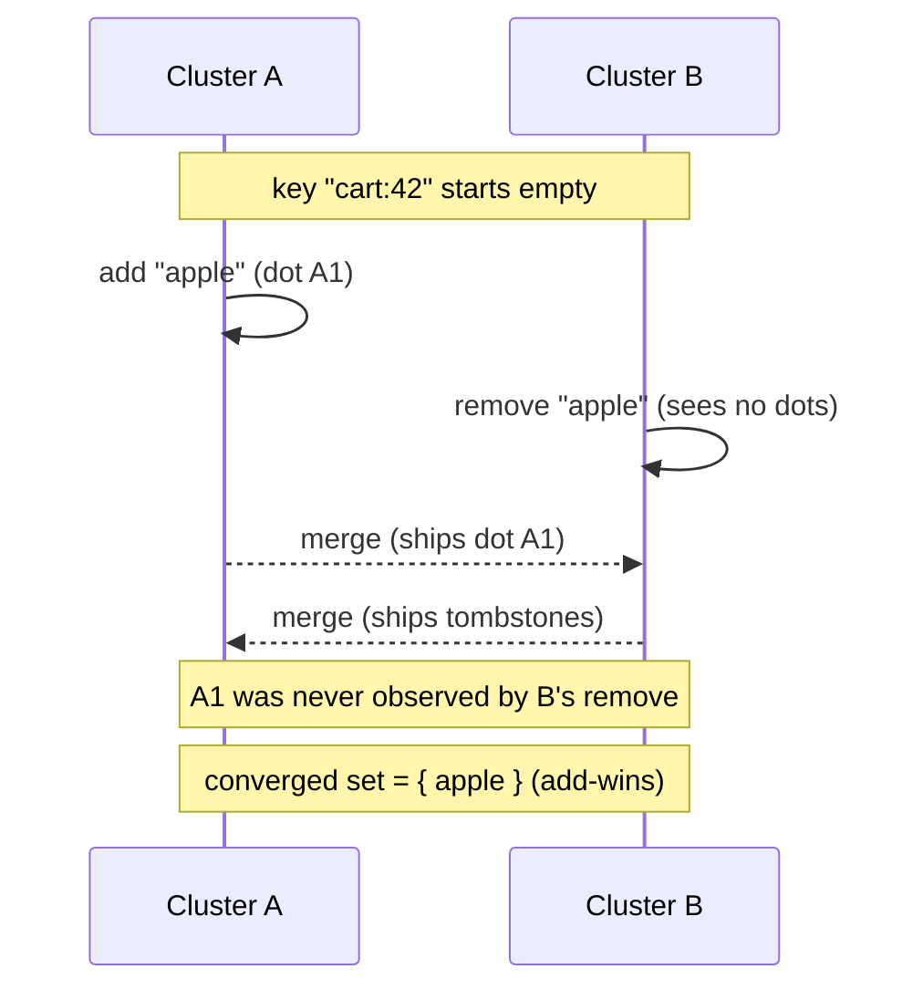

# OR-Set (Observed-Remove Set)

`tree.OrSet(key)` -> `OrSetAccessor`, merge mode `LatticeMergeMode.OrSet`.

## Semantics

An **OR-Set** is a distributed set of elements. You can add and remove elements
from any replica concurrently, and the set still converges. Its defining rule is
**add-wins**: if one replica removes an element while another concurrently adds
it (or re-adds it), the element **stays in the set**.

It achieves this by tagging every add with a unique causal *dot*
`(replicaId, counter)`. A remove does not delete the element by name; it
*tombstones the specific dots it has observed*. An add the remover never saw
carries a fresh dot that no tombstone cancels, so it survives.

Elements are opaque `byte[]` (encode strings with `Encoding.UTF8`).

Use it for: shopping carts, tag sets, group membership, "online users" - anywhere
a concurrent add should not be lost to a concurrent remove.

## Behaviour



## Example

```csharp verify
// Two clusters share one OR-Set under the same key.
var cart = tree.OrSet("cart:42");

// Cluster A adds "apple"; cluster B concurrently adds "pear".
await cart.AddAsync(Encoding.UTF8.GetBytes("apple"), "cluster-A", cancellationToken);
await cart.AddAsync(Encoding.UTF8.GetBytes("pear"), "cluster-B", cancellationToken);

// Once the states merge, both survive - adds accumulate.
bool hasApple = await cart.ContainsAsync(Encoding.UTF8.GetBytes("apple"), cancellationToken); // true
bool hasPear = await cart.ContainsAsync(Encoding.UTF8.GetBytes("pear"), cancellationToken);   // true

// A remove only tombstones the dots it has already observed. A concurrent
// re-add on another replica carries a fresh dot and wins the merge.
await cart.RemoveAsync(Encoding.UTF8.GetBytes("apple"), cancellationToken);

// Read the whole set back.
var set = await cart.GetAsync(cancellationToken);
```

See also: [OR-Map](ormap.md) (an OR-Set of keys whose values are themselves
CRDTs) and the [CRDT overview](readme.md).
