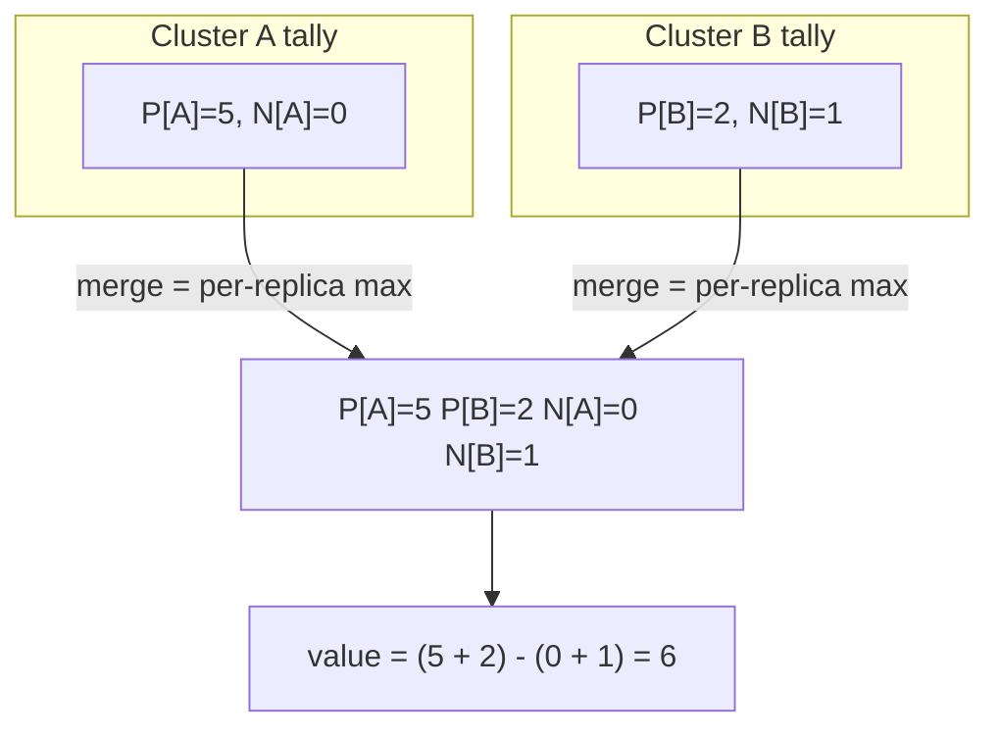

# PN-Counter (Positive-Negative Counter)

`tree.PnCounter(key)` -> `PnCounterAccessor`, merge mode `LatticeMergeMode.PnCounter`.

## Semantics

A **PN-Counter** is an integer counter that any number of replicas can
**increment and decrement concurrently** while still converging on the correct
total.

The trick: each replica keeps its own private tally of how much it has added
(`P`) and how much it has subtracted (`N`). A replica only ever advances *its
own* entries, so there is no write-write conflict. Merging takes the
**per-replica maximum** of every entry, and the scalar value is
`sum(P) - sum(N)`. Because each entry only grows, taking the max is safe,
commutative, and idempotent - a re-delivered update changes nothing.

Use it for: like counts, inventory / stock levels, quota consumption, active
connection counts, votes - any quantity edited from many places at once.

## Behaviour



## Example

```csharp verify
// A "likes" counter incremented from two clusters at once.
var likes = tree.PnCounter("post:99:likes");

// Cluster A records 5 likes; cluster B records 2 and one un-like.
await likes.IncrementAsync("cluster-A", 5, cancellationToken);
await likes.IncrementAsync("cluster-B", 2, cancellationToken);
await likes.DecrementAsync("cluster-B", 1, cancellationToken);

// After both sides merge, the total is (5 + 2) - 1 = 6, regardless of the
// order the updates arrived in.
long total = await likes.ValueAsync(cancellationToken); // 6
```

See also: [OR-Map](ormap.md) to key many counters (e.g. per-user vote tallies)
under one map, and the [CRDT overview](readme.md).
