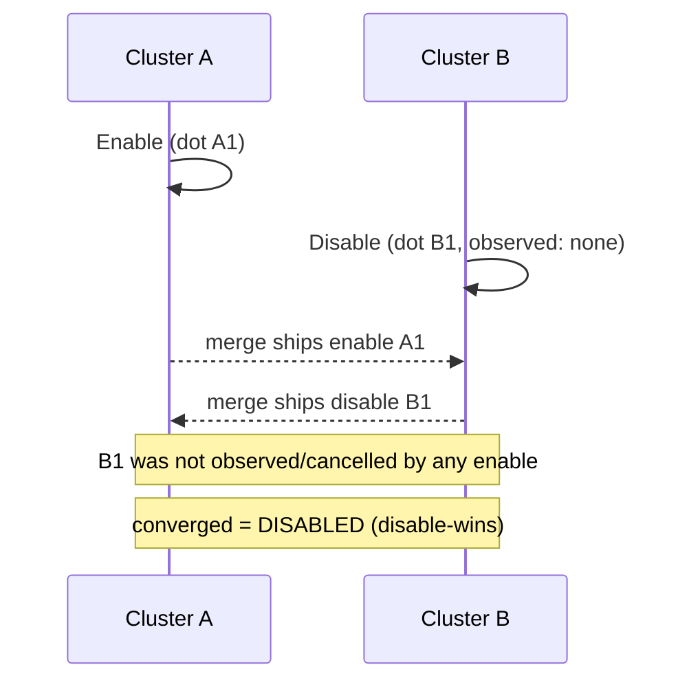

# RW-Flag (Remove-Wins Flag, disable-wins)

`tree.RwFlag(key)` -> `RwFlagAccessor`, merge mode `LatticeMergeMode.RwFlag`.

## Semantics

An **RW-Flag** is the mirror image of the [OR-Flag](orflag.md): a single boolean
presence bit that converges **disable-wins**. When an enable and a disable race,
the **disable wins** and the flag stays off.

It carries three dot sets: enables, disables, and tombstones that cancel
disables. The flag is on only when at least one enable dot exists **and no
disable dot survives**. A `Disable` an enable has not observed survives the merge
and keeps the flag off, so a revoke is never silently resurrected by a concurrent
re-add.

Both `Enable` and `Disable` take a `replicaId` (each side stamps its own dots).

Use it for: revocation lists, blocklists, "banned" / "deleted" markers, kill
switches - any presence bit where a removal must be the safe, winning outcome.

## Behaviour



## Example

```csharp verify
var access = tree.RwFlag("user:88:access");

// Cluster A grants access; cluster B concurrently revokes it.
await access.EnableAsync("cluster-A", cancellationToken);
await access.DisableAsync("cluster-B", cancellationToken);

// The revoke was not observed by the grant, so it survives the merge and the
// flag converges DISABLED - a revocation is never lost to a concurrent grant.
bool granted = await access.IsEnabledAsync(cancellationToken);
```

See also: its enable-wins mirror [OR-Flag](orflag.md) and the
[CRDT overview](readme.md).
