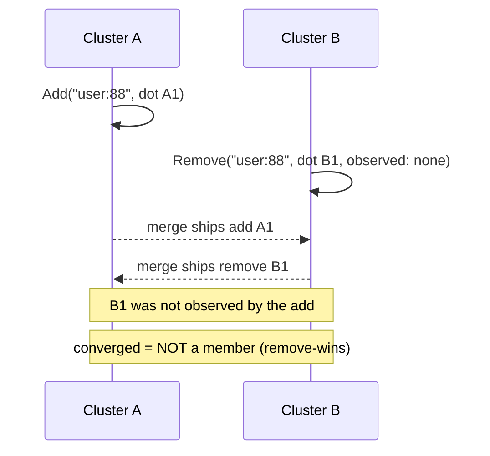

# RW-Set (Remove-Wins Observed-Remove Set)

`tree.RwSet(key)` -> `RwSetAccessor`, merge mode `LatticeMergeMode.RwSet`.

## Semantics

An **RW-Set** is a set whose membership converges **remove-wins**: when a
concurrent add and remove of the same element race, the **remove wins** and the
element stays out. It is the set-granularity generalisation of the
[RW-Flag](rwflag.md) - an RW-Flag is a single-element RW-Set, exactly as an
[OR-Flag](orflag.md) is to an [OR-Set](orset.md).

Each element carries three dot sets: add dots, remove dots, and observed-add
tombstones that cancel removes. An element is a member only when it carries an
add dot and no remove dot survives. A `Remove` that an add has not observed
survives the merge and keeps the element out, so a revoke is never silently
resurrected by a concurrent re-add.

Both `Add` and `Remove` take a `replicaId` (each side stamps its own dots). Use
it for membership revocation lists and blocklists - any set where a removal must
win the tie. When a concurrent add should instead win, reach for the add-wins
[OR-Set](orset.md).

## Behaviour



## Example

```csharp verify
var blocklist = tree.RwSet("tenant:7:blocklist");

// Cluster A re-admits a user; cluster B concurrently revokes them.
await blocklist.AddAsync(Encoding.UTF8.GetBytes("user:88"), "cluster-A", cancellationToken);
await blocklist.RemoveAsync(Encoding.UTF8.GetBytes("user:88"), "cluster-B", cancellationToken);

// The revoke was not observed by the add, so it survives and the element
// converges OUT of the set - a revocation is never lost to a concurrent add.
bool blocked = await blocklist.ContainsAsync(Encoding.UTF8.GetBytes("user:88"), cancellationToken);
```

See also: its add-wins mirror [OR-Set](orset.md), the single-element
[RW-Flag](rwflag.md), and the [CRDT overview](readme.md).
