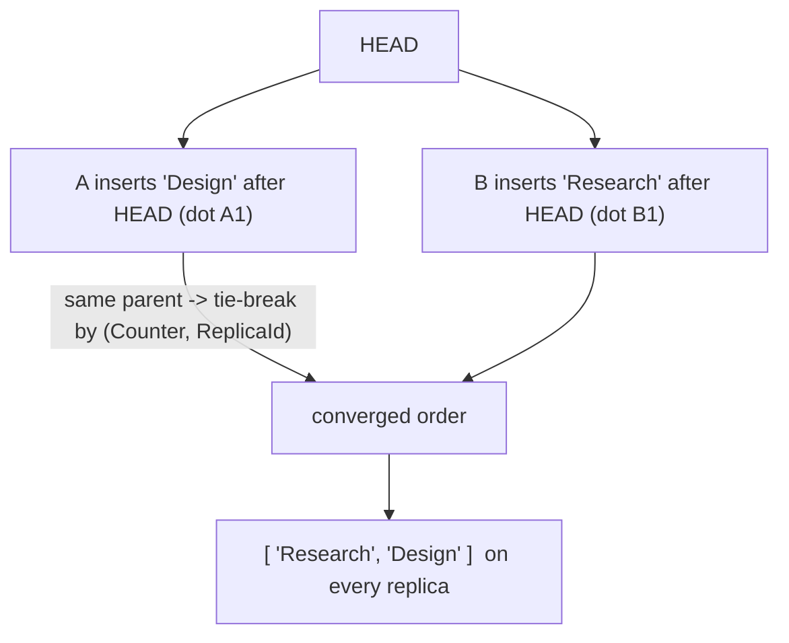

# Sequence (Replicated Growable Array / RGA)

`tree.Sequence<T>(key)` -> `RgaAccessor<T>`, merge mode `LatticeMergeMode.Sequence`.

## Semantics

A **Sequence** is an **ordered list** that many replicas can insert into and
delete from concurrently while converging on one identical order - the data
structure behind collaborative text and list editing.

Each element is a node identified by a causal *dot* and linked to the *parent*
it was inserted after. When two replicas insert after the **same** parent
concurrently, RGA breaks the tie deterministically with the descending
`(Counter, ReplicaId)` order, so every replica materialises the elements in the
same sequence. A delete does not unlink the node; it **tombstones** it, so a
later insert positioned relative to that node still resolves correctly.

`T` is serialized with a JSON serializer by default; pass your own
`ILatticeSerializer<T>` for other formats.

Use it for: shared to-do lists, ordered playlists, kanban columns, and text
buffers - anywhere concurrent edits to an ordered collection must converge.

## Behaviour



## Example

```csharp verify
// A collaboratively edited ordered list (e.g. a shared board's cards).
var cards = tree.Sequence<string>("board:1:cards");

// Two replicas insert at the same position concurrently.
await cards.InsertAtAsync(0, "cluster-A", "Design", cancellationToken);
await cards.InsertAtAsync(0, "cluster-B", "Research", cancellationToken);

// Concurrent inserts at the same slot converge on a deterministic order via
// the RGA (Counter, ReplicaId) tie-break - every replica sees the same list.
IReadOnlyList<string> ordered = await cards.ToListAsync(cancellationToken);

// A delete tombstones the node, so a later insert positioned near it still
// resolves correctly on every replica.
await cards.RemoveAtAsync(0, cancellationToken);
```

See also: [OR-Set](orset.md) (an *unordered* concurrent collection) and the
[CRDT overview](readme.md).
