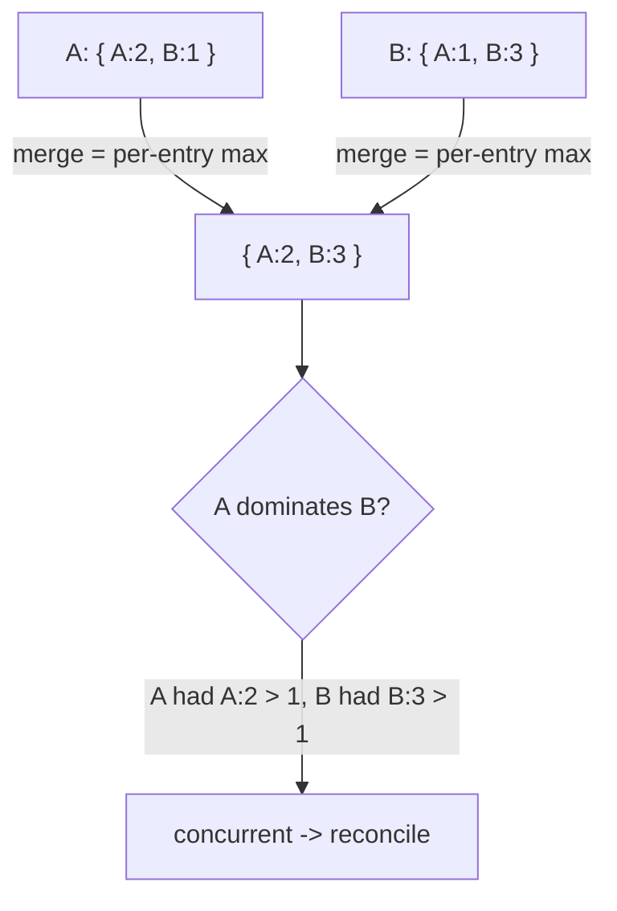

# Version Vector

`tree.VersionVector(key)` -> `VersionVectorAccessor`, merge mode `LatticeMergeMode.VersionVector`.

## Semantics

A **version vector** does not store application data - it stores **causal
history**: one logical clock per replica, answering "how far has each replica
progressed, and has A seen everything B has?".

Each replica **ticks** its own entry when it does something noteworthy. Merging
takes the **per-entry maximum** clock. Comparing two vectors then tells you
whether one causally dominates the other (`DominatesOrEquals`) or whether they
are **concurrent** (each has an entry the other lacks) - the classic signal that
two updates conflicted and need reconciliation.

Because merge is per-entry max, late or duplicate delivery is a harmless no-op.

Use it for: detecting concurrent edits, driving anti-entropy / "who is behind"
decisions, and building higher-level conflict detection on top of raw values.

## Behaviour



## Example

```csharp verify
var history = tree.VersionVector("doc:12:history");

// Each replica ticks its own entry as it makes edits.
await history.TickAsync("replica-A", cancellationToken);
await history.TickAsync("replica-A", cancellationToken);
await history.TickAsync("replica-B", cancellationToken);

// Read the merged causal frontier and compare against another vector to
// decide whether two states are concurrent or causally ordered.
VersionVector current = await history.GetAsync(cancellationToken);
var other = new VersionVector();
other.Tick("replica-C");
bool seenEverythingInOther = current.DominatesOrEquals(other); // false: C:1 unseen
```

See also: [MV-Register](mvregister.md), which uses per-value dot contexts for the
same concurrency-detection idea at the single-value level, and the
[CRDT overview](readme.md).
