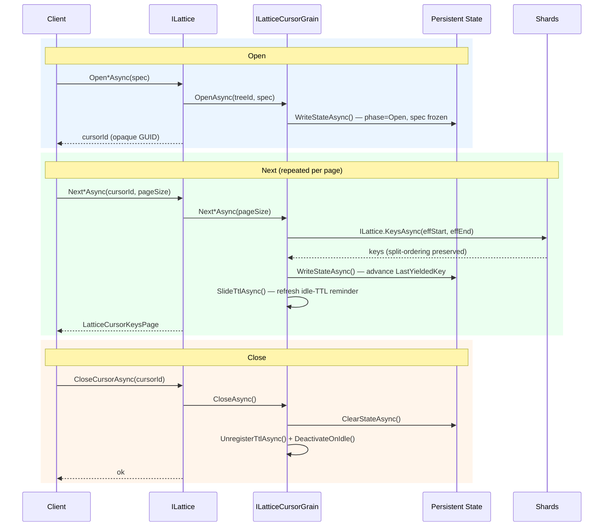
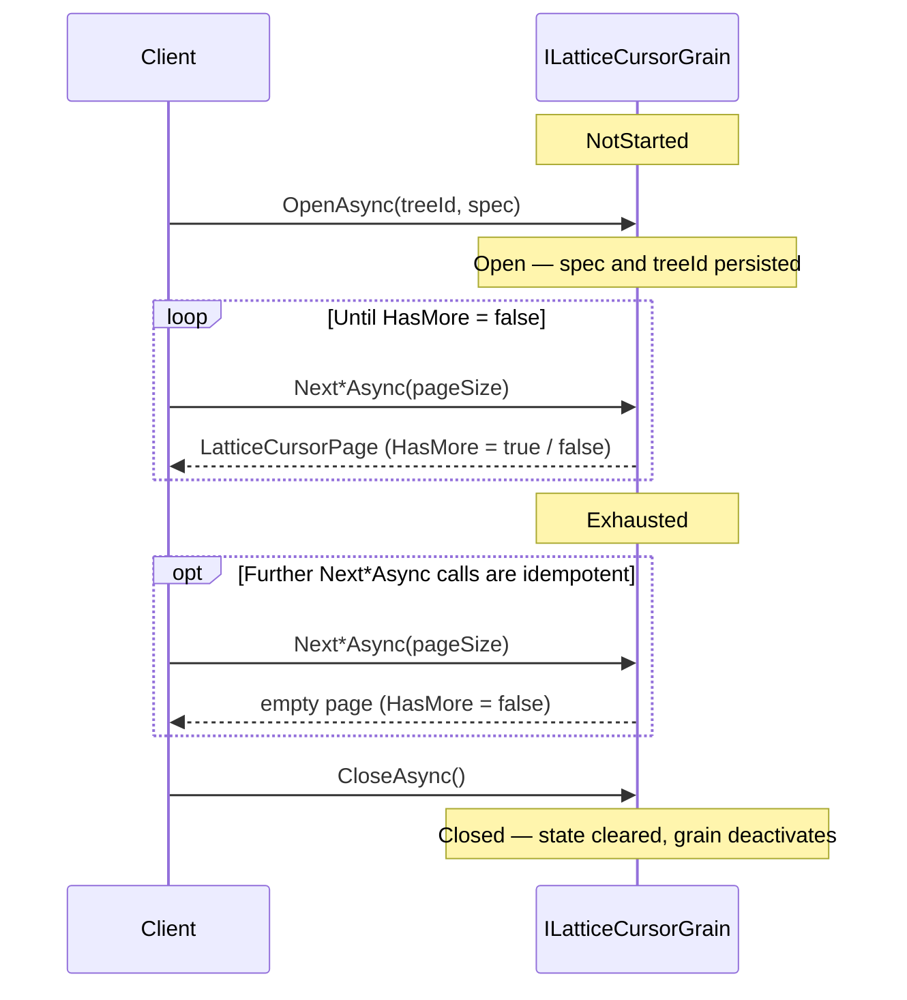
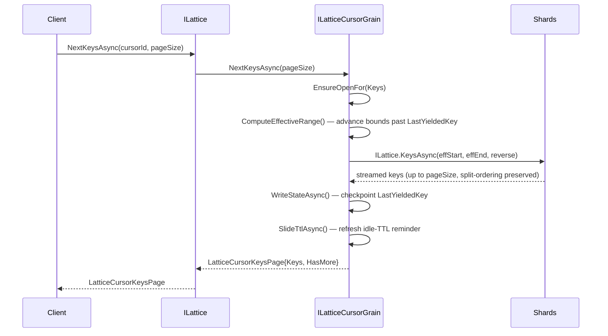
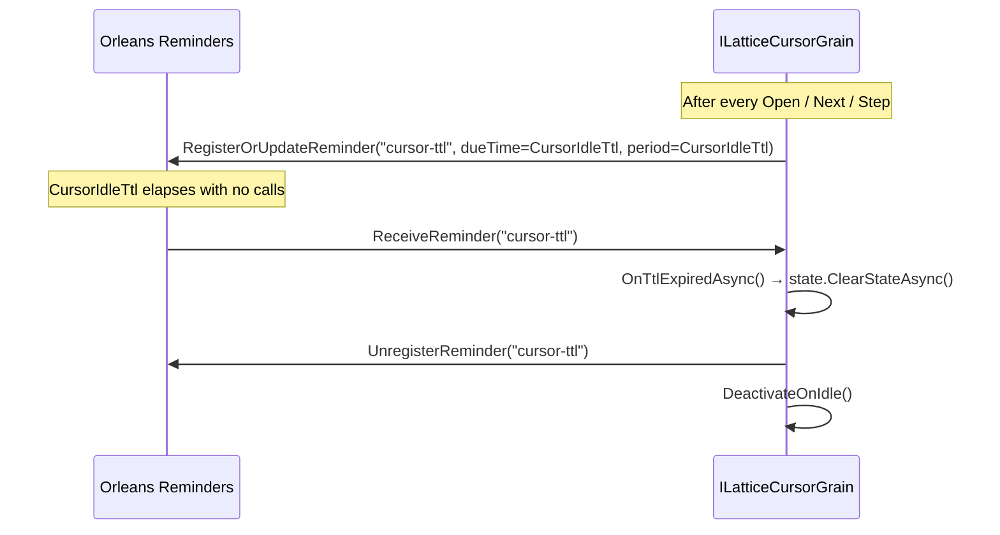

# Durable Cursors

Durable cursors are server-side, checkpointed iterators for long-running key
scans and resumable range deletes. Unlike the stateless
[`KeysAsync` / `EntriesAsync` / `DeleteRangeAsync`](api.md#enumeration)
methods — which are bounded by `LatticeOptions.MaxScanRetries` and die with
the client process — a cursor grain persists its position to Orleans storage
after every page. A new activation reads that checkpoint and continues exactly
where the previous one stopped, making export jobs, ETL pipelines, and
range-delete sweeps transparent to silo failovers, client restarts, and
topology changes (shard splits).

See [API Reference — Stateful Cursors](api.md#stateful-cursors)
for the full method signatures, return types, error surface, and code examples.
This document covers the design, grain lifecycle, and performance
characteristics.

## When to use a durable cursor

| Scenario | Recommendation |
|----------|----------------|
| Short-lived scan, client stays up, few thousand keys | Stateless `KeysAsync` / `EntriesAsync` — lower overhead, no grain state |
| Export or migration that may span minutes | Durable cursor — survives failover, no client retry code needed |
| Range delete that must survive interruption | `OpenDeleteRangeCursorAsync` — tracks tombstoning progress across steps |
| Topology under aggressive splitting, `MaxScanRetries` exhaustion | Durable cursor — each step has its own retry budget; topology churn only affects one step at a time |
| Cursor ID must be handed off between processes or services | Durable cursor — any client that knows the opaque ID can resume |

## Architecture

### Grain model

Each cursor is a single `ILatticeCursorGrain` activation keyed
`{treeId}/{cursorId}`, where `cursorId` is a server-assigned opaque GUID
returned by the `Open*Async` call. The grain is an internal implementation
detail — hidden from IntelliSense and guarded against direct external calls.
Callers interact exclusively through the `ILattice` facade.



### Cursor phase state machine


### Persisted state

`LatticeCursorState` is intentionally minimal — a silo restart only needs to
replay one page of work, and the checkpoint must be cheap to write on every
step.

| Field | Type | Purpose |
|-------|------|---------|
| `TreeId` | `string` | Target tree grain key |
| `Spec` | `LatticeCursorSpec` | Kind, start/end bounds, direction — frozen at `OpenAsync` |
| `Phase` | `LatticeCursorPhase` | `NotStarted` / `Open` / `Exhausted` / `Closed` |
| `LastYieldedKey` | `string?` | Last key returned or tombstoned. `null` before the first step. |
| `DeletedTotal` | `int` | Cumulative tombstone count (delete-range cursors only) |

### Step sequence

Every `Next*Async` / `DeleteRangeStepAsync` call follows the same pattern:



### Effective range computation and resumption

Resumption after a silo failover requires no replay of prior pages — the grain
recomputes `effStart` / `effEnd` from the persisted `LastYieldedKey` and
issues the next bounded `KeysAsync` / `EntriesAsync` call:

- **Forward scan:** `effStart = LastYieldedKey + "\0"` — the lexicographically
  first key strictly after the last yielded one. `effEnd` is unchanged.
- **Reverse scan:** `effEnd = LastYieldedKey` — the last yielded key becomes
  the exclusive upper bound, so it is not re-yielded. `effStart` is unchanged.

A key yielded by step *i* is therefore never re-yielded by step *i+1* or
later, regardless of any shard splits that occur between steps.

### Ordering under concurrent shard splits

Because each step delegates to the normal `ILattice.KeysAsync` /
`EntriesAsync` / `DeleteRangeAsync` path, **ordering preservation under
concurrent shard splits applies within each step**: concurrent shard splits are reconciled via
in-line cursor injection into the k-way merge priority queue, bounded by
`LatticeOptions.MaxScanRetries`. See [Shard Splitting](shard-splitting.md)
for the full reconciliation design.

Across steps, global ordering is preserved by the effective-range logic: the
continuation bound strictly excludes every previously-yielded key, so a split
that moves keys between steps is naturally handled by the next step's sharded
range query.

## Self-cleanup (idle-TTL reminder)

To prevent cursor state leaking when a client forgets `CloseCursorAsync`,
every cursor grain registers a sliding idle-TTL reminder (`cursor-ttl`) after
every successful call. If the reminder fires with no intervening activity, the
grain clears its persisted state and deactivates.



`LatticeCursorGrain` inherits this machinery from the internal `TtlGrain`
abstract base class, which also backs `AtomicWriteGrain`. Each grain overrides
`TtlReminderName`, `ResolveTtl`, and `OnTtlExpiredAsync` independently —
`CursorIdleTtl` and `AtomicWriteRetention` are separate options and do not
share a value.

**Configuration:**

```csharp verify
// Per-tree
siloBuilder.ConfigureLattice("my-tree", o =>
    o.CursorIdleTtl = TimeSpan.FromHours(6));

// Global default
siloBuilder.ConfigureLattice(o =>
    o.CursorIdleTtl = TimeSpan.FromHours(6));
```

Set `CursorIdleTtl = Timeout.InfiniteTimeSpan` to disable automatic cleanup.
The minimum effective interval is **1 minute** (Orleans reminder granularity);
smaller values are clamped to that floor.

## Performance characteristics

### Per-step overhead

Every `Next*Async` / `DeleteRangeStepAsync` call incurs two additional I/O
round-trips above a direct stateless scan call:

| Cost component | Magnitude | Notes |
|----------------|-----------|-------|
| `WriteStateAsync` — checkpoint | 1 × storage write per step | Serialises `LatticeCursorState` (< 10 KB). On memory provider: negligible. On Azure Table / SQL: ~1–5 ms. |
| `RegisterOrUpdateReminder` — TTL slide | 1 × reminder-table write per step | ~1–5 ms round-trip. See [debounce](#reducing-reminder-write-frequency) below. |
| Extra grain round-trip | +1 Orleans call per step | `ILatticeCursorGrain` sits between `ILattice` and the shard fan-out. Typically < 1 ms on a local cluster. |
| Shard fan-out | Same as `KeysAsync` / `EntriesAsync` | Each step is a normal sharded scan — no additional shard calls. |

**Total per-step overhead: ~2–10 ms**, dominated by the storage provider
round-trip.

### Large-export scenario

For a 10 million key export with `pageSize = 500` (20 000 steps):

| Metric | Value |
|--------|-------|
| Steps | 20 000 |
| Checkpoint writes | 20 000 |
| Reminder slides | 20 000 |
| Extra wall-clock time at 2 ms/step | ≈ 40 s |
| Extra wall-clock time at 5 ms/step | ≈ 100 s |

This overhead is typically small relative to the actual I/O cost of streaming
10 M keys across the network, but it is not zero.

### Reducing reminder write frequency

The internal `TtlGrain` base exposes a virtual `SlideDebounce` property
(default `TimeSpan.Zero`, meaning slide on every call). Overriding it in a
subclass throttles `RegisterOrUpdateReminder` calls to at most one per
interval, accepting a slightly stale TTL window in exchange for lower
reminder-table pressure. This is an internal extension point; it is not
surfaced on `LatticeOptions`.

The simpler alternative is to **increase `pageSize`**: halving the step
count halves the reminder and checkpoint write count proportionally.

### Grain state size

`LatticeCursorState` is intentionally minimal. Even with a 4 KB
`LastYieldedKey` and a 1 KB spec, the checkpoint is < 10 KB per cursor.
Aggregate reminder-table storage for a typical fleet of concurrent cursors
is negligible.

### Concurrent cursors

Each cursor grain is a single-threaded Orleans activation. Concurrent pages
from *different* cursors run in parallel with no cross-cursor coordination —
*N* concurrent cursors are equivalent in throughput to *N* independent
stateless scans, plus the per-step overhead per cursor.

## Stateless vs. durable — decision guide

| Dimension | Stateless (`KeysAsync` / `EntriesAsync`) | Durable cursor |
|-----------|------------------------------------------|----------------|
| Survives silo failover | ✗ — stream terminates | ✓ — resumes from checkpoint |
| Survives client restart | ✗ | ✓ — cursor ID is the resume token |
| Caller retry code needed | Required for robustness under splits | None needed |
| Per-page overhead | Zero | ~2–10 ms (checkpoint + reminder slide) |
| Ordering under splits | Per-call reconciliation (see [Shard Splitting](shard-splitting.md)) | Per-step reconciliation |
| Max scan duration | Bounded by `MaxScanRetries` | Unbounded — each step has its own budget |
| Idle cleanup | No state to clean up | Automatic via idle-TTL reminder |
| Cursor ID transferable across processes | ✗ | ✓ |
| Best for | Interactive queries, short scans | Long exports, ETL, background sweeps |

## See also

- [API Reference — Stateful Cursors](api.md#stateful-cursors) —
  full method signatures, return types, error surface, and code examples.
- [Shard Splitting](shard-splitting.md) — ordering preservation under
  concurrent topology changes (applied within each cursor step).
- [Atomic Writes](atomic-writes.md) — the related saga pattern for durable
  multi-key writes; shares the `TtlGrain` self-cleanup machinery.
- [Configuration](configuration.md) — `CursorIdleTtl`, `MaxScanRetries`, and
  other tunables.
