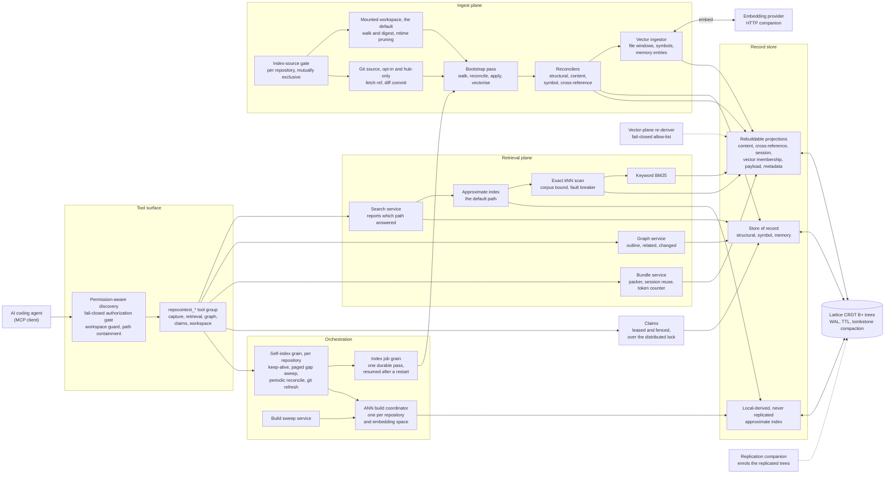

# Architecture

A map of the module's constituent parts and how a request or a file moves through
them. The reference pages describe each plane in depth; this page exists so you
can find the right one, and so the shape of the whole is visible from one place.

Read it alongside the [record model](record-model.md), which is the authoritative
layout contract for the trees and keys named here.

## The parts

## The flows that matter

**Ingest.** A repository's content arrives from one of two mutually exclusive
sources: a read-only mounted workspace (the default, and the only one that sees
uncommitted work) or a configured git remote (opt-in, hub-only, anchored to a
commit). From there a single idempotent pass walks or diffs, reconciles the
structural records, projects file content, extracts symbols, maintains the
reverse cross-reference edges, and embeds. Each stage records its own
*processed marker* on the file node, so each has an idempotent back-fill and a
repository indexed before a stage existed heals itself with no client call. See
[Index source strategies](container.md#index-source-strategies).

**Retrieval.** A query is answered by the best plane available and always says
which one that was. The approximate index serves by default; it falls back to a
bounded exact scan, and to deterministic keyword ranking over the content
projection when no vector plane can serve. Hits hydrate from the store of
record, never from the index. See [Semantic search](semantic-search.md) for the
five-value `retrievalPath` vocabulary, and
[Retrieval and token economics](retrieval-economics.md) for the graph verbs and
the budgeted bundle.

**Convergence.** No client call is on the critical path for freshness. A
per-repository self-index grain owns the standing "reach and stay indexed"
guarantee, the job grain owns the durability of one pass, and a build
coordinator owns the approximate index. All three are anchored by Orleans
reminders, so a process death resumes the work rather than abandoning it. See
[Staying fully indexed](tools.md#staying-fully-indexed-the-self-index-grain).

## The idea the design rests on

Every tree is classified as either **store of record** or **rebuildable
projection**, and that classification is enforced by name rather than inferred.

Store-of-record trees hold data that exists nowhere else: the structural nodes,
the symbol records, and agent memory. Projections hold data derived from them:
the content projection, the reverse cross-reference index, session reuse
bookkeeping, and the whole vector plane. A projection can be dropped and rebuilt;
a store-of-record tree cannot.

That single distinction is what makes several otherwise-awkward behaviours safe
and predictable:

- `repocontext_reset_index` drops the code index and every derived plane while
  preserving agent memory, so a wedged index is repairable without discarding
  notes, decisions, and gotchas.
- The self-healing re-derivation may reset exactly two rebuildable vector trees
  when one falls terminally off its write-ahead log, and refuses every other
  tree outright, so a heal can never become data loss.
- A terminally stale content tree degrades body-text ranking without failing
  ingest or retrieval, because the reconcile knows that content can be
  re-projected later.
- Replication enrols the store-of-record and shareable projection trees, while
  the approximate index stays local: each cluster builds its own far more
  cheaply than it could ship one.

Each classification is a fail-closed allow-list checked against local constants,
so an unrecognised tree name is refused rather than defaulted into a bucket.

## Where to go next

- [Record model](record-model.md) - the named trees, the key grammar, and the CRDT store-of-record model.
- [Tools](tools.md) - the tool catalogue, the indexing lifecycle, and the self-index grain.
- [Semantic search](semantic-search.md) - the embedding seam, the index planes, and fail-closed degradation.
- [Retrieval and token economics](retrieval-economics.md) - explainable search, graph navigation, and the budgeted bundle.
- [Memory and TTL](memory-and-ttl.md) - topics, entries, and per-repository expiry policy.
- [The agent-operated backlog](backlog.md) - leased, fenced claims over memory records.
- [Container quickstart](container.md) - running the module as a single durable local container.
