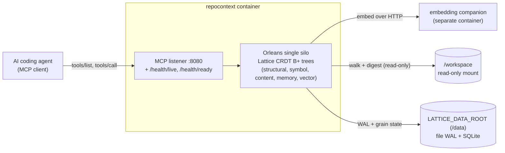

# Container quickstart

The module ships as a single, restart-durable container image - "codebase memory in a box". The container's only application listener is the MCP endpoint (plus HTTP health probes); no gRPC facade and no Explorer UI are exposed. All durable state lives on a host mount, so context survives a restart, a recreate, and an image upgrade.

The runnable sample is [`samples/RepoContextContainer`](../../samples/RepoContextContainer/README.md); this page summarises how it is wired.

## Topology



The container exposes a single application listener (the MCP endpoint, plus HTTP health probes) and reads the code it indexes from a read-only workspace mount, so it can never mutate that code. The `local` profile keeps both the WAL and the relational store under `LATTICE_DATA_ROOT`; the `postgres` and `azure` profiles move the relational store (and, for `azure`, the WAL) to an external service, leaving the same listener and workspace wiring unchanged. The embedding companion is optional: with no `LATTICE_EMBEDDING_ENDPOINT` set, search runs on the keyword path.

## The durability loop

The end-to-end guarantee the sample demonstrates:

**start -> add a repo under the mounted workspace -> recall -> restart -> context is still present.**

State is replayed from the WAL and the relational store on the mounted volume after a restart, so an agent's onboarded structural model and its remembered notes are all still there.

## Durability profiles

The host selects a durability profile from the `LATTICE_DURABILITY` environment variable:

| Profile | Grain storage + reminders | WAL | Use |
|---|---|---|---|
| `local` (default) | Single SQLite file under the data root | File-backed WAL under the data root | Zero external services - a laptop or a single box. |
| `postgres` | PostgreSQL | File-backed WAL | A durable relational store you already run. |
| `azure` | Azure Table Storage | Azure Table WAL | A cloud deployment; also enables the scaling signal endpoint. |

Every profile applies finite per-tree tombstone compaction to the churn trees (structural, symbol, content, memory, and the vector membership and metadata projection trees), so re-write, re-embed, and forget tombstones are reaped rather than accumulating. The write-once, content-addressed vector-payload tree is excluded because it never deletes in place.

## Data root and fail-fast

All durable local state - the file WAL directory and, in the `local` profile, the SQLite database - lives under `LATTICE_DATA_ROOT` (default `/data`), which must be a bind mount or named volume. The host fails fast at startup if that path is missing or not writable by its non-root UID, so a misconfigured mount surfaces immediately instead of silently losing durability.

## Configuration

The host is configured entirely by environment variables. The common ones:

| Variable | Default | Purpose |
|---|---|---|
| `LATTICE_DURABILITY` | `local` | The durability profile (`local`, `postgres`, `azure`). |
| `LATTICE_DATA_ROOT` | `/data` | Root for all durable local state; must be a writable host mount. |
| `LATTICE_MCP_PORT` | `8080` | The MCP listener port (the only application listener). |
| `LATTICE_WORKSPACE_ROOT` | `/workspace` | The read-only root that runtime-registered repositories must resolve under; a path escaping it is refused. |
| `LATTICE_EMBEDDING_ENDPOINT` | (unset) | The separate embedding companion's base address; enables semantic search. |
| `LATTICE_WAL_DIR` / `LATTICE_SQLITE_PATH` | under the data root | Override the WAL directory or SQLite file path individually. |
| `LATTICE_WAL_PIN_BUCKETS` | `8` | How many persisted slots the WAL materialiser retention-floor pin state is split across, so an advancing floor rewrites a fraction of the pin blob rather than all of it. Accepts 1-256; `1` is the library's legacy single-slot write path. Widening self-migrates on activation and leaves the legacy slot intact, so reverting to `1` is a safe rollback that over-retains WAL rather than over-trimming it. |
| `LATTICE_POSTGRES_CONNECTION_STRING` / `LATTICE_AZURE_STORAGE_CONNECTION_STRING` | (unset) | Required by the `postgres` / `azure` profiles. |

The background reconcile cadence (see [Background reconcile and change detection](#background-reconcile-and-change-detection)) is tuned by five further variables. The two periodic deadlines - the full walk and the embedding gap scan - are declared in wall clock but **counted in reconcile passes**: each is divided by the widest scheduled reconcile spacing (`LATTICE_RECONCILE_INTERVAL_SECONDS` plus `LATTICE_RECONCILE_JITTER_SECONDS`), rounded up, and clamped to at least one pass. That is what makes them hold on a large repository, where a pass routinely takes longer than its own scheduled spacing and a wall-clock deadline would be past on arrival every single time:

| Variable | Default | Purpose |
|---|---|---|
| `LATTICE_SELFINDEX_TICK_SECONDS` | `15` | How often each repository's self-index grain ticks; the reconcile cannot fire more often than this. |
| `LATTICE_RECONCILE_INTERVAL_SECONDS` | `900` | Base interval between periodic content reconciles. A small value (with zero jitter) makes the reconcile effectively continuous, bounded by the tick. |
| `LATTICE_RECONCILE_JITTER_SECONDS` | `300` | Maximum extra random interval added on top of the reconcile interval to desync repositories. |
| `LATTICE_FULL_WALK_INTERVAL_SECONDS` | `3600` | How often a reconcile is forced to ignore the directory-modification-time prune cache and stat every file, bounding how stale an in-place content edit can be. Counted in passes: at the shipped defaults it is 3 reconciles, so 2 in every 3 prune. Set it at or below one reconcile spacing and it degenerates to 1 pass, meaning every reconcile walks in full and pruning never engages. |
| `LATTICE_EMBEDDING_GAP_SCAN_INTERVAL_SECONDS` | `14400` | How often a reconcile re-probes every content-unchanged file for an embedding gap - a file whose structural record is committed but whose vector never landed. The probe costs two membership reads per indexed source, so on a converged repository it dominates the pass while finding nothing. Also counted in passes (12 at the shipped defaults). Spacing it does not delay healing: the self-index grain's out-of-band paged gap sweep forces an immediate in-pass scan the moment it finds a gap, and a repository not yet observed clean is re-probed every pass until it is. |

> **These three interval variables are a matched set.** `LATTICE_FULL_WALK_INTERVAL_SECONDS` and `LATTICE_EMBEDDING_GAP_SCAN_INTERVAL_SECONDS` are wall-clock values that are converted once into **pass counts** by dividing by the reconcile spacing (`LATTICE_RECONCILE_INTERVAL_SECONDS` plus `LATTICE_RECONCILE_JITTER_SECONDS`). Changing the reconcile interval therefore silently re-denominates both of the others. Raising it far enough that the full-walk interval floors to a single pass switches directory-modification-time pruning off entirely - no error, and the prune cache is written on every run but never read. If you raise the reconcile interval, restate the other two. The host logs the derived pass counts next to the configured seconds at startup (`full walk 120 s = 24 pass(es) ...; pruning can engage: True`), and warns when the arithmetic has disabled pruning, so the conversion never has to be worked out by hand.

Three further variables tune the indexing role, per-file token counting, and the semantic-search vector cache:

| Variable | Default | Purpose |
|---|---|---|
| `LATTICE_REPOCONTEXT_INDEXING_ROLE` | `hub` | The cluster's indexing role: `hub` (the authoritative indexer that walks, reconciles, prunes, and re-embeds) or `spoke` (a read-only replica whose index pass is inert). An absent or unrecognised value falls back to `hub`. |
| `LATTICE_REPOCONTEXT_TOKENIZER` | `o200k` | The BPE tokenizer profile the per-file token counter uses: `o200k` (OpenAI o200k_base) or `cl100k` (OpenAI cl100k_base). An absent or unrecognised value falls back to `o200k`. |
| `LATTICE_VECTOR_CACHE_TTL_SECONDS` | `30` | How long (in seconds) a warm decoded-vector candidate set is trusted before it is re-gathered from the store; `0` disables the cache. |

Two further variables are the kill switches for the approximate index's own housekeeping. Both default on, and both are documented in full under [Scheduling the approximate index build](semantic-search.md#scheduling-the-approximate-index-build):

| Variable | Default | Purpose |
|---|---|---|
| `LATTICE_REPOCONTEXT_ANN_INDEX_SCHEDULING` | `true` | Whether the approximate index build is scheduled by its durable, reminder-anchored coordinator - which is what lets a restored volume converge to a serving index with no client traffic at all, and what resumes a build interrupted by a process death. Set `false` and no index is built at all: every semantic query is answered by the exact scan with complete recall. An absent or unrecognised value falls back to `true`. |
| `LATTICE_REPOCONTEXT_ANN_INDEX_RECLAMATION` | `true` | Whether an index that has just reached `Ready` retires the sibling prefixes of its own repository whose embedding-space fingerprint is no longer live. A model or dimension change otherwise leaves the previous index resident forever. Set `false` to keep a superseded space for a deliberate roll-back. An absent or unrecognised value falls back to `true`. |

An opt-in family of `LATTICE_REPOCONTEXT_GIT_*` variables switches a repository from the mounted workspace to a git remote; see [Index source strategies](#index-source-strategies).

## Registering repositories at runtime

The container mounts a broad parent directory read-only at `LATTICE_WORKSPACE_ROOT` (default `/workspace`) and lets the MCP client decide which repositories under it to index - no repository path is baked into the container's configuration. The client drives this with these tools:

- `repocontext_add_repo` - registers a repository under the workspace and starts ingesting it (walk, digest, reconcile). This is the workspace-mode onboarding tool; it supersedes `repocontext_bootstrap`, which is not exposed in the container. Supply `path` (for example `/workspace/my-repo`); omit `repoId` to derive it from the final path segment. By default it honours the repository's `.gitignore` files (pass `respectGitignore=false` to index untracked files too) and drops files that look binary (pass `excludeBinary=false` to ingest blobs too); `includeGlobs` and `excludeGlobs` narrow the walk further. Ingestion runs asynchronously off the request thread and returns a `Running` snapshot at once, so poll `repocontext_index_status` for the same `repoId` to follow it to completion; a dropped client stream never aborts the run, and an interrupted one resumes after a restart. Re-adding the same repository is idempotent - only changed files are updated and deleted ones pruned.
- `repocontext_index_status` - reports a repository's indexing progress (lifecycle status, current phase, file and chunk counters, attempt count, timing, and any failure reason), so an agent can watch an `add_repo` pass complete or diagnose a failure. A repository that was never onboarded reports `status=None`.
- `repocontext_list_repos` - lists every registered repository with its last-ingested marker, recorded file count, and `embeddedVectorCount` (the durable count of sources whose embedding has landed, read from the store of record so it survives a restart; sources include files and captured symbols, so the count can exceed the file count once symbols are embedded), so an agent can discover what is queryable and how far semantic coverage has progressed before recalling, scanning, or searching. Counting exactly means walking the whole membership tree, so the listing never does it inline: it serves the last completed walk, omits the field until one completes (which is not the same answer as `0`), and sets `embeddedVectorCountPending` while a refresh is outstanding - which it will be for most of an active ingest, since every membership write supersedes the previous figure.
- `repocontext_remove_repo` - forgets every record for a repository (structural nodes, symbols, content projection, memory, and vectors). The working tree on disk is never touched.

Every path passed to `repocontext_add_repo` is resolved to its real on-disk location - defeating both `..` traversal and symlink escape - and must sit inside `LATTICE_WORKSPACE_ROOT`; a path outside it is refused. Mounting the workspace read-only means the container can never mutate the code it indexes.

A repository configured to be sourced from a git remote is not registered this way at all: it is declared in configuration, onboards itself, and is refused by `repocontext_add_repo` so a mounted path can never shadow the configured remote. See [Index source strategies](#index-source-strategies).

## Index source strategies

Where a repository's content comes from is a per-repository choice between two strategies.

The **mounted workspace** is the default and is what every section above describes: a client registers a path under `LATTICE_WORKSPACE_ROOT` and the background reconcile walks that tree. The **git source** is opt-in and hub-only: the host is told a remote url and a ref, fetches it into a staging work tree, and indexes the commit that ref resolved to. The two are mutually exclusive per repository - a git-sourced repository is refused by `repocontext_add_repo` with a clear error, so a mount can never silently shadow the configured remote.

| | Mounted workspace (default) | Git source (opt-in) |
|---|---|---|
| Where the truth lives | Outside the host: whoever mounts the volume decides what is indexed, and two hosts can mount divergent content. | In the host's own configuration - a remote url plus a ref - so the declared truth is verifiable and identical everywhere it is deployed. |
| What a generation is anchored to | Nothing. "Which revision am I serving?" has no answer. | The resolved commit SHA, reported by `repocontext_list_repos` as `indexedCommit`. |
| How the change set is computed | A directory walk with modification-time pruning plus a periodic full sweep. | A diff of the new commit's tree against the stored per-file digests. No walk. |
| How a delete is detected | Inferred from absence on disk, so an unmounted or half-synced volume looks like a mass deletion. | Read exactly from the commit's change set. |
| What it needs | A read-only bind mount. | Reach to a git remote, plus credentials unless the remote is anonymous. |
| What a pass costs | A stat of every file in every directory the prune cache cannot skip, on every reconcile. No network, and no second copy of the tree. | A shallow fetch and a SHA comparison. A refresh that finds the ref unmoved does no walk, no read, and no write at all - but the staging work tree means the repository is on disk twice. |
| How fresh it is | Whatever is on the volume right now, uncommitted work included, within the reconcile bound. | The tracked ref as last fetched. Work that is uncommitted, or committed but not pushed to that remote, does not exist to it. |
| What it serves | Any content: a local dev loop, non-git trees, air-gapped hosts, and work in progress. | Any reachable git remote at a committed ref - a hosted forge, or a bare repository on local disk. |
| Cluster role | Any. | Hub only; on a spoke the strategy is inert, as the whole index pass is. |

Neither strategy changes what the retrieval tools see. A git-sourced repository is recalled, scanned, searched, and bundled exactly like a mounted one; only how its records get there differs.

### Choosing a strategy

Pick by which of two properties matters more for that repository.

- **Mount the workspace when freshness is the point.** A dev loop in which an agent must see the file you just saved - before it is committed, let alone pushed - only works on a mount. That is the common case for a single-node, local-first deployment, and it is why the mount is the default.
- **Source from git when a verifiable revision is the point.** A shared or multi-replica host gains three things a mount cannot give it: every replica can name the commit it is serving, deletes are read from the commit rather than inferred from absence on disk, and the declared truth lives in the host's own configuration rather than in whoever mounted the volume.

The two cost profiles differ, but cost is rarely the deciding factor and should not be read as the headline. A git source does replace a per-reconcile directory walk with a fetch and a SHA comparison, so a repository that is idle most of the time settles into a cheaper steady state: an unchanged ref costs one shallow fetch and nothing else. It is not free, though - it needs reach to the remote on every refresh, and the staging work tree means the repository occupies disk twice. Treat the reduced walk as a secondary benefit of choosing a git source for the reasons above, never as a reason to give up a dev loop that has to see uncommitted work.

The choice is per repository, so nothing forces one strategy for the whole host: a host can mount the tree it is actively editing and source a stable dependency from its remote.

### Configuring a git source

The feature is inert until `LATTICE_REPOCONTEXT_GIT_REPOS` names at least one repository. Listing a repository there is the whole opt-in: it registers the git strategy, refuses the mount path for that repository, and starts the refresh loop.

| Variable | Default | Purpose |
|---|---|---|
| `LATTICE_REPOCONTEXT_GIT_REPOS` | (unset) | Semicolon- or comma-separated repository ids to source from git. Absent or blank leaves every repository on the mounted-workspace default and the whole subsystem inert. |
| `LATTICE_REPOCONTEXT_GIT_STAGING_ROOT` | a `lattice-repocontext-git` directory under the system temp path | The directory staging work trees are created under. Point it at a writable volume with room for a shallow checkout of every configured repository. |

Every remaining setting is per repository. The repository id is folded to an upper-case identifier - non-alphanumeric characters become `_` - so a repository named `my-repo` reads `LATTICE_REPOCONTEXT_GIT_MY_REPO_URL`:

| Variable (suffix) | Default | Purpose |
|---|---|---|
| `_URL` | (unset) | The remote url to fetch from. A repository declared without one never indexes: it fails closed rather than falling back to a mount. |
| `_REF` | `refs/heads/main` | The ref to track. A bare `main` or `v1.2.0` is qualified to a branch ref; pass `refs/tags/v1.2.0` to track a tag. |
| `_DEPTH` | `1` | Shallow-fetch depth, clamped to 0-100000. `0` means a full-history fetch. |
| `_REFRESH_SECONDS` | `300` | How often the refresh loop re-fetches the ref, clamped to 30-86400. |
| `_FETCH_TIMEOUT_SECONDS` | `300` | How long a single fetch may run before it is abandoned, clamped to 10-3600. The last-good index keeps serving across an abandoned fetch. |
| `_AUTH` | `token` | The credential mode: `token` (read a per-repository token) or `anonymous` (an explicit opt-in for a public or local remote). Anonymous is never a fallback. |
| `_TOKEN` | (unset) | The read-only token or password for `token` mode. Required in that mode; without it the repository does not index. |
| `_USERNAME` | `x-access-token` | The username paired with the token. The default suits a GitHub App installation token or a fine-grained PAT. |
| `_INCLUDE` | (unset) | Semicolon- or comma-separated include globs; when set, only matching files are indexed. |
| `_EXCLUDE` | (unset) | Semicolon- or comma-separated exclude globs; a match drops a file even when it also matched an include. |
| `_EXCLUDE_BINARY` | `true` | Whether files that look binary are dropped. Set `false` to ingest blobs too. |

A minimal opt-in for a repository id of `my-repo`:

```text
LATTICE_REPOCONTEXT_GIT_REPOS=my-repo
LATTICE_REPOCONTEXT_GIT_MY_REPO_URL=https://github.com/acme/my-repo.git
LATTICE_REPOCONTEXT_GIT_MY_REPO_REF=refs/heads/main
LATTICE_REPOCONTEXT_GIT_MY_REPO_TOKEN=<read-only token>
```

A git source does not require a hosted forge. Any url git can fetch from works, including a bare repository on a local volume, and `anonymous` is the explicit opt-in for a remote that needs no credential. That keeps the commit-anchored generation and the exact delete detection on a host with no outbound network at all:

```text
LATTICE_REPOCONTEXT_GIT_REPOS=my-repo
LATTICE_REPOCONTEXT_GIT_MY_REPO_URL=/srv/git/my-repo.git
LATTICE_REPOCONTEXT_GIT_MY_REPO_REF=refs/heads/main
LATTICE_REPOCONTEXT_GIT_MY_REPO_AUTH=anonymous
```

The path is resolved inside the container, so mount the bare repository in as you would any other volume, and give the staging root somewhere writable to check out into. The trade is unchanged by the remote being local: the index still tracks a committed ref, so work that is uncommitted - or committed but not yet pushed to that remote - stays invisible until it lands there. A repository you are actively editing belongs on a mount.

### What a refresh does

Shortly after startup the host arms every configured repository's self-index grain, retrying with backoff until the cluster is accepting calls, and the grain then drives the loop on its own reminder at `_REFRESH_SECONDS`. Each pass:

1. Fetches the configured ref into the repository's staging work tree. The index is never read from a tree mid-fetch, and because the self-index grain is a singleton, a fetch already in flight is never stacked on top of.
2. Resolves the ref to a commit. If it equals the SHA the last completed generation was stamped with, the pass is a no-op - no diff, no embedding, no write.
3. Otherwise diffs the new commit against the stored per-file digests and applies exactly that add / modify / delete set. Deletes come from the commit, not from absence on disk.
4. Stamps the repository record with the resolved commit SHA. `repocontext_list_repos` reports it as `indexedCommit`, and in a hub-and-spoke topology it replicates to spokes with the rest of the index, so every replica can state the revision it is serving.

A fetch that fails, times out, or authenticates badly leaves the previous generation in place and serving; nothing is pruned on the way in. The pass is safe to repeat, so a late or duplicated reminder costs at most one no-op fetch.

### Security posture

The git source is the only part of the host that makes an outbound, credentialed call, so it is deliberately narrow:

- **Fail closed.** A repository configured for `token` auth with no token resolves no credential and does not index. It never degrades to an anonymous fetch, and never falls back to a mounted walk. Anonymous access must be asked for by name.
- **Per-repository isolation.** Credentials are resolved per repository id; there is deliberately no ambient, un-suffixed token variable that several repositories could share, so one repository's credential cannot fetch another's remote.
- **Never logged.** Tokens are redacted from every log line and from every error message, including the userinfo component of a remote url, so a failed fetch cannot leak a secret into a diagnostic.
- **Read-only.** The staging work tree is a fetch-and-checkout cache. Nothing is ever pushed, and the staging root is the only path outside the read-only workspace the host is allowed to touch.
- **Hub only.** On a spoke, the whole index pass is inert, so a spoke performs no fetch and needs no credential.

The credential lookup sits behind a small provider seam. The shipped provider reads the per-repository environment variables above; a host that would rather mint short-lived GitHub App installation tokens can replace it without touching the fetch, diff, or indexing paths.

## Background reconcile and change detection

Once a repository is onboarded, its self-index grain keeps it converged without any client call. On each tick it re-drives an idempotent reconcile that walks the tree, diffs it against the stored structural records, and applies exactly the delta - so files added, edited, and deleted on disk are picked up automatically. The reconcile is single-flight and each tick is a fresh grain turn, so re-driving on completion polls for the previous run rather than recursing; a short `LATTICE_RECONCILE_INTERVAL_SECONDS` therefore makes it near-continuous, bounded only by the tick.

To keep that cheap on a large tree, the background reconcile uses **directory-modification-time pruning**: a directory whose modification time is unchanged since the previous walk carries its known files forward without re-stating them, while every subdirectory is still descended so a nested structural change is never missed. Adding, renaming, or deleting a file bumps its directory's modification time, so those changes defeat pruning and are caught on the next reconcile. An in-place content edit that leaves the directory's modification time untouched is invisible to pruning, so it is caught by the periodic full sweep instead: every `LATTICE_FULL_WALK_INTERVAL_SECONDS` a reconcile ignores the prune cache and stats every file. That deadline is enforced by **counting reconcile passes**, not by reading a clock. The distinction matters because the reconcile is single-flight: the real gap between two walks is the larger of the configured spacing and the previous pass's own duration, so on a repository whose pass runs longer than its spacing a wall-clock deadline is already past on arrival every single time, forcing a full walk on every pass and leaving the prune cache written but never read. Counting passes holds the bound however long a pass takes. The interval is converted once, by dividing it by the widest scheduled spacing - `LATTICE_RECONCILE_INTERVAL_SECONDS` plus `LATTICE_RECONCILE_JITTER_SECONDS` - rounding up, and clamping to at least one pass; the shipped defaults give 3 passes, so 2 reconciles in every 3 prune. Setting the interval at or below one reconcile spacing clamps it to a single pass, which reproduces the old "full walk every time" behaviour deliberately rather than by accident. Worst-case detection latency for a pure in-place content edit is therefore that many reconciles, which is the configured interval or longer in wall clock. The first walk after a process start is always a full one, so a restart re-establishes an exact baseline.

The same pass counting spaces out the **embedding gap scan**. Beyond structural convergence, a pass also re-probes files it decided were unchanged, looking for one whose structural record is committed but whose vector never landed. That probe costs two membership reads per indexed source, so once a repository is converged it is by far the most expensive thing a pass does while reliably finding nothing. It now runs every `LATTICE_EMBEDDING_GAP_SCAN_INTERVAL_SECONDS`, likewise counted in passes. Two safeguards mean the spacing costs no healing latency: a repository that has never yet been observed gap-free is probed on every pass until it is, and the self-index grain's continuous out-of-band paged gap sweep - which is already incremental and bounded - forces an immediate in-pass scan on the very next reconcile the moment it finds one, rather than waiting for the cadence.

Pruning is applied only to this background reconcile. An explicit `repocontext_add_repo` onboarding (or re-onboarding) always runs a full, exact walk, so an agent that re-adds a repository observes the current on-disk state immediately rather than within the full-walk bound.

Everything in this section describes the mounted-workspace strategy. A git-sourced repository never walks a directory and never prunes by modification time: its loop is the fetch-and-diff cycle in [Index source strategies](#index-source-strategies), where the change set - deletes included - comes from the commit itself.

## Health probing

The runtime image is distroless and shell-less, so probing is HTTP-only - there is no shell-exec healthcheck:

- `GET /health/live` - process and silo host alive (liveness).
- `GET /health/ready` - silo joined, activation-time WAL replay done, durable stores reachable, MCP serving (readiness). Not-ready during startup replay and during drain.

## Graceful shutdown

On `SIGTERM` (a `docker stop` or `restart`) the host flips readiness to not-ready first, then drains: the silo deactivates and the WAL commit-log flushes buffered records before exit, within a generous shutdown budget, so an in-flight write is durable after restart.
