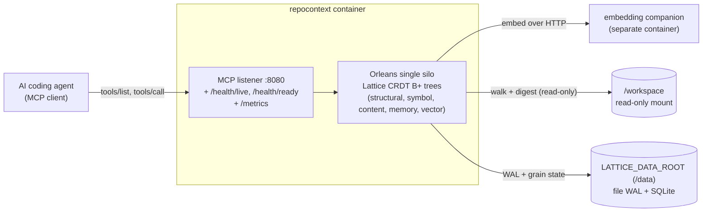

# Container quickstart

The module ships as a single, restart-durable container image - "codebase memory in a box". The container's only application listener is the MCP endpoint (plus HTTP health probes and a Prometheus `/metrics` scrape endpoint); no gRPC facade and no Explorer UI are exposed. All durable state lives on a host mount, so context survives a restart, a recreate, and an image upgrade.

The runnable sample is [`samples/RepoContextContainer`](../../samples/RepoContextContainer/README.md); this page summarises how it is wired.

## Topology



The container exposes a single application listener (the MCP endpoint, plus HTTP health probes) and reads the code it indexes from a read-only workspace mount, so it can never mutate that code. The `local` profile keeps both the WAL and the relational store under `LATTICE_DATA_ROOT`; the `postgres` and `azure` profiles move the relational store (and, for `azure`, the WAL) to an external service, leaving the same listener and workspace wiring unchanged. The embedding companion is optional: with no `LATTICE_EMBEDDING_ENDPOINT` set, search runs on the keyword path.

## The durability loop

The end-to-end guarantee the sample demonstrates:

**start -> add a repo under the mounted workspace -> recall -> restart -> context is still present.**

State is replayed from the WAL and the relational store on the mounted volume after a restart, so an agent's onboarded structural model and its remembered notes are all still there.

## Durability profiles

The host selects a durability profile from the `LATTICE_DURABILITY` environment variable:

| Profile | Grain storage + reminders | WAL | Use |
|---|---|---|---|
| `local` (default) | Single SQLite file under the data root | File-backed WAL under the data root | Zero external services - a laptop or a single box. |
| `postgres` | PostgreSQL | File-backed WAL | A durable relational store you already run. |
| `azure` | Azure Table Storage | Azure Table WAL | A cloud deployment; also enables the scaling signal endpoint. |

Every profile applies finite per-tree tombstone compaction to the churn trees (structural, symbol, content, memory, and the vector membership and metadata projection trees), so re-write, re-embed, and forget tombstones are reaped rather than accumulating. The write-once, content-addressed vector-payload tree is excluded because it never deletes in place.

## Data root and fail-fast

All durable local state - the file WAL directory and, in the `local` profile, the SQLite database - lives under `LATTICE_DATA_ROOT` (default `/data`), which must be a bind mount or named volume. The host fails fast at startup if that path is missing or not writable by its non-root UID, so a misconfigured mount surfaces immediately instead of silently losing durability.

## Configuration

The host is configured entirely by environment variables. The common ones:

| Variable | Default | Purpose |
|---|---|---|
| `LATTICE_DURABILITY` | `local` | The durability profile (`local`, `postgres`, `azure`). |
| `LATTICE_DATA_ROOT` | `/data` | Root for all durable local state; must be a writable host mount. |
| `LATTICE_MCP_PORT` | `8080` | The MCP listener port. The health probes and the `/metrics` scrape endpoint are served on it too; it is the container's only application listener. |
| `LATTICE_WORKSPACE_ROOT` | `/workspace` | The read-only root that runtime-registered repositories must resolve under; a path escaping it is refused. |
| `LATTICE_EMBEDDING_ENDPOINT` | `http://localhost:9000` | The separate embedding companion's base address. The embedding provider is always bound, so this repoints it at the companion rather than switching semantic search on; semantic search degrades to keyword ranking whenever that address cannot be reached. Must be an absolute URI or startup fails. |
| `LATTICE_WAL_DIR` / `LATTICE_SQLITE_PATH` | under the data root | Override the WAL directory or SQLite file path individually. |
| `LATTICE_WAL_PIN_BUCKETS` | `8` | How many persisted slots the WAL materialiser retention-floor pin state is split across, so an advancing floor rewrites a fraction of the pin blob rather than all of it. Accepts 1-256; `1` is the library's legacy single-slot write path. Widening self-migrates on activation and leaves the legacy slot intact, so reverting to `1` is a safe rollback that over-retains WAL rather than over-trimming it. |
| `LATTICE_POSTGRES_CONNECTION_STRING` / `LATTICE_AZURE_STORAGE_CONNECTION_STRING` | (unset) | Required by the `postgres` / `azure` profiles. |

A profile is a preset, not a straitjacket: each store it selects can be overridden on its own, and the remaining variables name the cluster and the embedding space. An unrecognised value for any of the four provider variables fails startup rather than falling back silently:

| Variable | Default | Purpose |
|---|---|---|
| `LATTICE_WAL_PROVIDER` | `azure` under the `azure` profile, otherwise `file` | Selects the WAL provider on its own. Accepts `file` or `azure` (`azuretable`). |
| `LATTICE_GRAIN_STORAGE` | the profile's store (`sqlite` / `postgres` / `azure`) | Selects the grain-storage provider on its own. Accepts `sqlite`, `postgres` (`postgresql`), or `azure` (`azuretable`). |
| `LATTICE_REMINDERS` | the profile's store | Selects the reminders provider on its own; same accepted values as the grain store. |
| `LATTICE_CLUSTERING` | `azure` under the `azure` profile, otherwise `localhost` | Selects the clustering provider. Accepts `localhost` (`local`) or `azure`. |
| `LATTICE_AZURE_WAL_TABLE` | `RepoContextWal` | The Azure Table the WAL writes to when the Azure WAL provider is selected. |
| `LATTICE_EMBEDDING_MODEL` | `nomic-ai/nomic-embed-text-v1` | The embedding model id requested from the companion. |
| `LATTICE_EMBEDDING_DIMENSION` | `768` | The embedding vector dimension; must match the model the companion serves. A non-positive value fails startup. |
| `LATTICE_CLUSTER_ID` | `repo-context` | The Orleans cluster id. |
| `LATTICE_SERVICE_ID` | `repo-context` | The Orleans service id. |

Selecting any Azure-backed store without `LATTICE_AZURE_STORAGE_CONNECTION_STRING` refuses to start rather than silently degrading durability. Changing `LATTICE_EMBEDDING_MODEL` or `LATTICE_EMBEDDING_DIMENSION` is a **new embedding space**, so it builds a wholly separate approximate index under its own prefix - which is what `LATTICE_REPOCONTEXT_ANN_INDEX_RECLAMATION` below then retires the superseded one for.

The background reconcile cadence (see [Background reconcile and change detection](#background-reconcile-and-change-detection)) is tuned by five further variables. The two periodic deadlines - the full walk and the embedding gap scan - are declared in wall clock but **counted in reconcile passes**: each is divided by the widest scheduled reconcile spacing (`LATTICE_RECONCILE_INTERVAL_SECONDS` plus `LATTICE_RECONCILE_JITTER_SECONDS`), rounded up, and clamped to at least one pass. That is what makes them hold on a large repository, where a pass routinely takes longer than its own scheduled spacing and a wall-clock deadline would be past on arrival every single time:

| Variable | Default | Purpose |
|---|---|---|
| `LATTICE_SELFINDEX_TICK_SECONDS` | `15` | How often each repository's self-index grain ticks; the reconcile cannot fire more often than this. |
| `LATTICE_RECONCILE_INTERVAL_SECONDS` | `900` | Base interval between periodic content reconciles. A small value (with zero jitter) makes the reconcile effectively continuous, bounded by the tick. |
| `LATTICE_RECONCILE_JITTER_SECONDS` | `300` | Maximum extra random interval added on top of the reconcile interval to desync repositories. |
| `LATTICE_FULL_WALK_INTERVAL_SECONDS` | `3600` | How often a reconcile is forced to ignore the directory-modification-time prune cache and stat every file, bounding how stale an in-place content edit can be. Counted in passes: at the shipped defaults it is 3 reconciles, so 2 in every 3 prune. Set it at or below one reconcile spacing and it degenerates to 1 pass, meaning every reconcile walks in full and pruning never engages. |
| `LATTICE_EMBEDDING_GAP_SCAN_INTERVAL_SECONDS` | `14400` | How often a reconcile re-probes every content-unchanged file for an embedding gap - a file whose structural record is committed but whose vector never landed. The probe costs two membership reads per indexed source, so on a converged repository it dominates the pass while finding nothing. Also counted in passes (12 at the shipped defaults). Spacing it does not delay healing: the self-index grain's out-of-band paged gap sweep forces an immediate in-pass scan the moment it finds a gap, and a repository not yet observed clean is re-probed every pass until it is. |

> **These three interval variables are a matched set.** `LATTICE_FULL_WALK_INTERVAL_SECONDS` and `LATTICE_EMBEDDING_GAP_SCAN_INTERVAL_SECONDS` are wall-clock values that are converted once into **pass counts** by dividing by the reconcile spacing (`LATTICE_RECONCILE_INTERVAL_SECONDS` plus `LATTICE_RECONCILE_JITTER_SECONDS`). Changing the reconcile interval therefore silently re-denominates both of the others. Raising it far enough that the full-walk interval floors to a single pass switches directory-modification-time pruning off entirely - no error, and the prune cache is written on every run but never read. If you raise the reconcile interval, restate the other two. The host logs the derived pass counts next to the configured seconds at startup (`full walk 120 s = 24 pass(es) ...; pruning can engage: True`), and warns when the arithmetic has disabled pruning, so the conversion never has to be worked out by hand.

Two further variables tune the indexing role and per-file token counting, and two select the semantic-retrieval path and size the vector cache:

| Variable | Default | Purpose |
|---|---|---|
| `LATTICE_REPOCONTEXT_INDEXING_ROLE` | `hub` | The cluster's indexing role: `hub` (the authoritative indexer that walks, reconciles, prunes, and re-embeds) or `spoke` (a read-only replica whose index pass is inert). An absent or unrecognised value falls back to `hub`. |
| `LATTICE_REPOCONTEXT_TOKENIZER` | `o200k` | The BPE tokenizer profile the per-file token counter uses: `o200k` (OpenAI o200k_base) or `cl100k` (OpenAI cl100k_base). An absent or unrecognised value falls back to `o200k`. |
| `LATTICE_REPOCONTEXT_SEMANTIC_RETRIEVAL` | `approximate` | Which semantic retrieval path is bound: `approximate` routes semantic search through the persisted approximate nearest-neighbour index (bounded recall, sub-linear query cost, survives a restart), and `exact` routes it through the complete-recall brute-force scan instead, whose cost is proportional to the corpus. An absent or unrecognised value falls back to `approximate`. A host set to `exact` maintains no approximate index at all, so the build coordinator below is inert for it. Documented in full under [Semantic search](semantic-search.md#the-two-paths). |
| `LATTICE_VECTOR_CACHE_TTL_SECONDS` | `30` | How long (in seconds) a warm decoded-vector candidate set is trusted before it is re-gathered from the store; `0` disables the cache. |

Two further variables are the kill switches for the approximate index's own housekeeping. Both default on, and both are documented in full under [Scheduling the approximate index build](semantic-search.md#scheduling-the-approximate-index-build):

| Variable | Default | Purpose |
|---|---|---|
| `LATTICE_REPOCONTEXT_ANN_INDEX_SCHEDULING` | `true` | Whether the approximate index build is scheduled by its durable, reminder-anchored coordinator - which is what lets a restored volume converge to a serving index with no client traffic at all, and what resumes a build interrupted by a process death. Set `false` and no index is built at all: every semantic query is answered by the exact scan with complete recall. An absent or unrecognised value falls back to `true`. |
| `LATTICE_REPOCONTEXT_ANN_INDEX_RECLAMATION` | `true` | Whether an index that has just reached `Ready` retires the sibling prefixes of its own repository whose embedding-space fingerprint is no longer live. A model or dimension change otherwise leaves the previous index resident forever. Set `false` to keep a superseded space for a deliberate roll-back. An absent or unrecognised value falls back to `true`. |
| `LATTICE_REPOCONTEXT_ANN_SWEEP_INTERVAL_SECONDS` | `900` | How often the build sweep re-arms every registered repository's coordinator. Floored at 60 seconds: a shorter value is raised to the floor, and the startup line says so rather than leaving the setting to look ignored. |

> **The sweep cadence is deliberately not part of the matched set above.** It used to be: the sweep took its interval from `LATTICE_RECONCILE_INTERVAL_SECONDS`, so raising that variable to quiesce walk load - a reasonable action, with nothing in its name to suggest otherwise - throttled index arming by the same factor. That is worse than a slow sweep. Two things arm a coordinator, this sweep and the self-index grain finishing a vectorising pass; a converged repository whose index was never built has no vectorising pass to finish, so the sweep is its **only** arming path, and the vectorising pass was paced by the reconcile interval too. Raising it did not slow one path of two, it slowed the only two there are. The index then serves nothing while the retrieval counter records `state="bootstrapping"`, which at the metric is indistinguishable from a genuine index defect. `LATTICE_REPOCONTEXT_ANN_SWEEP_INTERVAL_SECONDS` defaults to 900 seconds, which is the reconcile interval's own default, so a host that configures neither variable sweeps at exactly the cadence it always did.

Two further variables bound resources whose defaults are derived from a runtime fact rather than from the deployment's real limit, so a constrained container can state the limit it actually has:

| Variable | Default | Purpose |
|---|---|---|
| `LATTICE_WAL_MAX_CONCURRENT_REPLAYS` | `0` (defer to the library) | The per-silo ceiling on concurrent activation-time leaf WAL replays. Each permit admits one whole-readable-window replay, which is CPU bound, so this is the knob that decides how hard a reactivation storm hits the CPU the process can actually obtain. `0` defers to the library, which sizes the gate from `Environment.ProcessorCount`. Accepts 0-256; anything else fails startup rather than being silently ignored. |
| `LATTICE_MAX_LOCK_LEASE_SECONDS` | `1800` | The ceiling this host clamps every named-lock lease to, including the claim leases agents take through `repocontext_claim`. It bounds how long a crashed holder can pin an item while still covering a full build-and-test cycle. Accepts 30-7200; anything else fails startup. |
| `LATTICE_REPOCONTEXT_STOP_GRACE_PERIOD` | `120s` | The container grace period this deployment grants between `SIGTERM` and `SIGKILL`, declared to the process that has to fit inside it. The host derives its shutdown budget from it (75% of the grant, or all but a two-second unwind reserve, whichever is smaller), so `120s` yields the 90s budget the container has always run with. Accepts a positive number of seconds up to `3600`, with an optional `s` suffix; compound forms such as `1m30s` are refused rather than misread. It must equal the `stop_grace_period` on the same service - see [Where the 90s comes from](#where-the-90s-comes-from-and-why-it-is-not-a-free-parameter). |

> **Set the replay ceiling wherever you set a CPU limit.** `Environment.ProcessorCount` honours a container CPU quota only while `DOTNET_PROCESSOR_COUNT` does not override it, and that variable takes precedence over the quota-derived value. A container granted 6 CPUs whose environment also carries `DOTNET_PROCESSOR_COUNT=16` therefore sizes this gate at 16, not 6, and nothing inside the process can tell the difference. The two figures are two halves of one statement and are only checkable against each other when they are declared together, so keep the ceiling beside the `cpus` / `NanoCpus` limit rather than in a file that does not itself constrain CPU. The host logs the resolved ceiling once at startup, alongside the configured option and the `Environment.ProcessorCount` the runtime reported, so the effective figure can be read off the log instead of inferred from the host's vCPU count.
An opt-in family of `LATTICE_REPOCONTEXT_GIT_*` variables switches a repository from the mounted workspace to a git remote; see [Index source strategies](#index-source-strategies).

### Reading the effective configuration off the log

The container's real settings usually arrive from an untracked compose override, so reading this repository does not tell you what a running process resolved. The host therefore states its own resolved configuration once at startup, on the `Repository-context effective configuration:` prefix, and that report supersedes any file when the two disagree:

- one line per setting, carrying the value this process resolved, marked `[OVERRIDDEN...]` when it differs from the host default;
- a `SCOPE:` line, described below;
- one line per prefix-matched variable family;
- a **warning** per supplied `LATTICE_` variable that nothing in this host binds.

Grep the log for `SUPPLIED BUT NOT READ` to find a variable an operator set that never reaches anything - the silent failure that motivated the report. Values are printed through an allowlist, so a key that is not classified as safe to print renders as `<redacted: unclassified>` rather than leaking; a variable matched only by a prefix renders as `<withheld: matched by prefix only>`, because the host recognises the family without having verified that member individually.

**The report covers one input channel, and says so.** The `SCOPE:` line states that it covers settings resolved from the process environment plus `Environment.ProcessorCount`, and that it does **not** cover `LatticeOptions` configured in code through `ConfigureLattice` - `WalRetention` among them - nor any value supplied through some other channel. So a setting absent from the report is a setting outside its scope, not a setting proven unset. Read a silence that way and nothing else in the report has to be qualified by hand.

The set of keys the report treats as read is derived, not restated: the package publishes them as `RepoContextEnvironmentVariables`, whose `All` and `Prefixes` are built from the option classes' own constants, and the host folds that set into its own. A key added to an option class and published there is covered by the report without a second edit, which is what stops the two drifting apart.

## Registering repositories at runtime

The container mounts a broad parent directory read-only at `LATTICE_WORKSPACE_ROOT` (default `/workspace`) and lets the MCP client decide which repositories under it to index - no repository path is baked into the container's configuration. The client drives this with these tools:

- `repocontext_add_repo` - registers a repository under the workspace and starts ingesting it (walk, digest, reconcile). This is the workspace-mode onboarding tool; it supersedes `repocontext_bootstrap`, which is not exposed in the container. Supply `path` (for example `/workspace/my-repo`); omit `repoId` to derive it from the final path segment. By default it honours the repository's `.gitignore` files (pass `respectGitignore=false` to index untracked files too) and drops files that look binary (pass `excludeBinary=false` to ingest blobs too); `includeGlobs` and `excludeGlobs` narrow the walk further. Ingestion runs asynchronously off the request thread and returns a `Running` snapshot at once, so poll `repocontext_index_status` for the same `repoId` to follow it to completion; a dropped client stream never aborts the run, and an interrupted one resumes after a restart. Re-adding the same repository is idempotent - only changed files are updated and deleted ones pruned.
- `repocontext_index_status` - reports a repository's indexing progress (lifecycle status, current phase, file and chunk counters, attempt count, timing, and any failure reason), so an agent can watch an `add_repo` pass complete or diagnose a failure. A repository that was never onboarded reports `status=None`.
- `repocontext_list_repos` - lists every registered repository with its last-ingested marker, recorded file count, and `embeddedVectorCount` (the durable count of sources whose embedding has landed, read from the store of record so it survives a restart; sources include files and captured symbols, so the count can exceed the file count once symbols are embedded), so an agent can discover what is queryable and how far semantic coverage has progressed before recalling, scanning, or searching. Counting exactly means walking the whole membership tree, so the listing never does it inline: it serves the last completed walk, omits the field until one completes (which is not the same answer as `0`), and sets `embeddedVectorCountPending` while a refresh is outstanding - which it will be for most of an active ingest, since every membership write supersedes the previous figure.
- `repocontext_remove_repo` - forgets every record for a repository (structural nodes, symbols, content projection, memory, and vectors). The working tree on disk is never touched.

Every path passed to `repocontext_add_repo` is resolved to its real on-disk location - defeating both `..` traversal and symlink escape - and must sit inside `LATTICE_WORKSPACE_ROOT`; a path outside it is refused. Mounting the workspace read-only means the container can never mutate the code it indexes.

A repository configured to be sourced from a git remote is not registered this way at all: it is declared in configuration, onboards itself, and is refused by `repocontext_add_repo` so a mounted path can never shadow the configured remote. See [Index source strategies](#index-source-strategies).

## Index source strategies

Where a repository's content comes from is a per-repository choice between two strategies.

The **mounted workspace** is the default and is what every section above describes: a client registers a path under `LATTICE_WORKSPACE_ROOT` and the background reconcile walks that tree. The **git source** is opt-in and hub-only: the host is told a remote url and a ref, fetches it into a staging work tree, and indexes the commit that ref resolved to. The two are mutually exclusive per repository - a git-sourced repository is refused by `repocontext_add_repo` with a clear error, so a mount can never silently shadow the configured remote.

| | Mounted workspace (default) | Git source (opt-in) |
|---|---|---|
| Where the truth lives | Outside the host: whoever mounts the volume decides what is indexed, and two hosts can mount divergent content. | In the host's own configuration - a remote url plus a ref - so the declared truth is verifiable and identical everywhere it is deployed. |
| What a generation is anchored to | Nothing. "Which revision am I serving?" has no answer. | The resolved commit SHA, reported by `repocontext_list_repos` as `indexedCommit`. |
| How the change set is computed | A directory walk with modification-time pruning plus a periodic full sweep. | A diff of the new commit's tree against the stored per-file digests. No walk. |
| How a delete is detected | Inferred from absence on disk, so an unmounted or half-synced volume looks like a mass deletion. | Read exactly from the commit's change set. |
| What it needs | A read-only bind mount. | Reach to a git remote, plus credentials unless the remote is anonymous. |
| What a pass costs | A stat of every file in every directory the prune cache cannot skip, on every reconcile. No network, and no second copy of the tree. | A shallow fetch and a SHA comparison. A refresh that finds the ref unmoved does no walk, no read, and no write at all - but the staging work tree means the repository is on disk twice. |
| How fresh it is | Whatever is on the volume right now, uncommitted work included, within the reconcile bound. | The tracked ref as last fetched. Work that is uncommitted, or committed but not pushed to that remote, does not exist to it. |
| What it serves | Any content: a local dev loop, non-git trees, air-gapped hosts, and work in progress. | Any reachable git remote at a committed ref - a hosted forge, or a bare repository on local disk. |
| Cluster role | Any. | Hub only; on a spoke the strategy is inert, as the whole index pass is. |

Neither strategy changes what the retrieval tools see. A git-sourced repository is recalled, scanned, searched, and bundled exactly like a mounted one; only how its records get there differs.

### Choosing a strategy

Pick by which of two properties matters more for that repository.

- **Mount the workspace when freshness is the point.** A dev loop in which an agent must see the file you just saved - before it is committed, let alone pushed - only works on a mount. That is the common case for a single-node, local-first deployment, and it is why the mount is the default.
- **Source from git when a verifiable revision is the point.** A shared or multi-replica host gains three things a mount cannot give it: every replica can name the commit it is serving, deletes are read from the commit rather than inferred from absence on disk, and the declared truth lives in the host's own configuration rather than in whoever mounted the volume.

The two cost profiles differ, but cost is rarely the deciding factor and should not be read as the headline. A git source does replace a per-reconcile directory walk with a fetch and a SHA comparison, so a repository that is idle most of the time settles into a cheaper steady state: an unchanged ref costs one shallow fetch and nothing else. It is not free, though - it needs reach to the remote on every refresh, and the staging work tree means the repository occupies disk twice. Treat the reduced walk as a secondary benefit of choosing a git source for the reasons above, never as a reason to give up a dev loop that has to see uncommitted work.

The choice is per repository, so nothing forces one strategy for the whole host: a host can mount the tree it is actively editing and source a stable dependency from its remote.

### Configuring a git source

The feature is inert until `LATTICE_REPOCONTEXT_GIT_REPOS` names at least one repository. Listing a repository there is the whole opt-in: it registers the git strategy, refuses the mount path for that repository, and starts the refresh loop.

| Variable | Default | Purpose |
|---|---|---|
| `LATTICE_REPOCONTEXT_GIT_REPOS` | (unset) | Semicolon- or comma-separated repository ids to source from git. Absent or blank leaves every repository on the mounted-workspace default and the whole subsystem inert. |
| `LATTICE_REPOCONTEXT_GIT_STAGING_ROOT` | a `lattice-repocontext-git` directory under the system temp path | The directory staging work trees are created under. Point it at a writable volume with room for a shallow checkout of every configured repository. |

Every remaining setting is per repository. The repository id is folded to an upper-case identifier - non-alphanumeric characters become `_` - so a repository named `my-repo` reads `LATTICE_REPOCONTEXT_GIT_MY_REPO_URL`:

| Variable (suffix) | Default | Purpose |
|---|---|---|
| `_URL` | (unset) | The remote url to fetch from. A repository declared without one never indexes: it fails closed rather than falling back to a mount. |
| `_REF` | `refs/heads/main` | The ref to track. A bare `main` or `v1.2.0` is qualified to a branch ref; pass `refs/tags/v1.2.0` to track a tag. |
| `_DEPTH` | `1` | Shallow-fetch depth, clamped to 0-100000. `0` means a full-history fetch. |
| `_REFRESH_SECONDS` | `300` | How often the refresh loop re-fetches the ref, clamped to 30-86400. |
| `_FETCH_TIMEOUT_SECONDS` | `300` | How long a single fetch may run before it is abandoned, clamped to 10-3600. The last-good index keeps serving across an abandoned fetch. |
| `_AUTH` | `token` | The credential mode: `token` (read a per-repository token) or `anonymous` (an explicit opt-in for a public or local remote). Anonymous is never a fallback. |
| `_TOKEN` | (unset) | The read-only token or password for `token` mode. Required in that mode; without it the repository does not index. |
| `_USERNAME` | `x-access-token` | The username paired with the token. The default suits a GitHub App installation token or a fine-grained PAT. |
| `_INCLUDE` | (unset) | Semicolon- or comma-separated include globs; when set, only matching files are indexed. |
| `_EXCLUDE` | (unset) | Semicolon- or comma-separated exclude globs; a match drops a file even when it also matched an include. |
| `_EXCLUDE_BINARY` | `true` | Whether files that look binary are dropped. Set `false` to ingest blobs too. |

A minimal opt-in for a repository id of `my-repo`:

```text
LATTICE_REPOCONTEXT_GIT_REPOS=my-repo
LATTICE_REPOCONTEXT_GIT_MY_REPO_URL=https://github.com/acme/my-repo.git
LATTICE_REPOCONTEXT_GIT_MY_REPO_REF=refs/heads/main
LATTICE_REPOCONTEXT_GIT_MY_REPO_TOKEN=<read-only token>
```

A git source does not require a hosted forge. Any url git can fetch from works, including a bare repository on a local volume, and `anonymous` is the explicit opt-in for a remote that needs no credential. That keeps the commit-anchored generation and the exact delete detection on a host with no outbound network at all:

```text
LATTICE_REPOCONTEXT_GIT_REPOS=my-repo
LATTICE_REPOCONTEXT_GIT_MY_REPO_URL=/srv/git/my-repo.git
LATTICE_REPOCONTEXT_GIT_MY_REPO_REF=refs/heads/main
LATTICE_REPOCONTEXT_GIT_MY_REPO_AUTH=anonymous
```

The path is resolved inside the container, so mount the bare repository in as you would any other volume, and give the staging root somewhere writable to check out into. The trade is unchanged by the remote being local: the index still tracks a committed ref, so work that is uncommitted - or committed but not yet pushed to that remote - stays invisible until it lands there. A repository you are actively editing belongs on a mount.

### What a refresh does

Shortly after startup the host arms every configured repository's self-index grain, retrying with backoff until the cluster is accepting calls, and the grain then drives the loop on its own reminder at `_REFRESH_SECONDS`. Each pass:

1. Fetches the configured ref into the repository's staging work tree. The index is never read from a tree mid-fetch, and because the self-index grain is a singleton, a fetch already in flight is never stacked on top of.
2. Resolves the ref to a commit. If it equals the SHA the last completed generation was stamped with, the pass is a no-op - no diff, no embedding, no write.
3. Otherwise diffs the new commit against the stored per-file digests and applies exactly that add / modify / delete set. Deletes come from the commit, not from absence on disk.
4. Stamps the repository record with the resolved commit SHA. `repocontext_list_repos` reports it as `indexedCommit`, and in a hub-and-spoke topology it replicates to spokes with the rest of the index, so every replica can state the revision it is serving.

A fetch that fails, times out, or authenticates badly leaves the previous generation in place and serving; nothing is pruned on the way in. The pass is safe to repeat, so a late or duplicated reminder costs at most one no-op fetch.

### Security posture

The git source is the only part of the host that makes an outbound, credentialed call, so it is deliberately narrow:

- **Fail closed.** A repository configured for `token` auth with no token resolves no credential and does not index. It never degrades to an anonymous fetch, and never falls back to a mounted walk. Anonymous access must be asked for by name.
- **Per-repository isolation.** Credentials are resolved per repository id; there is deliberately no ambient, un-suffixed token variable that several repositories could share, so one repository's credential cannot fetch another's remote.
- **Never logged.** Tokens are redacted from every log line and from every error message, including the userinfo component of a remote url, so a failed fetch cannot leak a secret into a diagnostic.
- **Read-only.** The staging work tree is a fetch-and-checkout cache. Nothing is ever pushed, and the staging root is the only path outside the read-only workspace the host is allowed to touch.
- **Hub only.** On a spoke, the whole index pass is inert, so a spoke performs no fetch and needs no credential.

The credential lookup sits behind a small provider seam. The shipped provider reads the per-repository environment variables above; a host that would rather mint short-lived GitHub App installation tokens can replace it without touching the fetch, diff, or indexing paths.

## Background reconcile and change detection

Once a repository is onboarded, its self-index grain keeps it converged without any client call. On each tick it re-drives an idempotent reconcile that walks the tree, diffs it against the stored structural records, and applies exactly the delta - so files added, edited, and deleted on disk are picked up automatically. The reconcile is single-flight and each tick is a fresh grain turn, so re-driving on completion polls for the previous run rather than recursing; a short `LATTICE_RECONCILE_INTERVAL_SECONDS` therefore makes it near-continuous, bounded only by the tick.

To keep that cheap on a large tree, the background reconcile uses **directory-modification-time pruning**: a directory whose modification time is unchanged since the previous walk carries its known files forward without re-stating them, while every subdirectory is still descended so a nested structural change is never missed. Adding, renaming, or deleting a file bumps its directory's modification time, so those changes defeat pruning and are caught on the next reconcile. An in-place content edit that leaves the directory's modification time untouched is invisible to pruning, so it is caught by the periodic full sweep instead: every `LATTICE_FULL_WALK_INTERVAL_SECONDS` a reconcile ignores the prune cache and stats every file. That deadline is enforced by **counting reconcile passes**, not by reading a clock. The distinction matters because the reconcile is single-flight: the real gap between two walks is the larger of the configured spacing and the previous pass's own duration, so on a repository whose pass runs longer than its spacing a wall-clock deadline is already past on arrival every single time, forcing a full walk on every pass and leaving the prune cache written but never read. Counting passes holds the bound however long a pass takes. The interval is converted once, by dividing it by the widest scheduled spacing - `LATTICE_RECONCILE_INTERVAL_SECONDS` plus `LATTICE_RECONCILE_JITTER_SECONDS` - rounding up, and clamping to at least one pass; the shipped defaults give 3 passes, so 2 reconciles in every 3 prune. Setting the interval at or below one reconcile spacing clamps it to a single pass, which reproduces the old "full walk every time" behaviour deliberately rather than by accident. Worst-case detection latency for a pure in-place content edit is therefore that many reconciles, which is the configured interval or longer in wall clock. The first walk after a process start is always a full one, so a restart re-establishes an exact baseline.

The same pass counting spaces out the **embedding gap scan**. Beyond structural convergence, a pass also re-probes files it decided were unchanged, looking for one whose structural record is committed but whose vector never landed. That probe costs two membership reads per indexed source, so once a repository is converged it is by far the most expensive thing a pass does while reliably finding nothing. It now runs every `LATTICE_EMBEDDING_GAP_SCAN_INTERVAL_SECONDS`, likewise counted in passes. Two safeguards mean the spacing costs no healing latency: a repository that has never yet been observed gap-free is probed on every pass until it is, and the self-index grain's continuous out-of-band paged gap sweep - which is already incremental and bounded - forces an immediate in-pass scan on the very next reconcile the moment it finds one, rather than waiting for the cadence.

Pruning is applied only to this background reconcile. An explicit `repocontext_add_repo` onboarding (or re-onboarding) always runs a full, exact walk, so an agent that re-adds a repository observes the current on-disk state immediately rather than within the full-walk bound.

Everything in this section describes the mounted-workspace strategy. A git-sourced repository never walks a directory and never prunes by modification time: its loop is the fetch-and-diff cycle in [Index source strategies](#index-source-strategies), where the change set - deletes included - comes from the commit itself.

## Health probing

The runtime image is distroless and shell-less, so probing is HTTP-only - there is no shell-exec healthcheck:

- `GET /health/live` - process and silo host alive (liveness).
- `GET /health/ready` - readiness (routing), and it is the **conjunction of two independent components** on the local durability profile, **three on Azure**: the **lifecycle** phase (silo joined, activation-time WAL replay done, durable stores reachable, MCP serving), the **vector plane** having demonstrated that semantic retrieval works, and - under `DurabilityProfile.Azure` only - the **scaling-signal** health check, which the local profile never wires. A deployment with no embedder bound, and a host with no repository registered yet, both count as ready on the vector-plane component - there is no vector plane to wait for in the first case and nothing to serve in the second.

Readiness is therefore not-ready during startup replay and during drain, but those are **not** the only causes: a box whose vector plane cannot serve reports 503 indefinitely while remaining alive and answering MCP calls. Because the endpoint returns a bare `Unhealthy` with no per-component breakdown, a sustained 503 is ambiguous on its own and must not be used by itself as a rollback signal. Narrow it with `/health/live` (200 means the process is fine), then an MCP call (an answer means the lifecycle component is satisfied), then a `repocontext_search` whose `retrievalPath` of `keyword.vector_plane_unavailable` confirms the vector plane is the component holding readiness down, then `docker compose ps` to establish which side of the vector plane is at fault: an `embedder` that is missing, exited, or `(unhealthy)` is itself the cause and is directly actionable, whereas an `embedder` reporting `(healthy)` alongside a 503 rules the embedder out and places the fault host-side. Finally, `/metrics` separates a plane that has **never** been ready from one that was ready and lost it: `repocontext_retrieval_ready_seconds_count` is stamped once per process on the first transition into a ready phase (tagged with the `phase` it first reached), so its absence means the plane has never been ready in this container's lifetime, while `repocontext_retrieval_unavailable_total` counts fault episodes under a `cause` label carrying the same vocabulary as `retrievalPath`. See [Interpreting a persistent 503](../../samples/RepoContextContainer/README.md#interpreting-a-persistent-503) for the same procedure written as a walkthrough.

Two properties of that state are worth stating because both are deliberate and both are easy to misread. **Issuing a query by hand does not clear a persistent 503, and the host is already trying**: a warmup service issues the same semantic query from application start and retries with backoff (2s, doubling to a 30s cap) until the plane answers or shutdown begins, so a persistent 503 is the warmup failing repeatedly rather than an absence of traffic. A box with a repository **registered** but no vectors for it stays not-ready by design, because the search reports `keyword.vector_plane_unavailable`; a box with **no** repository registered reports ready, because there is nothing it could be asked to serve. And **readiness lags a fault on purpose**: once the plane has served, a fault must persist for a 30-second hold-down before readiness is revoked, and any successful retrieval inside that window clears the episode outright.

## Metrics scraping

`GET /metrics` serves a Prometheus text exposition (`text/plain; version=0.0.4`) on the same listener as MCP and the health probes, so a scraper needs no second port and no sidecar. Like the probes it is unauthenticated and always on: the listener is expected to sit on a private network, exactly as the sample compose file wires it.

The endpoint exposes every instrument published on a meter whose name starts with `orleans.lattice` (case-insensitive), which covers the core `orleans.lattice` meter and every per-package meter, `Orleans.Lattice.Api.Mcp.RepoContext` included. Instruments are selected by meter *name*, never by meter instance, so an instrument is exposed regardless of which type created it.

Three properties are worth knowing when reading a scrape:

- An instrument that has never recorded a measurement still announces itself with `# HELP` and `# TYPE` lines and no samples, so "the instrument is absent" and "the instrument has not fired yet" are distinguishable from the payload alone.
- A `Histogram<T>` renders as a Prometheus `summary` carrying `_sum` and `_count`, and **no `_bucket` series**. The listener reports raw measurements and does not surface bucket boundaries, and no instrument in this repository declares bucket-boundary advice, so emitting a `histogram` family would mean inventing buckets and reporting invented quantiles as measurements.

  This has a consequence worth stating plainly, because it fabricates a plausible number rather than an obvious gap. A PromQL `histogram_quantile` over a `_bucket` series returns nothing here, and the common dashboard idiom of appending `or vector(0)` then substitutes a literal **zero**. The shipped `OrleansLatticeCommitPath` dashboard does exactly that for `orleans_lattice_leaf_deactivation_checkpoint_delta`, so scraped from this endpoint its p95 panel reads a flat zero - which is indistinguishable from the sustained-zero cold-arm fault shape that same dashboard tells you to look for. Read `_sum` and `_count` from this endpoint and treat any quantile panel as unavailable, not as measured. A pipeline that needs true quantiles needs a real histogram exporter, not this endpoint.
- The endpoint self-reports its own limits. `lattice_metrics_series` gauges the live series count and `lattice_metrics_dropped_measurements_total` counts measurements dropped once the series ceiling is reached, so a truncated scrape says so rather than reading as a quiet zero.

## Graceful shutdown

On `SIGTERM` (a `docker stop` or `restart`) the host flips readiness to not-ready first, then drains: the silo deactivates and the WAL commit-log flushes buffered records before exit, so an in-flight write is durable after restart.

**The budget for that drain is 90 seconds, and it belongs to the host, not to Docker.** The host sets `HostOptions.ShutdownTimeout` to 90s (`RepoContextHostBuilder.ShutdownBudget`), and Docker's own `stop_grace_period` defaults to **10 seconds**. A budget the container will not grant is dead configuration: the two are enforced independently, the smaller one wins, and the process is `SIGKILL`ed at 10s with the drain still in flight. That was issue #2389, and this compose file's `stop_grace_period: 120s` is what makes the 90s reachable. It has to exceed the host budget rather than merely exceed some measured drain time, because a larger index moves the drain but not the bound; `RepoContextComposeShutdownBudgetTests` asserts that relationship so the two values cannot drift apart unnoticed. Since issue #2402 the 90s is not written down independently at all: it is derived from the grace period the deployment declares through `LATTICE_REPOCONTEXT_STOP_GRACE_PERIOD`, so a budget larger than the grant cannot be configured. See [Where the 90s comes from](#where-the-90s-comes-from-and-why-it-is-not-a-free-parameter).

If you run this image under your own orchestration, you must grant the same budget there. Kubernetes has the identical trap under a different name: `terminationGracePeriodSeconds` defaults to 30s, which is also less than 90.

The drain is observable rather than inferred, so the budget can be derived instead of bisected. The host logs one line when a drain starts and one when it completes:

```text
RepoContext drain started: ... The host shutdown budget is 90s; ...
RepoContext drain complete in 33.9s, consuming 37.7% of the 90s host shutdown budget. ...
```

There are three outcomes and the log distinguishes all three, which it did not before issue #2397.

| What you see | What happened | What to do |
| --- | --- | --- |
| Start line, no completion line | The container was killed mid-drain. The grace period is smaller than the drain. | Raise `stop_grace_period` above the host budget. This was issue #2389. |
| `drain complete ... consuming NN%` at `Information` | The drain finished with headroom. `NN%` is what your corpus needs. | Nothing. |
| `drain complete ... consuming NN%` at `Warning` | The drain finished, but consumed more than 70% of the budget. | Treat as a lead indicator: the next growth in the index may push it over. |
| `drain ABANDONED after 90s` at `Error`, and the container exits **70** | The **host** stopped waiting. Deactivation was abandoned part-way. | Raise `stop_grace_period` and the `LATTICE_REPOCONTEXT_STOP_GRACE_PERIOD` that declares it, together and to the same value. |

The last row is the one that needed issue #2397. A widespread belief - stated in an earlier revision of this very document - is that `ApplicationStopped` fires only after every hosted service has stopped, which would make the completion line self-evidently trustworthy. **It is not true.** `HostShutdownTimeoutBehaviourTests` demonstrates the actual behaviour against a real generic host: when `HostOptions.ShutdownTimeout` expires, the host stops waiting for the services and raises `ApplicationStopped` anyway. Before #2397 the signal was bound to that event and to nothing else, so an abandoned drain emitted `drain complete in 90.0s` - a confident false positive, which is worse than the silence it was assumed to be. The overrun is now reported at `Error`, from an alarm armed when the drain starts, so it is emitted at the instant the budget expires rather than depending on a completion callback that may never arrive.

### The abandoned drain also reports itself in the exit code

An `Error` line only helps somebody who is already reading the log. The layer that acts on a stopped container automatically - your orchestrator - does not read logs, it reads the exit code, and before issue #2401 an abandoned drain did not reliably produce a distinctive one.

Measured against a real generic host rather than assumed, the pre-#2401 outcome was not merely zero, it was **undetermined**, and which of two outcomes you got depended on an internal choice of the silo's hosted service:

- if the service absorbed the cancellation and returned (a force-stop), `RunAsync` returned normally and nothing assigned an exit code, so the process exited **0** - an abandoned drain recorded as a clean stop;
- if the service rethrew it, the exception escaped `RunAsync` unhandled and the process **aborted**, which is indistinguishable from a genuine crash.

So the host now assigns the code itself, at the moment the overrun latches:

| Exit code | Meaning |
| --- | --- |
| `0` | The drain completed inside the host shutdown budget. |
| `70` | The host shutdown budget expired and the drain was abandoned part-way, so leaf activations were torn down without banking their projection checkpoints. |

`70` is `EX_SOFTWARE` in the BSD `sysexits.h` convention. The convention is not something any orchestrator interprets, so the value's job is to be distinct and documented: it avoids `0`, `1` and `2` (success, generic failure, shell misuse), Docker's reserved `125`-`127`, and the whole `128 + signal` band - which is where `137` (`SIGKILL`, the killed-mid-drain case of issue #2389) and `143` (`SIGTERM`) live, and those are precisely the neighbouring conditions this code exists to be told apart from.

**Be clear about what the code does and does not change.** It is an observability signal, not a restart control. This compose file runs the container under `restart: unless-stopped`, and Docker restarts on that policy regardless of exit code, so nothing here suppresses or triggers a restart. What changes is what is *recorded*, which is what an alert can be written against:

```console
$ docker inspect --format '{{.State.ExitCode}}' repocontext
70
$ docker ps -a --filter name=repocontext
... Exited (70) 12 seconds ago
```

Under Kubernetes the same container terminates with reason `Error` rather than `Completed`, so an abandoned drain becomes visible in `kubectl get pod` and in `lastState.terminated.exitCode` instead of looking like an ordinary graceful stop.

There is deliberately **no configuration knob to turn this off**. A switch restoring `0` would remove the evidence rather than the problem, and an operator who does not want the signal wants the drain to fit inside its budget instead.

Measured drains for scale, and they are worth reading carefully. The same 400-file rig drained in **33.9s** before its vector trees had landed and in **67.2s** once they had - so drain time scales with resident state, and the second figure is already three quarters of the 90s the host allows. This is why the value to clear is the host budget rather than an observed drain: a `stop_grace_period` tuned to the first measurement would have looked carefully chosen and would have begun killing teardowns as the index grew, reintroducing the defect silently.

It also means the host budget itself is a finite resource, not merely a formality. If a drain ever exceeds 90s the **host** abandons it, and no `stop_grace_period` can rescue that on its own - the budget has to rise with it.

### Why the 90s budget is not raised to some larger fixed number

The obvious response to a drain at 74.7% of budget is to raise the budget. Issue #2397 investigated that and deliberately did not, because the measurements do not support any particular replacement value, and a value that is not supported is worse than none: it looks chosen.

What the instrumentation on a live, actively-indexing box shows is that the quantity driving drain time has no observed ceiling. Over a three-hour window that box logged 135 idle-deactivation sweeps whose sizes ranged from **1 to 4,418 activations**, with the high-water mark still rising between successive readings taken minutes apart. Per-leaf persistence cost over the same period had a marginal mean of roughly **520 ms** (`orleans_lattice_leaf_write_duration`), sustained at about **2.6x** concurrency. A drain must flush the resident dirty set, so its duration tracks that set - and a fixed ceiling on an unbounded quantity is the wrong shape of fix regardless of which fixed value is chosen. Raising 90s to 150s or 300s would move the threshold without changing the failure mode.

That is why issue #2397 shipped the diagnostic and not the number, and why issue #2402 - which proposed raising the number - did not ship one either.

### Where the 90s comes from, and why it is not a free parameter

Issue #2402 asked for the budget to be raised, or made adaptive from observed residency. Neither is honest here, and the reason is worth stating because it is the opposite of the intuition.

`stop_grace_period` is a **hard ceiling imposed from outside the process**. Docker sends `SIGTERM` and then `SIGKILL` at the grace period whatever the host is doing, and the host can neither read that value nor change it. So a budget set *above* the grant buys no drain time whatsoever. What it does instead is strictly worse than leaving it alone: it arms the overrun alarm for an instant the process never lives to reach, so the `drain ABANDONED` line - the only evidence a drain was cut short - is never emitted. Raising the budget past the grace period therefore **reintroduces the silent teardown of issue #2389** by way of the change meant to prevent it. Deriving the budget from residency has the same defect with extra steps: it would climb straight past a grant nothing can see.

So the budget is derived from the quantity that genuinely bounds it. The deployment declares its grace period to the process through `LATTICE_REPOCONTEXT_STOP_GRACE_PERIOD`, and the host takes 75% of it, or all but a two-second unwind reserve, whichever is smaller. The declared 120s in the sample compose file yields exactly the 90s the container has always run with, so nothing moved; what changed is that there is now **one number to set instead of two independent ones**, and a budget exceeding its grace period can no longer be expressed. The 75% is calibrated to reproduce that shipped pair rather than measured, and the constant reserve exists because the cost it covers - emitting one log line and flushing it - is roughly fixed, so a pure percentage would leave only a second at a four-second grace period.

**The residual risk, stated plainly: the environment variable *declares* the grant, it is not the grant.** A deployment that declares 120s while granting 20s derives a 90s budget under a 20s guillotine, and by the same premise that motivates all of this - the real grace period is unobservable from inside the container - the process cannot detect it. Writing the two values adjacently in the same compose service is the mitigation, and `RepoContextComposeShutdownBudgetTests` asserts they are equal in the sample. That adjacency is **a convention, not an enforcement**. Change the two together, always.

None of this bounds the resident activation set, and drain time still scales with it. If your own box reports the `Error` line, raising both values past your observed drain buys time; it does not fix the cause.
