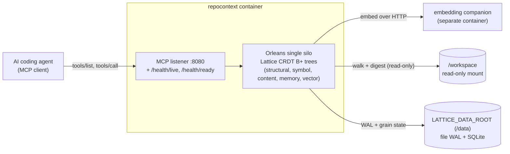

# Container quickstart

The module ships as a single, restart-durable container image - "codebase memory in a box". The container's only application listener is the MCP endpoint (plus HTTP health probes); no gRPC facade and no Explorer UI are exposed. All durable state lives on a host mount, so context survives a restart, a recreate, and an image upgrade.

The runnable sample is [`samples/RepoContextContainer`](../../samples/RepoContextContainer/README.md); this page summarises how it is wired.

## Topology

The container exposes a single application listener (the MCP endpoint, plus HTTP health probes) and reads the code it indexes from a read-only workspace mount, so it can never mutate that code. The `local` profile keeps both the WAL and the relational store under `LATTICE_DATA_ROOT`; the `postgres` and `azure` profiles move the relational store (and, for `azure`, the WAL) to an external service, leaving the same listener and workspace wiring unchanged. The embedding companion is optional: with no `LATTICE_EMBEDDING_ENDPOINT` set, search runs on the keyword path.

## The durability loop

The end-to-end guarantee the sample demonstrates:

**start -> add a repo under the mounted workspace -> recall -> restart -> context is still present.**

State is replayed from the WAL and the relational store on the mounted volume after a restart, so an agent's onboarded structural model and its remembered notes are all still there.

## Durability profiles

The host selects a durability profile from the `LATTICE_DURABILITY` environment variable:

| Profile | Grain storage + reminders | WAL | Use |
|---|---|---|---|
| `local` (default) | Single SQLite file under the data root | File-backed WAL under the data root | Zero external services - a laptop or a single box. |
| `postgres` | PostgreSQL | File-backed WAL | A durable relational store you already run. |
| `azure` | Azure Table Storage | Azure Table WAL | A cloud deployment; also enables the scaling signal endpoint. |

Every profile applies finite per-tree tombstone compaction to the churn trees (structural, symbol, content, memory, and the vector membership and metadata projection trees), so re-write, re-embed, and forget tombstones are reaped rather than accumulating. The write-once, content-addressed vector-payload tree is excluded because it never deletes in place.

## Data root and fail-fast

All durable local state - the file WAL directory and, in the `local` profile, the SQLite database - lives under `LATTICE_DATA_ROOT` (default `/data`), which must be a bind mount or named volume. The host fails fast at startup if that path is missing or not writable by its non-root UID, so a misconfigured mount surfaces immediately instead of silently losing durability.

## Configuration

The host is configured entirely by environment variables. The common ones:

| Variable | Default | Purpose |
|---|---|---|
| `LATTICE_DURABILITY` | `local` | The durability profile (`local`, `postgres`, `azure`). |
| `LATTICE_DATA_ROOT` | `/data` | Root for all durable local state; must be a writable host mount. |
| `LATTICE_MCP_PORT` | `8080` | The MCP listener port (the only application listener). |
| `LATTICE_WORKSPACE_ROOT` | `/workspace` | The read-only root that runtime-registered repositories must resolve under; a path escaping it is refused. |
| `LATTICE_EMBEDDING_ENDPOINT` | (unset) | The separate embedding companion's base address; enables semantic search. |
| `LATTICE_WAL_DIR` / `LATTICE_SQLITE_PATH` | under the data root | Override the WAL directory or SQLite file path individually. |
| `LATTICE_POSTGRES_CONNECTION_STRING` / `LATTICE_AZURE_STORAGE_CONNECTION_STRING` | (unset) | Required by the `postgres` / `azure` profiles. |

The background reconcile cadence (see [Background reconcile and change detection](#background-reconcile-and-change-detection)) is tuned by four further variables. Their defaults reproduce the original in-process behaviour (a full walk on every reconcile), so pruning only engages when the reconcile interval is set shorter than the full-walk interval, as the container sample does:

| Variable | Default | Purpose |
|---|---|---|
| `LATTICE_SELFINDEX_TICK_SECONDS` | `15` | How often each repository's self-index grain ticks; the reconcile cannot fire more often than this. |
| `LATTICE_RECONCILE_INTERVAL_SECONDS` | `900` | Base interval between periodic content reconciles. A small value (with zero jitter) makes the reconcile effectively continuous, bounded by the tick. |
| `LATTICE_RECONCILE_JITTER_SECONDS` | `300` | Maximum extra random interval added on top of the reconcile interval to desync repositories. |
| `LATTICE_FULL_WALK_INTERVAL_SECONDS` | `300` | How often a reconcile is forced to ignore the directory-modification-time prune cache and stat every file, bounding how stale an in-place content edit can be. |

## Registering repositories at runtime

The container mounts a broad parent directory read-only at `LATTICE_WORKSPACE_ROOT` (default `/workspace`) and lets the MCP client decide which repositories under it to index - no repository path is baked into the container's configuration. The client drives this with these tools:

- `repocontext_add_repo` - registers a repository under the workspace and starts ingesting it (walk, digest, reconcile). This is the workspace-mode onboarding tool; it supersedes `repocontext_bootstrap`, which is not exposed in the container. Supply `path` (for example `/workspace/my-repo`); omit `repoId` to derive it from the final path segment. By default it honours the repository's `.gitignore` files (pass `respectGitignore=false` to index untracked files too) and drops files that look binary (pass `excludeBinary=false` to ingest blobs too); `includeGlobs` and `excludeGlobs` narrow the walk further. Ingestion runs asynchronously off the request thread and returns a `Running` snapshot at once, so poll `repocontext_index_status` for the same `repoId` to follow it to completion; a dropped client stream never aborts the run, and an interrupted one resumes after a restart. Re-adding the same repository is idempotent - only changed files are updated and deleted ones pruned.
- `repocontext_index_status` - reports a repository's indexing progress (lifecycle status, current phase, file and chunk counters, attempt count, timing, and any failure reason), so an agent can watch an `add_repo` pass complete or diagnose a failure. A repository that was never onboarded reports `status=None`.
- `repocontext_list_repos` - lists every registered repository with its last-ingested marker, recorded file count, and `embeddedVectorCount` (the durable count of sources whose embedding has landed, read from the store of record so it survives a restart; sources include files and captured symbols, so the count can exceed the file count once symbols are embedded), so an agent can discover what is queryable and how far semantic coverage has progressed before recalling, scanning, or searching.
- `repocontext_remove_repo` - forgets every record for a repository (structural nodes, symbols, content projection, memory, and vectors). The working tree on disk is never touched.

Every path passed to `repocontext_add_repo` is resolved to its real on-disk location - defeating both `..` traversal and symlink escape - and must sit inside `LATTICE_WORKSPACE_ROOT`; a path outside it is refused. Mounting the workspace read-only means the container can never mutate the code it indexes.

## Background reconcile and change detection

Once a repository is onboarded, its self-index grain keeps it converged without any client call. On each tick it re-drives an idempotent reconcile that walks the tree, diffs it against the stored structural records, and applies exactly the delta - so files added, edited, and deleted on disk are picked up automatically. The reconcile is single-flight and each tick is a fresh grain turn, so re-driving on completion polls for the previous run rather than recursing; a short `LATTICE_RECONCILE_INTERVAL_SECONDS` therefore makes it near-continuous, bounded only by the tick.

To keep that cheap on a large tree, the background reconcile uses **directory-modification-time pruning**: a directory whose modification time is unchanged since the previous walk carries its known files forward without re-stating them, while every subdirectory is still descended so a nested structural change is never missed. Adding, renaming, or deleting a file bumps its directory's modification time, so those changes defeat pruning and are caught on the next reconcile. An in-place content edit that leaves the directory's modification time untouched is invisible to pruning, so it is caught by the periodic full sweep instead: every `LATTICE_FULL_WALK_INTERVAL_SECONDS` a reconcile ignores the prune cache and stats every file. That interval is therefore the worst-case detection latency for a pure content edit. The first walk after a process start is always a full one, so a restart re-establishes an exact baseline.

Pruning is applied only to this background reconcile. An explicit `repocontext_add_repo` onboarding (or re-onboarding) always runs a full, exact walk, so an agent that re-adds a repository observes the current on-disk state immediately rather than within the full-walk bound.

## Health probing

The runtime image is distroless and shell-less, so probing is HTTP-only - there is no shell-exec healthcheck:

- `GET /health/live` - process and silo host alive (liveness).
- `GET /health/ready` - silo joined, activation-time WAL replay done, durable stores reachable, MCP serving (readiness). Not-ready during startup replay and during drain.

## Graceful shutdown

On `SIGTERM` (a `docker stop` or `restart`) the host flips readiness to not-ready first, then drains: the silo deactivates and the WAL commit-log flushes buffered records before exit, within a generous shutdown budget, so an in-flight write is durable after restart.
