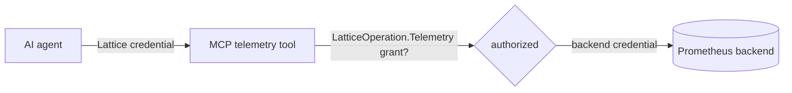

# Security

The telemetry add-on sits on a **dual-credential trust boundary**: who may ask a telemetry question (MCP-side authorization) and how the proxy authenticates to the metrics backend (the backend credential) are two independent halves. Neither leaks into the other.

## The two halves



1. **MCP-side authorization.** A caller sees and can invoke the `lattice_telemetry_*` tools only if its effective authorization includes a cluster-wide `LatticeOperation.Telemetry` grant. This runs through the same permission-scoped discovery the rest of the MCP surface uses - an ungranted caller never sees the group.
2. **Backend credential.** The proxy stamps the configured *backend* credential (bearer, basic, or mutual-TLS) on every backend request. This credential is supplied by the host in `LatticeApiMcpTelemetryOptions.Credential` and is entirely separate from any caller identity.

**The caller's Lattice credential is never forwarded to the backend.** The backend client's only collaborators are an `HttpClient` and the telemetry options; it holds no reference to any Lattice credential source, so there is no path by which the caller's identity could reach the backend. Conversely, the backend credential is never exposed to the caller.

## The `Telemetry` capability

`LatticeOperation.Telemetry` is a **cluster-wide** capability, deliberately distinct from the data-plane operations:

- It is **not** part of the data-plane aggregate and is conferred by **no** other operation, including `Admin`. A caller must be granted `Telemetry` explicitly.
- It is granted over the **all-trees sentinel scope**, `LatticeScope.ClusterWide()`, because telemetry is a cluster-wide concern rather than a per-tree one. The grant is an ordinary Allow rule that the existing policy pipeline compiles and evaluates with no special-casing.

```csharp verify
using Orleans.Lattice.Auth;

// Grant an automation agent read access to cluster telemetry, and nothing else.
var rule = new LatticeAuthorizationRule(
    "agent-telemetry",
    LatticeSubjectSelector.User("agent"),
    LatticeScope.ClusterWide(),
    LatticeOperation.Telemetry,
    LatticeEffect.Allow);
```

Because the capability is a distinct bit, a Telemetry grant never widens a caller's data-plane reach, and a data-plane grant never confers telemetry access.

## Metric-access allow-list

Beyond the yes/no capability, the host can restrict *which* metrics a granted caller may read. `LatticeApiMcpTelemetryOptions.MetricAccess` selects the posture:

- **`ReadAll`** (default) - any metric the backend exposes is readable.
- **`DenyAllExceptAllowed`** - only the exact names and `*`-wildcard patterns in `AllowedMetrics` are readable; everything else is denied.

The allow-list is enforced consistently across all four tools:

- `lattice_telemetry_query` and `lattice_telemetry_query_range` extract the metric names referenced by the PromQL expression and reject the call if **any** referenced name is not admitted - before the backend is called.
- `lattice_telemetry_list_metrics` filters the returned names to the admitted set.
- `lattice_telemetry_metric_metadata` rejects a non-admitted named metric and, for an unnamed call, returns only admitted metrics.

The PromQL metric-name extraction is **conservative**: it scans for identifiers in metric-name position and skips function and aggregation calls, PromQL keywords and operators, grouping-modifier label lists, `{...}` label matchers, quoted strings, and numeric or duration literals. It is an allow-list gate, not a full PromQL parser: a selector that references a metric only through a `__name__` label value (for example `{__name__="up"}`) yields no extracted name, and is therefore not matched against the allow-list - so prefer naming metrics directly in the expression when running under `DenyAllExceptAllowed`.

## Range guardrails

A range query is bounded so a single call cannot ask the backend for an unbounded scan: `end - start` may not exceed `MaxRange` (default 24h) and `step` may not exceed `MaxStep` (default 1h). An over-budget request is rejected with a clean `Success = false` result and never reaches the backend.

## Fail-clean surfacing

Every fault path returns a structured result rather than throwing: a backend timeout, HTTP failure, non-success backend status, malformed payload, guardrail rejection, or metric-access denial arrives as `Success = false` with a human-readable `Error`. Only a genuine caller cancellation propagates as a cancellation. An agent therefore never sees a raw transport exception, and a denied metric is reported as a clear, actionable message.

## Next

- [Tools](tools.md) - the four telemetry tools and their results.
- [Setup](setup.md) - configuring the backend credential and the metric-access allow-list.
- [MCP security](../lattice.api.mcp/security.md) - the fail-closed discovery model this capability plugs into.
