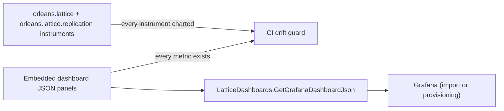

# Dashboards Architecture

This document describes how the dashboards package is built and kept honest. It covers behaviour and packaging, not the names of internal types - the only public surface is described in [the API reference](api.md).

## Embedded JSON resources

Each dashboard is authored once as a Grafana dashboard model and compiled into the assembly as an embedded resource. The public accessor maps a `LatticeDashboardKind` to the matching resource and returns its bytes as a UTF-8 string. Because the JSON travels inside the assembly:

- Retrieval is a synchronous in-process read - no network call, no file-system dependency, and no external service to provision before a dashboard can be fetched.
- The dashboards are version-pinned to the library. A given package version always returns dashboards whose panels reference exactly the instruments that version emits.

The panels reference instruments by their metric name (for example `lattice.leaf.write.duration`), not by any internal handle, so a dashboard is portable across any backend that scrapes the OpenTelemetry meters.

## The bidirectional drift guard

The risk with bundled dashboards is silent drift: a renamed instrument leaves a panel charting nothing, or a newly added instrument ships with no panel. A CI test closes both directions:

1. **Every referenced metric exists.** Each metric name a panel queries must resolve to a live instrument on the `orleans.lattice` or `orleans.lattice.replication` meter. A renamed or removed instrument fails the build.
2. **Every instrument is charted.** Each live instrument on those meters must be referenced by at least one panel. A new instrument with no panel fails the build.

The authoritative human-readable view of this pairing is the [metric-to-panel map](metrics-to-panel-map.md); the test is the enforcement. Together they guarantee the bundled dashboards never reference a stale metric and never silently omit a new one.

## No replication link dependency

The package depends on the core library only. The `Replication` dashboard's panels query instruments on the `orleans.lattice.replication` meter, but those names are embedded as plain strings in the JSON - the package does not reference the replication assembly. This keeps the dashboards installable in local-only deployments without dragging in the replication package; the replication meter simply produces no data unless that package is separately registered on the silo.

## Provisioning templates

Alongside the embedded JSON, the package carries a `Provisioning/` folder with a baseline Grafana data-source template and a file-provider dashboards template. These are static YAML assets meant to be copied and adjusted, not code - they let an operator stand up file-system provisioning without hand-writing the boilerplate. See [Configuration](configuration.md) for how they fit together.

## Coverage at a glance

## See also

- [API Reference](api.md) - the public accessor and kinds.
- [Configuration](configuration.md) - meter registration and provisioning templates.
- [Metric-to-panel map](metrics-to-panel-map.md) - the enforced per-instrument coverage table.
