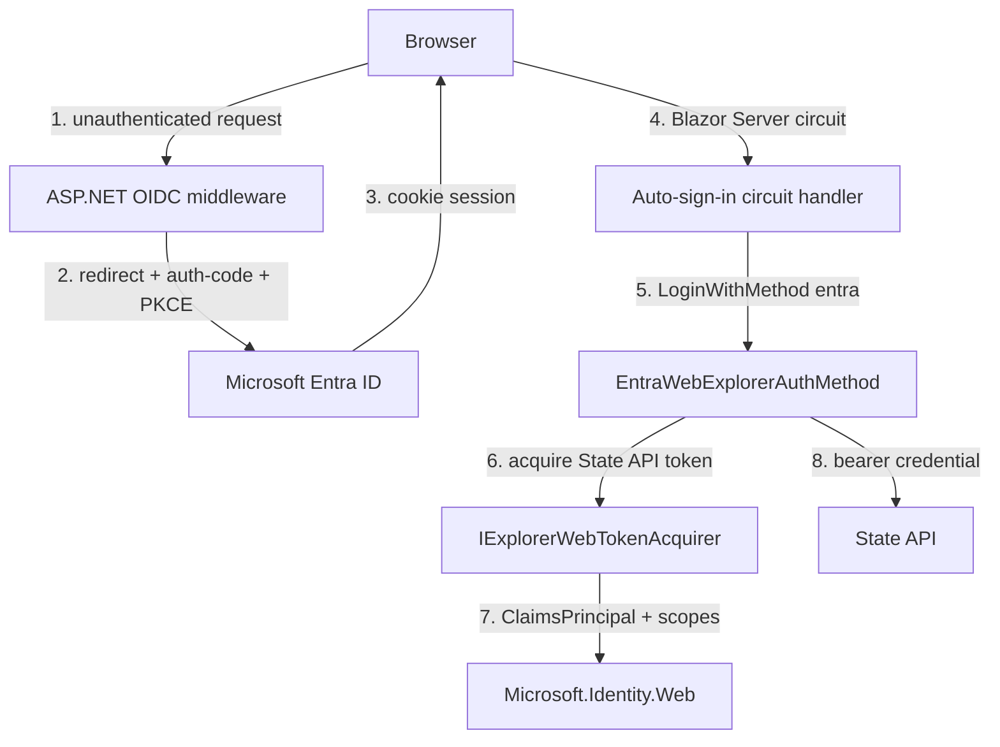

# Orleans.Lattice.Explorer.Entra.Web architecture

The package bridges two authentication worlds: the browser's OpenID Connect session with Entra, and the Explorer's own `IExplorerAuthMethod` seam that produces a State API bearer credential. It does so without any public API change to the released Explorer packages.

## The two layers

1. **Browser session (middleware layer).** `AddLatticeExplorerEntraWebAuth` wires `AddMicrosoftIdentityWebApp` - the standard auth-code + PKCE OpenID Connect flow with a cookie session. When `RequireAuthenticatedUser` is set (the default), a fallback authorization policy challenges any unauthenticated request into the Entra redirect. This all happens in ASP.NET middleware, *outside* the SignalR circuit.
2. **State API credential (circuit layer).** Once the browser has a cookie session, the Explorer still needs a bearer token for the cluster's State API. `EntraWebExplorerAuthMethod` handles the `entra` scheme the core Explorer already advertises a button for, and delegates token acquisition to `IExplorerWebTokenAcquirer`.

Because the core `LoginDialog` already renders a generic "Sign in with Entra ID" button for the `entra` scheme, no released Explorer type changes. This package only *adds* the provider behind that scheme for the hosted-web host.

## Token acquisition without an HttpContext

A remote Blazor Server circuit runs over SignalR and has **no ambient `HttpContext`**, so Microsoft.Identity.Web cannot infer the user. The internal Microsoft.Identity.Web-backed token acquirer therefore:

- reads the current `ClaimsPrincipal` from the scoped `AuthenticationStateProvider`;
- throws `ExplorerWebReauthRequiredException` immediately if the browser session is not authenticated;
- calls `ITokenAcquisition.GetAuthenticationResultForUserAsync(scopes, user: principal, ...)`, passing the principal **explicitly**;
- translates `MsalUiRequiredException` and `MicrosoftIdentityWebChallengeUserException` into `ExplorerWebReauthRequiredException`.

The acquirer and the auth method are registered **scoped**, so each circuit acquires and holds only its own user's token - no cross-user credential bleed.

For the scoped `AuthenticationStateProvider` to report the signed-in browser user (rather than an anonymous principal) inside the circuit, the Blazor Server host must register the cascading authentication state. `AddLatticeExplorerEntraWebAuth` calls `AddCascadingAuthenticationState()` on your behalf, so the circuit sees the OIDC identity without any extra host wiring. Without it the circuit would authenticate the browser at the HTTP layer yet still observe an anonymous circuit, and every downstream State API call would be made anonymously.

## Scope resolution

`EntraWebExplorerAuthMethod` resolves the State API scope in priority order: the configured `Scopes` if any, otherwise the audience the State API advertises in its auth-scheme descriptor, appending `/.default` when that advertised value is a bare resource id. This lets a deployment omit `Scopes` and let the cluster declare its own resource.

## Renewal and revocation

The method wires the core `ExplorerAccessTokenSource` with a renewal delegate that re-invokes the acquirer. When acquisition raises `ExplorerWebReauthRequiredException`, the delegate returns null, which latches the credential as **revoked** rather than serving a stale token - the user is sent back to an interactive sign-in. This is the fail-closed path: an expired or challenged session never silently continues.

## Auto-sign-in circuit handler

When `AutoSignIn` is enabled (the default), an internal best-effort Blazor Server circuit handler runs on `OnConnectionUpAsync`:

1. If the session is already authenticated, do nothing.
2. If the browser principal is anonymous, log a warning and return - the circuit is unauthenticated even though the page rendered, which is the signal that the cascading authentication state is missing or the cookie session did not flow into the circuit.
3. Otherwise initialize the session, discover the endpoint's advertised schemes, and - only if `entra` is advertised - drive `LoginWithMethodAsync("entra")`, logging an informational line on success.

Every step is wrapped in a `try`/`catch` that logs a warning (with the exception) and swallows the failure, so a discovery or token error **never breaks the page**; the user simply falls back to clicking the interactive sign-in dialog. The handler is best-effort convenience, not a correctness dependency - but its log lines make an otherwise silent auto-sign-in failure visible to operators.

## Token cache and multi-replica hosting

Microsoft.Identity.Web caches acquired tokens. `TokenCache = InMemory` (the default) is per-process and correct for a single replica. On a multi-replica host, select `TokenCache = Distributed` and register a shared `IDistributedCache` - for example [`Orleans.Lattice.Caching.AzureBlob`](../lattice.caching.azureblob/README.md) - so a user whose circuit lands on a cold replica does not silently re-authenticate. Data Protection keys (which protect the auth cookie) should likewise be shared across replicas via the official Azure Blob Data Protection key ring; that is host wiring, not part of this package.

## See also

- [`Orleans.Lattice.Explorer`](../lattice.explorer/README.md) - the core Explorer and the `IExplorerAuthMethod` / `ExplorerAccessTokenSource` seam.
- [`Orleans.Lattice.Caching.AzureBlob`](../lattice.caching.azureblob/architecture.md) - the durable `IDistributedCache` recommended for the distributed token cache.
