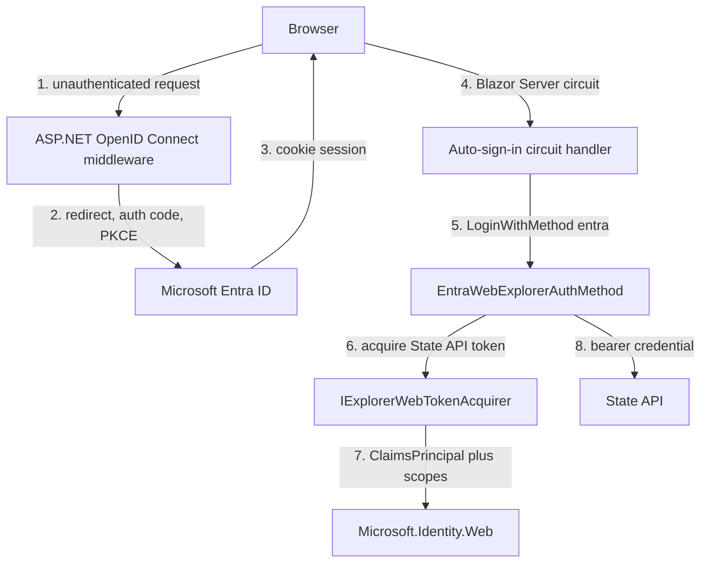

# Orleans.Lattice.Explorer.Entra.Web architecture

The package bridges two authentication layers: the browser's OpenID Connect
session with Entra, and the Explorer auth method that produces a bearer
credential for the State API.

## The two layers

```mermaid
flowchart TD
    Browser[Browser] -->|1. unauthenticated request| Middleware[ASP.NET OpenID Connect middleware]
    Middleware -->|2. redirect, auth code, PKCE| Entra[Microsoft Entra ID]
    Entra -->|3. cookie session| Browser
    Browser -->|4. Blazor Server circuit| Circuit[Auto-sign-in circuit handler]
    Circuit -->|5. LoginWithMethod entra| Method[EntraWebExplorerAuthMethod]
    Method -->|6. acquire State API token| Acquirer[IExplorerWebTokenAcquirer]
    Acquirer -->|7. ClaimsPrincipal plus scopes| IdentityWeb[Microsoft.Identity.Web]
    Method -->|8. bearer credential| StateApi[State API]
```

1. **Browser session.** `AddLatticeExplorerEntraWebAuth` calls
   `AddMicrosoftIdentityWebApp`, using the standard authorization-code + PKCE
   OpenID Connect flow with a cookie session. When `RequireAuthenticatedUser` is
   true, a fallback authorization policy challenges unauthenticated requests.
2. **State API credential.** Once the browser has a cookie session, the Explorer
   still needs a State API bearer token. `EntraWebExplorerAuthMethod` handles the
   `entra` scheme and delegates token acquisition to `IExplorerWebTokenAcquirer`.

The session chrome offers the `entra` sign-in method when the endpoint advertises
it. The OIDC redirect is driven by ASP.NET Core middleware, outside the SignalR
circuit.

## Token acquisition without an ambient `HttpContext`

A remote Blazor Server circuit runs over SignalR and has no ambient
`HttpContext`. The Microsoft.Identity.Web-backed acquirer therefore:

- reads the circuit user from the scoped `AuthenticationStateProvider`;
- throws `ExplorerWebReauthRequiredException` if the circuit is anonymous;
- calls `ITokenAcquisition.GetAuthenticationResultForUserAsync` with the
  `ClaimsPrincipal` passed explicitly;
- translates `MsalUiRequiredException` and
  `MicrosoftIdentityWebChallengeUserException` into
  `ExplorerWebReauthRequiredException`.

The registration calls `AddCascadingAuthenticationState()` so the circuit sees
the OpenID Connect identity captured during the HTTP render. Without that, the
page could be authenticated at the HTTP layer while the circuit sees an
anonymous user and all downstream State API calls remain anonymous.

## Scope resolution

`EntraWebExplorerAuthMethod` resolves downstream scopes in priority order:

1. `ExplorerEntraWebOptions.Scopes`, when non-empty.
2. The audience advertised by the State API, appending `/.default` when the
   advertised value is a bare resource id.

If neither source provides a scope, sign-in fails with an actionable exception.

## Renewal and revocation

The auth method wraps the acquired token in `ExplorerAccessTokenSource`. Renewal
runs through the token acquirer again. When acquisition raises
`ExplorerWebReauthRequiredException`, the renewal delegate returns `null`; the
source latches into its revoked state and the session chrome shows the `Your
session expired` interstitial.

The initial token acquisition of a new sign-in is outside that latch path, so its
failure surfaces directly to the sign-in flow.

## Auto-sign-in circuit handler

When `AutoSignIn` is true, a scoped circuit handler runs when a Blazor Server
circuit connects:

1. If the Explorer auth session is already authenticated, it does nothing.
2. If the browser principal is anonymous, it logs a warning and returns.
3. Otherwise it initialises the Explorer session, initialises the auth session,
   discovers the endpoint's advertised schemes, and calls `LoginWithMethodAsync`
   for `entra` only when that scheme is advertised.

Any exception is logged as a warning and swallowed. Auto-sign-in is a convenience,
not a correctness boundary; the user can still sign in through the dialog.

## Token cache and multi-replica hosting

Microsoft.Identity.Web caches acquired tokens. `ExplorerWebTokenCacheKind.InMemory`
is per process and correct for a single replica. On a multi-replica host, a user
routed to a cold replica has a valid cookie but no token in that replica's cache,
so token acquisition requires interaction.

Set `TokenCache` to `Distributed` and register a shared `IDistributedCache` so
any replica can find the token. Share the ASP.NET Data Protection key ring as
well so every replica can decrypt the browser session cookie. See
[multi-replica and failover hosting](../lattice.explorer/multi-replica-hosting.md).

## Federated sign-out and CSP

When `SignOutPath` is set, the provider publishes `ExplorerSignOutOptions` so the
identity menu posts to the federated sign-out endpoint. The endpoint validates
antiforgery, clears the local State API credential, clears the OpenID Connect
cookie and signs out of Entra.

The provider also adds the configured Entra authority origin to the Explorer web
head's `form-action` CSP sources when the authority parses as an HTTP or HTTPS
origin. This allows the local sign-out `POST` to redirect to Entra's end-session
endpoint without loosening other CSP directives.

## See also

- [API reference](api.md)
- [Configuration](configuration.md)
- [Hosted-web Entra overview](README.md)
- [`Orleans.Lattice.Caching.AzureBlob`](../lattice.caching.azureblob/architecture.md)
