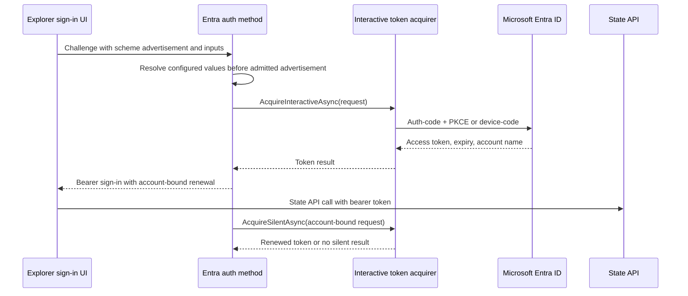

# Orleans.Lattice.Explorer.Entra architecture

The interactive Entra provider implements the Explorer's auth-method seam for
hosts that can launch an interactive browser or device-code flow. It is
separate from the hosted-web provider: a remote Blazor Server circuit cannot
start an interactive browser flow on the operator's machine, so web hosts use
[`Orleans.Lattice.Explorer.Entra.Web`](../lattice.explorer.entra.web/README.md).

## Sign-in and renewal

`AddExplorerEntraAuth` adds a scoped `IEntraInteractiveTokenAcquirer` and a
scoped `IExplorerAuthMethod`; hosts also register Core authentication with
`AddExplorerAuth`. The method resolves static `ExplorerEntraOptions` first.
Only unset values may be filled from the endpoint's advertised auth scheme.
Advertised authority and audience values are validated before they are used,
so an endpoint cannot silently redirect sign-in to an unapproved identity host
or choose an unrelated token resource.

The initial acquisition uses either MSAL's interactive auth-code + PKCE flow
or device-code flow. The returned token is wrapped in the Core bearer-token
source. Renewal is proactive and concurrent refreshes are coalesced; the method
captures the initial account name in the renewal request, preventing a cached
token for another account from being attached to this connection. If silent
acquisition returns no result, the credential source becomes revoked and the
Explorer presents its re-authentication interstitial.

## Scope and token storage

The production acquirer is registered scoped, and its MSAL public-client cache
lives only in that provider instance. Access tokens and refresh material are not
written to the Explorer JSON configuration. `DeviceCodeCallback` lets a host
surface the prompt outside standard output; with no callback, the production
acquirer writes the prompt to standard output.

## See also

- [API reference](api.md)
- [Configuration](configuration.md)
- [Explorer auth integration](../lattice.explorer/connecting-to-an-auth-enabled-state-api.md)
- [Hosted-web Entra provider](../lattice.explorer.entra.web/README.md)
