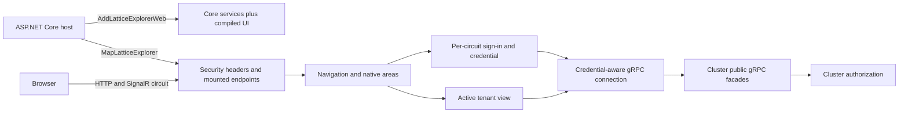

# Orleans.Lattice.Explorer architecture

The Explorer is a Blazor Server administration head, not an Orleans silo
participant. A host references `Orleans.Lattice.Explorer.Web`; that package
composes the Core connection/authentication services, the Razor UI and the
shared AppKit assets. The browser communicates with the head over its Blazor
Server circuit, while the head calls the configured cluster through the Lattice
public gRPC facades.

## Host and connection pipeline

`AddLatticeExplorerWeb` registers the interactive-server components, state API
connection, configuration store and optional first-run environment bootstrap,
protected browser preference store, authentication and credential storage,
tenant view, app-frame host and native areas. `MapLatticeExplorer` installs
security response headers and maps static assets, authentication form posts,
the app-frame bootstrap route and Razor endpoints. A non-root `BasePath` is
implemented by an isolated branch so component routes remain root-relative and
the Explorer does not claim host routes outside its mount.

A circuit owns its sign-in, connection and UI state. A sign-in is bound to the
endpoint for which it was created; the transport asks the auth session for a
credential for that endpoint, and an endpoint change does not carry the prior
credential forward. The active tenant is sampled at the start of each outgoing
call and asserted through the tenant header when the tenant view requires it.
The cluster validates both the caller's credential and tenant standing. Explorer
availability and button visibility are presentation decisions, never substitutes
for cluster-side authorization.

The host may configure `LatticeExplorerWebOptions` at registration time. The
complete defaults, constraints and environment/bootstrap behavior are in
[Configuration](configuration.md); the supported public method signatures are
in the [API reference](api.md#web-host-entry-points).

## Navigation and native areas

The UI builds navigation from nine compiled-in areas: Data, Apps, Access,
Schema, Tenancy, Replication, Backups, Telemetry and Cluster. On navigation, each
area probes only the facade and capability it needs. An area that cannot prove
it is available is hidden or, where the user can act to resolve the condition,
shown as unavailable. The spine and route guard use the same decision. Probes
are time-boxed and refreshed when the sign-in, endpoint or connection settings
change. Individual operations still go to the cluster, which makes the final
authorization decision.

There is no public area-registration or component plug-in seam. The supported
third-party UI path is an installed Lattice App, not a host-registered area.

## App frame boundary

An app UI runs in a separate browser window or tab inside an opaque-origin
sandboxed iframe. The head obtains and validates the installed bundle using the
caller-bound app workspace, verifies its asset digests, and transfers it to the
frame over a message port. The AppKit bootstrap loads the bundle under a policy
that denies network connections. App code requests narrowly named operations;
the head brokers each request through cluster-facing app APIs and the cluster
checks consented grants, app-role standing and the caller's own authorization.
The frame receives no cluster credential and cannot call a facade directly.

`Orleans.Lattice.Explorer.AppKit.AppKitProtocol` is the public shared protocol
contract for the frame and host. Its protocol-v1 messages, operations, error
codes and bounds are listed in the [API reference](api.md#appkit-protocol-v1).

## Authentication providers

Core provides Basic sign-in and the `IExplorerAuthMethod` extension seam. The
optional `Orleans.Lattice.Explorer.Entra` package performs interactive MSAL
sign-in for non-web hosts. The optional `Orleans.Lattice.Explorer.Entra.Web`
package uses the browser's OpenID Connect session and acquires a downstream
State API bearer token. Their separate docs describe the provider-specific
configuration and token lifecycle.

For multiple replicas, live Blazor circuits still require affinity to one
replica. A shared Data Protection key ring and, for hosted-web Entra, a shared
token cache let a *new* circuit recover sign-in after failover; they do not move
a live circuit. See [Multi-replica and failover hosting](multi-replica-hosting.md).

## See also

- [API reference](api.md)
- [Configuration](configuration.md)
- [Area availability](area-availability.md)
- [Navigation model](navigation-model.md)
- [Lattice Apps in the Explorer](lattice-apps.md)
- [Multi-replica and failover hosting](multi-replica-hosting.md)
