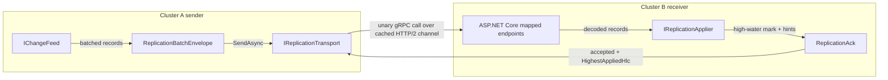

# Architecture

`Orleans.Lattice.Replication.Grpc` binds the replication package's public transport seams to ASP.NET Core gRPC. It does not change how mutations are captured, encoded, applied, deduplicated, or merged; those behaviours belong to [Orleans.Lattice.Replication](../lattice.replication/README.md). This document describes the transport topology in behavioural terms.

## Transport pipeline

A sender reads local WAL entries through `IChangeFeed`, packages them as a `ReplicationBatchEnvelope`, sends them through `IReplicationTransport`, and waits for a `ReplicationAck`. The receiver endpoint decodes the same envelope and drives `IReplicationApplier`.

The gRPC call boundary carries the public `ReplicationBatchEnvelope` bytes described in [Wire Format](../lattice.replication/wire-format.md). The receiver ack is the public `ReplicationAck` used by the shipper to advance progress and react to receiver flow-control hints.

## Sender behaviour

1. **Peer resolution.** The target cluster id is looked up in `LatticeReplicationGrpcOptions.Peers`. Missing peers fail the send.
2. **Channel construction.** The first send to a peer creates a long-lived `GrpcChannel`. HTTPS is required unless `AllowPlaintextEndpoints` is enabled.
3. **Channel customization.** `ConfigureChannel` runs during channel construction so the host can attach handlers, credentials, retry policy, keep-alive, and message-size settings.
4. **Unary batch push.** Each batch is sent as one unary call. HTTP/2 multiplexing lets concurrent calls share the peer channel.
5. **Ack handling.** The sender uses `ReplicationAck.HighestAppliedHlc` as the only durable progress point for that peer and tree.

The transport is safe for concurrent sends to different peer and tree pairs. Ordering, batching, cursor persistence, retry cadence, and adaptive throttling are owned by the replication shipper; see [Replication Drivers](../lattice.replication/replication-drivers.md) and [Receiver Flow Control](../lattice.replication/receiver-flow-control.md).

## Receiver behaviour

1. **Endpoint mapping.** `MapLatticeReplicationGrpc` maps the receiver routes on an ASP.NET Core endpoint route builder.
2. **Decode.** The inbound body is decoded with the replication batch encoder, preserving the same envelope shape used by other transports.
3. **Apply.** The decoded records are passed to `IReplicationApplier`, which handles high-water-mark dedup, causal buffering, dead-letter quarantine, and CRDT merge dispatch.
4. **Acknowledge.** The receiver returns `ReplicationAck` with accepted state, the highest applied HLC, and optional flow-control or compatibility hints.

Receiver idempotency is essential: a retry may redeliver a batch after the receiver applied it but before the sender observed the ack. The apply path turns repeated `(origin, hlc)` records into no-ops.

## Shared endpoint topology

The gRPC package also carries remote snapshot bootstrap and read-only anti-entropy probe traffic over the same peer endpoint map. Those protocols are documented by the replication package:

- [Snapshot Bootstrap](../lattice.replication/snapshot-bootstrap.md) - point-in-time seeding before live incremental shipping.
- [Automatic drift remediation](../lattice.replication/automatic-drift-remediation.md) - opt-in anti-entropy orchestration.
- [Transport Security](../lattice.replication/transport-security.md) - shared-secret auth and HTTPS posture for every replication call.

## Invariants preserved

1. **Payload semantics stay in replication.** The transport moves envelopes and acks; it does not decide merge order, conflict resolution, or dead-letter policy.
2. **Origin metadata is preserved.** Outbound calls stamp the local origin header from `LocalClusterId` or `LatticeReplicationOptions.ClusterId`; records still carry their source origin inside the envelope.
3. **Progress is receiver-owned.** The sender advances only to the high-water mark in the ack returned by the receiver.
4. **Peer endpoints are explicit.** A batch never falls back to discovery or broadcast when a peer id is missing from `Peers`.
5. **Security fails closed by default.** Non-HTTPS peer endpoints are rejected unless `AllowPlaintextEndpoints` opts in.

The chaos suite summarized in [Chaos Tests](chaos-tests.md) validates the retry and idempotency side of these invariants under channel faults.
