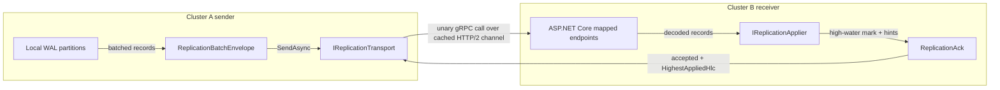

# Architecture

`Orleans.Lattice.Replication.Grpc` binds the replication package's public transport seams to ASP.NET Core gRPC. It does not change how mutations are captured, encoded, applied, deduplicated, or merged; those behaviours belong to [Orleans.Lattice.Replication](../lattice.replication/README.md). This document describes the transport topology in behavioural terms.

## Transport pipeline

A sender - the replication shipper - tails the local WAL partitions directly, packages the entries as a `ReplicationBatchEnvelope`, sends them through `IReplicationTransport`, and waits for a `ReplicationAck`. The receiver endpoint decodes the same envelope and drives `IReplicationApplier`.

```mermaid
flowchart LR
    subgraph "Cluster A sender"
        Feed[Local WAL partitions]
        Batch[ReplicationBatchEnvelope]
        Transport[IReplicationTransport]
        Feed -->|batched records| Batch
        Batch -->|SendAsync| Transport
    end

    subgraph "Cluster B receiver"
        Endpoint[ASP.NET Core mapped endpoints]
        Applier[IReplicationApplier]
        Ack[ReplicationAck]
        Endpoint -->|decoded records| Applier
        Applier -->|high-water mark + hints| Ack
    end

    Transport -->|unary gRPC call over cached HTTP/2 channel| Endpoint
    Ack -->|accepted + HighestAppliedHlc| Transport
```

The gRPC call boundary carries the public `ReplicationBatchEnvelope` bytes described in [Wire Format](../lattice.replication/wire-format.md). The receiver ack is the public `ReplicationAck` used by the shipper to advance progress and react to receiver flow-control hints.

## Sender behaviour

1. **Peer resolution.** The target cluster id is looked up in `LatticeReplicationGrpcOptions.Peers`. Missing peers fail the send.
2. **Channel construction.** The first send to a peer creates a long-lived `GrpcChannel`. HTTPS is required unless `AllowPlaintextEndpoints` is enabled.
3. **Channel customization.** `ConfigureChannel` runs during channel construction so the host can attach handlers, credentials, retry policy, keep-alive, and message-size settings.
4. **Unary batch push.** Each batch is sent as one unary call. HTTP/2 multiplexing lets concurrent calls share the peer channel.
5. **Ack handling.** On an accepted ack the sender advances its durable per-peer cursor to `ReplicationAck.HighestAppliedHlc`; when that frontier is at or below the current cursor (for example every entry was deduplicated), it advances to the last shipped entry's HLC instead so the same batch is not re-shipped. A rejected ack (`Accepted = false`) leaves the cursor in place and retries after a backoff.

The transport is safe for concurrent sends to different peer and tree pairs. Ordering, batching, cursor persistence, retry cadence, and adaptive throttling are owned by the replication shipper; see [Replication Drivers](../lattice.replication/replication-drivers.md) and [Receiver Flow Control](../lattice.replication/receiver-flow-control.md).

## Receiver behaviour

1. **Endpoint mapping.** `MapLatticeReplicationGrpc` maps the receiver routes on an ASP.NET Core endpoint route builder.
2. **Decode.** The inbound body is decoded with the replication batch encoder, preserving the same envelope shape used by other transports.
3. **Validate.** Before the service sees the call, the shared-secret check authenticates it and, by default, binds the presented secret to the origin header (see [Security](api.md#security) and [`BindCredentialToOriginCluster`](../lattice.replication/configuration.md#transport-security---latticereplicationsecurityoptions)). An envelope with an empty tree name or origin cluster id is then rejected as `InvalidArgument`, and a call that carries no origin header, or whose envelope declares an origin cluster id that differs from that header, is refused as `PermissionDenied`; neither reaches the applier.
4. **Apply.** The decoded records are passed to `IReplicationApplier`, which handles duplicate suppression, causal buffering, dead-letter quarantine, and CRDT merge dispatch.
5. **Acknowledge.** The receiver returns `ReplicationAck` with accepted state, the highest applied HLC, and optional flow-control or compatibility hints. Every non-deferred outcome - applied, deduplicated, parked in the causal-apply buffer, dead-lettered, dropped at the receiver's enrollment gate because the tree resolves no merge mode here, or refused as local-origin - is acknowledged `Accepted = true`. A batch the applier deferred because an in-flight coordinated restore holds the tree's inbound receive fence is acknowledged `Accepted = false` with a 500 ms `PauseForMs`, so the sender keeps its cursor and re-ships the batch once the fence lifts. The built-in shipper does not read flow-control hints from a rejected ack: it treats the rejection as a transient failure, retries on its ordinary ship backoff (`ShipBackoffInitial` to `ShipBackoffMax`), and counts it on the outbound `peer.consecutive_errors` gauge. An apply that throws fails the call with an `Internal` status instead of acknowledging.

Receiver idempotency is essential: a retry may redeliver a batch after the receiver applied it but before the sender observed the ack. The apply path turns a repeated record - an exact `(origin, hlc, key, op)` match - into a no-op.

## Shared endpoint topology

The gRPC package also carries remote snapshot bootstrap, read-only anti-entropy probe traffic, and the cross-cluster saga control channel over the same peer endpoint map. Those protocols are documented by the replication package:

- [Snapshot Bootstrap](../lattice.replication/snapshot-bootstrap.md) - point-in-time seeding before live incremental shipping.
- [Automatic drift remediation](../lattice.replication/automatic-drift-remediation.md) - opt-in anti-entropy orchestration.
- [Coordinated restore](../lattice.replication/coordinated-restore.md) - the all-or-nothing cross-cluster restore saga driven over the saga control channel.
- [Transport Security](../lattice.replication/transport-security.md) - shared-secret auth and HTTPS posture for every replication call.

## Invariants preserved

1. **Payload semantics stay in replication.** The transport moves envelopes and acks; it does not decide merge order, conflict resolution, or dead-letter policy.
2. **Origin metadata is preserved and checked.** Outbound calls stamp the local origin header from `LocalClusterId` or the cluster-wide `LatticeReplicationOptions.ClusterId`; records still carry their source origin inside the envelope, and the receiver refuses a push, content-manifest exchange, or peer high-water-mark probe that carries no origin header or whose request names an origin - the sending tree's own `ClusterId`; for a push, the batch envelope's - that differs from it. While receiver authentication is on, the default [credential-to-origin binding](../lattice.replication/configuration.md#transport-security---latticereplicationsecurityoptions) also refuses a call whose secret is not bound to the header's cluster.
3. **Progress is ack-driven.** The sender advances its cursor only on an accepted ack from the receiver - to the acked high-water mark, or to the last shipped entry when the receiver deduplicated the whole batch.
4. **Peer endpoints are explicit.** A batch never falls back to discovery or broadcast when a peer id is missing from `Peers`.
5. **Security fails closed by default.** Non-HTTPS peer endpoints are rejected unless `AllowPlaintextEndpoints` opts in.

The chaos suite summarized in [Chaos Tests](chaos-tests.md) validates the retry and idempotency side of these invariants under channel faults.
