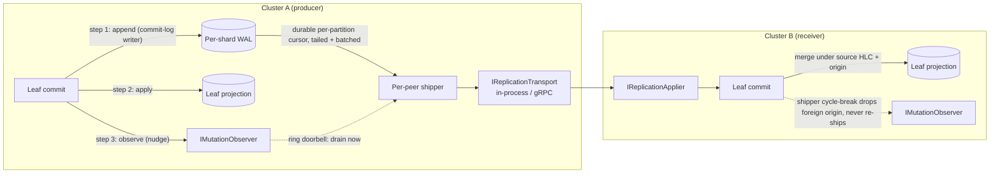

# Architecture

`Orleans.Lattice.Replication` layers cross-cluster replication on top of an
existing `Orleans.Lattice` deployment. The core library is unaware of
replication: the subsystem attaches only through first-class public extension
points and a per-cluster push transport. This document describes the end-to-end
pipeline in behavioural terms and the invariants it preserves; for the core
data-path architecture it builds on, see
[`../lattice/architecture.md`](../lattice/architecture.md).

## High-level pipeline

A mutation committed on one cluster is captured at commit time, durably logged,
shipped to each peer cluster, and applied on the receiver under the source
cluster's clock. Capture and apply are the two public seams; everything between
them is internal machinery the host never wires by hand.

1. **Commit-time WAL append (`ICommitLogWriter`) and replication nudge (`IMutationObserver`).** Every leaf commit on the
   producing cluster runs the core `wal -> apply -> observe` pipeline. The
   `wal` step is the durable capture: the leaf's commit-log writer is the single
   WAL appender, writing each mutation to the per-shard log before the originating
   `SetAsync` / `DeleteAsync` reports success, so an append failure surfaces to the
   caller rather than silently dropping a change. The replication subsystem attaches
   to the `observe` step only as a low-latency nudge - it rings the per-peer
   shipper doorbells so an idle or deactivated shipper is woken to drain the
   fresh append; it maintains no producer-side vector clock state, performs no
   second WAL write, and is best-effort. The causal frontier the shipper sends
   is read from the leaf WAL it tails, never from an in-memory commit-time mirror.

2. **Per-shard replication WAL.** Each commit is appended by the leaf's commit-log
   writer to a per-tree,
   per-shard write-ahead log addressed by a deterministic hash of the key. The
   WAL is the source of truth for incremental replication: shipping and
   recovery read from it, never from the primary tree. Snapshot bootstrap is the
   exception - the default snapshot provider exports a point-in-time view of the
   tree's committed leaf projections rather than replaying the WAL. The WAL grain
   contract and the turn-safe batching protocol live in
   [`wal.md`](wal.md); the pluggable durability backend lives in
   [`../lattice/wal-storage-providers.md`](../lattice/wal-storage-providers.md).

3. **Change feed (`IChangeFeed`).** A public, in-process pull feed over the
   locally-authored WAL for custom consumers - bridges, tests, and in-process
   projections. It walks every partition for a tree from a per-partition offset
   cursor, filters by origin, and merges in HLC-ascending order. The shipping
   path does not use it; the shipper tails the WAL partitions directly (step 4).
   See [`change-feed.md`](change-feed.md).

4. **Shipping.** A per-`(tree, peer)` outbound worker - the log-first replication
   producer - tails the WAL from a durable per-partition cursor and ships batches
   to each configured
   peer, advancing the resume cursor as acknowledgements arrive. It is the sole ship
   driver; the commit-time observer does not ship, it only rings the worker's doorbell
   as an edge-triggered wake so an idle or deactivated shipper is (re)activated and
   its steady-state phase timer - the sole drain+ship driver, armed on activation -
   picks the new work up on its next tick. Redundant
   per-key versions are coalesced off the wire before shipping, and the framing
   tail is compressed; both are convergent transforms over what the ship loop
   reads, never a mutation of the durable WAL. The efficiency posture is
   described in [`../lattice.replication/README.md`](README.md#default-efficiency-posture-versions-greater-than-v710)
   and the cursor/cadence knobs in [`configuration.md`](configuration.md).

5. **Transport (`IReplicationTransport`).** The public transport seam carries
   batches between clusters. The gRPC binding - one unary push call per batch
   over a long-lived, HTTP/2-multiplexed channel per peer - is the
   canonical implementation; in-process and custom transports plug into the same
   contract. See [`transport.md`](transport.md) and
   [Orleans.Lattice.Replication.Grpc](../lattice.replication.grpc/README.md). The receiver stamps
   flow-control hints onto every acknowledgement so a struggling receiver can
   throttle in-band - see [`receiver-flow-control.md`](receiver-flow-control.md).

6. **Receiver apply (`IReplicationApplier`).** Inbound records flow through the
   public applier seam, which first gates each entry against this receiver's own
   per-tree replication enrollment and locally-resolved merge mode - dropping a
   tree not enrolled here and dead-lettering an entry whose peer-supplied wire
   merge mode disagrees - then drops entries a pinned bootstrap snapshot already
   covers, suppresses repeated records by exact `(origin, hlc, key, op)` identity
   (shadow-forward de-duplication), parks entries whose causal dependencies have
   not arrived, and performs CRDT-aware merges
   before committing through the same core leaf path that local writes use. See
   [`replication-apply.md`](replication-apply.md).

7. **Bootstrap.** A peer that is new, or whose cursor has fallen behind the
   retained WAL, seeds from a point-in-time snapshot and then switches to
   incremental shipping at the snapshot's HLC. See
   [`snapshot-bootstrap.md`](snapshot-bootstrap.md) and
   [`auto-bootstrap.md`](auto-bootstrap.md).

8. **Dead-letter quarantine.** Poison entries - schema skew, oversized values,
   corrupt clocks - are quarantined per tree after a configurable retry budget
   so replication continues past them. See
   [`dead-letter-queue.md`](dead-letter-queue.md).

## Invariants the pipeline preserves

1. **The WAL append is atomic with the local commit.** The leaf's commit-log
   writer appends to the per-shard WAL in the `wal` step of the leaf commit,
   before the write reports success, so a recorded entry always describes a
   committed mutation and an append failure surfaces to the original writer. The
   commit-time replication nudge in the later `observe` step is best-effort and
   never blocks or fails the commit.

2. **Origin metadata rides through verbatim.** The authoring cluster stamps each
   record with its configured `LatticeReplicationOptions.ClusterId`, and the
   receiver applies under that same origin. This is what breaks cycles: when the
   receiver's shipper tails its own WAL, the producer-side cycle-break filter
   ships only entries whose origin is the local cluster, so an apply-installed
   entry - which keeps its source cluster's origin - is never re-shipped and a
   write replicated into and back out of a peer never loops.

3. **Source HLCs are preserved on the receiver.** The persisted timestamp of an
   applied write is the authoring cluster's HLC, verbatim; the receiving leaf
   only advances its own clock to at least that value, so a later local write
   still sorts after the applied one. That is what makes lexicographic
   `(HLC, originClusterId)` last-writer-wins resolution converge identically
   across clusters.

4. **Atomic-write sagas land all-or-nothing.** A replicated multi-key atomic
   write arrives as prepared records that stay invisible until the terminal
   commit-or-abort decision arrives, so no reader on any peer observes a partial
   batch - even if the inter-site link partitions mid-delivery.

5. **CRDT merge modes are dispatched per tree.** A tree declared with a
   `LatticeMergeMode` other than last-writer-wins ships typed state-merge
   records that the receiver folds with the primitive's commutative,
   associative, idempotent join, so out-of-order receipt is convergent without
   any per-edge ordering guarantee. See [`deltas.md`](deltas.md) and
   [`replication-modes.md`](replication-modes.md).

6. **Tree events are local-only.** Receiver-side applies do not republish the
   per-tree event stream; each cluster emits events only for writes that
   originated locally. See
   [`../lattice/events.md`](../lattice/events.md#operations-that-deliberately-do-not-emit-events).

## Relationship to the core library

The replication subsystem attaches to the core library only through public
seams: `IMutationObserver` (the commit-time nudge), the per-tree
`ILatticeMergeModeResolver`, `ILatticeOriginClusterIdResolver`, and
`ILatticeReplicationContext` implementations `AddLatticeReplication` swaps in,
the `ITreeAliasObserver` that rebinds shippers after an alias swap, and the
`IWalCursorRegistry` that carries the per-peer ship cursors and receiver
blocked floors that hold back WAL trimming; its own
`IReplicationApplier` is the receiver-side merge seam. The
single-cluster and multi-cluster code paths are identical up to the point where
the transport carries a batch across a network boundary; there is no
"replication mode" that changes how a foreground commit durabilizes. The WAL
that replication reads is the same per-shard log the core library commits and
replays from - see [`../lattice/wal.md`](../lattice/wal.md).

The chaos-test suite that exercises every invariant above end-to-end is
summarised in [`chaos-tests.md`](chaos-tests.md).
