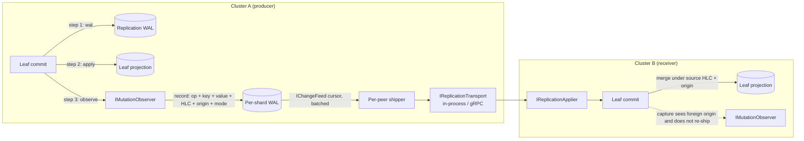

# Architecture

`Orleans.Lattice.Replication` layers cross-cluster replication on top of an
existing `Orleans.Lattice` deployment. The core library is unaware of
replication: the subsystem attaches only through first-class public extension
points and a per-cluster push transport. This document describes the end-to-end
pipeline in behavioural terms and the invariants it preserves; for the core
data-path architecture it builds on, see
[`../lattice/architecture.md`](../lattice/architecture.md).

## High-level pipeline

A mutation committed on one cluster is captured at commit time, durably logged,
shipped to each peer cluster, and applied on the receiver under the source
cluster's clock. Capture and apply are the two public seams; everything between
them is internal machinery the host never wires by hand.

1. **Commit-time capture (`IMutationObserver`).** Every leaf commit on the
   producing cluster runs the core `wal -> apply -> observe` pipeline. The
   replication subsystem attaches to the `observe` step, so each captured record
   describes a mutation that is already durably committed. The capture call is
   awaited inline with the originating `SetAsync` / `DeleteAsync`, so a capture
   failure surfaces to the caller rather than silently dropping a change.

2. **Per-shard replication WAL.** Captured records are appended to a per-tree,
   per-shard write-ahead log addressed by a deterministic hash of the key. The
   WAL is the single source of truth for replication: shipping, snapshotting,
   and recovery all read from it, never from the primary tree. The WAL grain
   contract and the turn-safe batching protocol live in
   [`wal.md`](wal.md); the pluggable durability backend lives in
   [`../lattice/wal-storage-providers.md`](../lattice/wal-storage-providers.md).

3. **Change feed (`IChangeFeed`).** The shipping path reads the WAL through the
   change feed seam, which walks every partition for a tree, filters by HLC
   cursor and origin, and merges in HLC-ascending order. See
   [`change-feed.md`](change-feed.md).

4. **Shipping.** A per-peer outbound worker streams batches to each configured
   peer, advancing a durable resume cursor as acknowledgements arrive. Redundant
   per-key versions are coalesced off the wire before shipping, and the framing
   tail is compressed; both are convergent transforms over what the ship loop
   reads, never a mutation of the durable WAL. The efficiency posture is
   described in [`../lattice.replication/README.md`](README.md#default-efficiency-posture)
   and the cursor/cadence knobs in [`configuration.md`](configuration.md).

5. **Transport (`IReplicationTransport`).** The public transport seam carries
   batches between clusters. A long-lived gRPC streaming binding is the
   canonical implementation; in-process and custom transports plug into the same
   contract. See [`transport.md`](transport.md) and
   [Orleans.Lattice.Replication.Grpc](../lattice.replication.grpc/README.md). The receiver stamps
   flow-control hints onto every acknowledgement so a struggling receiver can
   throttle in-band - see [`receiver-flow-control.md`](receiver-flow-control.md).

6. **Receiver apply (`IReplicationApplier`).** Inbound records flow through the
   public applier seam, which performs per-origin high-water-mark dedup, causal
   dependency parking, shadow-forward de-duplication, and CRDT-aware merges
   before committing through the same core leaf path that local writes use. See
   [`replication-apply.md`](replication-apply.md).

7. **Bootstrap.** A peer that is new, or whose cursor has fallen behind the
   retained WAL, seeds from a point-in-time snapshot and then switches to
   incremental shipping at the snapshot's HLC. See
   [`snapshot-bootstrap.md`](snapshot-bootstrap.md) and
   [`auto-bootstrap.md`](auto-bootstrap.md).

8. **Dead-letter quarantine.** Poison entries - schema skew, oversized values,
   corrupt clocks - are quarantined per tree after a configurable retry budget
   so replication continues past them. See
   [`dead-letter-queue.md`](dead-letter-queue.md).

## Invariants the pipeline preserves

1. **Capture is atomic with the local commit.** Capture runs in the `observe`
   step of the leaf commit, after the write is durable, so a captured record
   always describes a committed mutation. The capture call is awaited inline; a
   capture-side failure surfaces to the original writer.

2. **Origin metadata rides through verbatim.** The authoring cluster stamps each
   record with its configured `LatticeReplicationOptions.ClusterId`, and the
   receiver applies under that same origin. This is what breaks cycles: the
   receiver's own capture seam sees the foreign origin and does not re-ship the
   write back toward its source, so a write replicated into and back out of a
   peer never loops.

3. **Source HLCs are preserved on the receiver.** Apply does not advance the
   receiver's local clock over an incoming write; the persisted timestamp is the
   authoring cluster's HLC. That is what makes lexicographic
   `(HLC, originClusterId)` last-writer-wins resolution converge identically
   across clusters.

4. **Atomic-write sagas land all-or-nothing.** A replicated multi-key atomic
   write arrives as prepared records that stay invisible until the terminal
   commit-or-abort decision arrives, so no reader on any peer observes a partial
   batch - even if the inter-site link partitions mid-delivery.

5. **CRDT merge modes are dispatched per tree.** A tree declared with a
   `LatticeMergeMode` other than last-writer-wins ships typed state-merge
   records that the receiver folds with the primitive's commutative,
   associative, idempotent join, so out-of-order receipt is convergent without
   any per-edge ordering guarantee. See [`deltas.md`](deltas.md) and
   [`replication-modes.md`](replication-modes.md).

6. **Tree events are local-only.** Receiver-side applies do not republish the
   per-tree event stream; each cluster emits events only for writes that
   originated locally. See
   [`../lattice/events.md`](../lattice/events.md#operations-that-deliberately-do-not-emit-events).

## Relationship to the core library

The only contact surfaces between the core library and the replication
subsystem are `IMutationObserver` (commit-time capture) and `IReplicationApplier`
(receiver-side merge), both first-class public extension points. The
single-cluster and multi-cluster code paths are identical up to the point where
the transport carries a batch across a network boundary; there is no
"replication mode" that changes how a foreground commit durabilizes. The WAL
that replication reads is the same per-shard log the core library commits and
replays from - see [`../lattice/wal.md`](../lattice/wal.md).

The chaos-test suite that exercises every invariant above end-to-end is
summarised in [`chaos-tests.md`](chaos-tests.md).
