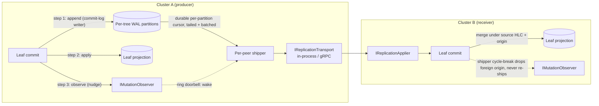

# Architecture

`Orleans.Lattice.Replication` layers cross-cluster replication on top of an
existing `Orleans.Lattice` deployment. The core library does not depend on the
replication package: the subsystem plugs into public extension points the core
exposes, a per-cluster push transport, and - through an internals-visibility
grant the core library extends to the replication package - core-internal
machinery such as the per-tree WAL partitions and the core's replication-apply
path (see [Relationship to the core library](#relationship-to-the-core-library)).
This document describes the end-to-end
pipeline in behavioural terms and the invariants it preserves; for the core
data-path architecture it builds on, see
[`../lattice/architecture.md`](../lattice/architecture.md).

## High-level pipeline

A mutation committed on one cluster is captured at commit time, durably logged,
shipped to each peer cluster, and applied on the receiver under the source
cluster's clock. Capture and apply are the two public seams; everything between
them is internal machinery the host never wires by hand.

```mermaid
flowchart LR
    subgraph "Cluster A (producer)"
        Leaf[Leaf commit]
        Leaf -->|"step 1: append (commit-log writer)"| Wal[(Per-tree WAL partitions)]
        Leaf -->|"step 2: apply"| Proj[(Leaf projection)]
        Leaf -->|"step 3: observe (nudge)"| Capture[IMutationObserver]
        Wal -->|"durable per-partition cursor, tailed + batched"| Ship[Per-peer shipper]
        Capture -.->|"ring doorbell: wake"| Ship
        Ship --> Transport[IReplicationTransport<br/>in-process / gRPC]
    end

    subgraph "Cluster B (receiver)"
        Transport --> Apply[IReplicationApplier]
        Apply --> LeafB[Leaf commit]
        LeafB -->|"merge under source HLC + origin"| ProjB[(Leaf projection)]
        LeafB -.->|"shipper cycle-break drops foreign origin, never re-ships"| CaptureB[IMutationObserver]
    end
```

1. **Commit-time WAL append (the leaf commit-log writer) and replication nudge (`IMutationObserver`).** Every leaf commit on the
   producing cluster runs the core `wal -> apply -> observe` pipeline. The
   `wal` step is the durable capture: the leaf's commit-log writer is the single
   WAL appender, writing each mutation to its WAL partition before the originating
   `SetAsync` / `DeleteAsync` reports success, so an append failure surfaces to the
   caller rather than silently dropping a change. The replication subsystem attaches
   to the `observe` step only as a low-latency nudge - it rings the per-peer
   shipper doorbells so an idle or deactivated shipper is woken to drain the
   fresh append; it maintains no producer-side vector clock state, performs no
   second WAL write, and is best-effort. The causal frontier the shipper sends
   is read from the leaf WAL it tails, never from an in-memory commit-time mirror.

2. **Partitioned replication WAL.** Each commit is appended by the leaf's commit-log
   writer to the tree's write-ahead log, in the partition a deterministic hash of
   the key selects; the partitions are per tree, not per shard, so every shard of
   the tree shares them. The
   WAL is the source of truth for incremental replication: shipping and
   recovery read from it, never from the primary tree. Snapshot bootstrap is the
   exception - the default snapshot provider exports a point-in-time view of the
   tree's committed leaf projections, plus the prepared rows of any saga still
   undecided at the export, rather than replaying the WAL. The WAL grain
   contract and the turn-safe batching protocol live in
   [`wal.md`](wal.md); the pluggable durability backend lives in
   [`../lattice/wal-storage-providers.md`](../lattice/wal-storage-providers.md).

3. **Change feed (`IChangeFeed`).** A public, in-process pull feed over the
   locally-authored WAL for custom consumers - bridges, tests, and in-process
   projections. It walks every partition for a tree from a per-partition offset
   cursor, filters by origin, and merges in HLC-ascending order. The shipping
   path does not use it; the shipper tails the WAL partitions directly (step 4).
   See [`change-feed.md`](change-feed.md).

4. **Shipping.** A per-`(tree, peer)` outbound worker - the log-first replication
   producer - tails the WAL from a durable per-partition cursor and ships batches
   to each configured
   peer, advancing the resume cursor as acknowledgements arrive. It is the sole ship
   driver; the commit-time observer does not ship, it only rings the worker's doorbell
   as an edge-triggered wake so an idle or deactivated shipper is (re)activated and
   its steady-state phase timer - the sole drain+ship driver, armed on activation -
   picks the new work up on its next tick. Redundant
   per-key versions are coalesced off the wire before shipping, and the framing
   tail is compressed; both are convergent transforms over what the ship loop
   reads, never a mutation of the durable WAL. The efficiency posture is
   described in [`../lattice.replication/README.md`](README.md#default-efficiency-posture)
   and the cursor/cadence knobs in [`configuration.md`](configuration.md).

5. **Transport (`IReplicationTransport`).** The public transport seam carries
   batches between clusters. The gRPC binding - one unary push call per batch
   over a long-lived, HTTP/2-multiplexed channel per peer - is the
   canonical implementation; in-process and custom transports plug into the same
   contract. See [`transport.md`](transport.md) and
   [Orleans.Lattice.Replication.Grpc](../lattice.replication.grpc/README.md). The receiver stamps
   flow-control hints onto every acknowledgement so a struggling receiver can
   throttle in-band - see [`receiver-flow-control.md`](receiver-flow-control.md).

6. **Receiver apply (`IReplicationApplier`).** Inbound records flow through the
   public applier seam, which gates each entry against this receiver's own
   per-tree replication enrollment and locally-resolved merge mode - dropping a
   tree not enrolled here and dead-lettering an entry whose peer-supplied wire
   merge mode disagrees - and, when tenancy is on, against the tenant-isolation
   gate, which dead-letters a write for a tenant that is unknown, not resident
   in this region, or suspended. It defers an entry while a coordinated restore
   holds the tree's inbound receive fence, so the sender re-ships it once the
   fence lifts; a single-entry apply checks the fence after those two gates,
   while a multi-entry batch checks it first and defers a fenced run whole. It
   then drops entries a pinned bootstrap snapshot already
   covers, suppresses repeated records by exact `(origin, hlc, key, op)` identity
   (shadow-forward de-duplication), parks entries whose causal dependencies have
   not arrived, and performs CRDT-aware merges
   before committing through the same core leaf path that local writes use. See
   [`replication-apply.md`](replication-apply.md).

7. **Bootstrap.** A peer seeds from a point-in-time snapshot and then
   switches to incremental shipping at the snapshot's HLC. A receiver-side
   fall-off probe can start that automatically when the receiver's own local WAL
   no longer retains entries for an origin it has already recorded. A source-side
   shipper can also detect that its read cursor was trimmed past, stamp the next
   push with `ReplicationBatch.ReseedAfterEpoch`, and ask the receiver to run the
   same full bootstrap. An explicit re-seed request seeds a new peer. See
   [`snapshot-bootstrap.md`](snapshot-bootstrap.md) and
   [`auto-bootstrap.md`](auto-bootstrap.md).

8. **Dead-letter quarantine.** An entry whose apply keeps failing is
   quarantined per tree after a configurable retry budget, and entries the
   merge-mode or tenant-isolation gate refuses, the causal-apply buffer evicts
   or fails to apply when it drains, or the sender cannot encode are parked at
   once, so replication continues
   past them. The queue is bounded but never evicts: when it is full it
   refuses the park and the affected link is held back, so no acknowledged
   write is ever lost. See
   [`dead-letter-queue.md`](dead-letter-queue.md).

## Invariants the pipeline preserves

1. **The WAL append is atomic with the local commit.** The leaf's commit-log
   writer appends to the tree's WAL in the `wal` step of the leaf commit,
   before the write reports success, so a recorded entry always describes a
   committed mutation and an append failure surfaces to the original writer. The
   commit-time replication nudge in the later `observe` step is best-effort and
   never blocks or fails the commit.

2. **Origin metadata rides through verbatim.** The authoring cluster stamps each
   record with its configured `LatticeReplicationOptions.ClusterId`, and the
   receiver applies under that same origin. This is what breaks cycles: when the
   receiver's shipper tails its own WAL, the producer-side cycle-break filter
   ships only entries whose origin is the local cluster, so an apply-installed
   entry - which keeps its source cluster's origin - is never re-shipped and a
   write replicated into and back out of a peer never loops.

3. **Source HLCs are preserved on the receiver.** For a last-writer-wins
   write, the persisted timestamp of an applied write is the authoring
   cluster's HLC, verbatim; the receiving leaf
   only advances its own clock to at least that value, so a later local write
   still sorts after the applied one. That is what makes last-writer-wins
   resolution - ordered by HLC, with an exact HLC tie broken by the
   replica-invariant tombstone, expiry, and value-byte fields before the origin
   cluster id - converge identically across clusters. A typed CRDT delta keeps
   its source HLC only when it is folded as part of a multi-entry batched run;
   any other fold is written at a fresh local HLC, which the commutative join
   makes safe (see [`replication-apply.md`](replication-apply.md)).

4. **Atomic-write sagas land all-or-nothing.** A replicated multi-key atomic
   write arrives as prepared records that stay invisible until the terminal
   commit-or-abort decision arrives, so no reader on any peer observes a partial
   batch - even if the inter-site link partitions mid-delivery.

5. **CRDT merge modes are dispatched per tree.** A tree declared with a
   `LatticeMergeMode` other than last-writer-wins ships typed CRDT deltas
   that the receiver folds with the primitive's commutative,
   associative, idempotent join, so out-of-order receipt is convergent without
   any per-edge ordering guarantee. See [`deltas.md`](deltas.md) and
   [`replication-modes.md`](replication-modes.md).

6. **Tree events are emitted where a write originates, with two
   exceptions.** An inbound replicated last-writer-wins apply does not
   republish the per-tree event stream at the receiving silo. A replicated
   atomic batch's prepared writes and a replicated CRDT delta are applied
   through the receiver's local write paths, so they do publish there when
   publication is enabled; a subscriber attached at every cluster should treat
   those as duplicates of the originating cluster's events. See
   [`../lattice/events.md`](../lattice/events.md#operations-that-deliberately-do-not-emit-events).

## Formal verification

The plain replication protocol has a design-level TLA+ specification,
[`spec/replication/Replication.tla`](../../spec/replication/README.md), checked
exhaustively by TLC on every pull request over a bounded instance of three
clusters. Its transport loses, duplicates, reorders, and partitions entries,
receivers restart, and the merge is abstracted over both last-writer-wins and a
grow-only counter. It checks six properties:

| Property | What it guarantees |
|----------|--------------------|
| `NoRelay` | A cluster ships only the writes it authored, so nothing is relayed or ping-pongs around a ring. |
| `NoReflection` | A cluster never applies its own write received back from a peer. |
| `CursorNeverSkipsUnshipped` | A shipper's cursor never passes a write the peer has not absorbed. |
| `DedupNeverDropsNew` | A receiver discards an entry as a duplicate only when its replica already reflects it. |
| `BootstrapHandoffLosesNothing` | After a snapshot bootstrap, every write the snapshot does not hold is still applied when it arrives. |
| `EventualConvergence` | Once writing stops, with a fair transport and dead letters eventually replayed, every replica of every key converges to the value of all its writes. |

A companion module,
[`ReplicationCausalDelivery.tla`](../../spec/replication/ReplicationCausalDelivery.tla),
checks that a receiver cannot deadlock on causal dependencies when shipping
order inverts a cross-origin dependency cycle and every shipper waits on each
acknowledgement.

The specification is tied to the code three ways. The decisions it checks run
in production through pure cores (`ReplicationShipEligibility` for the
shipper's cycle-break and cursor filter, `ReplicationReceiveDedup` for the
receiver's cycle-break and high-water mark), which Coyote models in
`test/lattice.replication/Coyote/` execute under systematic interleaving. Every
spec action and property is mapped to the production seam it abstracts, and to
a test that was proven to fail when that seam is broken, in the
[refinement note](../../spec/replication/Refinement.md). And every property has
a mutation that makes it fail, so none holds vacuously.

The specification reproduces four production defects, each now fixed and kept
as a mutation that reproduces it: a bootstrap pin that discarded writes
(#4463), a causal buffer that could strand or lose parked entries (#4464), a
duplicate of an in-flight entry that was acknowledged and lost (#4465), and a
snapshot bootstrap that shipped no deletes (#4504).

A second companion,
[`ReplicationReBootstrap.tla`](../../spec/replication/ReplicationReBootstrap.tla),
covers what happens once the source has garbage-collected a tombstone. A
receiver that fell off the source's log past a delete whose tombstone was
then reaped receives it by no path, and keeps the deleted value. The module
checks the planned receiver-side reconcile and its safety gates; until it is
built that gap is open (#4537), and a key the receiver holds under another
origin remains a residual (#4549).

**Scope.** The specification covers plain replication only. Atomic-write sagas
carried over replication (invariant 4 above) are not modelled here; that is
owned by #4436. The refinement note lists every other abstraction the model
makes, among them a single WAL partition per cluster, a bounded fault budget,
and an unbounded identity cache.

## Relationship to the core library

The replication subsystem attaches to the core library through public
seams: `IMutationObserver` (the commit-time nudge), the per-tree
`ILatticeMergeModeResolver`, `ILatticeOriginClusterIdResolver`, and
`ILatticeReplicationContext` implementations `AddLatticeReplication` swaps in,
the `ITreeAliasObserver` that rebinds shippers after an alias swap, and the
`IWalCursorRegistry` that carries the per-peer ship cursors and receiver
blocked floors that hold back WAL trimming; its own
`IReplicationApplier` is the receiver-side merge seam. It also calls
core-internal machinery directly, through an internals-visibility grant the
core library extends to the replication package: the shipper, the WAL
introspection seam, and the change feed read the tree's WAL partitions; the
applier writes through the core's internal replication-apply path; and the
snapshot export walks shard and leaf state and reads the per-tree transaction
registry. The
single-cluster and multi-cluster code paths are identical up to the point where
the transport carries a batch across a network boundary; there is no
"replication mode" that changes how a foreground commit durabilizes. The WAL
that replication reads is the same partitioned log the core library commits and
replays from - see [`../lattice/wal.md`](../lattice/wal.md).

The chaos-test suite that exercises every invariant above end-to-end is
summarised in [`chaos-tests.md`](chaos-tests.md).
