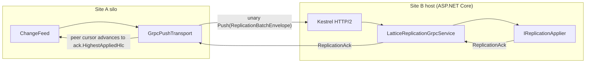

# gRPC streaming push transport (`Orleans.Lattice.Replication.Grpc`)

The `Orleans.Lattice.Replication.Grpc` sub-package ships the canonical sender + receiver pair for the [`IReplicationTransport`](transport.md) seam. It replaces the default no-op transport with a long-lived, HTTP/2-multiplexed `GrpcChannel` per peer cluster on the sender side, and exposes an ASP.NET Core endpoint that drives [`IReplicationApplier`](replication-apply.md) on the receiver side.

The sub-package is opt-in: hosts that need the transport reference `Orleans.Lattice.Replication.Grpc` and call the DI extensions below; hosts that don't never pay the dependency cost.

## Topology



One unary `Push` RPC per batch, a single long-lived `GrpcChannel` per peer cluster id, HTTP/2 multiplexing concurrent batches across the channel.

## Wire format

The on-the-wire shape is the same `ReplicationBatchEnvelope` (alias `olr.be`, wire version 1) the [`IReplicationBatchEncoder`](wire-format.md) seam frames. The gRPC marshaller hands the gRPC stream's `IBufferWriter<byte>` straight to `IReplicationBatchEncoder.Encode(envelope, writer)`, so the envelope's bytes are written directly into the underlying network buffer without an intermediate managed allocation. The encoder is the canonical Orleans-binary encoder by default; swapping the DI registration for a different encoder (e.g. JSON for HTTP debuggability) is the only knob needed to change the wire bytes.

The gRPC service definition is **not** generated from `.proto` - it is hand-rolled via custom `Marshaller<T>` instances backed by the encoder. There is no `Grpc.Tools` build dependency, no `.proto` file to keep in sync, and no language-binding artefact to ship: a non-.NET peer that wants to talk to the receiver implements the same encoded envelope shape directly.

## Sender-side and receiver-side registration

A single helper, `AddLatticeReplicationGrpc`, wires the silo as both a sender and a receiver. A silo that never expects peers to dial it leaves the endpoint mapping off; a silo that never expects to dial peers leaves the `Peers` map empty. Both modes share one `LatticeReplicationGrpcOptions` instance.

```csharp verify
var builder = WebApplication.CreateBuilder();
builder.Host.UseOrleans(silo => silo
    .AddLattice((s, storageName) => s.AddMemoryGrainStorage(storageName))
    .AddLatticeReplication(o => o.ClusterId = "site-a"));

builder.Services.AddLatticeReplicationGrpc(grpc =>
{
    grpc.Peers["site-b"] = new Uri("https://site-b.example:5001");
    grpc.Peers["site-c"] = new Uri("https://site-c.example:5001");
});

var app = builder.Build();
app.MapLatticeReplicationGrpc();
app.Run();
```

`AddLatticeReplicationGrpc` replaces the default `NoOpReplicationTransport` registered by `AddLatticeReplication`, registers the snapshot transport for cross-cluster bootstrap, and wires the receiver-side gRPC services. Subsequent calls are idempotent - the registration uses `IServiceCollection.Replace` for the transports, not `Add`.

`MapLatticeReplicationGrpc` exposes both the live-push `Push` route and the snapshot `GetMetadata` / `RequestSnapshot` routes on the endpoint builder. The receiver requires the standard `AddLatticeReplication` registrations (encoder + `IReplicationApplier`); call it before `AddLatticeReplicationGrpc`.

### `LatticeReplicationGrpcOptions`

| Member | Semantics |
|---|---|
| `Peers` | `IDictionary<string, Uri>` keyed by remote cluster id. Each entry yields a long-lived `GrpcChannel` reused across both live-push batches and snapshot pulls to that peer. A batch whose `TargetClusterId` (or a bootstrap whose `sourceClusterId`) is not in the map causes the call to throw `InvalidOperationException`. The map is read once per peer (on the first dispatch) and cached - runtime edits are not observed. |
| `ConfigureChannel` | Optional `Action<string, GrpcChannelOptions>?` invoked when the binding constructs the per-peer `GrpcChannel`. Hosts attach mTLS credentials, custom `HttpHandler`s, retry policies, and keep-alive settings here. The callback runs **after** the package applies its hardened defaults (call credentials + secure-channel option), so a host that needs to replace the credential chain (e.g. mTLS only) can do so unconditionally. The default (`null`) leaves channel options at `Grpc.Net.Client` defaults plus the package's shared-secret call credentials. |
| `AllowPlaintextEndpoints` | `bool`, default `false`. When `false`, any `Peers` entry whose scheme is not `https://` causes the call to throw at channel-resolution time. Set to `true` only for loopback / test scenarios. |
| `LocalClusterId` | `string?`. When set, stamped as the `x-lattice-replication-origin` header on every outbound call. When unset, the binding falls back to `LatticeReplicationOptions.ClusterId`. |

Transport security is shipped by the package: shared-secret authentication, HTTPS-by-default scheme enforcement, and a pluggable secret-source seam are documented in [Transport Security](transport-security.md). mTLS remains available end-to-end via `ConfigureChannel`.

## Concurrency and idempotency

The transport is safe for concurrent invocation across distinct `(TargetClusterId, TreeName)` pairs - the canonical outbound shipper fans out across peers and trees in parallel. Concurrent invocation against the same pair is implementation-defined; the canonical shipper serialises calls per pair.

Idempotency is the receiver's responsibility. The transport retries are configured via `GrpcChannelOptions.ServiceConfig` (per gRPC's standard retry policy mechanism), and the per-origin high-water-mark dedup in `IReplicationApplier` makes re-deliveries of the same `(origin, hlc)` tuple a no-op. The sender advances its per-peer cursor strictly to `ack.HighestAppliedHlc`, never to a value the sender chose locally.

## Observability

Each `SendAsync` records a `LatticeReplicationMetrics.ShipDuration` sample tagged with:

- `tree` - the `ReplicationBatch.TreeName`.
- `peer` - the `ReplicationBatch.TargetClusterId`.
- `outcome` - `ok` on a successful ack, `error` on any thrown exception.

Per-peer gauges (`entries_behind`, `bytes_behind`, `consecutive_errors`, `last_contact_seconds`) are owned by the outbound shipper, not the transport - they aggregate across batches and are not the transport's concern.

## Implementation notes

- **Box wrappers.** gRPC's `Method<TRequest, TResponse>` has a `class` constraint; the public `ReplicationBatchEnvelope` and `ReplicationAck` are `readonly record struct`. Internal sealed-class wrappers (`ReplicationBatchEnvelopeBox`, `ReplicationAckBox`) carry the value across the gRPC call boundary. The wrappers are an internal implementation detail; callers never see them.
- **`[BindServiceMethod]` codegen-style topology.** The receiver service is split into an internal `LatticeReplicationGrpcServiceBase` (carries the `[BindServiceMethod]` attribute and the static `BindService` callback) and a sealed derived `LatticeReplicationGrpcService` (the DI-resolved per-request handler). This mirrors the topology `Grpc.Tools` codegen produces and is required because `Grpc.AspNetCore` invokes `BindService(binder, null)` once at startup to record method metadata before resolving the per-request instance.
- **`LatticeReplicationGrpcMethodHolder`.** The static `BindService` callback cannot accept DI dependencies, so a process-wide `LatticeReplicationGrpcMethodHolder.Current` bridges the DI-resolved `LatticeReplicationGrpcMethod` into the static binding hook. The DI factory populates the holder when the method singleton first resolves; `MapLatticeReplicationGrpc` pre-resolves it before invoking `MapGrpcService<LatticeReplicationGrpcServiceBase>` so the holder is populated before gRPC reflects on the type.
- **Read-only anti-entropy probes.** Beyond live-push `Push`, the binding hosts the read-only unary RPCs the [anti-entropy pipeline](anti-entropy-digest-probe.md) drives: `ProbeDigest` (shard digest), `ExchangeContentManifest` (snapshot bootstrap fallback), `ProbeMerkleWalk` (the [Merkle-walk](anti-entropy-merkle-walk.md) range-scoped subtree digest, resolving the peer's `ILattice.GetLeafProjectionDigestForRangeAsync`), and `GetPeerHighWaterMark` (the [leaf re-replay](anti-entropy-leaf-rereplay.md) per-origin cursor read, resolving the peer's `IReplicationHighWaterMarkGrain.GetAsync`). Each is a `Method<TRequestBox, TResponseBox>` with the same internal box-wrapper pattern as `Push`. A peer that has not bound a given method answers `Unimplemented`; the client invoker catches `RpcException` with `StatusCode.Unimplemented` or `Unavailable` and returns the method's documented not-supported sentinel (`MerkleWalkProbeResponse.Unavailable` and `HybridLogicalClock.Zero` respectively), so a mixed-version peer set degrades gracefully rather than throwing.

## Caveats

- **`Peers` is read once per peer.** Adding or removing peers at runtime is **not** observed by the binding. A future item (observable topology) addresses this; until then, host restarts are required to change the peer set.
- **Transport-level authentication is enabled by default.** `LatticeReplicationGrpcAuthInterceptor` rejects every Lattice replication call that does not carry a valid `x-lattice-replication-secret` header (`StatusCode.Unauthenticated` when absent, `PermissionDenied` when the value is not in the accepted-secret set). The sender attaches the secret as gRPC `CallCredentials` whenever a non-empty outbound secret is resolved. See [Transport Security](transport-security.md) for the full surface, including how to plug in a custom secret source via `AddLatticeReplicationSecrets<TSource>()`.
- **The transport does not interpret the payload.** A transport-level decision based on payload contents (e.g. shed-load on oversize batches) is out of scope. `GrpcChannelOptions.MaxSendMessageSize` and `MaxReceiveMessageSize` cap the wire size at the transport boundary; the receiver-side flow-control work will surface batch-size hints on the ack envelope.
