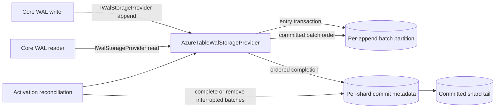

# Architecture

`Orleans.Lattice.Storage.AzureTable` is a durable implementation of the core `IWalStorageProvider` seam. The core WAL grain decides what to append, when to trim, and how consumers read; the Azure Table provider decides how those append, read, trim, and reconcile calls are represented in Azure Table Storage.

For the core WAL contract and placement model, see [WAL Storage Providers](../lattice/wal-storage-providers.md). For replication consumption of the WAL, see [Replication WAL](../lattice.replication/wal.md).

## High-level pipeline

The provider keeps each `(tree, shard)` stream ordered while allowing append payloads to land in per-batch storage partitions. Commit metadata is ordered by start offset and advances the shard tail only when the contiguous prefix is committed.

## Storage layout

The table is split by behaviour, not by public .NET type:

| Stored data | Behaviour |
|---|---|
| Entry rows | Store one retained WAL entry payload and its offset. Rows for one append batch are written together in one Azure Table transaction. |
| Batch partition | Groups the entry rows for one append batch. Separate batches use separate partitions so concurrent shard work is not forced through one storage partition for the entry payloads. |
| Commit metadata | Records that a batch is committed and the inclusive offset range it covers. Reads enumerate committed metadata in offset order before fetching entry rows. |
| Tail metadata | Stores the highest committed offset for a shard. Highest-offset recovery is a point read rather than a scan over all entries. |
| Recovery markers or discoverable batch state | Lets reconciliation find interrupted appends after a crash and either complete the contiguous prefix or remove non-contiguous leftovers. |

Tree ids are encoded for Azure Table key safety. The table is created on first use. Use a non-default `TableName` when multiple deployments share one storage account.

## Transactional batch contract

Every append preserves the public WAL invariants:

1. The supplied offsets must be dense for one shard.
2. Entry payload rows for one batch are committed atomically by Azure Table Storage.
3. Commit metadata advances in strict offset order.
4. The visible tail never skips a gap.
5. A failed append does not expose a partial visible batch.
6. Trim can remove old retained rows, but it never moves the committed tail backward.

Azure Table transactions are limited to 100 actions and 4 MiB. The provider exposes `AzureTableWalStorageProvider.MaxEntriesPerBatch = 100`; replication defaults keep append batches below this ceiling. For throughput and pending-depth tuning, see [WAL tuning](../lattice/wal-tuning.md).

## Commit pipeline

A normal append has three behavioural stages:

1. **Prepare recovery state.** The provider records enough information to distinguish an interrupted append from a committed append during the next reconciliation pass. With `EliminateCandidateRowOnHotPath = true`, the normal path skips an extra recovery-marker write and relies on discoverable batch state plus the committed tail.
2. **Write entries.** Entry payload rows are written in a single Azure Table transaction for that batch.
3. **Complete in offset order.** Commit metadata and the shard tail are updated in strict ascending offset order. Under load, multiple completions can be coalesced into one transaction, bounded by Azure Table transaction limits.

`PipelinePhaseTwoCommits = true` lets a caller return after durable entry write and observation of the previous pending completion for the shard. It does not change ordering, recovery, or all-or-nothing durability; it changes which append observes a completion fault, and it introduces a bounded read visibility lag. `PipelinedPhaseTwoFaultHandler` exists so an idle shard can still report a completion fault for observability.

### Read visibility lag under pipelining

The read path is derived from the commit metadata written in stage 3, so a batch becomes readable when its completion lands rather than when its append returns. Under `PipelinePhaseTwoCommits = true` the trailing batch on a shard is therefore durable but not yet readable for a short interval, and a read can omit it.

The reported highest offset does **not** share that lag. `GetHighestOffsetAsync` folds the contiguous run of already-durable batches the shard's live completion worker has accepted over the stored tail, so an offset returned by a completed append is never reported back as though it did not exist. The fold walks upward from the stored tail and stops at the first gap, which is exactly the run reconciliation would roll forward, so it can never claim a batch whose lower neighbour is still in flight. It degrades to the stored tail alone when this provider instance has no live worker for the shard - a fresh activation, another silo, or `PipelinePhaseTwoCommits = false` - and the stored tail keeps its former meaning everywhere else, including on the reconciliation path.

Nothing is lost. The entries are durable before the append returns, and reconciliation rolls the batch forward if the process restarts first. WAL consumers poll, and the core WAL grain tracks its next offset in memory rather than re-reading the tail, so the read lag is invisible on the canonical replication path.

A caller that genuinely needs read-after-write - a controlled hand-off, an operator consistency probe, or a test - awaits the provider's phase-two flush barrier, which drains the completions outstanding at the moment of the call and then rethrows any that failed. Prefer that barrier over sleeping or polling for an expected count.

`PhaseTwoCoalescingWindow` controls how long completion waits for more pending work before sending the coalesced transaction. `PhaseTwoCommitTimeout` bounds a wedged completion transaction so later work is not blocked indefinitely.

## Recovery and downgrade safety

On activation, the core WAL grain calls the provider reconciliation hook. The provider compares the committed tail with interrupted append evidence and applies these rules:

- If an interrupted batch contiguously extends the committed tail, reconciliation completes it and advances the tail.
- If an interrupted batch is below the tail or above a gap, reconciliation removes it so the next append can use the correct next offset.
- Reconciliation is idempotent: a clean shard has no work to do.

When `EliminateCandidateRowOnHotPath` is enabled, reconciliation recognizes both the legacy recovery-marker shape and the newer discoverable-batch shape. Upgrading from the legacy setting to the default setting is safe. Before downgrading back to the legacy setting, drain pending appends and allow reconciliation to complete on a deployment that still has the default setting enabled.

## Read, trim, and capacity behaviour

Reads enumerate committed batch metadata in offset order, then stream entry rows lazily from each overlapping batch. `GetHighestOffsetAsync` reads the stored tail and folds over it the contiguous run of already-durable batches the shard's live completion worker has accepted, so it never lags behind a completed append. `GetLowestOffsetAsync` finds the first retained batch after trim.

Trim deletes old retained entry rows in bounded Azure Table transactions and removes matching commit metadata in order. A crash during trim can leave a stale retained prefix, but not a gap in the live tail; a later trim can resume cleanup.

Capacity planning is shared with core WAL tuning:

- Increase shard count to spread work across storage partitions.
- Keep `WalMaxBatchEntries` at or below the provider batch limit.
- Use `WalMaxPendingBatches` carefully; more pending batches increase pipeline depth and storage pressure.
- Watch retry-attempt and retry-exhausted telemetry to distinguish transient retry storms from saturated storage.
- Use the core [WAL saturation signal](../lattice/wal-saturation-signal.md) to coordinate admission and retry behaviour.

## Compression and retry policies

Stored payload compression is per row. A row records enough metadata to decode itself, so changing `Compression`, `CompressionMinPayloadBytes`, or the registered compressor affects new rows only. Older rows remain readable.

When the provider constructs its own Azure SDK client, it attaches `RetryAttemptTrackingPolicy` for retry telemetry. When `HonorSaturationSignal` is enabled and `IWalSaturationSignal` is available, it also attaches `SaturationAwareRetryPolicy` so retry attempts can short-circuit during saturated WAL pressure. A pre-built `TableServiceClient` bypasses provider-owned pipeline construction; the host owns any equivalent policies in that mode.

## Relationship to replication

Replication writes and reads the WAL through the same core provider seam as single-cluster WAL users. This package does not define replication semantics; it supplies durable storage for the retained log that replication shippers, bootstrap, and fall-off-log handling depend on. See [Replication package](../lattice.replication/README.md) and [Replication WAL](../lattice.replication/wal.md).
