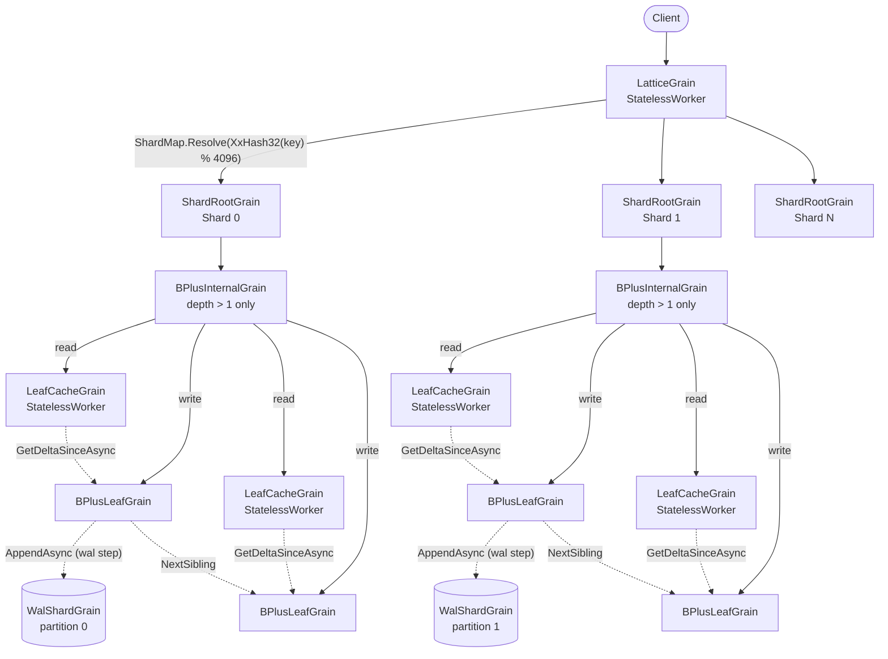
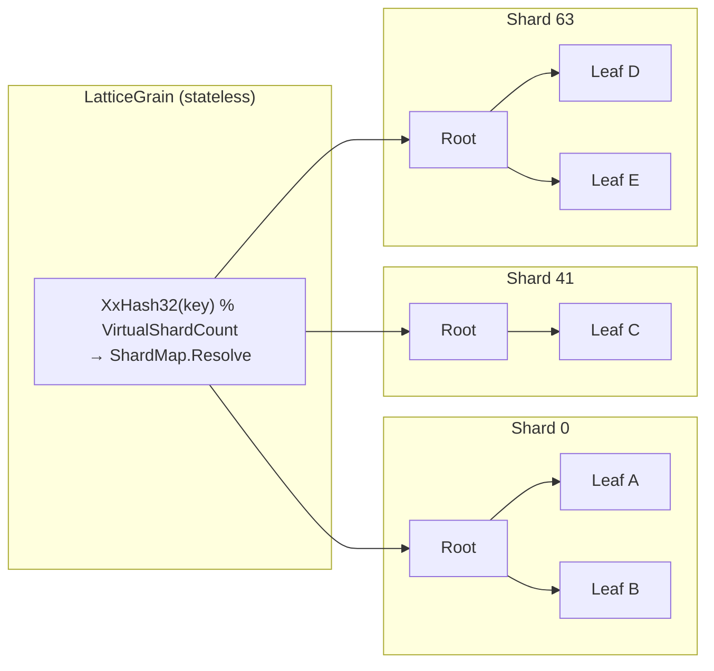

# Architecture

## High-Level Architecture

A request flows through five layers of Orleans grains. Writes are appended to a per-shard write-ahead log inline with the leaf commit, so a successful return from `SetAsync` / `DeleteAsync` is the durability point; reads are served by a stateless cache that pulls deltas from the primary leaf:

1. **`LatticeGrain`** - a `[StatelessWorker]` grain (many concurrent activations). Resolves the key's virtual slot via `XxHash32(key) % VirtualShardCount`, looks up the physical shard index in the cached `ShardMap`, and forwards the request to the corresponding `ShardRootGrain`.
2. **`ShardRootGrain`** - one per shard (keyed `{treeId}/{shardIndex}`). Manages the root pointer for its sub-tree. When the root is a leaf (small shard), traversal goes directly from `ShardRootGrain` to that leaf; once the shard grows enough to require a `BPlusInternalGrain` root, routing flows through one or more internal levels. Handles root-level splits by creating new internal nodes above the old root, and routes reads through the cache layer.
3. **`BPlusInternalGrain`** - an internal node holding separator keys and child references. Only allocated once the shard's depth exceeds 1. Routes a key to the correct child and accepts promoted splits from below. Split acceptance is idempotent - duplicate deliveries are detected and skipped.
4. **`LeafCacheGrain`** - a `[StatelessWorker]` read-through cache. Each silo may have its own activation. On a cache miss, it pulls a `StateDelta` from the primary leaf and merges entries using `LwwValue.Merge`. Because the merge is commutative and idempotent, stale entries are harmlessly overwritten without an invalidation protocol.
5. **`BPlusLeafGrain`** - a leaf node whose live key → value entries are held in an in-memory sorted dictionary, rebuilt from the canonical WAL on activation (the persisted leaf state row carries only topology and checkpoint metadata, never the entries themselves). Splits when the entry count exceeds the configured maximum. Maintains a `VersionVector` that is ticked on every write, enabling delta extraction for the cache layer. Every commit runs the **`wal → apply → observer → digest`** pipeline: the leaf awaits `IWalShardGrain.AppendAsync` (the commit point - a WAL failure surfaces to the caller before any in-memory mutation happens), then LWW-merges into its projection, then notifies any registered `IMutationObserver` (the seam the [replication package](#replication) attaches to), then publishes a projection-hash digest to its parent internal node.

## Sharding

Without sharding, every operation starts at a single root grain - a serialisation bottleneck. Sharding eliminates this by giving each key range its own independent sub-tree:

The hash function (`XxHash32`) is **stable across processes** - unlike `string.GetHashCode()`, it will always route the same key to the same shard. The default shard count is 64, configurable at tree creation time.

**Shard map indirection.** Routing is two-stage: keys hash into a large fixed virtual space (`LatticeConstants.DefaultVirtualShardCount`, a compile-time constant fixed at 4096), and a per-tree `ShardMap` collapses ranges of virtual slots onto physical shards. The default map (`slot[i] = i % shardCount`) preserves the legacy `hash % shardCount` routing bit-for-bit when `VirtualShardCount % ShardCount == 0` (enforced by `ShardMap.CreateDefault` at use time). The shard map is persisted on the tree's registry entry, fetched lazily by `LatticeGrain` on first access, cached for the activation's lifetime, and invalidated alongside the physical-tree-ID cache when a shard signals a stale alias. This indirection decouples logical key routing from the physical shard count, enabling adaptive shard splitting without rehashing existing keys. The virtual shard count is not a `LatticeOptions` property because changing it would invalidate every persisted `ShardMap` (slots are referenced by integer index).

**Trade-off:** Keys in different shards have no ordering relationship. A global range scan requires a scatter-gather across all shards followed by a merge.

### Key distribution is not an adversarial boundary

Both the shard hash (`XxHash32`, key → virtual slot → physical shard) and the WAL-partition hash (FNV-1a, key → `WalShardGrain` partition) are **fast, non-cryptographic, unseeded** functions, deliberately so: the mapping must be byte-for-byte stable across every silo and process in the cluster (`string.GetHashCode()` is rejected precisely because it is process-randomised). That determinism is load-bearing - two activations of a router or producer that hash the same key must always pick the same shard and partition, or per-partition WAL sequence ordering loses its meaning.

A consequence of an unseeded, publicly known hash is that anyone who can both **choose key strings** and knows the shard / partition count can precompute keys that all land on a single shard or WAL partition, concentrating load and defeating the even distribution the system relies on. This is a *load-distribution* property, not a correctness or confidentiality one: the worst case is that an N-shard tree behaves like a 1-shard tree for the affected keys (a hot shard / hot partition with the attendant latency and throughput imbalance). It never corrupts data, crosses a tree boundary, or discloses anything, and the per-shard structure remains an ordinary B+ tree - there is no algorithmic-complexity blow-up.

Lattice therefore treats **keys as trusted input**: key distribution is assumed to be roughly uniform because the writers choosing the keys are trusted, exactly as the write surface itself is. In the normal deployment model an actor who can choose colliding keys already holds write access and could load any single shard directly, so the hash grants no extra capability. The one case that deserves attention is a multi-tenant front end that is itself trusted (holds write access) but **embeds untrusted, caller-supplied data in the key** (a tenant id, username, document slug, and so on): there the key *content* is partially adversary-controlled through a trusted door, and an attacker could steer those keys onto one shard. If your keys are constructed that way and you face a hostile tenant, spread the attacker-influenced portion across the key space yourself (for example by prefixing the key with a hash of the stable, trusted tenant identity) rather than relying on the placement hash to do it. Re-seeding the placement hash with a deployment secret is intentionally *not* offered as a built-in knob: it would change the mapping of every existing key, disturbing on-disk WAL partitioning and the per-partition sequence ordering downstream shippers depend on, for a threat that is out of scope under the trusted-writer model.

## Root Promotion

When a split cascades all the way up to the shard root, `ShardRootGrain` creates a new internal root above the old one via a **two-phase promotion**:

1. **Phase 1 (persist intent):** The `SplitResult` and a `RootWasLeaf` flag are saved to `ShardRootState.PendingPromotion` and persisted.
2. **Phase 2 (create root):** A new `BPlusInternalGrain` is created with a **deterministic `GrainId`** derived from the shard key and old root ID (`SHA-256` hash). The new root is initialised with the promoted key and left/right children, and `RootNodeId` is updated.

If the shard root crashes between phases, `ResumePendingPromotionAsync` (called at the start of every `GetAsync`, `SetAsync`, and `DeleteAsync`) detects the pending promotion and completes it. The deterministic `GrainId` ensures that re-executing Phase 2 targets the same grain - making the promotion idempotent.

## Bounded Retry

`ShardRootGrain` wraps `SetAsync` and `DeleteAsync` in a bounded retry loop (default: 3 attempts). If a grain call fails due to a transient error (e.g. storage fault, network partition), the request is retried. Orleans automatically deactivates a failed grain; the retry hits a fresh activation that runs any pending recovery logic before processing the request. This shields callers from transient infrastructure errors without requiring client-side retry code.

## Grain-to-Grain Mapping

### Data-path grains

These grains form the structural B+ tree and handle every read/write request:

| B+ Tree Concept | Orleans Grain | Key Format | Persistent State |
|---|---|---|---|
| Shard router | `LatticeGrain` (`[StatelessWorker]`) | `{treeId}` | None (stateless). Caches the resolved `ShardMap` in memory; invalidated on stale-routing detection. |
| Shard root | `ShardRootGrain` | `{treeId}/{shardIndex}` | `ShardRootState` - root node ID + leaf/internal flag + pending promotion + pending bulk graft + last completed bulk operation ID |
| Internal node | `BPlusInternalGrain` | `Guid` | `InternalNodeState` - sorted children + HLC + split state |
| Leaf node | `BPlusLeafGrain` | `Guid` | `LeafNodeState` - topology (sibling pointers, parent, key range, split state) + HLC + version vector + projection checkpoint offset + 16-byte projection hash. Per-key LWW entries are **not** persisted; the per-activation runtime cache rebuilds from the WAL strictly after `ProjectionCheckpointOffset`. |
| Leaf cache | `LeafCacheGrain` (`[StatelessWorker]`) | `{leafGrainId}` | None (in-memory LWW-map + version vector) |

### Tree registry

| Grain | Key Format | Storage |
|---|---|---|
| `LatticeRegistryGrain` | `_lattice_trees` (the `LatticeConstants.RegistryTreeId` constant) | **Self-hosting** - stores its data in a Lattice tree keyed `_lattice_trees`, so registry reads/writes flow through the same `LatticeGrain → ShardRootGrain → LeafGrain` path as user data. |

The registry holds a `TreeRegistryEntry` per user tree, containing:

- **`ShardMap`** - the per-tree mapping from virtual slots to physical shard indices. `null` until the first topology change (adaptive split or explicit `SetShardMapAsync`); `LatticeGrain` falls back to `ShardMap.CreateDefault(LatticeConstants.DefaultVirtualShardCount, ShardCount)` when absent.
- **Structural pins** - per-tree `MaxLeafKeys`, `MaxInternalChildren`, and `ShardCount` seeded on first use from `LatticeConstants` (128 / 128 / 64). These are the sole source of structural truth, read by every grain through `LatticeOptionsResolver`. Mutable only through `ResizeAsync` (leaf / internal capacity) and `ReshardAsync` (shard count).
- **Tree alias** - an optional indirection from a logical tree name to a physical tree ID, used by `ResizeAsync` and `SnapshotAsync` to swap the backing tree atomically.
- **Soft-delete metadata** - deletion timestamp and retention window for `DeleteTreeAsync` / `RecoverTreeAsync`.

### Coordination grains

Long-running or multi-step operations are managed by dedicated coordination grains. Each persists its progress and registers an Orleans reminder so that a silo crash mid-operation is recovered automatically on the next reminder tick. All are internal - external callers interact only through methods on `ILattice`.

| Operation | Orleans Grain | Key Format | Persistent State | Reminder-driven |
|---|---|---|---|---|
| Adaptive shard split | `TreeShardSplitGrain` | `{treeId}/{shardIndex}` | `TreeShardSplitState` - source/dest shard, migrating slots, drain cursor, phase | Yes |
| Online reshard | `TreeReshardGrain` | `{treeId}` | `TreeReshardState` - target shard count, eligibility queue, dispatch budget, phase | Yes |
| Hot-shard monitoring | `HotShardMonitorGrain` | `{treeId}` | `HotShardMonitorState` - first-activation timestamp so the auto-split grace period survives silo restarts (polls `ShardRootGrain.GetHotnessAsync` on each tick) | Yes |
| Tree merge | `TreeMergeGrain` | `{treeId}` | `TreeMergeState` - source tree, per-shard progress | Yes |
| Snapshot | `TreeSnapshotGrain` | `{treeId}` | `TreeSnapshotState` - destination tree, per-shard progress, phase | Yes |
| Resize | `TreeResizeGrain` | `{treeId}` | `TreeResizeState` - old/new tree IDs, sizing overrides, phase | Yes |
| Soft delete / purge | `TreeDeletionGrain` | `{treeId}` | `TreeDeletionState` - deletion timestamp, retention, purge progress | Yes |
| Tombstone compaction | `TombstoneCompactionGrain` | `{treeId}` | `TombstoneCompactionState` - per-shard compaction cursor | Yes |
| Atomic write saga | `AtomicWriteGrain` | `{treeId}/{operationId}` | `AtomicWriteState` - phase (Prepare/Execute/Compensate/Completed), entries, retention | Yes (keepalive + retention) |
| Per-tree tx registry | `TxRegistryGrain` | `{treeId}` | `TxRegistryState` - per-transaction commit/abort decisions with bounded retention window | No |

### Durability and transport grains

These grains carry the per-shard write-ahead log, leaf-projection replay, cursor-paged enumeration, and ambient counters / metrics:

| Purpose | Orleans Grain | Key Format | Persistent State |
|---|---|---|---|
| Per-shard WAL | `WalShardGrain` | `{treeId}/{partition}` (partition = stable hash of key mod `WalPartitions`) | None as grain state - appends `WalRecord` entries directly to the configured `IWalStorageProvider` (the append is the commit point) and recovers its next offset from the provider on activation |
| Leaf replay coordinator | `LeafReplayCoordinatorGrain` | `{leafGrainId}` | Per-leaf replay cursor: how far into the WAL the leaf has consumed during activation replay |
| Cursor pagination | `LatticeCursorGrain` | `{treeId}/{cursorId}` | Cursor position (key bound + reverse flag + scan kind); released on `CloseCursorAsync` |
| Tree stats | `LatticeStatsGrain` | `{treeId}` | None (aggregates over the live shard / leaf grains for `DiagnoseAsync`) |
| TTL coordinator | `TtlGrain` | `{ownerType}/{ownerId}` | Retention reminder targets for `AtomicWriteGrain` (terminal grace) |

### Interaction diagram

The following diagram shows how `ILattice` delegates to data-path and coordination grains, and how the registry self-hosts its own data through the same data path.

All coordination grain interfaces are declared `internal` - external callers interact only through methods on `ILattice`.

## Replication

When the optional [`Orleans.Lattice.Replication`](../../src/lattice.replication) package is registered on the silo, two seams attach to the data path described above and a per-cluster transport carries mutations to peer clusters. The core library is unaware of replication - the only contact surfaces are `IMutationObserver` (commit-time capture, fired in the `observer` step of the leaf commit) and `IReplicationApplier` (receiver-side merge, which commits inbound writes through the same leaf path local writes use), both first-class core extension points.

The full producer-to-receiver pipeline - capture, per-shard replication WAL, change feed, per-peer shipping, transport, receiver apply, bootstrap, and dead-letter quarantine - together with the invariants it preserves end-to-end (origin-stamped cycle breaking, source-HLC preservation, all-or-nothing atomic-write delivery, per-tree CRDT merge dispatch, and local-only events) is documented in [`../lattice.replication/architecture.md`](../lattice.replication/architecture.md). The chaos-test suite that exercises every invariant lives under [`test/lattice.replication/Chaos/`](../../test/lattice.replication/Chaos) and is summarised in [`../lattice.replication/chaos-tests.md`](../lattice.replication/chaos-tests.md).

## Capacity and Depth

With the default branching factor of 128:

| Keys per shard | Tree depth | Total grains per shard |
|---|---|---|
| ≤ 128 | 1 (leaf only) | 2 (root + leaf) |
| ≤ 16,384 | 2 | ~130 |
| ≤ 2,097,152 | 3 | ~16,500 |

With 64 shards, the total tree supports **~134 million keys** at depth 3. A depth-3 lookup requires 3–4 grain calls from router to leaf; actual latency depends on cluster topology, network conditions, and storage provider performance.
