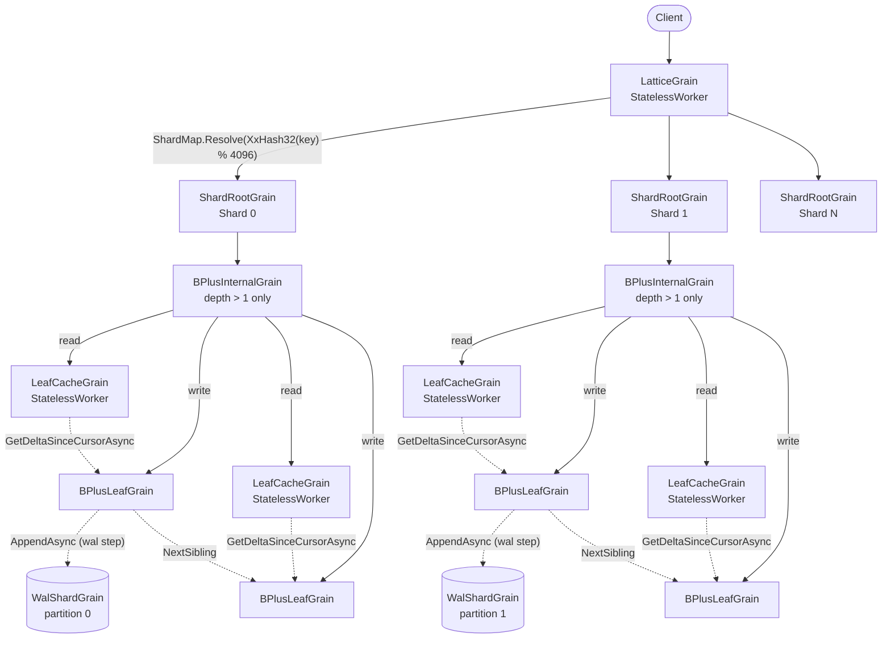
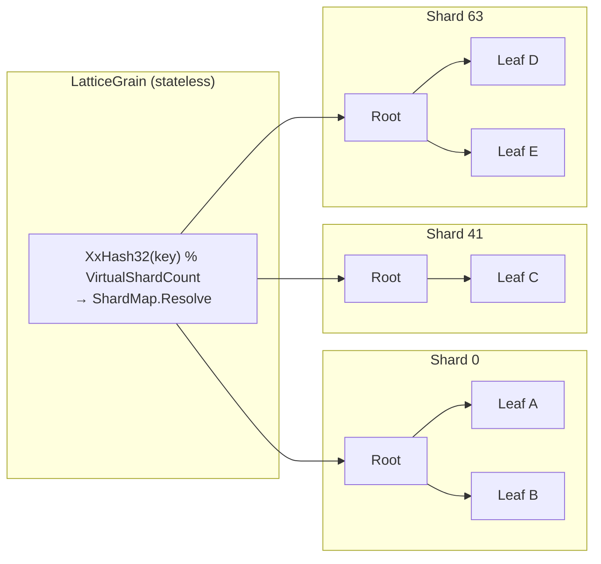
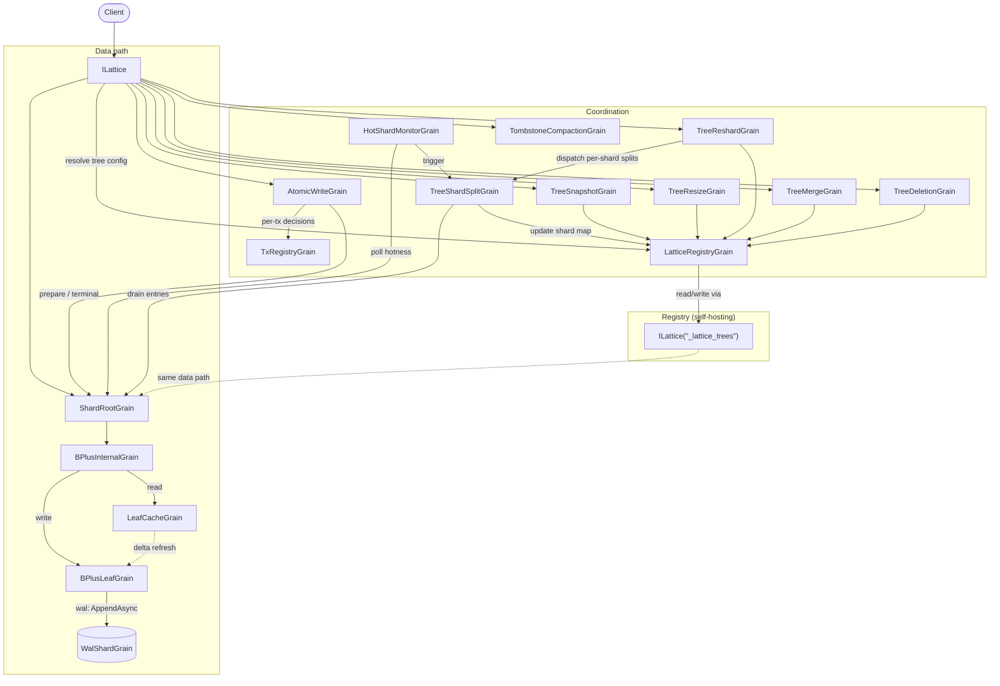

# Architecture

## High-Level Architecture

A request flows through five layers of Orleans grains. Writes are appended to a per-shard write-ahead log inline with the leaf commit, so a successful return from `SetAsync` / `DeleteAsync` is the durability point; reads are served by a stateless cache that pulls deltas from the primary leaf:

1. **`LatticeGrain`** - a `[StatelessWorker]` grain (many concurrent activations). Resolves the key's virtual slot via `XxHash32(key) % VirtualShardCount`, looks up the physical shard index in the cached `ShardMap`, and forwards the request to the corresponding `ShardRootGrain`.
2. **`ShardRootGrain`** - one per shard (keyed `{treeId}/{shardIndex}`). Manages the root pointer for its sub-tree. When the root is a leaf (small shard), traversal goes directly from `ShardRootGrain` to that leaf; once the shard grows enough to require a `BPlusInternalGrain` root, routing flows through one or more internal levels. Handles root-level splits by creating new internal nodes above the old root, and routes reads through the cache layer.
3. **`BPlusInternalGrain`** - an internal node holding separator keys and child references. Only allocated once the shard's depth exceeds 1. Routes a key to the correct child and accepts promoted splits from below. Split acceptance is idempotent - duplicate deliveries are detected and skipped.
4. **`LeafCacheGrain`** - a `[StatelessWorker]` read-through cache. Each silo may have its own activation. On a cache miss, or when its copy is stale, it pulls a `StateDelta` from the primary leaf - only the entries whose per-key delivery sequence is newer than the cursor it last saw, or the whole leaf once the leaf's activation has changed - and merges entries using `LwwValue.Merge`. Because the merge is commutative and idempotent, stale entries are harmlessly overwritten without an invalidation protocol.
5. **Leaf node** - holds its live key -> value entries in an in-memory sorted cache, rebuilt on activation from the leaf's snapshot and the canonical WAL (the persisted leaf state row carries only topology and checkpoint metadata, never the entries themselves). Splits when its entry count exceeds the configured maximum or its entries' combined size exceeds `LatticeOptions.MaxLeafBytes`. Advances a `VersionVector` on every foreground write, and numbers its writes with an activation-scoped delivery cursor that the cache layer pulls deltas against. Every commit runs the **`wal -> apply -> observer -> digest`** pipeline: the leaf awaits the append to its WAL partition (the commit point - a WAL failure surfaces to the caller before any in-memory mutation happens), then LWW-merges into its projection, then notifies any registered `IMutationObserver` (the seam the [replication package](#replication) attaches to), then publishes a projection-hash digest to its parent internal node.

## Sharding

Without sharding, every operation starts at a single root grain - a serialisation bottleneck. Sharding eliminates this by giving each key range its own independent sub-tree:

The hash function (`XxHash32`) is **stable across processes** - unlike `string.GetHashCode()`, it will always route the same key to the same shard. The default shard count is 64, configurable at tree creation time.

**Shard map indirection.** Routing is two-stage: keys hash into a large fixed virtual space (a compile-time constant fixed at 4096 slots), and a per-tree `ShardMap` maps each virtual slot onto a physical shard. The default map (`slot[i] = i % shardCount`) preserves the legacy `hash % shardCount` routing bit-for-bit when the shard count divides 4096 evenly; `ShardMap.CreateDefault` does not enforce that (it requires only a shard count between 1 and the virtual slot count), and any other count still routes deterministically, just not identically to the legacy formula. The shard map is persisted on the tree's registry entry, fetched lazily by the router on first access, cached by the activation, and invalidated when a shard reports stale shard routing (a split or consolidation has moved slots) or, together with the physical-tree-ID cache, a stale alias. This indirection decouples logical key routing from the physical shard count, enabling adaptive shard splitting without rehashing existing keys. The virtual shard count is not a `LatticeOptions` property because changing it would invalidate every persisted `ShardMap` (slots are referenced by integer index).

**Trade-off:** Keys in different shards have no ordering relationship. A global range scan requires a scatter-gather across all shards followed by a merge.

### Key distribution is not an adversarial boundary

Both the shard hash (`XxHash32`, key → virtual slot → physical shard) and the WAL-partition hash (FNV-1a, key → `WalShardGrain` partition) are **fast, non-cryptographic, unseeded** functions, deliberately so: the mapping must be byte-for-byte stable across every silo and process in the cluster (`string.GetHashCode()` is rejected precisely because it is process-randomised). That determinism is load-bearing - two activations of a router or producer that hash the same key must always pick the same shard and partition, or per-partition WAL sequence ordering loses its meaning.

A consequence of an unseeded, publicly known hash is that anyone who can both **choose key strings** and knows the shard / partition count can precompute keys that all land on a single shard or WAL partition, concentrating load and defeating the even distribution the system relies on. This is a *load-distribution* property, not a correctness or confidentiality one: the worst case is that an N-shard tree behaves like a 1-shard tree for the affected keys (a hot shard / hot partition with the attendant latency and throughput imbalance). It never corrupts data, crosses a tree boundary, or discloses anything, and the per-shard structure remains an ordinary B+ tree - there is no algorithmic-complexity blow-up.

Lattice therefore treats **keys as trusted input**: key distribution is assumed to be roughly uniform because the writers choosing the keys are trusted, exactly as the write surface itself is. In the normal deployment model an actor who can choose colliding keys already holds write access and could load any single shard directly, so the hash grants no extra capability. The one case that deserves attention is a multi-tenant front end that is itself trusted (holds write access) but **embeds untrusted, caller-supplied data in the key** (a tenant id, username, document slug, and so on): there the key *content* is partially adversary-controlled through a trusted door, and an attacker could steer those keys onto one shard. If your keys are constructed that way and you face a hostile tenant, spread the attacker-influenced portion across the key space yourself (for example by prefixing the key with a hash of the stable, trusted tenant identity) rather than relying on the placement hash to do it. Re-seeding the placement hash with a deployment secret is intentionally *not* offered as a built-in knob: it would change the mapping of every existing key, disturbing on-disk WAL partitioning and the per-partition sequence ordering downstream shippers depend on, for a threat that is out of scope under the trusted-writer model.

## Root Promotion

When a split cascades all the way up to the shard root, the shard root creates a new internal root above the old one via a **two-phase promotion**:

1. **Phase 1 (persist intent):** the division being promoted, and whether the old root was a leaf, are recorded on the shard root's persisted state.
2. **Phase 2 (create root):** a new internal node is created with a **deterministic `GrainId`** derived from the shard key and the old root's ID (a `SHA-256` hash). It is initialised with the promoted key and with the old root and the new sibling as its children; the shard root then repoints its root at it and clears the intent.

If the shard root crashes between phases, its next operation - every shard-root operation checks for owed work first - finds the recorded intent and completes it. The deterministic `GrainId` ensures that re-executing Phase 2 targets the same grain - making the promotion idempotent. A promotion runs under the same per-shard gate as every other split link (see [Tree Structure](tree-structure.md#leaf-splits)).

## Bounded Retry

`ShardRootGrain` wraps its dispatch to a leaf - for `SetAsync` (with or without a TTL), `DeleteAsync`, `GetOrSetAsync`, `SetIfVersionAsync`, CRDT deltas, and the batched write and merge paths - in a bounded retry loop. A transient Orleans, timeout, or I/O fault (e.g. a storage fault or network partition) is retried for up to 3 attempts in total, a fixed bound rather than an option. A write refused by a leaf that empty-leaf reclaim is retiring is instead retried with a short jittered backoff until `LatticeOptions.LeafRetirementRetryDeadline` (default 2 s) expires. Orleans automatically deactivates a failed grain; the retry hits a fresh activation that runs any pending recovery logic before processing the request. This shields callers from transient infrastructure errors without requiring client-side retry code.

## Grain-to-Grain Mapping

### Data-path grains

These grains form the structural B+ tree and handle every read/write request:

| B+ Tree Concept | Orleans Grain | Key Format | Persistent State |
|---|---|---|---|
| Shard router | `LatticeGrain` (`[StatelessWorker]`) | `{treeId}` | None (stateless). Caches the resolved `ShardMap` in memory; invalidated on stale-routing detection. |
| Shard root | `ShardRootGrain` | `{treeId}/{shardIndex}` | `ShardRootState` - root node ID + leaf/internal flag + pending promotion + pending bulk graft + last completed bulk operation ID, plus deleted and registered flags and the bounded bookkeeping [Tree Storage](tree-storage.md#wal-first-storage-model) lists (dirty-leaf map, moved-away slot table, in-flight split record, owed child links and leaf clears) |
| Internal node | `BPlusInternalGrain` | `Guid` | `InternalNodeState` - sorted children + HLC + split state, plus the subtree digest fold and per-child digest table |
| Leaf node | `BPlusLeafGrain` | `Guid` | Leaf state row - topology (sibling pointers, parent, key range, split state) + HLC + version vector + projection checkpoint offsets + 16-byte projection hash (see [State Model](state-model.md) for the full list). Per-key LWW entries are **not** persisted; the per-activation runtime cache is rebuilt on activation from the leaf's snapshot plus a WAL replay beyond it, or by replaying the whole readable WAL window when no snapshot covers it. |
| Leaf cache | `LeafCacheGrain` (`[StatelessWorker]`) | `{leafGrainId}` | None (in-memory LWW-map, version vector, and delivery cursor) |

### Tree registry

| Grain | Key Format | Storage |
|---|---|---|
| `LatticeRegistryGrain` | `_lattice_trees` (the `LatticeConstants.RegistryTreeId` constant) | **Self-hosting** - stores its data in a Lattice tree keyed `_lattice_trees`, so registry reads/writes flow through the same shard router -> shard root -> leaf node path as user data. |

The registry holds one entry per user tree, containing:

- **The shard map** - the per-tree mapping from virtual slots to physical shard indices. Absent until the first topology change (an adaptive split, a shard consolidation, or an empty-tree reshard); the router falls back to the default identity map (`ShardMap.CreateDefault` over the 4096 virtual slots and the pinned shard count) when absent.
- **Structural pins** - per-tree `MaxLeafKeys`, `MaxInternalChildren`, and `ShardCount`, seeded on first use from the library defaults (128 / 128 / 64). These are the sole source of structural truth, read by every grain through the registry. Mutable only through `ResizeAsync` (leaf / internal capacity) and `ReshardAsync` (shard count), or supplied when the tree is first created through the tree-administration facade.
- **Tree alias** - an optional indirection from a logical tree name to a physical tree ID, used by `ResizeAsync` (and by a shadow-cutover restore) to swap the backing tree atomically.
- **Runtime overrides and bookkeeping** - optional per-tree overrides (publish-events, projection-digest maintenance and its permanent-disable latch, durable-history retention, `MaxCacheValueBytes`, `WalMaxRetainedBytes`), the tree's pinned WAL partition count and WAL placement, the highest physical shard index adaptive splits have allocated, and, on a restore's shadow tree, the logical tree it was restored for.

Soft-delete state is **not** held on the registry entry: the deletion timestamp and purge progress live with the tree's deletion coordinator (see [Tree Deletion](tree-deletion.md)), and the window itself is `LatticeOptions.SoftDeleteDuration`.

### Coordination grains

Long-running or multi-step operations are managed by dedicated coordination grains. Each persists its progress, and the reminder-driven ones register an Orleans reminder so that a silo crash mid-operation is recovered automatically on the next reminder tick. All are internal - external callers interact only through methods on `ILattice`.

| Operation | Orleans Grain | Key Format | Persistent State | Reminder-driven |
|---|---|---|---|---|
| Adaptive shard split | `TreeShardSplitGrain` | `{treeId}/{shardIndex}` | `TreeShardSplitState` - source/dest shard, migrating slots, drain cursor, phase | Yes |
| Shard consolidation (over-split healing) | Consolidation coordinator, one per donor shard | `{treeId}/{donorShardIndex}` (the physical tree id) | Donor and survivor shard, donor slots, the pre-consolidation shard map, drain cursor and progress counters, phase, cancellation flags | Yes |
| Shard-healing orchestration | Healing orchestrator, one per tree | `{treeId}` | In-flight donor shards, cooldown, and the last decision and observation | Yes |
| Online reshard | `TreeReshardGrain` | `{treeId}` | Target shard count, operation ID, phase, and in-progress / complete flags; eligible sources and the dispatch budget are recomputed on every tick, not persisted | Yes |
| Hot-shard monitoring | `HotShardMonitorGrain` | `{treeId}` | `HotShardMonitorState` - first-activation timestamp so the auto-split grace period survives silo restarts (polls `ShardRootGrain.GetHotnessAsync` on each tick) | Yes |
| Cluster-wide split admission | Admission gate, a cluster singleton | `0` | Per-tree split footprints (admission and observation-only), each with an expiry | No |
| Tree merge | `TreeMergeGrain` | `{treeId}` | `TreeMergeState` - source tree, per-shard progress | Yes |
| Snapshot | `TreeSnapshotGrain` | `{treeId}` | `TreeSnapshotState` - destination tree, per-shard progress, phase | Yes |
| Resize | `TreeResizeGrain` | `{treeId}` | `TreeResizeState` - old/new tree IDs, sizing overrides, phase | Yes |
| Soft delete / purge | `TreeDeletionGrain` | `{treeId}` | Deleted flag and timestamp, purge progress (next shard index, per-shard retries), and a purge-complete flag; the soft-delete window is read from `SoftDeleteDuration`, not persisted | Yes |
| Tombstone compaction | `TombstoneCompactionGrain` | `{treeId}` | `TombstoneCompactionState` - per-shard compaction cursor | Yes |
| Atomic write saga | `AtomicWriteGrain` | `{treeId}/{operationId}` | Saga phase (prepare, prepared, execute, compensate, completed, or precondition-failed), the entries with their captured pre-values, and per-step progress; the retention period is `AtomicWriteRetention`, applied by the retention reminder | Yes (keepalive + retention) |
| Per-tree tx registry (sharded) | `TxRegistryGrain` | `_lattice_txshard_{n}_{treeId}` (`{treeId}` for the legacy, pre-sharding registry) | `TxRegistryState` - per-transaction commit/abort decisions with bounded retention window | No |
| Tx registry shard high-water | `TxRegistryHighWaterGrain` | `{treeId}` | `TxRegistryHighWaterState` - the highest registry shard index plus one ever written, which bounds tree-wide registry reads | No |

The same pattern backs the rest of the library's multi-step features, each described with its feature: [atomic actions](atomic-action.md), cross-tree [atomic writes](atomic-writes.md) and their receiver-side visibility barrier, the [distributed lock](distributed-lock.md), [materialised-view](materialised-views.md) maintenance and its registry, and tag-index reconciliation.

### Durability and transport grains

These grains carry the per-shard write-ahead log, leaf-projection replay, cursor-paged enumeration, and ambient counters / metrics:

| Purpose | Orleans Grain | Key Format | Persistent State |
|---|---|---|---|
| Per-shard WAL | `WalShardGrain` | `{treeId}/{partition}` (partition = stable hash of key mod `WalPartitions`) | None as grain state - appends `WalRecord` entries directly to the configured `IWalStorageProvider` (the append is the commit point) and recovers its next offset from the provider on activation |
| Leaf replay coordinator | `LeafReplayCoordinatorGrain` | `{treeId}/{partition}` (the WAL partition it reads) | None - forwards activation-replay WAL slice reads to the registered commit-log reader, passing each leaf's replay filter down to storage (issue #3565), and caches the last-served slice in memory for five seconds, keyed by window and filter, so back-to-back reads of the same window with the same ownership share one read |
| Leaf snapshot storage | Snapshot store, one per leaf | the leaf's `Guid` | The leaf's snapshot blob (`leaf-snapshot`), or a manifest over separate `leaf-snapshot-segment` rows for a payload above `LeafSnapshotSegmentBytes` - see [Tree Storage](tree-storage.md#sizing-surface-3---leaf-snapshot-blob) |
| Cursor pagination | `LatticeCursorGrain` | `{treeId}/{cursorId}` | Cursor position (key bound + reverse flag + scan kind); released on `CloseCursorAsync` |
| Tree stats | `LatticeStatsGrain` | `{treeId}` | None (aggregates over the live shard / leaf grains for `DiagnoseAsync`) |
| TTL self-cleanup base | `TtlGrain<TSelf>` (abstract) | N/A - each concrete grain keeps its own key | None of its own - registers, slides and dispatches the reminder that deletes a transient grain's state after an idle or retention TTL, for grains such as cursors, atomic-write and atomic-action sagas, locks, and cross-tree transactions |

### Interaction diagram

The following diagram shows how `ILattice` delegates to data-path and coordination grains, and how the registry self-hosts its own data through the same data path.

All coordination grain interfaces are declared `internal` - external callers interact only through methods on `ILattice`.

## Replication

When the optional [`Orleans.Lattice.Replication`](../../src/lattice.replication) package is registered on the silo, two seams attach to the data path described above and a per-cluster transport carries mutations to peer clusters. The core library is unaware of replication - the only contact surfaces are `IMutationObserver` (commit-time capture, fired in the `observer` step of the leaf commit) and `IReplicationApplier` (receiver-side merge, which commits inbound writes through the same leaf path local writes use), both first-class core extension points.

The full producer-to-receiver pipeline - capture, per-shard replication WAL, change feed, per-peer shipping, transport, receiver apply, bootstrap, and dead-letter quarantine - together with the invariants it preserves end-to-end (origin-stamped cycle breaking, source-HLC preservation, all-or-nothing atomic-write delivery, per-tree CRDT merge dispatch, and local-only events) is documented in [`../lattice.replication/architecture.md`](../lattice.replication/architecture.md). The chaos-test suite that exercises every invariant lives under [`test/lattice.replication/Chaos/`](../../test/lattice.replication/Chaos) and is summarised in [`../lattice.replication/chaos-tests.md`](../lattice.replication/chaos-tests.md).

## Capacity and Depth

With the default branching factor of 128:

| Keys per shard | Tree depth | Total grains per shard |
|---|---|---|
| ≤ 128 | 1 (leaf only) | 2 (root + leaf) |
| ≤ 16,384 | 2 | ~130 |
| ≤ 2,097,152 | 3 | ~16,500 |

With 64 shards, the total tree supports **~134 million keys** at depth 3. Depth adds no grain calls on the steady-state path: the shard root caches each internal node's routing table, so a lookup at any depth is the router, the shard root, and the leaf - or, for a read, the leaf's cache, which pulls a delta from the leaf when it is stale. An internal node is consulted only when that routing cache misses, on the first descent after the shard root activates or after a split changes the node. Actual latency depends on cluster topology, network conditions, and storage provider performance.
