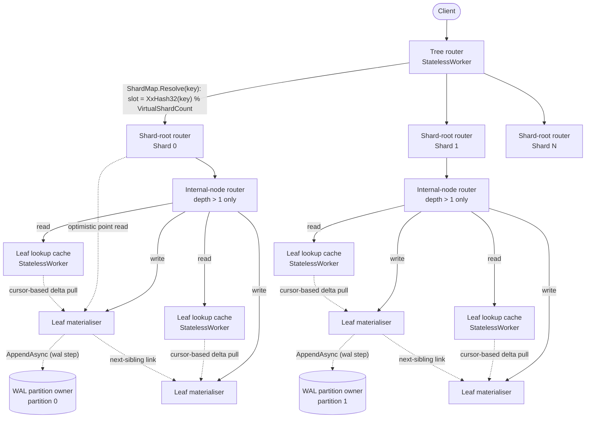
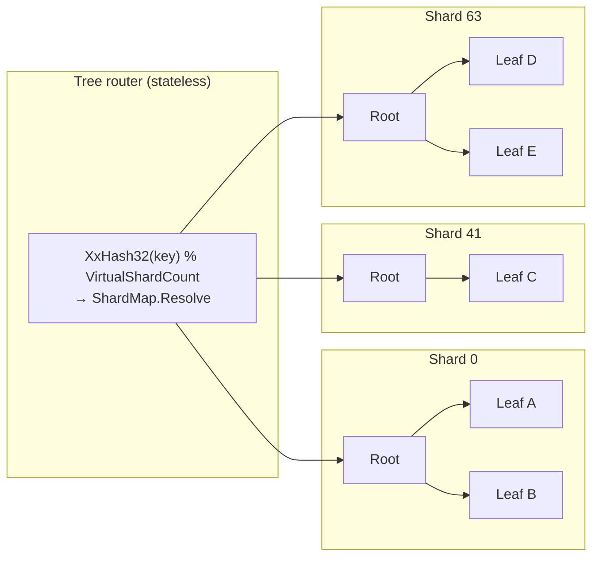
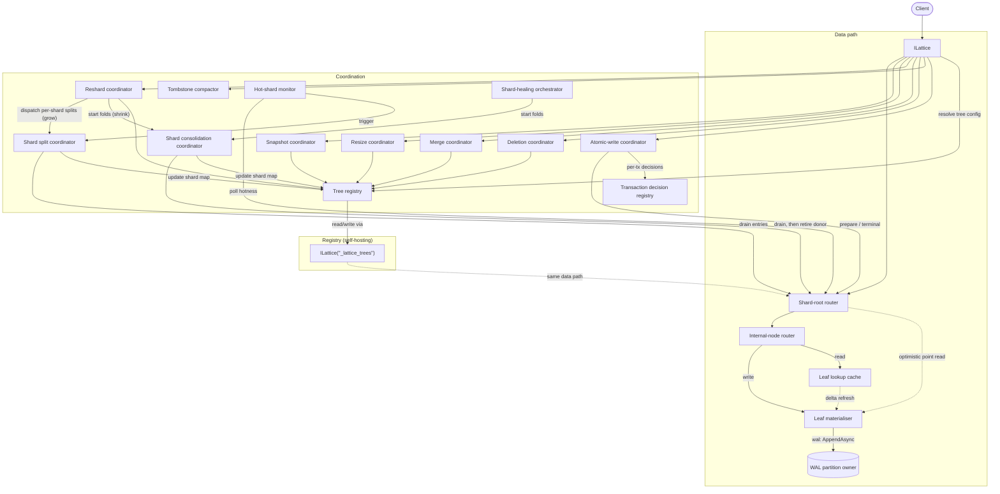

# Architecture

## High-Level Architecture

A request flows through five layers of Orleans grains. Writes are appended to the tree's write-ahead log - the partition the key hashes to - inline with the leaf commit, so a successful return from `SetAsync` / `DeleteAsync` is the durability point. A point read is first tried as an interleaved, optimistic read that the shard root sends straight to the primary leaf; every other read - and any point read that optimistic path cannot validate - is served by a stateless cache that pulls deltas from the primary leaf:

```mermaid
flowchart TD
    Client([Client])
    SR[Tree router<br/>StatelessWorker]
    S0[Shard-root router<br/>Shard 0]
    S1[Shard-root router<br/>Shard 1]
    SN[Shard-root router<br/>Shard N]
    I0[Internal-node router<br/>depth > 1 only]
    I1[Internal-node router<br/>depth > 1 only]
    C0[Leaf lookup cache<br/>StatelessWorker]
    C1[Leaf lookup cache<br/>StatelessWorker]
    C2[Leaf lookup cache<br/>StatelessWorker]
    C3[Leaf lookup cache<br/>StatelessWorker]
    L0[Leaf materialiser]
    L1[Leaf materialiser]
    L2[Leaf materialiser]
    L3[Leaf materialiser]
    W0[(WAL partition owner<br/>partition 0)]
    W1[(WAL partition owner<br/>partition 1)]

    Client --> SR
    SR -->|"ShardMap.Resolve(key): slot = XxHash32(key) % VirtualShardCount"| S0
    SR --> S1
    SR --> SN
    S0 --> I0
    S1 --> I1
    I0 -->|read| C0
    I0 -->|read| C1
    I1 -->|read| C2
    I1 -->|read| C3
    I0 -->|write| L0
    I0 -->|write| L1
    I1 -->|write| L2
    I1 -->|write| L3
    S0 -.->|"optimistic point read"| L0
    L0 -. "AppendAsync (wal step)" .-> W0
    L2 -. "AppendAsync (wal step)" .-> W1
    C0 -.->|"cursor-based delta pull"| L0
    C1 -.->|"cursor-based delta pull"| L1
    C2 -.->|"cursor-based delta pull"| L2
    C3 -.->|"cursor-based delta pull"| L3
    L0 -. "next-sibling link" .-> L1
    L2 -. "next-sibling link" .-> L3
```

1. **tree router** - a `[StatelessWorker]` grain (many concurrent activations, capped at 256 per silo, which bounds a silo's concurrency of single-key calls). Resolves the key's virtual slot via `XxHash32(key) % VirtualShardCount`, looks up the physical shard index in the cached `ShardMap`, and forwards the request to the corresponding shard-root router.
2. **shard-root router** - one per shard (keyed `{treeId}/{shardIndex}`). Manages the root pointer for its sub-tree. When the root is a leaf (small shard), traversal goes directly from shard-root router to that leaf; once the shard grows enough to require an internal-node router root, routing flows through one or more internal levels. Handles root-level splits by creating new internal nodes above the old root, and routes serial reads through the cache layer. Point reads and point writes interleave on it: a point read is first tried optimistically against the primary leaf and validated against the shard root's in-memory routing epoch (and, where required, the leaf's ownership proof), falling back to the serial read when routing moved under it ([`OptimisticShardRootPointReads`](configuration.md#optimisticshardrootpointreads), on by default); a point write is held back while a non-interleaved turn runs, and that turn first waits for the point writes already in flight to drain. A deactivation the shard root requests itself is deferred until its in-flight point and batch writes drain, and a write arriving meanwhile is refused with a retriable fault that the router absorbs.
3. **internal-node router** - an internal node holding separator keys and child references. Only allocated once the shard's depth exceeds 1. Routes a key to the correct child and accepts promoted splits from below. Split acceptance is idempotent - duplicate deliveries are detected and skipped.
4. **leaf lookup cache** - a `[StatelessWorker]` read-through cache. Each silo may have its own activation. On a cache miss, or when its copy is stale, it pulls a per-key delta from the primary leaf - only the entries whose per-key delivery sequence is newer than the cursor it last saw, or the whole leaf once the leaf's activation has changed - and merges entries using the last-writer-wins merge. Because the merge is commutative and idempotent, stale entries are harmlessly overwritten without an invalidation protocol.
5. **Leaf node** - holds its key -> value entries, tombstones included, in an in-memory sorted cache, rebuilt on activation from the leaf's snapshot and the canonical WAL (the persisted leaf state row carries topology, clocks and checkpoint metadata, never the entries themselves). Splits when its entry count exceeds the configured maximum or its entries' combined size exceeds `LatticeOptions.MaxLeafBytes`. Advances a `VersionVector` on every foreground write, and numbers its writes with an activation-scoped delivery cursor that the cache layer pulls deltas against. Every commit runs the **`wal -> apply -> observer -> digest`** pipeline: the leaf awaits the append to its WAL partition (the commit point - a WAL failure surfaces to the caller before any in-memory mutation happens), then LWW-merges into its projection, then notifies any registered `IMutationObserver` (the seam the [replication package](#replication) attaches to), then publishes a projection-hash digest to its parent internal node - by default coalesced over a short window (`LatticeOptions.DigestCoalescingWindowMs`, 5 ms), so the commits inside one window share a single publish instead of each awaiting its own.

## Sharding

Without sharding, every operation starts at a single root grain - a serialisation bottleneck. Sharding eliminates this by giving each key range its own independent sub-tree:

```mermaid
flowchart LR
    subgraph Router["Tree router (stateless)"]
        H["XxHash32(key) % VirtualShardCount<br/>→ ShardMap.Resolve"]
    end

    subgraph Shard0["Shard 0"]
        R0[Root] --> LA[Leaf A]
        R0 --> LB[Leaf B]
    end

    subgraph Shard41["Shard 41"]
        R41[Root] --> LC[Leaf C]
    end

    subgraph Shard63["Shard 63"]
        R63[Root] --> LD[Leaf D]
        R63 --> LE[Leaf E]
    end

    H --> R0
    H --> R41
    H --> R63
```

The hash function (`XxHash32`) is **stable across processes** - unlike `string.GetHashCode()`, it will always route the same key to the same shard. The default shard count is 64, configurable at tree creation time.

**Shard map indirection.** Routing is two-stage: keys hash into a virtual slot space, and a per-tree `ShardMap` maps each virtual slot onto a physical shard. The slot count is the number of slots in the tree's map: 4096 - a compile-time constant - for every tree except one an installed app created with a `virtualShardCount` in its manifest ([Orleans.Lattice.Apps](../lattice.apps/README.md)), whose map is created over that slot count when the tree is first registered. The default map (`slot[i] = i % shardCount`) preserves the legacy `hash % shardCount` routing bit-for-bit when the shard count divides the slot count evenly; `ShardMap.CreateDefault` does not enforce that (it requires only a shard count between 1 and the virtual slot count), and any other count still routes deterministically, just not identically to the legacy formula. The shard map is persisted on the tree's registry entry, fetched lazily by the router on first access, cached by the activation, and invalidated when a shard reports stale shard routing (a split or consolidation has moved slots) or, together with the physical-tree-ID cache, a stale alias; a tree with no persisted map routes by the default map over 4096 slots and its pinned shard count. This indirection decouples logical key routing from the physical shard count, enabling adaptive shard splitting without rehashing existing keys. The virtual shard count is not a `LatticeOptions` property because changing a tree's slot count re-routes its keys, and slots are referenced by integer index in its persisted `ShardMap`. A resize carries a tree's map over to the resized copy, and an online reshard of an empty tree rebuilds it over the slot count it already had.

**Trade-off:** Keys in different shards have no ordering relationship. A global range scan requires a scatter-gather across all shards followed by a merge.

### Key distribution is not an adversarial boundary

Both the shard hash (`XxHash32`, key -> virtual slot -> physical shard) and the WAL-partition hash (FNV-1a, key -> WAL partition) are **fast, non-cryptographic, unseeded** functions, deliberately so: the mapping must be byte-for-byte stable across every silo and process in the cluster (`string.GetHashCode()` is rejected precisely because it is process-randomised). That determinism is load-bearing - two activations of a router or producer that hash the same key must always pick the same shard and partition, or per-partition WAL sequence ordering loses its meaning.

A consequence of an unseeded, publicly known hash is that anyone who can both **choose key strings** and knows the shard / partition count can precompute keys that all land on a single shard or WAL partition, concentrating load and defeating the even distribution the system relies on. This is a *load-distribution* property, not a correctness or confidentiality one: the worst case is that an N-shard tree behaves like a 1-shard tree for the affected keys (a hot shard / hot partition with the attendant latency and throughput imbalance). It never corrupts data, crosses a tree boundary, or discloses anything, and the per-shard structure remains an ordinary B+ tree - there is no algorithmic-complexity blow-up.

Lattice therefore treats **keys as trusted input**: key distribution is assumed to be roughly uniform because the writers choosing the keys are trusted, exactly as the write surface itself is. In the normal deployment model an actor who can choose colliding keys already holds write access and could load any single shard directly, so the hash grants no extra capability. The one case that deserves attention is a multi-tenant front end that is itself trusted (holds write access) but **embeds untrusted, caller-supplied data in the key** (a tenant id, username, document slug, and so on): there the key *content* is partially adversary-controlled through a trusted door, and an attacker could steer those keys onto one shard. If your keys are constructed that way and you face a hostile tenant, spread the attacker-influenced portion across the key space yourself (for example by prefixing the key with a hash of the stable, trusted tenant identity) rather than relying on the placement hash to do it. Re-seeding the placement hash with a deployment secret is intentionally *not* offered as a built-in knob: it would change the mapping of every existing key, disturbing on-disk WAL partitioning and the per-partition sequence ordering downstream shippers depend on, for a threat that is out of scope under the trusted-writer model.

## Root Promotion

When a split cascades all the way up to the shard root, the shard root creates a new internal root above the old one via a **two-phase promotion**:

1. **Phase 1 (persist intent):** the division being promoted, and whether the old root was a leaf, are recorded on the shard root's persisted state.
2. **Phase 2 (create root):** a new internal node is created with a **deterministic `GrainId`** derived from the shard key and the old root's ID (a `SHA-256` hash). It is initialised with the promoted key and with the old root and the new sibling as its children; the shard root then repoints its root at it and clears the intent.

If the shard root crashes between phases, its next operation - every shard-root operation checks for owed work first - finds the recorded intent and completes it. The deterministic `GrainId` ensures that re-executing Phase 2 targets the same grain - making the promotion idempotent. A promotion runs under the same per-shard gate as every other split link (see [Tree Structure](tree-structure.md#leaf-splits)).

## Bounded Retry

The shard-root router wraps its dispatch to a leaf - for `SetAsync` (with or without a TTL), `DeleteAsync`, `GetOrSetAsync`, `SetIfVersionAsync`, CRDT deltas, and the batched write and merge paths - in a bounded retry loop. A transient Orleans, timeout, or I/O fault (e.g. a storage fault or network partition) is retried for up to 3 attempts in total, a fixed bound rather than an option. A write refused by a leaf that empty-leaf reclaim is retiring is instead retried with a short jittered backoff until `LatticeOptions.LeafRetirementRetryDeadline` (default 2 s) expires. Orleans automatically deactivates a failed grain; the retry hits a fresh activation that runs any pending recovery logic before processing the request. This shields callers from transient infrastructure errors without requiring client-side retry code.

## Grain-to-Grain Mapping

### Data-path grains

These grains form the structural B+ tree and handle every read/write request:

| B+ Tree Concept | Orleans Grain | Key Format | Persistent State |
|---|---|---|---|
| Shard router | tree router (`[StatelessWorker]`) | `{treeId}` | None (stateless). Caches the resolved `ShardMap` in memory; invalidated on stale-routing detection. |
| Shard root | shard-root router | `{treeId}/{shardIndex}` | The shard root's state - root node ID + leaf/internal flag + pending promotion + pending bulk graft + last completed bulk operation ID, plus deleted, registered and retired flags (retired when an online shard consolidation releases the shard's storage, leaving its moved-away slot table as a routing tombstone), the fixed-size records an online resize or snapshot (shadow-forward state), a shadow-cutover restore (retained redirect) and a cross-cluster saga (write fence) install, the stranded-scan-leaf recovery record, and the bounded bookkeeping [Tree Storage](tree-storage.md#wal-first-storage-model) lists (dirty-leaf map, moved-away slot table, in-flight split record, leaf-access histogram, owed child links and leaf clears) |
| Internal node | internal-node router | `Guid` | Internal node state row - tree id, parent, sorted children (and whether they are leaves) + HLC + split state, the separator key, new sibling and handed-over children of a split in progress, the subtree digest fold, the per-child digest table, and the digest-publish sequence |
| Leaf node | leaf materialiser | `Guid` | Leaf state row - topology (sibling pointers, parent, key range, split state) + HLC + version vector + projection checkpoint offsets + 16-byte projection hash (see [State Model](state-model.md) for the full list). Per-key LWW entries are **not** persisted; the per-activation runtime cache is rebuilt on activation from the leaf's snapshot plus a WAL replay beyond it, or by replaying the whole readable WAL window when no covering snapshot was ever kept (subject to the genuine-loss guard). An unreadable snapshot, or a missing snapshot recorded as previously kept, fails the projection closed instead. |
| Leaf cache | leaf lookup cache (`[StatelessWorker]`) | `{leafGrainId}` | None (in-memory LWW-map, version vector, and delivery cursor) |

### Tree registry

| Grain | Key Format | Storage |
|---|---|---|
| tree registry | `_lattice_trees` (the registry tree id) | **Self-hosting** - stores its data in a Lattice tree keyed `_lattice_trees`, so registry reads/writes flow through the same shard router -> shard root -> leaf node path as user data. |

The registry holds one entry per user tree, containing:

- **The shard map** - the per-tree mapping from virtual slots to physical shard indices. Absent until the first topology change (an adaptive split, a shard consolidation, or an empty-tree reshard), except on a tree an installed app created with a `virtualShardCount` in its manifest, whose map is stored over that slot count when the tree is first registered; a resize carries the map over to the resized copy. The router falls back to the default identity map (`ShardMap.CreateDefault` over 4096 virtual slots and the pinned shard count) while it is absent.
- **Structural pins** - per-tree `MaxLeafKeys`, `MaxInternalChildren`, and `ShardCount`, seeded on first use from the library defaults (128 / 128 / 64). These are the sole source of structural truth, read by every grain through the registry. Mutable only through `ResizeAsync` (leaf / internal capacity) and `ReshardAsync` (shard count), or supplied when the tree is first created, through the tree-administration facade or by an installed app's manifest (which can also pin the tree's WAL partition count and virtual slot count).
- **Tree alias** - an optional indirection from a logical tree name to a physical tree ID, used by `ResizeAsync`, a shadow-cutover restore and a schema remediation to swap the backing tree atomically, and settable directly through the tree-administration facade (`ILatticeTreeAdmin.SetTreeAliasAsync`). Only one level of indirection is allowed, and an alias is not changed while either tree is deleted or has a delete pending. Every alias assignment, maintenance ones included, is put to the `ITreeOwnershipGuard` seam before it is written. The seam allows every alias unless the host registers an ownership provider (the [apps package](../lattice.apps/README.md) does), and a refusal throws `LatticeTreeOwnershipDeniedException` and writes nothing.
- **Runtime overrides and bookkeeping** - optional per-tree overrides (publish-events, projection-digest maintenance and its permanent-disable latch, durable-history retention, `MaxCacheValueBytes`, `WalMaxRetainedBytes`), the tree's pinned WAL partition count and WAL placement, the split allocation high-water mark (the highest physical shard index a split has allocated, which a fold also raises past the donor it retires), and, on a physical copy a resize, shadow-cutover restore or schema remediation created, the logical tree it was created to back (a restore's shadow tree also records the logical tree it was restored for). A delete through an alias acts only on a copy created for the deleting tree, and the per-tree `tree` metric tag reports such a copy under that logical tree.

Soft-delete state is **not** held on the registry entry: the deletion timestamp and purge progress live with the tree's deletion coordinator (see [Tree Deletion](tree-deletion.md)), and the window itself is `LatticeOptions.SoftDeleteDuration`.

### Coordination grains

Long-running or multi-step operations are managed by dedicated coordination grains. Each persists its progress, and the reminder-driven ones register an Orleans reminder so that a silo crash mid-operation is recovered automatically on the next reminder tick. All are internal - external callers interact only through methods on `ILattice`.

| Operation | Orleans Grain | Key Format | Persistent State | Reminder-driven |
|---|---|---|---|---|
| Adaptive shard split | adaptive shard-split coordinator | `{treeId}/{shardIndex}` | Source/dest shard, migrating slots, the pre-split shard map (kept for rollback), drain cursor, phase, operation ID, and in-progress / complete flags | Yes |
| Shard consolidation (over-split healing, or a shrinking reshard) | Consolidation coordinator, one per donor shard | `{treeId}/{donorShardIndex}` (healing addresses it by the physical tree id, a shrinking reshard by the logical tree id) | Donor and survivor shard, donor slots, the pre-consolidation shard map, drain cursor and progress counters, phase, cancellation flags, operation ID, in-progress / complete flags, and start / last-update times | Yes |
| Shard-healing orchestration | Healing orchestrator, one per tree | `{treeId}` | In-flight donor shards, cooldown, and the last decision and observation | Yes |
| Online reshard | tree reshard coordinator | `{treeId}` | Target shard count and the count it started from, whether it shrinks, the donor shards of the folds a shrink has started, operation ID, phase, and in-progress / complete flags; eligible sources and the dispatch budget are recomputed on every tick, not persisted | Yes |
| Hot-shard monitoring | hot-shard monitor | `{treeId}` | hot-shard monitor state - first-activation timestamp so the auto-split grace period survives silo restarts (polls the shard hotness read on each tick) | Yes |
| Cluster-wide split admission | Admission gate, a cluster singleton | `0` | Per-tree split footprints (admission and observation-only), each with an expiry | No |
| Tree merge | tree merge coordinator | `{treeId}` | Source tree, the source and target physical tree ids and source shards captured at the start, per-shard progress and retries, a drain cursor, where the latest generation of source shards begins (re-resolved when a consolidation retires one), and in-progress / complete flags | Yes |
| Snapshot | tree snapshot coordinator | `{treeId}` | Destination tree, mode, sizing overrides, the source's logical and physical tree ids, shard count, routed shard indices and custom shard map captured at the start, per-shard progress and retries, copy and drain cursors, phase, whether it releases the shadow-forward when the copy completes, operation ID, and in-progress / complete flags | Yes |
| Resize | tree resize coordinator | `{treeId}` | Old and new physical tree IDs, sizing overrides, phase, the old shards it forwards and rejects, the pre-resize registry entry an undo restores, and the alias reservation it holds on the tree while the resize or its undo runs, which refuses a delete of the tree meanwhile, plus the operation ID, shard count, and in-progress / complete flags; a separate record keeps an accepted undo's intent and outcome (undone, or withdrawn with its reason) | Yes |
| Soft delete / purge | Deletion coordinator, one per tree | `{treeId}` | Deleted flag and timestamp, purge progress (next shard index, the shard count it walks, per-shard retries, and whether the purge was explicitly requested), a purge-complete flag, whether the copy was discarded by an undone resize (and so can never be recovered), and whether the purge must leave the registry entry and compaction schedule in place (set when the deleted copy is a resize's retired physical tree, which carries the live logical tree's id). A delete of an aliased tree also records the live copy it pinned, its own deletion time and its logical delete and purge progress; a copy deleted on a logical tree's behalf is marked as driven by that tree, and it and a copy a resize retires or discards raise no lifecycle events of their own. An alias-change reservation, a pending-delete fence and a pin on an unaliased delete's own id keep an alias change and a delete from overlapping. The soft-delete window is read from `SoftDeleteDuration`, not persisted | Yes |
| Tombstone compaction | tombstone compaction coordinator | `{treeId}` | The physical tree id and shard indices captured for the current pass, per-shard progress and retries, an in-shard resume key or a position in the dirty-leaf list the shard root nominated (with its clock watermark), per-shard last-trigger times for the trigger cooldown, and an in-progress flag | Yes |
| Atomic write saga | atomic-write coordinator | `{treeId}/{operationId}` | Saga phase (not started, prepare, prepared, execute, compensate, completed, or precondition-failed), the tree id, the entries with their captured pre-values, per-entry author deltas and delete markers, the batch's author delta and vector clock, the guard predicate, the transaction id, key fingerprint and batch size, the shards the prepare touched, the start time, the failure message, the cross-tree coordinator and participant trees for a cross-tree sub-saga, and per-step progress; the retention period is `AtomicWriteRetention`, applied by the retention reminder | Yes (keepalive + retention) |
| Per-tree tx registry (sharded) | saga decision registry | `_lattice_txshard_{n}_{treeId}` (`{treeId}` for the legacy, pre-sharding registry) | Per-transaction commit/abort decisions with a bounded retention window (a forgotten decision stays queryable as a timestamped tombstone), the shards each transaction's prepare touched, cross-cluster terminal-arrival tallies and expected counts, point-in-time cursor snapshot pins, cross-tree decision delegations (sender and receiver side), and the revision and epoch counters behind the token reader fast paths validate against | No |
| Tx registry shard high-water | saga ticket allocator | `{treeId}` | saga ticket high-water state - the highest registry shard index plus one ever written, which bounds tree-wide registry reads | No |

The same pattern backs the rest of the library's multi-step features, each described with its feature: [atomic actions](atomic-action.md), cross-tree [atomic writes](atomic-writes.md) and their receiver-side visibility barrier, the [distributed lock](distributed-lock.md), [materialised-view](materialised-views.md) maintenance and its registry, and tag-index reconciliation.

### Durability and transport grains

These grains carry the partitioned write-ahead log, leaf-projection replay, cursor-paged enumeration, and ambient counters / metrics:

| Purpose | Orleans Grain | Key Format | Persistent State |
|---|---|---|---|
| WAL partition | WAL partition owner | `{treeId}/{partition}` (partition = stable hash of key mod `WalPartitions`) | None as grain state - appends `WalRecord` entries directly to the configured `IWalStorageProvider` (the append is the commit point) and recovers its next offset from the provider on activation |
| Leaf replay coordinator | leaf replay coordinator | `{treeId}/{partition}` (the WAL partition it reads) | None - forwards activation-replay WAL slice reads to the registered commit-log reader, passing each leaf's replay filter down to storage (issue #3565), and caches the last-served slice in memory for five seconds, keyed by window and filter, so back-to-back reads of the same window with the same ownership share one read |
| Leaf snapshot storage | Snapshot store, one per leaf | the leaf's `Guid` | The leaf's snapshot blob (`leaf-snapshot`), or a manifest over separate `leaf-snapshot-segment` rows for a payload above `LeafSnapshotSegmentBytes` - see [Tree Storage](tree-storage.md#sizing-surface-3---leaf-snapshot-blob) |
| Cursor pagination | durable cursor owner | `{treeId}/{cursorId}` | Lifecycle phase, the tree id, the scan spec (range, reverse flag and scan kind), the last yielded key and a range-delete cursor's running delete count, plus the captured saga-decision snapshot and its registry pin for a point-in-time cursor, and the snapshot coordinate and whether its frozen baselines have been persisted for a snapshot cursor; released on `CloseCursorAsync` |
| Tree stats | tree statistics aggregator | `{treeId}` | None (aggregates over the live shard / leaf grains for `DiagnoseAsync`) |
| TTL self-cleanup base | the shared TTL cleanup base (abstract) | N/A - each concrete grain keeps its own key | None of its own - registers, slides and dispatches the reminder that deletes a transient grain's state after an idle or retention TTL, for grains such as cursors, atomic-write and atomic-action sagas, locks, and cross-tree transactions |

### Interaction diagram

The following diagram shows how `ILattice` delegates to data-path and coordination grains, and how the registry self-hosts its own data through the same data path.

```mermaid
flowchart TD
    Client([Client]) --> ILattice

    subgraph "Data path"
        ILattice --> ShardRoot[Shard-root router]
        ShardRoot --> Internal[Internal-node router]
        Internal -->|write| Leaf[Leaf materialiser]
        Internal -->|read| Cache[Leaf lookup cache]
        Cache -.->|delta refresh| Leaf
        ShardRoot -.->|optimistic point read| Leaf
        Leaf -->|"wal: AppendAsync"| Wal[(WAL partition owner)]
    end

    subgraph "Coordination"
        ILattice --> Snapshot[Snapshot coordinator]
        ILattice --> Resize[Resize coordinator]
        ILattice --> Reshard[Reshard coordinator]
        ILattice --> Merge[Merge coordinator]
        ILattice --> Delete[Deletion coordinator]
        ILattice --> Compact[Tombstone compactor]
        ILattice --> Atomic[Atomic-write coordinator]
        Atomic -->|prepare / terminal| ShardRoot
        Atomic -->|"per-tx decisions"| TxReg[Transaction decision registry]
        Monitor[Hot-shard monitor] -->|poll hotness| ShardRoot
        Monitor -->|trigger| Split[Shard split coordinator]
        Reshard -->|"dispatch per-shard splits (grow)"| Split
        Reshard -->|"start folds (shrink)"| Fold[Shard consolidation coordinator]
        Healing[Shard-healing orchestrator] -->|start folds| Fold
        Fold -->|"drain, then retire donor"| ShardRoot
        Fold -->|update shard map| Registry
        Split -->|drain entries| ShardRoot
        Split -->|update shard map| Registry
    end

    subgraph "Registry (self-hosting)"
        ILattice -->|resolve tree config| Registry[Tree registry]
        Registry -->|read/write via| SelfLattice["ILattice(&quot;_lattice_trees&quot;)"]
        SelfLattice -.->|same data path| ShardRoot
    end

    Snapshot --> Registry
    Resize --> Registry
    Reshard --> Registry
    Merge --> Registry
    Delete --> Registry
```

All of these coordination grain interfaces are declared `internal` - external callers interact only through methods on `ILattice`. (The atomic-action and distributed-lock coordinators, described with their features, expose public grain interfaces.)

## Replication

When the optional [`Orleans.Lattice.Replication`](../../src/lattice.replication) package is registered on the silo, two seams attach to the data path described above and a per-cluster transport carries mutations to peer clusters. The core library takes no dependency on replication. Its public `IMutationObserver` seam provides commit-time capture, fired in the `observer` step of the leaf commit, and reports each mutation under the logical tree id the write was routed through, so an observer keeps matching after a resize, shadow-cutover restore or schema remediation swaps the tree's alias (a write made directly against a physical copy, with no routing context, carries that copy's id); an internal apply seam, which the replication package's `IReplicationApplier` drives, commits inbound writes through the same leaf path local writes use while preserving the source HLC and origin; and the public `ILatticeReplicationContext` configuration seam, whose single-cluster default the replication registration replaces, is how core features learn the local replica id and each tree's declared merge mode.

The full producer-to-receiver pipeline - capture, canonical WAL tailing, change feed, per-peer shipping, transport, receiver apply, bootstrap, and dead-letter quarantine - together with the invariants it preserves end-to-end (origin-stamped cycle breaking, source-HLC preservation, all-or-nothing atomic-write delivery, per-tree CRDT merge dispatch, and local-only events) is documented in [`../lattice.replication/architecture.md`](../lattice.replication/architecture.md). The chaos-test suite that exercises every invariant lives under [`test/lattice.replication/Chaos/`](../../test/lattice.replication/Chaos) and is summarised in [`../lattice.replication/chaos-tests.md`](../lattice.replication/chaos-tests.md).

## Capacity and Depth

With the default branching factor of 128:

| Keys per shard | Tree depth | Total grains per shard |
|---|---|---|
| ≤ 128 | 1 (leaf only) | 2 (root + leaf) |
| ≤ 16,384 | 2 | ~130 |
| ≤ 2,097,152 | 3 | ~16,500 |

With 64 shards, the total tree supports **~134 million keys** at depth 3. Depth adds no grain calls on the steady-state path: the shard root caches each internal node's routing table, so a lookup at any depth is the router, the shard root, and the leaf - or, for a read the optimistic path does not serve, the leaf's cache, which pulls a delta from the leaf when it is stale. An internal node is consulted only when that routing cache misses, on the first descent after the shard root activates or after a split changes the node. Actual latency depends on cluster topology, network conditions, and storage provider performance.
