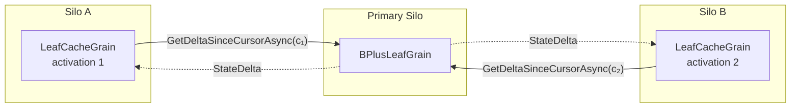

# Read Caching

Point reads (`GetAsync`, `ExistsAsync`, `GetManyAsync`) reach a leaf through a read-through cache: an internal stateless-worker grain placed in front of each primary leaf (the leaf cache grain in the diagram below). Each silo that reads through it runs its own activation - a stateless worker can run several per silo - and every activation keeps its own local mirror of the leaf's entries. Versioned reads (`GetWithVersionAsync`) bypass the cache and go to the leaf directly:



- **Cursor-based delta refresh**: Every read first refreshes the cache from
  the primary leaf. The cache holds an activation-scoped delivery cursor (an
  epoch plus a sequence number); the leaf bumps the sequence once per stored
  or removed entry regardless of the write's LWW HLC, so it ships every entry
  strictly newer than the cache's last delivered sequence even when the
  underlying source HLC has rewound (the cross-cluster apply case, where the
  destination leaf preserves the source cluster's HLC verbatim). An empty
  delta is a cheap cursor comparison with no entry scan. Before each delta the
  cache also re-reads the leaf's set of keys covered by an in-flight atomic
  batch, so reads of those keys can be delegated to the leaf. Two gates can
  skip the refresh. When the primary leaf is activated on the same silo, the
  cache compares an in-process revision counter the leaf bumps on every state
  change and skips the refresh only while it is unchanged - a changed counter
  forces a refresh even inside `CacheTtl`. When the primary leaf is on another
  silo and [`CacheTtl`](configuration.md#cachettl) is non-zero, the cache
  skips the refresh if less than that duration has elapsed since the last
  successful refresh.
- **Epoch-flip full snapshot**: A leaf re-activation bumps the
  leaf-side epoch, so a cache holding a stale cursor falls back to a
  full-snapshot delivery on its next refresh and adopts the new
  cursor. A cursor whose sequence is ahead of the leaf's is treated as
  stale in the same way. On either resync the cache discards its whole
  mirror before merging the snapshot, so keys the leaf has since
  deleted or migrated away do not linger. The cursor is intentionally non-persistent: the WAL replay
  path remains the sole projection source-of-truth and the cursor
  adds zero per-write durable I/O.
- **Freshness bound**: Cached reads are bounded by `CacheTtl + one delta round-trip`. See [Consistency](consistency.md#read-cache-staleness) for the full per-operation contract.
- **Why keep a local cache at all?**: The cursor comparison fast-path makes the delta call cheap when nothing has changed, but the local `Dictionary<string, LwwValue<byte[]>>` avoids deserialising the full entry set on every read. When the primary returns a non-empty delta, only the changed entries are merged - the rest are already in memory.
- **Split-aware pruning**: When a `StateDelta` contains a non-null `SplitKey`, the cache removes all entries with keys ≥ `SplitKey` from its local dictionary. These entries now belong to a different leaf grain and would otherwise become stale ghosts in the cache.
- **Migrated-entry delegation and moved-away pruning**: An entry
  arriving from a cross-shard migration is stamped `IsMigrated = true`
  on the destination leaf until a higher-HLC non-migrated write
  supersedes it. The cache delegates reads for any cached row
  carrying `IsMigrated = true` back to the primary leaf so the
  leaf-side shadow guard (which protects an in-flight cross-shard
  migration window) is never bypassed by the cache fast path. When a
  delta carries the cumulative `MovedAwaySlots` set, the cache drops
  every cached entry whose key hashes into one of those virtual
  slots so it stops serving the source's pre-migration snapshot once
  the destination has taken authoritative ownership.
  It also keeps the set, so a later read of a key in one of those
  slots is refused with the internal stale shard-routing signal -
  which the routing tier absorbs by refreshing its shard map and
  retrying against the new owner - instead of being answered as a
  miss.
- **Seal lift after consolidation**: When an online shard
  consolidation folds virtual slots back onto the shard, the primary
  leaf lifts its moved-away seal for them. The next delta carries the
  leaf's reduced sealed set - or, once no slot remains sealed, an
  explicit lift signal - and the cache adopts it, so it stops refusing
  the reclaimed keys. Because the cache pruned those rows while the
  slots were sealed but kept advancing its delivery cursor past them,
  the leaf also records a fresh delivery sequence for every key it
  holds in a reclaimed slot, so the next incremental refresh re-ships
  those rows instead of leaving the cache answering a miss for keys
  the leaf owns.

## Value-payload eviction

By default the cache mirror is **unbounded**: `_cache` holds one
`LwwValue<byte[]>` per live key on the primary leaf, so per-silo per-tree memory
scales linearly with the touched-leaf entry count. This is the lowest-latency
configuration - every read is served from the local dictionary - but it has no
operator-side cap.

Setting [`MaxCacheValueBytes`](configuration.md#maxcachevaluebytes) to a positive
value bounds the resident **value-payload** bytes per activation with a
least-recently-used policy. The policy is deliberately narrow: it evicts the
`byte[]` **payload only**, never the row. An evicted entry is rewritten with a
`null` value while every metadata field is retained, which is what lets the bound
coexist with the correctness contracts above:

- **Delta-refresh cursor**: the row keeps its place under the adopted delivery
  cursor, so eviction never makes the leaf skip re-shipping the key. (Evicting
  the whole row would leave the cursor at the leaf head with no entry to
  re-deliver until the next write - a silent false miss. That is why only the
  payload is dropped.)
- **Pending-key, moved-away, migrated-entry**: the retained timestamp, tombstone
  bit, `IsMigrated` flag, and expiry keep every delegation and pruning decision
  intact.

Because `LwwValue.Create` never stores a `null` value and empty values are
non-null `byte[0]`, the shape `Value == null && !IsTombstone` is an unambiguous
**payload-evicted sentinel**. A value read (`GetAsync` / `GetManyAsync`) that
lands on the sentinel delegates to the primary leaf for the authoritative bytes -
reusing the same delegation path as pending and migrated keys. A single-key
`GetAsync` that delegates for this reason is recorded as a cache miss; a
`GetManyAsync` batch leaves every delegated key out of its hit and miss counts.
An existence check (`ExistsAsync`) is answered from the retained
metadata with no leaf RPC. A later higher-HLC write for the key re-ships the full
value in a delta, and the merge repopulates the payload, so hot keys drift back
into residency automatically. The budget is re-resolved each time a refresh
merges entries, so a changed budget reaches a warm activation, but lowering it
evicts nothing until the next entry is merged. The net trade is bounded per-silo
memory against one leaf RPC on the evicted fraction of value reads.

## Cache Invalidation via Tree Aliasing

When a tree is **resized** (via `ResizeAsync`), the data is copied into a new physical tree with different leaf grain IDs. After the alias swap, reads route to the new physical tree's leaf grains - which have entirely different `GrainId` values. Because `LeafCacheGrain` instances are keyed by the primary leaf's `GrainId.ToString()`, the new physical tree automatically gets **fresh cache grains** with no stale data.

This means cache invalidation after a resize is **free** - no explicit cache flush or broadcast is needed:

```
Before resize:
  LatticeGrain("my-tree") → ShardRootGrain("my-tree/0") → LeafCacheGrain("leaf-abc")

After resize + alias swap:
  LatticeGrain("my-tree") → resolves alias → ShardRootGrain("my-tree/resized/op1/0") → LeafCacheGrain("leaf-xyz")
```

The old `LeafCacheGrain("leaf-abc")` is never called again and will be garbage-collected by Orleans when it deactivates due to inactivity. The new `LeafCacheGrain("leaf-xyz")` starts fresh, fetching a full delta from the new primary leaf on its first read.

### Stale `LatticeGrain` activations

`LatticeGrain` is a `[StatelessWorker]` that resolves the alias once per activation and caches the result. After an alias swap, existing activations still hold a cached alias pointing to the old physical tree. Once the resize has moved the old tree's shards into its rejecting phase - which follows the swap and stays in force after the old tree is soft-deleted - they refuse every request with an internal stale tree-routing signal. The activation then discards its cached alias and shard map, re-resolves the alias from the registry, and retries the operation within the same call, for up to a 60-second wall-clock budget. A cached alias that instead points at a physical tree deleted without a rejecting phase - the discarded copy after an `UndoResizeAsync` - makes the shard throw `InvalidOperationException`, which the activation handles the same way, once (a Lattice domain exception such as `LatticeSaturatedException` propagates instead of being absorbed). Either way the caller sees a brief retry delay, not a failure.

## Read performance

For the caller-visible effect of this cache on a live silo - the steady-state
read-latency envelope it produces under a realistic offered load, and how a
workload with a low cache-hit ratio shifts that envelope toward the underlying
storage round-trip - see the Layer 2 read rows and the read-side caching note in
the [single-silo performance guide](performance-single-silo.md). Those figures
are regenerated against a real Azure deployment, so consult them there rather
than reproducing any numbers here.
