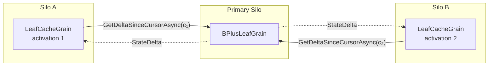

# Read Caching

The `LeafCacheGrain` is a `[StatelessWorker]` that acts as a per-silo read-through cache for leaf data:

## The four-layer read-cache stack

A read of a single key travels through up to four distinct caches before it
reaches durable state. Each layer caches a different artefact and is keyed
differently, so they compose rather than duplicate work:

| Layer | Component | What it caches | Keyed by | Scope / lifetime | Populated on |
|---|---|---|---|---|---|
| 1 | `LatticeGrain` | Resolved tree alias + shard map (`ShardMap`, routing table snapshot) | `treeId` | Per `[StatelessWorker]` activation | First routed call; invalidated on `StaleShardRoutingException` / alias swap |
| 2 | `ShardRootGrain` | Leaf / internal `GrainId` references + routing-table snapshot | `(treeId, shardIndex)` | Per shard-root activation | Traversal; invalidated on split / reshard |
| 3 | `LeafCacheGrain` | Mirror of the leaf's live entries (`Dictionary<string, LwwValue<byte[]>>`) | leaf `GrainId` string | Per silo (`[StatelessWorker]`) | Delta refresh from the primary leaf |
| 4 | `BPlusLeafGrain` | The authoritative live entry set (`LeafEntryCache` over `state.State.Entries`) | n/a (the grain *is* the source of truth) | Per primary-leaf activation | Writes / WAL replay |

Layers 1–2 cache *routing*; layers 3–4 cache *entries*. The duplication this
page is concerned with is between **layer 3 and layer 4 on the primary leaf's
own silo**: when the `LeafCacheGrain` activation and its primary
`BPlusLeafGrain` happen to live on the same silo, layer 3's mirror is a
structural copy of layer 4's authoritative set, held twice in the same
process.

### Co-location read pass-through (`CoLocationReadPassThrough`)

When [`CoLocationReadPassThrough`](configuration.md#colocationreadpassthrough)
is enabled and the `LeafCacheGrain` can prove its primary leaf is co-located on
the same silo (the primary's same-silo revision cookie is published in the
process-wide registry, i.e. `BPlusLeafGrain.TryGetLeafRevision` returns true),
the cache stops mirroring layer 4 into layer 3 and instead serves
`GetAsync` / `ExistsAsync` / `GetManyAsync` by delegating straight to the
co-located primary leaf via a **same-silo grain dispatch**. This eliminates the
layer-3/layer-4 duplication on the primary's silo at the cost of one extra
in-process grain hop per read.

The pass-through is a *physical* short-circuit, not a semantic one:

- It is gated on the **exact** co-location condition (`TryGetLeafRevision`), so
  a cross-silo cache (where the registry has no local cookie) transparently
  keeps its normal layer-3 mirror behaviour - multi-silo caching is unaffected.
- Reads are dispatched through the leaf's mailbox/scheduler (a same-silo grain
  call), never a raw cross-thread read of `state.State.Entries`, so Orleans
  turn-isolation against the leaf's writer turn is preserved.
- The **pending-tx** and **migrated-saga** delegation semantics are preserved
  by construction: the co-located primary leaf is the single authority for both
  (it consults the per-tree `TxRegistry` and its shadow-marker guard exactly as
  it does for the mirror path's own delegation branch).
- The **moved-away read gate** is preserved: the cache continues to refresh its
  moved-away slot metadata and raises `StaleShardRoutingException` for a key
  whose virtual slot has migrated away *before* delegating, so a reshard-drain
  read still re-routes rather than observing a phantom-absent key.

**This option is disabled by default and is an experimental memory-versus-latency
trade-off.** The empirical motivation is that the co-located steady-state read
path is *already cheap* - a revision-cookie equality check (layer 3 skips the
delta RPC when nothing changed) followed by a local dictionary lookup - whereas
pass-through turns every read into a same-silo grain hop. The committed probe
`Bench.LeafCacheCoLocation` measures both cohorts (mirror vs pass-through) on a
single-silo cluster for four metrics: per-call wall-time p50/p95, allocations
per call, and steady-state `Process.WorkingSet64` delta. Enable the option only
where the per-silo memory reclaimed by dropping the mirror outweighs the
measured per-call wall-time regression for the workload in question.

A reference run of the probe (1,000,000 `GetAsync` reads against a 10,000-entry
co-located leaf, single-silo cluster, server GC) measured a clear regression
that did **not** clear the acceptance bar, which is why the option ships
disabled:

| cohort | p50 (µs) | p95 (µs) | alloc B/call |
|---|---|---|---|
| baseline mirror | 32.2 | 86.9 | 8,097 |
| pass-through | 44.0 | 99.9 | 11,125 |

Pass-through was ~37 % slower at p50 and allocated ~37 % more per call (the
extra same-silo grain hop costs more than the local dictionary lookup it
replaces), while the working-set saving from dropping the ~10k-entry mirror was
too small to separate from GC noise in the harness. The path is therefore kept
off by default; the probe and option remain committed so the trade-off can be
re-measured if the read mix or entry sizes change.

## How the layer-3 mirror refreshes



- **Cursor-based delta refresh**: Every read calls
  `GetDeltaSinceCursorAsync` on the primary leaf, passing the cache's
  current `LeafDeliveryCursor` (an activation-scoped
  `(Epoch, Sequence)` pair). `Sequence` is bumped on the leaf once per
  `StoreEntry` / `RemoveEntry` regardless of the write's LWW HLC, so
  the leaf ships every entry strictly newer than the cache's last
  delivered sequence even when the underlying source HLC has rewound
  (the cross-cluster apply case, where the destination leaf preserves
  the source cluster's HLC verbatim and may publish a `Version[ReplicaId]`
  higher than that HLC). An empty delta is a cheap cursor comparison
  with no entry scan. When [`CacheTtl`](configuration.md#cachettl) is set
  to a non-zero value, the cache skips the refresh entirely if less than
  the configured duration has elapsed since the last successful refresh.
- **Epoch-flip full snapshot**: A leaf re-activation bumps the
  leaf-side epoch, so a cache holding a stale cursor falls back to a
  full-snapshot delivery on its next refresh and adopts the new
  cursor. The cursor is intentionally non-persistent: the WAL replay
  path remains the sole projection source-of-truth and the cursor
  adds zero per-write durable I/O.
- **Freshness bound**: Cached reads are bounded by `CacheTtl + one delta round-trip`. See [Consistency](consistency.md#read-cache-staleness) for the full per-operation contract.
- **Why keep a local cache at all?**: The cursor comparison fast-path makes the delta call cheap when nothing has changed, but the local `Dictionary<string, LwwValue<byte[]>>` avoids deserialising the full entry set on every read. When the primary returns a non-empty delta, only the changed entries are merged - the rest are already in memory.
- **Split-aware pruning**: When a `StateDelta` contains a non-null `SplitKey`, the cache removes all entries with keys ≥ `SplitKey` from its local dictionary. These entries now belong to a different leaf grain and would otherwise become stale ghosts in the cache.
- **Migrated-entry delegation and moved-away pruning**: An entry
  arriving from a cross-shard migration is stamped `IsMigrated = true`
  on the destination leaf until a higher-HLC non-migrated write
  supersedes it. The cache delegates reads for any cached row
  carrying `IsMigrated = true` back to the primary leaf so the
  leaf-side shadow guard (which protects an in-flight cross-shard
  migration window) is never bypassed by the cache fast path. When a
  delta carries the cumulative `MovedAwaySlots` set, the cache drops
  every cached entry whose key hashes into one of those virtual
  slots so it stops serving the source's pre-migration snapshot once
  the destination has taken authoritative ownership.

## Cache Invalidation via Tree Aliasing

When a tree is **resized** (via `ResizeAsync`), the data is copied into a new physical tree with different leaf grain IDs. After the alias swap, reads route to the new physical tree's leaf grains - which have entirely different `GrainId` values. Because `LeafCacheGrain` instances are keyed by the primary leaf's `GrainId.ToString()`, the new physical tree automatically gets **fresh cache grains** with no stale data.

This means cache invalidation after a resize is **free** - no explicit cache flush or broadcast is needed:

```
Before resize:
  LatticeGrain("my-tree") → ShardRootGrain("my-tree/0") → LeafCacheGrain("leaf-abc")

After resize + alias swap:
  LatticeGrain("my-tree") → resolves alias → ShardRootGrain("my-tree/resized/op1/0") → LeafCacheGrain("leaf-xyz")
```

The old `LeafCacheGrain("leaf-abc")` is never called again and will be garbage-collected by Orleans when it deactivates due to inactivity. The new `LeafCacheGrain("leaf-xyz")` starts fresh, fetching a full delta from the new primary leaf on its first read.

### Stale `LatticeGrain` activations

`LatticeGrain` is a `[StatelessWorker]` that resolves the alias once per activation and caches the result. After an alias swap, existing activations still hold a cached alias pointing to the old (now soft-deleted) physical tree. When a request hits a stale activation and the shard throws `InvalidOperationException`, the grain catches the error, invalidates its cached alias via `TryInvalidateStaleAlias()`, re-resolves the alias from the registry, and retries the operation - all transparently within the same grain call. This means the caller sees at most one brief retry delay, not a failure. Old activations will eventually deactivate due to inactivity.
