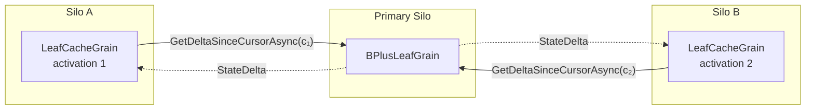

# Read Caching

The `LeafCacheGrain` is a `[StatelessWorker]` that acts as a per-silo read-through cache for leaf data:



- **Cursor-based delta refresh**: Every read calls
  `GetDeltaSinceCursorAsync` on the primary leaf, passing the cache's
  current `LeafDeliveryCursor` (an activation-scoped
  `(Epoch, Sequence)` pair). `Sequence` is bumped on the leaf once per
  `StoreEntry` / `RemoveEntry` regardless of the write's LWW HLC, so
  the leaf ships every entry strictly newer than the cache's last
  delivered sequence even when the underlying source HLC has rewound
  (the cross-cluster apply case, where the destination leaf preserves
  the source cluster's HLC verbatim and may publish a `Version[ReplicaId]`
  higher than that HLC). An empty delta is a cheap cursor comparison
  with no entry scan. When [`CacheTtl`](configuration.md#cachettl) is set
  to a non-zero value, the cache skips the refresh entirely if less than
  the configured duration has elapsed since the last successful refresh.
- **Epoch-flip full snapshot**: A leaf re-activation bumps the
  leaf-side epoch, so a cache holding a stale cursor falls back to a
  full-snapshot delivery on its next refresh and adopts the new
  cursor. The cursor is intentionally non-persistent: the WAL replay
  path remains the sole projection source-of-truth and the cursor
  adds zero per-write durable I/O.
- **Freshness bound**: Cached reads are bounded by `CacheTtl + one delta round-trip`. See [Consistency](consistency.md#read-cache-staleness) for the full per-operation contract.
- **Why keep a local cache at all?**: The cursor comparison fast-path makes the delta call cheap when nothing has changed, but the local `Dictionary<string, LwwValue<byte[]>>` avoids deserialising the full entry set on every read. When the primary returns a non-empty delta, only the changed entries are merged - the rest are already in memory.
- **Split-aware pruning**: When a `StateDelta` contains a non-null `SplitKey`, the cache removes all entries with keys ≥ `SplitKey` from its local dictionary. These entries now belong to a different leaf grain and would otherwise become stale ghosts in the cache.
- **Migrated-entry delegation and moved-away pruning**: An entry
  arriving from a cross-shard migration is stamped `IsMigrated = true`
  on the destination leaf until a higher-HLC non-migrated write
  supersedes it. The cache delegates reads for any cached row
  carrying `IsMigrated = true` back to the primary leaf so the
  leaf-side shadow guard (which protects an in-flight cross-shard
  migration window) is never bypassed by the cache fast path. When a
  delta carries the cumulative `MovedAwaySlots` set, the cache drops
  every cached entry whose key hashes into one of those virtual
  slots so it stops serving the source's pre-migration snapshot once
  the destination has taken authoritative ownership.

## Cache Invalidation via Tree Aliasing

When a tree is **resized** (via `ResizeAsync`), the data is copied into a new physical tree with different leaf grain IDs. After the alias swap, reads route to the new physical tree's leaf grains - which have entirely different `GrainId` values. Because `LeafCacheGrain` instances are keyed by the primary leaf's `GrainId.ToString()`, the new physical tree automatically gets **fresh cache grains** with no stale data.

This means cache invalidation after a resize is **free** - no explicit cache flush or broadcast is needed:

```
Before resize:
  LatticeGrain("my-tree") → ShardRootGrain("my-tree/0") → LeafCacheGrain("leaf-abc")

After resize + alias swap:
  LatticeGrain("my-tree") → resolves alias → ShardRootGrain("my-tree/resized/op1/0") → LeafCacheGrain("leaf-xyz")
```

The old `LeafCacheGrain("leaf-abc")` is never called again and will be garbage-collected by Orleans when it deactivates due to inactivity. The new `LeafCacheGrain("leaf-xyz")` starts fresh, fetching a full delta from the new primary leaf on its first read.

### Stale `LatticeGrain` activations

`LatticeGrain` is a `[StatelessWorker]` that resolves the alias once per activation and caches the result. After an alias swap, existing activations still hold a cached alias pointing to the old (now soft-deleted) physical tree. When a request hits a stale activation and the shard throws `InvalidOperationException`, the grain catches the error, invalidates its cached alias via `TryInvalidateStaleAlias()`, re-resolves the alias from the registry, and retries the operation - all transparently within the same grain call. This means the caller sees at most one brief retry delay, not a failure.

## Read performance

For the caller-visible effect of this cache on a live silo - the steady-state
read-latency envelope it produces under a realistic offered load, and how a
workload with a low cache-hit ratio shifts that envelope toward the underlying
storage round-trip - see the Layer 2 read rows and the read-side caching note in
the [single-silo performance guide](performance-single-silo.md). Those figures
are regenerated against a real Azure deployment, so consult them there rather
than reproducing any numbers here.
