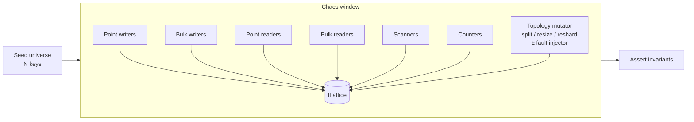
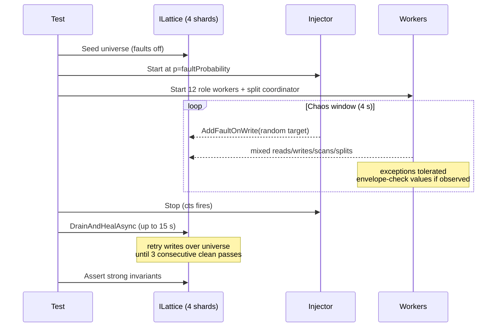

# Chaos Tests

Orleans.Lattice ships a suite of integration tests that bombard a running
cluster (single-cluster and multi-site) with concurrent reads, writes,
scans, atomic-write sagas, topology mutations, and inter-site network
partitions, then assert that the system's public correctness guarantees
hold. They act as the end-to-end contract for the properties described
in [Consistency](consistency.md) and [Replication](../lattice.replication/replication.md) -
specifically that the public `ILattice` API is strongly consistent
across arbitrary concurrent shard splits, online resizes, and online
reshards; that point-mutation public-API calls (`DeleteRangeAsync`,
`SetIfVersionAsync` (the public compare-and-swap entry point), `ScanKeysAsync` / `ScanEntriesAsync` cancellation) hold their stated
invariants under concurrent contention; that `SetManyAtomicAsync`
remains atomically visible (zero-or-all keys per poll) on the
authoring site and on every receiver site; and that the per-merge-mode
CRDT dispatch paths (`LwwRegister`, `OrSet`, `PnCounter`, `MvRegister`,
and `OrMap`) converge across
partitioned sites. The single-cluster suite also exercises the
recovery protocols (resumable splits, two-phase root promotion,
shadow-write atomicity, shadow-forwarding, registry version stamping,
idempotent bulk graft) under random storage-write faults. The
replication suite extends those guarantees to the production shipper,
WAL trim, per-peer liveness, tombstone-reap filtering, and the gRPC
transport; the Azure Table WAL suite pins append-batch atomicity and
offset monotonicity against a real Azurite-backed provider.

Every fixture uses the `[NonParallelizable]` attribute so it has the cluster to itself, and is tagged `[Category("Chaos")]` so the iterative-development test filter (`dotnet test --filter "TestCategory!=Chaos"`) skips them.

### Core chaos suite (`test/lattice/BPlusTree/`)

| Test class | File | Purpose |
|---|---|---|
| Happy-path chaos | `ChaosIntegrationTests.cs` | Strong invariants *during* heavy concurrent load with manually-triggered splits. |
| Chaos + storage faults | `ChaosWithFaultsIntegrationTests.cs` | Parametrized theory that injects random storage faults; asserts eventual convergence after the fault window closes. |
| Chaos + online resize | `ChaosResizeIntegrationTests.cs` | Full-workload chaos while `ResizeAsync` changes fan-out in the background under `SnapshotMode.Online`. Exercises the `TreeResizeGrain` phase machine (Snapshot → Swap → Reject → Cleanup), shadow-forwarding on every source shard, and the alias swap. |
| Chaos + online reshard | `ChaosReshardIntegrationTests.cs` | Full-workload chaos while `ReshardAsync` grows the physical shard count (4 → 8) in the background. Exercises the `TreeReshardGrain` migration loop, dispatch-budget clamping, `HotShardMonitorGrain` interlock, and `ShardMap` convergence when reshard-dispatched splits race with workload writes. |
| Atomic-write reader isolation | `AtomicVisibilityChaosTests.cs` | Strict reader isolation: a continuous reader concurrent with `SetManyAtomicAsync` always observes either the full pre-saga snapshot, the full post-saga snapshot, or all keys hidden - never a partial view. Quiescent topology (no concurrent split/resize/reshard). |
| Atomic-write reader isolation across shard split | `ShardSplitTopologyTests.cs` | Same zero-or-all visibility invariant as `AtomicVisibilityChaosTests`, but the topology mutator drives a manual `SplitAsync` on shard 0 concurrently with a chain of `SetManyAtomicAsync` sagas. Exercises shadow-forward of saga prepares onto the destination shard and the saga terminal-broadcast retry onto the new owner via `StaleShardRoutingException`. |
| Atomic-write reader isolation across online resize | `ResizeTopologyTests.cs` | Same zero-or-all visibility invariant, but the topology mutator runs an online `ResizeAsync` (`MaxLeafKeys` / `MaxInternalChildren` to 8) concurrently with the saga chain. Exercises shadow-forwarding from the source physical tree to the destination, the alias swap, and the saga terminal-broadcast retry onto the new owner via `StaleTreeRoutingException`. |
| Atomic-write reader isolation across online reshard | `ReshardTopologyTests.cs` | Same zero-or-all visibility invariant, but the topology mutator runs a 4-shard → 8-shard `ReshardAsync` concurrently with the saga chain. Exercises the retroactive prepared-mutation sweep at `BeginShadowWrite`, the registry's `TxDecisionRetention` tombstone window, and the saga terminal-fan-out shadow-forward fallback that mirrors `TxCommit` / `TxAbort` marks onto the destination shard via the post-Complete `MovedAwaySlots` lookup. |
| Digest determinism under load | `ChaosDigestIntegrationTests.cs` | `ILattice.GetLeafProjectionDigestAsync` is byte-stable across repeated calls in a write-quiescent window after concurrent writer / scanner load, and per-shard `EntryCount` sums equal `CountAsync`. |
| Range delete under load | `ChaosRangeDeleteIntegrationTests.cs` | `DeleteRangeAsync` under concurrent writer load preserves range exclusivity (no key inside the deleted range survives a quiescent re-read) and never tombstones a key outside the range. Includes the cross-shard range case and the empty / single-key boundary cases. |
| Compare-and-swap under contention | `CompareAndSwapChaosTests.cs` | Many concurrent `SetIfVersionAsync` (CAS) callers racing on a small key universe produce exactly one observed `success=true` per logical CAS round; lost-update rounds report `success=false` with the actual current envelope so the call-site retry loop can make progress. |
| Scan cancellation under load | `ScanCancellationChaosTests.cs` | An in-flight `ScanKeysAsync` / `ScanEntriesAsync` enumerator that observes a cancellation token transition surfaces `OperationCanceledException` within a bounded delay and leaks no grain-side resources; subsequent scans against the same range succeed normally. |
| Multi-silo restart under load | `MultiSiloRestartChaosTests.cs` | Two-silo `TestCluster`, sustained write/read load on an `ILattice` tree, secondary silo restarted every ~2.5 s via `TestCluster.RestartSiloAsync`. Post-window invariants: pinned `CountAsync`, envelope-valid value on every key, no caller-visible exception outside the documented transient class. Uses `ProcessScopeMemoryGrainStorage` (a static-dictionary-backed `IGrainStorage` shared across every silo in the test process) so secondary-silo restart does not wipe the shard-root / registry topology - per-silo Orleans memory storage would otherwise let a re-placed `ShardRootGrain` activation read empty state and overwrite the live topology with a fresh leaf root (the underlying split-brain that previously surfaced as `InvalidCastException`). |

### Cross-cluster chaos suite (`test/lattice.replication/Chaos/`)

| Test class | File | Purpose |
|---|---|---|
| Cross-cluster saga atomic visibility | `CrossClusterAtomicVisibilityChaosTests.cs` | Receiver-side reader-isolation invariant: a saga authored on one site and shipped to two peer sites via the WAL replication transport lands all-or-nothing on every receiver, even when the inter-site delivery topology is partitioned and healed mid-workload. |
| LWW register convergence | `LwwRegisterConvergenceChaosTests.cs` | Three sites issue concurrent point writes against a single key under a mid-workload partition; after heal and drain, every site converges to the lexicographic `(HLC, originClusterId)` winner. |
| OR-Set convergence | `OrSetConvergenceChaosTests.cs` | Three sites issue concurrent OR-Set adds (and, in the second test, observed-removes) against a single key under partition; after drain, every site observes exactly the union of authored adds minus the union of authored removes. |
| PN-Counter convergence | `PnCounterConvergenceChaosTests.cs` | Three sites issue concurrent increments and decrements against a single counter under partition; after drain, every site reads the same algebraic sum. |
| MV-Register convergence | `MvRegisterConvergenceChaosTests.cs` | Three sites issue concurrent `Set` operations against a single MV-Register key under partition; after drain, every site observes the same dot-tagged multi-value set with concurrent writes preserved and observed predecessors collapsed. |
| Multi-site fixture smoke | `MultiSiteClusterFixtureSmokeTests.cs` | Diagnostic smoke tests for `MultiSiteClusterFixture` + `ChaosDeliveryPump`. Not chaos tests themselves - they pin the simpler invariants the convergence suite relies on (per-site WAL capture, per-site change feed yield, end-to-end pump delivery). Tagged `[Category("Chaos")]` so they ship alongside the suite they diagnose. |
| OR-Map convergence | `OrMapConvergenceChaosTests.cs` | Three sites concurrently mutate an `OrMap<string, PnCounter>` key (each site authors a disjoint family of map keys, each value PnCounter-incremented) under a partition that isolates one site mid-workload, then heals. After drain, every site converges to the union of authored map keys and every per-key PnCounter equals the algebraic sum of authored deltas. Exercises the producer-side typed-delta dispatch (`OrMapAccessor.SetAsync` -> `BPlusLeafGrain.CrdtApply` -> WAL CRDT-Set with `Delta` slot populated) and the receiver-side `ReplicationApplier.ApplyStateMergeAsync<OrMap<TKey, TValue>>` dispatch, both consulting the per-tree `CrdtShape` registered via `MultiSiteClusterFixture.RegisterOrMapShape<TKey, TValue>`. |
| WAL trim under shipping | `WalTrimUnderShippingChaosTests.cs` | Producer-side WAL trim cannot prune entries the per-peer shipper has not yet acknowledged. Uses `ProductionShipperFixture` (real `AddLatticeReplication` + in-process loopback transport) to drive sustained writes while invoking trim against an artificially low retention bound; asserts every authored entry that the shipper has not yet acked remains readable from the WAL after trim. |
| Liveness probe + inbound error under partition | `LivenessProbeAndInboundStatsChaosTests.cs` | Real partition-then-heal cycle against `ProductionShipperFixture`'s loopback transport with a `FaultInjectingReplicationApplier` decorator injecting receiver-side throws on the healed path; asserts the per-peer `IPeerStats` liveness probe flips to `Unhealthy` during isolation and back to `Healthy` after heal, and that the inbound-error counter records every injected receiver fault without inflating the success counter. |
| Compaction + shipping | `CompactionShippingChaosTests.cs` | Sustained write+delete churn against site A with explicit `RunCompactionPassAsync` calls between phases. The producer-side `ReplicationShipperGrain.ShouldShip` filter must keep every maintenance-tagged tombstone-reap envelope (`MutationKind.Tombstone`) off the wire, since per-cluster compaction is local structural cleanup with no defined cross-cluster semantics; asserts the observed wire stream contains zero `Tombstone` entries while the workload itself shipped non-trivial traffic and the receiver converged on the live key set. |

### gRPC transport chaos suite (`test/lattice.replication.grpc/Chaos/`)

| Test class | File | Purpose |
|---|---|---|
| gRPC transport chaos | `GrpcTransportChaosTests.cs` | Exercises the gRPC replication transport under transient channel faults: server restart mid-shipment, idle-channel reconnection, and slow-receiver back-pressure all converge with no batch loss and no duplicate apply. |

### Azure Table WAL chaos suite (`test/lattice.storage.azuretable/Chaos/`)

| Test class | File | Purpose |
|---|---|---|
| Azure Table WAL chaos | `AzureTableWalChaosTests.cs` | Real Azurite-backed (Docker) WAL provider under concurrent append + read load with transient storage faults; asserts append-batch atomicity, monotone offset assignment, and trim correctness. Skipped at run time if the Azurite probe in `[OneTimeSetUp]` cannot reach the local emulator. |

## The workload

The four full-workload single-cluster fixtures (Tests 1-4 below) run a
parallel workload against a 4-shard tree with aggressive structural
sizing (`MaxLeafKeys = 4` on the happy-path / faults fixtures) over a
fixed key *universe*. Writers only rewrite existing keys with
monotonically-increasing values of the form `v-{keyIndex}-{writerId}-{seq}`.
Any value matching that envelope proves the byte array is internally
consistent.

The atomic-visibility fixtures (Tests 5-6, 8), the per-mode
convergence fixtures (Test 9), the multi-site smoke (Test 10), the
range-delete / CAS / scan-cancel public-API fixtures, the
production-shipper fixtures (WAL trim, liveness + inbound stats,
compaction + shipping), and the downstream-package fixtures (gRPC
transport, Azure Table WAL) do not follow this exact shape - each
defines its own universe and worker mix appropriate to the invariant
it targets. See the per-test sections (or the suite tables at the top
of this document for the newer fixtures) for details.

Fixture and parameter differences:

| Test | Fixture | `MaxLeafKeys` | `MaxInternalChildren` | Key prefix | Universe |
|---|---|---|---|---|---|
| Happy-path | `FourShardClusterFixture` | 4 | default | `chaos-{i:D5}` | 500 |
| Chaos + faults | `MultiShardFaultInjectionClusterFixture` | 4 | 4 | `fchaos-{i:D5}` | 200 |
| Chaos + resize | `FourShardClusterFixture` | registry default → `16` mid-run | registry default → `16` mid-run | `resize-chaos-{i:D5}` | 200 |
| Chaos + reshard | `FourShardClusterFixture` (4 shards → 8) | registry default | registry default | `reshard-chaos-{i:D5}` | 200 |

Worker categories (exact mix varies per test - see the runtime table):

* **Point writers** - `SetAsync` on random universe keys.
* **Bulk writers** - `SetManyAsync` with batches of 8 random keys
  (happy-path / faults only).
* **Point readers** - `GetAsync`; validates envelope if a value is returned.
* **Bulk readers** - `GetManyAsync` for 16 random keys (happy-path /
  faults only).
* **Scanners** - rotating `ScanKeysAsync`, `ScanEntriesAsync`, reverse scan,
  range scan. Each full-tree scan must yield exactly the universe with
  no duplicates and no unknown keys.
* **Counters** - `CountAsync` must always equal the pinned universe size.
* **Topology mutator** - test-specific:
  * happy-path: every ~500 ms drives
    `ITreeShardSplitGrain.SplitAsync` + `RunSplitPassAsync` on a
    non-empty shard.
  * faults: same split driver plus a fault injector that arms random
    `WriteStateAsync` faults.
  * resize: initiates `ResizeAsync` once at the window start and pumps
    the coordinator to completion.
  * reshard: initiates `ReshardAsync(8)` once at the window start and
    pumps `RunReshardPassAsync` + per-shard split passes to completion.

## Test 1 - Happy-path chaos (`ChaosIntegrationTests`)

This test establishes that `ILattice`'s consistency guarantees hold
*during* the chaos window, not just after it closes. Every operation
observes a fully consistent view of the tree.

### What it proves

| Invariant | Mechanism under test |
|---|---|
| `CountAsync` returns the exact universe size, always | Per-slot routing via `CountForSlotsAsync` against the authoritative `ShardMap` plus version stability check |
| `ScanKeysAsync` / `ScanEntriesAsync` yield exactly the universe, no duplicates, no unknowns, in strict sorted order | In-line reconciliation-cursor injection into the k-way merge + `HashSet` dedup |
| `ScanKeysAsync(null, null, reverse: true)` yields the full universe in reverse | Reverse-scan path also reconciles |
| `ScanKeysAsync(start, end)` yields exactly the in-range slice | Range pruning is slot-aware |
| `GetAsync` / `GetManyAsync` never return a corrupt value | Writes are atomic per-shard; CRDT LWW resolves concurrent rewrites |
| No public-API call throws an unhandled exception | Stale routing retries and enumeration aborts are transparent |
| Splits during a scan never cause data loss, duplication, or out-of-order output | `MovedAwaySlots` + version stamping + in-line reconciliation |

### Tolerated transients

These exception types surface from Orleans' streaming internals and are
treated as retry signals, not failures:

* `EnumerationAbortedException` - a stream cursor grain deactivated
  mid-iteration. The caller re-issues the scan.
* `StaleShardRoutingException` - a `LatticeGrain` activation used a
  cached shard map after a concurrent split committed its swap. The
  framework retries once against the fresh map.

Any other exception, or any observed envelope/duplicate/missing-key
violation, fails the test.

### Pass criteria

After the chaos window closes:

* `CountAsync` matches the pinned universe size exactly.
* `ScanKeysAsync` yields exactly the pinned universe (no gaps, no extras).
* Every worker category performed at least one operation (proves the
  workload ran under real concurrency, not a degenerate single-thread
  schedule).
* Zero envelope violations were observed *during* the window.

## Test 2 - Chaos + storage faults theory (`ChaosWithFaultsIntegrationTests`)

This parametrized theory layers random storage faults on top of the same
workload. Unlike the happy-path test, per-operation invariants are
*weakened* during the fault window - arbitrary exceptions are tolerated
because a failed `WriteStateAsync` legitimately cascades into split
aborts, stale routing, and count drift. Instead, the test asserts
**eventual convergence**: once faults stop and the cluster quiesces,
the tree must recover to the exact same pinned universe with every
value still matching its envelope.

`faultProbability` is the probability, per 20 ms tick, that the fault
injector arms a fresh one-shot `WriteStateAsync` fault on a randomly
chosen target grain (initial leaves + shard-root grains of every shard).
Orleans' `FaultInjectionGrainStorage` consumes each armed fault on the
next write for that grain, so the injector re-arms continuously to
approximate a steady-state failure rate.

> Note: Orleans' one-shot fault API caps concurrent armed faults at
> ≈ `|targets|`. Higher `faultProbability` primarily drives faster
> re-arm latency rather than a linear increase in fault count. The
> gradient is still meaningful for exercising recovery paths under
> progressively heavier disruption.

### Test phases

### Tolerated during faults

Every exception type is tolerated and counted (`tolerated-write-errors`,
`tolerated-read-errors`, `tolerated-scan-errors`, etc.). A single
storage fault cascades into many observable shapes:

* Direct `InvalidOperationException` from the faulted write.
* `OrleansException` wrappers when a faulted grain deactivates.
* `EnumerationAbortedException` if a stream cursor was on the
  deactivated grain.
* `StaleShardRoutingException` after a shard map swap when the split
  coordinator crashed and resumed mid-phase.
* `ArgumentException` from the injector itself when a target already
  has an armed fault pending (skipped).

Envelope violations (a value that doesn't start with `v-{index}-`) are
**not** tolerated - CRDT LWW is supposed to preserve atomicity of the
value payload even when the wrapping write fails.

### Healing phase (`DrainAndHealAsync`)

After the fault injector stops, lingering armed faults remain on
whichever targets weren't hit during the chaos window. The test drains
them by replaying writes over the entire universe until **3 consecutive
passes complete exception-free**, bounded by a 15 s timeout. This loop:

* Consumes any remaining one-shot faults (each fires once on its next
  write, clearing itself).
* Gives resumable splits and pending root promotions time to reach
  their `RunSplitPassAsync` keepalive tick and replay.
* Exercises idempotent apply of `BulkGraft` and shadow `MergeManyAsync`
  - a healing retry that re-writes the same value is a no-op under LWW.

### Pass criteria (post-quiescence)

After healing:

* `CountAsync == UniverseSize` exactly.
* `ScanKeysAsync` yields exactly the pinned universe.
* `ScanEntriesAsync` yields exactly the pinned universe with every value
  matching its envelope.
* Every universe key is recoverable via `GetAsync`.
* Zero envelope violations were observed during the whole run.
* Every workload category performed at least one operation; the
  injector armed at least one fault (for `p > 0`).

## Test 3 - Chaos + online resize (`ChaosResizeIntegrationTests`)

This test targets the online resize path. A full concurrent workload
runs against a seeded tree while `ResizeAsync` changes the B+ fan-out
to `MaxLeafKeys = 16` / `MaxInternalChildren = 16` under
`SnapshotMode.Online`. The entire resize - snapshot drain, alias swap,
per-shard reject phase, cleanup - happens inside the chaos window.

### Recovery surfaces exercised

* `TreeResizeGrain` phase machine (Snapshot → Swap → Reject → Cleanup)
  under sustained traffic.
* Shadow-forwarding on every source shard - live writes during the
  drain must be mirrored to the destination with their original HLCs.
* Alias swap - mid-flight `GetAsync` / `SetAsync` on a stateless-worker
  `LatticeGrain` activation holding a stale alias must transparently
  re-resolve and retry.
* Strongly-consistent `CountAsync` / `ScanKeysAsync` during the online
  snapshot drain and Rejecting phase.

### Tolerated transients

The same set as the happy-path test, plus `StaleTreeRoutingException`
raised during the alias swap window.

### Pass criteria

After the chaos window closes:

* `CountAsync` matches the pinned universe size exactly.
* `ScanKeysAsync` yields exactly the pinned universe.
* `IsResizeCompleteAsync` is `true`.
* Every worker category performed at least one operation; the resize
  was driven to completion.
* Zero envelope violations observed during the window.

## Test 4 - Chaos + online reshard (`ChaosReshardIntegrationTests`)

This test targets the online reshard path - growing the physical shard
count from 4 to 8 while the tree continues to serve traffic. The
reshard is kicked off synchronously before the chaos timer starts (so
cold-activation cost doesn't burn the window on slow Release CI
runners); the in-window driver only pumps the migration loop to
completion.

### Recovery surfaces exercised

* `TreeReshardGrain` migration loop under sustained traffic -
  eligibility filtering, dispatch-budget clamping
  (`MaxConcurrentMigrations`), re-evaluation across ticks.
* `HotShardMonitorGrain` interlock - the autonomic monitor must
  suppress its own passes while a reshard is in flight.
* `ShardMap` convergence when reshard-dispatched splits race with
  workload writes (shadow-write, drain, swap, reject, permanent
  `MovedAwaySlots`).
* No invariant drift across the full reshard window.

### Tolerated transients

`EnumerationAbortedException`, `StaleShardRoutingException`,
`TimeoutException`.

### Pass criteria

After the chaos window closes:

* `CountAsync` matches the pinned universe size exactly.
* `ScanKeysAsync` yields exactly the pinned universe.
* `IsReshardCompleteAsync` is `true`.
* The post-reshard `ShardMap` has at least `ReshardTarget` distinct
  physical shards.
* Every worker category performed at least one operation.
* Zero envelope violations observed during the window.

## Test 5 - Atomic-write reader isolation (`AtomicVisibilityChaosTests`)

This test asserts the **universal reader-isolation invariant** for
`SetManyAtomicAsync`: every poll of a continuous reader concurrent
with an in-flight saga must observe either the full pre-saga snapshot,
the full post-saga snapshot, or all keys hidden - never a partial view.
The invariant holds **per poll**, with no bounded-window caveat, across
50 sequential saga rounds at a 10 ms reader cadence.

### What it proves

| Invariant | Mechanism under test |
|---|---|
| Continuous reader observes zero-or-all keys at every poll | WAL-metadata reader-isolation primitive driven through `BPlusLeafGrain`'s prepared-write commit path |
| Saga drives 16 keys spanning multiple leaves through the full prepare → terminal pipeline | `AtomicWriteGrain` per-shard terminal broadcast, idempotent under concurrent retry |
| Final post-round value is preserved across 50 iterations | LWW resolution under saga commit ordering |

### Workload

* **Seed phase** - `SetAsync` for each of 16 keys (`atomic-00` … `atomic-15`) at round 0, followed by a single `SetManyAtomicAsync` at round 0 to land all keys through the saga path before reader rounds begin.
* **Saga rounds** - 50 sequential rounds. Each round starts a continuous reader task that polls all 16 keys via `GetManyAsync` every 10 ms, and concurrently issues `SetManyAtomicAsync` with the post-round value envelope.
* **Reader classification** - every poll is bucketed: `fullPre` (every key at the previous round's value), `fullPost` (every key at the new round's value), `fullHidden` (every key missing during the prepare → terminal window), or **split** (any mixed observation, which fails the test).

### Pass criteria

* Zero split-view failures across all 50 rounds.
* `totalPolls > 0` and `fullPostPolls > 0` (proves the reader and saga ran under real concurrency).
* Final `GetManyAsync` of all 16 keys yields the round-50 envelope on every key.

### Tolerated transients

The reader's `GetManyAsync` may observe `OperationCanceledException` at the round boundary; saga writes are not expected to surface any transient - the saga's own retry-on-stale-routing logic absorbs split / resize / reshard activity at the API layer.

### Companion observability

See [Metrics](metrics.md#saga-coordinator-lifecycle).

## Test 6

Three sibling fixtures extend Test 5's reader-isolation invariant
across each of the three online topology mutations (shard split,
online resize, online reshard). Every fixture seeds the same 16-key
universe, then drives 15 sequential `SetManyAtomicAsync` rounds while
the topology mutator runs in parallel; a continuous reader polls all
16 keys every 10 ms and every poll must observe either the full
pre-round value, the full post-round value, or all 16 keys hidden -
never a partial subset.

### What they prove

| Invariant | Mechanism under test |
|---|---|
| Saga prepares survive a mid-flight shard split | Source shard's shadow-forward pipeline mirrors prepared entries to the destination during the split's drain phase; saga terminal-broadcast retries onto the new owner via `StaleShardRoutingException` |
| Saga prepares survive a mid-flight online resize | Source physical tree shadow-forwards every live write (including saga prepares) to the destination physical tree during the snapshot drain; alias swap is observed via `StaleTreeRoutingException` and the saga terminal-broadcast retries onto the new owner |
| Saga prepares survive a mid-flight online reshard | `TreeReshardGrain` migration loop dispatches per-shard splits; the retroactive prepared-mutation sweep at `BeginShadowWrite` and the terminal-fan-out shadow-forward fallback together mirror prepares and the saga's `TxCommit` / `TxAbort` marks onto the destination shard via the post-Complete `MovedAwaySlots` lookup; the registry's `TxDecisionRetention` tombstone window absorbs duplicate terminals |

### Workload (per fixture)

* **Seed phase** - `SetAsync` for each of 16 keys at round 0, followed by a single `SetManyAtomicAsync` at round 0 so the universe is pinned through the saga path before the topology mutator starts.
* **Topology kick-off** - exactly once before the saga loop: `SplitAsync(shard 0)` for `ShardSplitTopologyTests`, `ResizeAsync(MaxLeafKeys=8, MaxInternalChildren=8)` for `ResizeTopologyTests`, or `ReshardAsync(8)` for `ReshardTopologyTests`. A background driver pumps the coordinator's `RunSplitPassAsync` / `RunResizePassAsync` / `RunReshardPassAsync` to completion while the saga loop runs.
* **Saga loop** - 15 sequential rounds. Each round starts a continuous reader task that polls all 16 keys via `GetManyAsync` every 10 ms and concurrently issues `SetManyAtomicAsync` with the post-round value envelope.
* **Reader classification** - identical to Test 5: `fullPre`, `fullPost`, `fullHidden`, or **split** (mixed observation, fails the test).
* **Drain phase** - after the saga loop, the test pumps the coordinator to idle and asserts the final post-round value is present on every key.

### Pass criteria (per fixture)

* Zero split-view failures across all 15 rounds.
* `totalPolls > 0` and `fullPostPolls > 0`.
* Final `GetManyAsync` of all 16 keys yields the round-15 envelope on every key.
* The topology coordinator reaches its terminal idle state (`IsIdleAsync` / `IsResizeCompleteAsync` / `IsReshardCompleteAsync` is true) before the test exits.

### Tolerated transients

* `StaleShardRoutingException` on the reader's `GetManyAsync` - retried inside the reader loop.
* `StaleTreeRoutingException` on the reader's `GetManyAsync` (resize fixture only) - retried inside the reader loop.
* `OperationCanceledException` at the round boundary when the reader's CTS fires.

### Companion observability

Same `orleans.lattice.atomic_write.*` histograms as Test 5, plus the topology-mutator-side counters that fire when the split / resize / reshard actually mutates the tree (`orleans.lattice.leaf.splits`, `orleans.lattice.shard.splits_committed`, and the per-split `orleans.lattice.split.retroactive_forward.duration` / `.entries` pair on shadow-forward). See [Metrics](metrics.md).

## Test 7 - Digest determinism under load (`ChaosDigestIntegrationTests`)

This test exercises `ILattice.GetLeafProjectionDigestAsync` under
sustained concurrent load and asserts two determinism invariants that
gate the digest's value as a cross-silo divergence detector:
**byte-identical repeated calls** in a write-quiescent window, and
**per-shard `EntryCount` sums equal `CountAsync`**.

### What it proves

| Invariant | Mechanism under test |
|---|---|
| Digest hash is byte-stable across repeated calls when no writes occur in between | Hash function fed by a deterministically-ordered key+value enumeration over the leaf projection |
| Sum of per-shard `EntryCount` equals `CountAsync` | Shard-level digest counts are accountable against the tree's own population view |
| Digest computation is safe to call concurrently with foreground writer / scanner traffic | No exception is observed on any worker - digest rendering does not block or interfere with the read / write path |

### Workload

* **Seed phase** - 200 keys (`chaos-digest-{i:D5}`) preloaded with `SetAsync`.
* **Chaos window (~8 s)** - 4 writer tasks rewriting random keys, 2 scanner tasks calling `KeysAsync`, 1 digest poller calling `GetLeafProjectionDigestAsync` for every shard in a tight loop.
* **Quiesce phase** - after the chaos window closes, the digest is sampled twice in succession with no intervening writes.

### Pass criteria

* No exception observed on any worker during the chaos window (`EnumerationAbortedException` is tolerated on the scanner; everything else is fatal).
* For every shard, `secondPass[s].Hash` equals `firstPass[s].Hash` and `EntryCount` is equal.
* Sum of `firstPass[s].EntryCount` equals `tree.CountAsync()`.
* `tree.CountAsync()` equals 200 (writers only update existing keys; no inserts or deletes).

### Tolerated transients

* `EnumerationAbortedException` from the scanner's `KeysAsync` enumeration when a stream cursor grain deactivates mid-iteration.

## Test 8 - Cross-cluster atomic-visibility chaos (`CrossClusterAtomicVisibilityChaosTests`)

This test asserts the **cross-cluster receiver-side reader-isolation
invariant** for `SetManyAtomicAsync`: a saga authored on one site and
shipped via the WAL replication transport to two peer sites must be
observed all-or-nothing on every receiver, even when the inter-site
delivery topology is partitioned and healed mid-workload. It is the
cross-cluster sibling of [Test 5](#test-5--atomic-write-reader-isolation-atomicvisibilitychaostests)
and exercises the same WAL-metadata reader-isolation primitive
through the receiver-side prepared/terminal apply seam
(`IReplicationApplyGrain.ApplyPreparedSetAsync` /
`ApplyPreparedDeleteAsync` / `ApplyTxTerminalAsync`).

### What it proves

| Invariant | Mechanism under test |
|---|---|
| Every saga's keys land all-or-nothing on every receiver site | Receiver-side prepared/terminal apply seam staging prepared writes in the leaf's per-tx pending bucket, then flipping them on terminal arrival |
| Source HLC rides through the wire verbatim | `LatticeHlcOverrideContext` wrapping the apply call so the receiver does not stamp a fresh local HLC |
| Repeated terminal delivery is idempotent | Per-tree `ITxRegistry` LWW-resolves duplicate terminals; per-leaf `_recentlyTerminal` `HashSet<Guid>` absorbs second-delivery within the activation |
| Mid-workload partition does not produce partial-saga visibility on any site | Prepares queued behind the partition and the matching terminal both ship after heal; the receiver-side staging buffer holds prepared entries off the visible projection until the terminal arrives |
| Producer-side per-key WAL filter does not strand terminals | `ReplicationShipperGrain.ShouldShip` bypasses `KeyFilter` / `KeyPrefixes` for `TxCommit` / `TxAbort` records |

### Workload

* **Topology** - three independent `TestCluster` instances (`site-0`, `site-1`, `site-2`) wired through `MultiSiteClusterFixture`, each with its own `MemoryGrainStorage`-backed Lattice and a per-site `ReplicationApplier` driven by the chaos delivery pump.
* **Author phase** - every site concurrently runs 6 local `SetManyAtomicAsync` sagas (4 keys per saga, deterministic per-saga key prefix), so each saga emits 4 prepared `Set` records + 1 `TxCommit` per touched shard onto its source site's WAL.
* **Partition cycle** - `site-0`'s loop isolates `site-2` after the first third of its workload and heals it after the second third. The `ChaosDeliveryPump` continues polling but does not advance the cursor on the partitioned edges, so the prepares and terminals authored during the outage queue at the source and ship en bloc after heal.
* **Drain phase** - after every author task completes, `pump.HealAllAndDrainAsync` heals every edge and waits for every per-edge cursor to catch up to its sender's WAL tail, with a 60 s timeout.

### Pass criteria

* On every receiver site, for every authored saga: the count of visible keys is either `0` (saga not yet shipped or aborted) or `KeysPerSaga` (saga fully visible). Any partial-visibility count is a saga-atomicity violation and fails the test.
* On every receiver site, every saga's keys are present after the drain - every authored saga is a local commit, so universal visibility is the strong post-drain assertion.
* `pump.PumpErrors` is empty - a transient grain failure during the run surfaces here without aborting the loop, but the convergence assertion remains the source of truth.

### Tolerated transients

The chaos pump's per-edge loop catches and queues transient grain exceptions onto `PumpErrors`; only sustained faults that prevent convergence within the drain timeout fail the test. The universe is small (3 sites x 6 sagas x 4 keys = 72 keys) so authoring completes in seconds and the drain typically settles in under a second after heal.

### Companion observability

Saga writes emit `orleans.lattice.atomic_write.duration` / `orleans.lattice.atomic_write.batch_size` on the authoring site (see [Metrics](metrics.md#saga-coordinator-lifecycle)). On the receiver side the apply seam emits `orleans.lattice.replication.apply.duration` tagged with the source cluster id, the merge mode, and the apply outcome.

## Test 9

Four sibling fixtures - one per `LatticeMergeMode` dispatch path -
prove that the producer-side change-feed → shipper → receiver-side
applier pipeline converges every site to the same final state under
concurrent multi-site writes and mid-workload partitions. Every
fixture wires three sites through `MultiSiteClusterFixture` /
`ChaosDeliveryPump`, declares the test tree under the relevant merge
mode, lets every site author a disjoint workload while one site is
isolated and re-healed mid-flight, drains the pump, then asserts the
mode-specific convergence invariant pointwise across sites.

### What they prove

| Fixture | Mode | Convergence invariant | Mechanism under test |
|---|---|---|---|
| `LwwRegisterConvergenceChaosTests` | `LwwRegister` | Every site reads the same `VersionedValue` after drain - the lexicographic `(HLC, originClusterId)` winner across all authored writes | LWW resolution under `SetIfVersionAsync` on the receiver side; per-edge change-feed cursors do not skip entries across partition heal |
| `OrSetConvergenceChaosTests` | `OrSet` | Every site's `OrSet(key).GetAsync()` yields exactly the union of authored adds (test 1), or the union of authored adds minus the union of authored removes (test 2) | `ReplicationApplier.ApplyStateMergeAsync<OrSet>` under `LatticeOriginContext`; OR-Set's commutative-monoid merge absorbs out-of-order receive |
| `PnCounterConvergenceChaosTests` | `PnCounter` | Every site's `PnCounter(key).ValueAsync()` returns the same algebraic sum of authored deltas | Receiver-side `ApplyStateMergeAsync<PnCounter>`; per-replica P/N maps merge by component-wise max |
| `MvRegisterConvergenceChaosTests` | `MvRegister` | Every site's `MvRegister<T>(key).ValuesAsync()` yields exactly the dot-frontier expected from the authored history: concurrent writes survive as a multi-value set, and any write whose dot is causally dominated by a later writer's observed context is superseded on every replica | `ReplicationApplier.ApplyStateMergeAsync<MvRegister>` under `LatticeOriginContext`; dot-context merge drops dominated entries and pointwise-maxes the per-replica context maps |

### Workload (per fixture)

* **Topology** - 3 `TestCluster` instances wired through `MultiSiteClusterFixture` declared with the fixture's merge mode; `ChaosDeliveryPump` drives every inter-site edge.
* **Author phase** - every site authors a disjoint family of writes against a single key (`k`):
  * LWW: 40 sequential `SetAsync` calls per site.
  * OR-Set test 1: 25 sequential `AddAsync` calls per site.
  * OR-Set test 2: 15 adds + 2 observed-removes per site.
  * PN-Counter: 30 increments + 10 decrements per site.
  * MV-Register: two-phase scenario - site 0 issues two sequential `SetAsync` calls and drains so every peer observes its dot context; then sites 1 and 2 write concurrently behind a partition that isolates site 2 from site 1, producing two surviving concurrent dots that both dominate the site-0 entry.
* **Partition cycle** - one site's loop isolates a target site for the middle third of its workload (the exact (driver, target) pair varies per fixture: site 2 isolates site 1 for LWW; site 0 isolates site 2 for OR-Set; site 1 isolates site 0 for PN-Counter; site 2 is isolated for the concurrent-write phase in MV-Register).
* **Drain phase** - after every author task completes, `pump.HealAllAndDrainAsync(30 s)` heals every edge and waits for every per-edge cursor to catch up.

### Pass criteria

* LWW: pointwise equality of `(Value, Version)` across all 3 sites after drain.
* OR-Set: pointwise set-equivalence of `Elements()` across all 3 sites against the closed-form expected union.
* PN-Counter: pointwise equality of `ValueAsync()` across all 3 sites against `SiteCount * (IncrementsPerSite - DecrementsPerSite)`.
* MV-Register: pointwise set-equivalence of `ValuesAsync()` across all 3 sites against the closed-form expected frontier (surviving concurrent dots only).

### Tolerated transients

* PN-Counter's call-site retry loop absorbs `CAS budget exhausted` from `IncrementAsync` / `DecrementAsync` under concurrent foreign-origin pump writes against the same key (8 attempts with linear backoff; mirrors what a real application would do). A final unretried call propagates the exception if the CAS contention is sustained.
* MV-Register uses the same 8-attempt linear-backoff wrapper around `SetAsync` for the same reason: a foreign-origin merge that lands mid-CAS bumps the local state and aborts the local attempt.
* OR-Set / LWW: no per-call retry needed - the pipeline is non-blocking from the producer side; transient pump errors queue onto `pump.PumpErrors` and surface in the post-drain assertion if convergence stalls.

### Companion observability

Producer-side: `orleans.lattice.replication.ship.*` histograms (see [Metrics](metrics.md)) - rate, batch size, retry counts per shipper. Receiver-side: `orleans.lattice.replication.apply.duration` tagged with the source cluster id and the merge mode, so a 3-site convergence run produces 6 streams per mode (2 inbound edges per receiver).

## Test 10 - Multi-site fixture smoke (`MultiSiteClusterFixtureSmokeTests`)

These are not chaos tests in the bombardment sense - they are
deterministic single-write smoke tests that pin the simpler
invariants the cross-cluster convergence suite relies on. They ship
under `[Category("Chaos")]` so the strict-delta integration filter
runs them alongside the suite they diagnose; a failure here
short-circuits failure analysis on the larger convergence /
atomic-visibility fixtures by isolating which seam broke.

### What they prove

| Test | Invariant |
|---|---|
| `Site_change_feed_yields_locally_authored_lww_entry` | A locally-authored `SetAsync` lands on the per-site producer-side WAL, the local `IChangeFeed` yields the captured `WalRecord`, and the record carries the site's `OriginClusterId` and declared `LatticeMergeMode` |
| `Delivery_pump_ships_lww_entry_from_site_0_to_site_1` | A locally-authored `SetAsync` on site 0 propagates end-to-end through the chaos delivery pump to site 1, where a subsequent `GetAsync` returns the authored value |

### Tolerated transients

None - these tests run on a quiescent 2-site fixture with no partition / concurrency. Any exception is fatal.

## Observed recovery surfaces

Between them, the chaos tests exercise every recovery path documented
in [shard-splitting.md](shard-splitting.md),
[online-reshard.md](online-reshard.md),
[tree-sizing.md](tree-sizing.md),
[tombstone-compaction.md](tombstone-compaction.md),
[wal.md](wal.md),
[wal-storage-providers.md](wal-storage-providers.md),
[state-primitives.md](state-primitives.md),
[../lattice.replication/replication.md](../lattice.replication/replication.md),
[../lattice.replication/transport.md](../lattice.replication/transport.md),
[../lattice.replication/grpc-push-transport.md](../lattice.replication/grpc-push-transport.md),
and the architecture notes:

The table below covers the four full-workload topology-mutation chaos fixtures (Tests 1-4). The atomic-write reader-isolation (Test 5), atomic-visibility-across-topology siblings (Test 6), digest-determinism (Test 7), cross-cluster atomic-visibility (Test 8), per-mode convergence chaos (Test 9), multi-site smoke (Test 10), and the per-test invariant fixtures (range delete, CAS, scan cancel, multi-silo restart, WAL trim, liveness + inbound stats, OR-Map convergence, compaction + shipping, gRPC transport, Azure Table WAL) target orthogonal invariants and are documented in their own grids below.

| Surface | Happy path | Faults | Resize | Reshard |
|---|:---:|:---:|:---:|:---:|
| Concurrent reads/writes during split shadow phase | ✅ | ✅ | - | ✅ |
| `ScanKeysAsync` / `ScanEntriesAsync` in-line reconciliation | ✅ | ✅ | ✅ | ✅ |
| `CountAsync` per-slot routing + version stability + bounded retry | ✅ | ✅ | ✅ | ✅ |
| `StaleShardRoutingException` transparent retry | ✅ | ✅ | - | ✅ |
| `StaleTreeRoutingException` transparent retry across alias swap | - | - | ✅ | - |
| Permanent `MovedAwaySlots` rejection after split completion | ✅ | ✅ | - | ✅ |
| Resumable `SplitInProgress` intent replay across crashes | - | ✅ | - | - |
| Two-phase root promotion (`PendingPromotion`) replay | - | ✅ | - | - |
| Shadow `MergeManyAsync` atomicity under failed source write | - | ✅ | - | - |
| Registry `ShardMap.Version` stamping under retry | - | ✅ | - | ✅ |
| Idempotent `BulkGraft` and drain chunks | - | ✅ | ✅ | ✅ |
| `TreeResizeGrain` phase machine under live traffic | - | - | ✅ | - |
| Per-source-shard shadow-forwarding under live traffic | - | - | ✅ | - |
| `TreeReshardGrain` migration loop + dispatch-budget clamping | - | - | - | ✅ |
| `HotShardMonitorGrain` ↔ reshard interlock | - | - | - | ✅ |

### Saga-atomicity surfaces (Tests 5, 6, 8)

| Surface | Atomic vis. quiescent | Split + saga | Resize + saga | Reshard + saga | Cross-cluster |
|---|:---:|:---:|:---:|:---:|:---:|
| Continuous reader observes zero-or-all keys per poll | ✅ | ✅ | ✅ | ✅ | ✅ |
| `AtomicWriteGrain` per-shard terminal broadcast idempotent under retry | ✅ | ✅ | ✅ | ✅ | ✅ |
| Prepared-write commit path holds keys hidden until terminal arrives | ✅ | ✅ | ✅ | ✅ | ✅ |
| Saga prepares shadow-forwarded onto destination shard mid-split | - | ✅ | - | ✅ | - |
| Saga prepares shadow-forwarded onto destination physical tree mid-resize | - | - | ✅ | - | - |
| Retroactive prepared-mutation sweep at `BeginShadowWrite` | - | - | - | ✅ | - |
| Saga terminal-fan-out shadow-forward fallback via post-Complete `MovedAwaySlots` | - | - | - | ✅ | - |
| Registry `TxDecisionRetention` tombstone absorbs duplicate terminals | - | - | - | ✅ | ✅ |
| Receiver-side prepared/terminal apply seam holds prepares off projection | - | - | - | - | ✅ |
| `LatticeHlcOverrideContext` preserves source HLC on receiver | - | - | - | - | ✅ |
| `ShouldShip` bypass for `TxCommit` / `TxAbort` records | - | - | - | - | ✅ |

### Per-mode convergence surfaces (Test 9)

| Surface | LWW | OR-Set | PN-Counter | MV-Register |
|---|:---:|:---:|:---:|:---:|
| Producer-side change feed yields locally-authored mutations with origin id | ✅ | ✅ | ✅ | ✅ |
| Shipper drives delivery to every peer site under partition-cycled topology | ✅ | ✅ | ✅ | ✅ |
| Receiver-side mode-specific dispatch (`SetIfVersionAsync` / `ApplyStateMergeAsync<T>`) | ✅ | ✅ | ✅ | ✅ |
| `LatticeOriginContext` flagging foreign-origin writes during apply | ✅ | ✅ | ✅ | ✅ |
| Commutative-monoid CRDT merge absorbs out-of-order receive | - | ✅ | ✅ | ✅ |
| Dot-context supersession of causally-dominated entries on merge | - | - | - | ✅ |
| CAS-budget exhaustion handled by call-site retry under sustained foreign-origin contention | - | - | ✅ | ✅ |

### Per-test invariant surfaces (range delete, CAS, scan cancel, restart, replication, storage)

The chaos tests below target surfaces that the four full-workload
topology grids above do not cover: per-call public-API invariants
(range delete, CAS, scan cancellation), Orleans membership churn
(multi-silo restart), the production replication pipeline (WAL trim,
liveness + inbound stats, OR-Map convergence,
compaction + shipping), and the two downstream-package suites (gRPC
transport, Azure Table WAL). Columns map to the test rows in the
suite tables at the top of this document.

| Surface | Range delete | CAS | Scan cancel | Multi-silo restart | WAL trim | Liveness + inbound | OR-Map | Compaction + shipping | gRPC transport | Azure Table WAL |
|---|:---:|:---:|:---:|:---:|:---:|:---:|:---:|:---:|:---:|:---:|
| `DeleteRangeAsync` range exclusivity under concurrent writers | ✅ | - | - | - | - | - | - | - | - | - |
| `DeleteRangeAsync` cross-shard fan-out + tombstone scope | ✅ | - | - | - | - | - | - | - | - | - |
| `SetIfVersionAsync` (CAS) linearisable winner under contention | - | ✅ | - | - | - | - | - | - | - | - |
| `SetIfVersionAsync` (CAS) lost-update returns current envelope | - | ✅ | - | - | - | - | - | - | - | - |
| `ScanKeysAsync` / `ScanEntriesAsync` cooperative cancellation surfaces `OperationCanceledException` within bounded delay | - | - | ✅ | - | - | - | - | - | - | - |
| Cancelled scan leaks no grain-side enumerator state | - | - | ✅ | - | - | - | - | - | - | - |
| `TestCluster.RestartSiloAsync` mid-workload preserves universe (count, envelope) | - | - | - | ✅ | - | - | - | - | - | - |
| Process-shared `IGrainStorage` isolates membership churn from storage disappearance | - | - | - | ✅ | - | - | - | - | - | - |
| Producer-side WAL trim cannot prune un-acked entries | - | - | - | - | ✅ | - | - | - | - | - |
| Real `AddLatticeReplication` + loopback transport under sustained writes | - | - | - | - | ✅ | ✅ | ⏭ | ✅ | - | - |
| Per-peer `IPeerStats` liveness probe flips Unhealthy on isolation and Healthy on heal | - | - | - | - | - | ✅ | - | - | - | - |
| Receiver-side fault-injection records inbound-error counter without inflating success counter | - | - | - | - | - | ✅ | - | - | - | - |
| OR-Map convergence under concurrent multi-site mutation + partition | - | - | - | - | - | - | ✅ | - | - | - |
| Per-tree typed-CRDT shape resolution end-to-end on producer + receiver dispatch | - | - | - | - | - | - | ✅ | - | - | - |
| `ReplicationShipperGrain.ShouldShip` keeps `MutationKind.Tombstone` envelopes off the wire | - | - | - | - | - | - | - | ✅ | - | - |
| `ITombstoneCompactionGrain.RunCompactionPassAsync` mid-shipment preserves receiver convergence | - | - | - | - | - | - | - | ✅ | - | - |
| gRPC server restart mid-shipment converges with no batch loss / no duplicate apply | - | - | - | - | - | - | - | - | ✅ | - |
| gRPC idle-channel reconnection + slow-receiver back-pressure converge | - | - | - | - | - | - | - | - | ✅ | - |
| Azurite-backed WAL append-batch atomicity + monotone offset assignment under concurrent load | - | - | - | - | - | - | - | - | - | ✅ |
| Azurite-backed WAL trim correctness under transient storage faults | - | - | - | - | - | - | - | - | - | ✅ |

Legend: ✅ = covered by a live test.

## Runtime characteristics

### Single-cluster suite (`test/lattice/BPlusTree/`)

| Property | Happy-path | Faults (per case) | Resize | Reshard | Atomic vis. | Split + saga | Resize + saga | Reshard + saga | Digest |
|---|---|---|---|---|---|---|---|---|---|
| Chaos window | ~5 s | ~4 s | ~20 s | ~20 s | 50 saga rounds, ~10 ms each | 15 saga rounds | 15 saga rounds | 15 saga rounds | ~8 s |
| Heal / assert | ~1 s | up to 15 s | ~1 s | ~1 s | n/a | drain to idle | drain to idle (up to 60 s) | drain to idle (up to 60 s) | ~1 s |
| Wall-clock | ~8 s | ~20 s / case (~80 s total) | ~25 s | ~25 s | ~5-10 s | ~5-10 s | ~10-30 s | ~10-30 s | ~10 s |
| Universe size | 500 | 200 | 200 | 200 | 16 | 16 | 16 | 16 | 200 |
| Parallel workers | 16 | 14 | 7 + resize driver | 7 + reshard driver | 1 reader + 1 saga writer | 1 reader + 1 saga writer + split driver | 1 reader + 1 saga writer + resize driver | 1 reader + 1 saga writer + reshard driver | 4 writers + 2 scanners + 1 digest poller |
| Shards (initial / post) | 4 / up to ~8 | 4 / up to ~6 | 4 / 4 (fan-out changed, shard count unchanged) | 4 / ≥ 8 | 4 / 4 | 4 / 5 (shard 0 split once) | 4 / 4 (fan-out 8/8) | 4 / 8 | 4 / 4 |

### Cross-cluster suite (`test/lattice.replication/Chaos/`)

| Property | Cross-cluster atomic vis. | LWW convergence | OR-Set convergence | PN-Counter convergence | MV-Register convergence | Multi-site smoke |
|---|---|---|---|---|---|---|
| Sites | 3 | 3 | 3 | 3 | 3 | 2 |
| Chaos window | 18 sagas across 3 sites, partition cycled mid-workload | 120 writes across 3 sites, site 1 partitioned mid-window | 75 adds (test 1) / 51 adds+removes (test 2) across 3 sites, site 2 partitioned mid-window | 120 increments + 30 decrements across 3 sites, site 0 partitioned mid-window | 2 sequential site-0 writes followed by 1 concurrent write per peer with site 2 partitioned | single deterministic write per test |
| Drain timeout | up to 60 s | up to 30 s | up to 30 s | up to 30 s | up to 30 s | up to 15 s |
| Wall-clock | ~5 s | ~5 s | ~5 s / test | ~5-10 s | ~5 s / test | ~3 s / test |
| Universe size | 72 keys (3 × 6 × 4) | 1 key | 1 key (set-valued) | 1 key (counter) | 1 key (multi-value register) | 1 key |
| Parallel workers | 3 saga writers (one per site) + 6 inter-site delivery pumps | 3 writers + 6 delivery pumps | 3 writers + 6 delivery pumps | 3 writers + 6 delivery pumps | 1 writer + 2 delivery pumps |
| Shards (per site) | default 64 / 64 | default 64 / 64 | default 64 / 64 | default 64 / 64 | default 64 / 64 |

The runtime tables above capture the originally-shipped baseline fixtures.
Newer chaos tests (range delete, CAS, scan cancel, multi-silo restart, WAL
trim, liveness probe, OR-Map convergence, compaction + shipping, the gRPC
transport suite, and the Azure Table WAL suite) follow the same general
shape - short chaos window, bounded drain, single-tree or single-key
universe - and add per-suite cost in proportion to the workload described
in their "Purpose" column above. The cross-cluster, gRPC, and Azure Table
suites all run end-to-end against real `AddLatticeReplication` (and, where
applicable, real `AddLatticeReplicationGrpc` / `AddLatticeAzureTableWal`)
silos rather than test-double transports.

## See also

* [Consistency](consistency.md) - the per-operation guarantees these
  tests verify against the public API under topology mutation.
* [Replication](../lattice.replication/replication.md) - the producer-side change-feed →
  shipper → receiver-side applier pipeline that the cross-cluster
  suite exercises.
* [Adaptive Shard Splitting](shard-splitting.md) - the split protocol
  exercised by the happy-path, faults, reshard, and split + saga
  tests.
* [Online Reshard](online-reshard.md) - the reshard coordinator and
  its interaction with autonomic splits.
* [Tree Sizing](tree-sizing.md#resizing-an-existing-tree) - the online
  resize path exercised by `ChaosResizeIntegrationTests` and
  `ResizeTopologyTests`.
* [Architecture](architecture.md) - grain layers, root promotion,
  bounded retry, and the invariants the chaos tests verify.
* [State Primitives](state-primitives.md) - HLC and LWW, which
  guarantee the value envelope holds even under concurrent rewrites.
